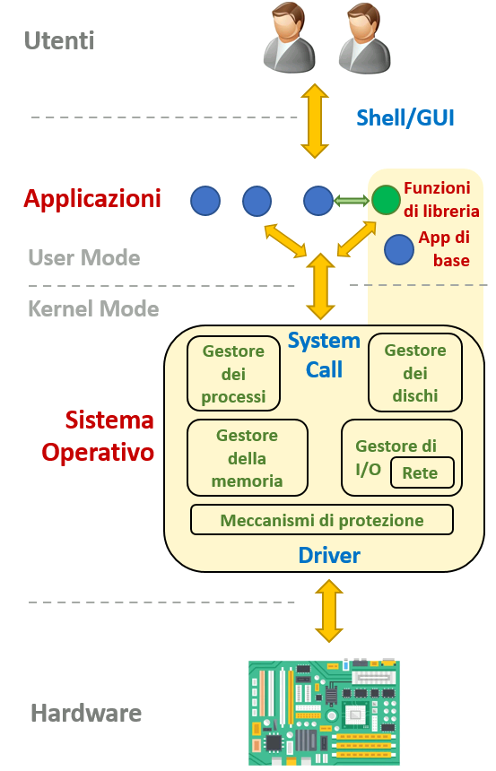

<!-- _paginate: false-->
<!-- _header: "" -->
<!-- _backgroundColor: #FCF3CF -->
<style scoped> h1, h2, h3, h4 {text-align: center;}
section {background-color: #FDEDEC;}
h1 {color:red} a:link {color: darkred;} p {text-align: center; font-size: 25px}</style>
<br/><br/><br/>
### Sistemi Operativi
### Unità 1: Introduzione
Introduzione ai Sistemi Operativi
=====================
<br/><br/><br/>
[Martino Trevisan](https://trevisan.inginf.units.it/)
[Università di Trieste](https://www.units.it)
[Dipartimento di Ingegneria e Architettura](https://dia.units.it/)

---
## Argomenti

1. Componenti di un sistema di elaborazione
2. Architettura di un sistema di elaborazione
3. Definizione di sistema operativo
4. Componenti di un sistema operativo
5. Definizioni relative ai sistemi operativi
6. Tipologie di sistemi operativi


---
## Componenti di un sistema di elaborazione
Un sistema di elaborazione si può suddividere in quattro componenti: 
- <r>Hardware</r>
  - Fornisce le risorse fisiche: CPU, memoria, disco
- <r>Sistema Operativo</r>
  - Gestisce l'accesso all'hardware da parte dei programmi
- <r>Programmi Applicativi</r>
  - Eseguono i compiti desiderati dagli utenti o dal sistema
- <r>Utenti</r>
  - Lanciano e usano programmi

---
## Architettura di un sistema di elaborazione
- Composto da diverse unità
- Il <r>bus</r> mette in comunicazione le componenti del sistema


---
## Architettura di un sistema di elaborazione
- La <r>CPU</r> esegue le istruzioni che preleva dalla memoria.
- Moduli fondamentali:
  - Arithmetic Logic Unit
  - Control Unit
  - Registri

- Tre fasi per eseguire ogni istruzione


---
## Architettura di un sistema di elaborazione
- La <r>Memoria</r> fornisce un modo per salvare i dati.
- Un sistema ha vari tipi di memoria, con caratteristiche diverse
  - Organizzazione in una gerarchia di memoria
  


---
## Architettura di un sistema di elaborazione
- Un sistema di elaborazione interagisce con l'esterno tramite dispositivi di <r>Input/Output</r>
  - Schermo
  - Tastiera
  - Mouse
  - Rete
  - Sensori
- Comunicano con la CPU tramite il bus


---
## Definizione di sistema operativo
- Il compito dei sistemi operativi è:
  - Interagire con l'<r>hardware</r>
  - Fornire all'utente un <r>modello</r> di computer più semplice


---
## Definizione di sistema operativo
- In un certo senso, i sistemi operativi rendono gradevole ciò che ha un'interfaccia sgradevole


---
## Definizione di sistema operativo
- Il sistema operativo si interfaccia con i dispositivi hardware
  - Tramite moduli software chiamati <r>Driver</r>
- Offre servizi alle applicazioni
  - Tramite API chiamate <r>System Call</r>
- Organizzato in moduli


---
## Componenti di un sistema operativo
- Un sistema di elaborazione è composto di diversi moduli
  - Che offrono servizi a utente
  - Ma interagiscono anche tra loro



---
## Componenti di un sistema operativo
- **Gestore dei processi**:
  - Crea e gestisce i processi
    - Un processo è un programma in esecuzione.
  - Trova le risorse di CPU e memoria necessarie all'esecuzione
- **Gestore della memoria**:
  - La memoria di un elaboratore è un unico vettore
  - Il SO gestisce:
    - L'allocazione di memoria ai processi e la condivisione della memoria tra programmi
- **Gestore dei dischi**:
  - La memorizzazione su disco è persistente
  - Il SO organizza la memoria su disco in una struttura ad albero di directory e file

---
## Componenti di un sistema operativo 
- **Gestore dei dispositivi di I/O**:
  - I dispositivi di I/O non sono gestiti direttamente dalle applicazioni
    - Sarebbe complicato e creerebbe problemi di funzionamento
  - I SO utilizza i driver per pilotare i dispositivi
  - La connessione di rete rappresenta un caso particolare di I/O.
    - Ha un trattamento speciale nei moderni SO

- **Gestore dei meccanismi di protezione**:
  - Nei SO ci sono tanti utenti con diversi permessi di accedere alle risorse
    - Per accedere a file, dispositivi, configurazione, ecc... 
  - I SO implementa le policy di accesso


---
## Componenti di un sistema operativo 

- **Altre componenti**:
  - **Sincronizzazione**. Permette ai processi:
    - Di comunicare tra loro
    - Di sincronizzarsi tra loro
  - **Virtualizzazione**. Per supportare la creazione di macchine virtuali o simili (e.g., container)
    - Se il SO offre funzionalità per la virtualizzazione, le VM saranno molto più veloci perché possono avere accesso diretto ad (alcune) risorse

---
## Definizioni relative ai sistemi operativi
- **Kernel**:
  - Cuore del SO
  - Include tutti i moduli visti in precedenza
    - Gestisce le operazioni fondamentali e a più basso livello
  - Modulo software sempre in esecuzione
    - Con privilegi speciali
    - Tutte le altre applicazioni (di utente o di sistema) hanno privilegi minori
      - Si appoggiano al kernel
  - Diverse tipologie di kernel
    - Monolitici: il kernel è un unico programma che esegue tutto il codice necessario
      - I più comuni
    - Micro-Kernel: cercano di delegare alle applicazioni più funzionalità possibile
    - A livelli stratificati: il kernel (e i programmi) sono organizzati in una gerarchia di processi a privilegi crescenti. 

---
## Definizioni relative ai sistemi operativi

- **Processo**:
  - Programma in esecuzione
    - Con certi privilegi e risorse
  - Accede alla CPU a turno con gli altri programmi
    - Il SO deve permettere che il suo stato sia conservato quando viene messo in pausa
      - Richiede salvataggio di registri di CPU
    - Ogni processo identificato da un numero detto <r>PID</r>
  - Un processo può creare altri processi detti figli
    - Si dice che i processi sono organizzati in un <r>Albero dei Processi</r>
- **Thread**:
  - Un processo raggruppa le risorse di un programma in esecuzione
  - Un thread individual un flusso di esecuzione
  - Un processo può avere al suo interno **uno o più** flussi in esecuzione
  - Identificato da un identificatore detto <r>TID</r>


---
## Definizioni relative ai sistemi operativi
- **System call**:
  - Sono delle funzioni messe a disposizione dal SO alle applicazioni
  - Offrono i servizi del SO per creare processi, accedere ai dischi, ecc...
    - Il kernel "serve" le richieste di System Call dei programmi
  - Da non confondere con le <r>Funzioni di Libreria</r>
    - Che sono moduli software che svolgono compiti comuni a più applicazioni
    - Sono software comuni con stessi privilegi di applicazione
    - Possono (ma non sempre) chiamare delle System Call


---
## Definizioni relative ai sistemi operativi
- **System call**:
  - Le system call sono funzioni C. Hanno aspetti diversi
  
**POSIX** su Linux
``` c
int read (int fd, void *buffer, size_t nbytes);
```
**Win32/Win64 API** su Windows
```c
BOOL ReadFile (
  HANDLE fileHandle,
  LPVOID dataBuffer,
  DWORD numberOfByteToRead,
  LPDWORD numberOfByteRead,
  LPOVERLAPPED overlappedDataStructure
);
```

---
## Definizioni relative ai sistemi operativi
- **System call**:
  - Esempi di System Call comuni:
    - Gestione dei process: `fork` `exec` `wait` `kill`
    - Gestione dei file: `open` `close` `read` `write`
  - <r>Nota</r>: i SO operativi offrono anche molte funzioni di libreria
    - Alcune funzioni di libreria non necessitano di System Call
    - Calcolare la radice quadrata: `double sqrt(double arg)`. Non necessita di una System Call
    - Scrivere su schermo: `int printf(char *format, arg list ...)`. Formatta la stringa da scrivere e poi chiama la System Call `write`
 
---
## Definizioni relative ai sistemi operativi
- **Kernel/User mode**:
  - <r>Kernel Mode</r>: Il kernel ha accesso completo all'hardware
    - Può accedere a ogni locazione di memoria e registro di dispositivo di I/O
    - Solo codice di ottima qualità. Gli errori sono potenzialmente distruttivi
  - <r>User Mode</r>: le applicazioni hanno posibilità limitate
    - Accedono a uno spazio di indirizzamento limitato (memoria virtuale)
    - Non possono accedere direttamente ai dispositivi di I/O
    - Necessaria cooperazione della CPU che implementa specifiche funzionalità
    - Le funzioni di libreria si eseguono in User Mode
    


---
## Definizioni relative ai sistemi operativi
- **File System**:
  - Struttura che include un insieme di file e cartelle
  - Organizzato secondo un albero
  


---
## Definizioni relative ai sistemi operativi
- **Organizzazione dei path**:
  - <r>Root Directory</r>: la radice di tutti le cartelle. Si **identifica** con `/` in Linux
  - <r>Working Directory</r>: directory dove un processo viene lanciato
  - <r>Path Assoluto</r>: **inizia** con `/` e identifica un percorso a partire dalla **Root Directory**
  - <r>Path Relativo</r>: **non inizia** con `/` ma con un nome. Identifica un path relativo alla **Working Directory** del processo
---
## Definizioni relative ai sistemi operativi
- **Bootloader**:
  - Il codice che carica in memoria il kernel al momento dell'accensione del sistema
  - Contenuto in ROM/EEPROM
- **Login**:
  - Autenticazione di un utente nel sistema, solitamente tramite username e password
- **Shell**:
  - Programma che legge comandi da tastiera, li esegue e ne stampa l'output
  - Metodo di accesso tradizionale
  - Non fa parte del kernel
    - Quando un sistema viene avviato, il kernel avvia sempre una shell o l'interfaccia grafica


---
## Domande

<!-- _backgroundColor: #FFF9E3 -->


<medium>

Cosa é un processo?
`• Un programma` `• Un algoritmo` `• Un programma in esecuzione`


Le System Call sono usate da:
`• SO per interagire con l'hardWare`
`• Dai processi per interagire col SO`


Le Funzioni di Libreria vengono eseguite:
`• In User Mode` `• In Kernel Mode`


Il File System é organizzato come:
`• Un Grafo contentente cicli`
`• Un Grafo NON contentente cicli`

</medium>

