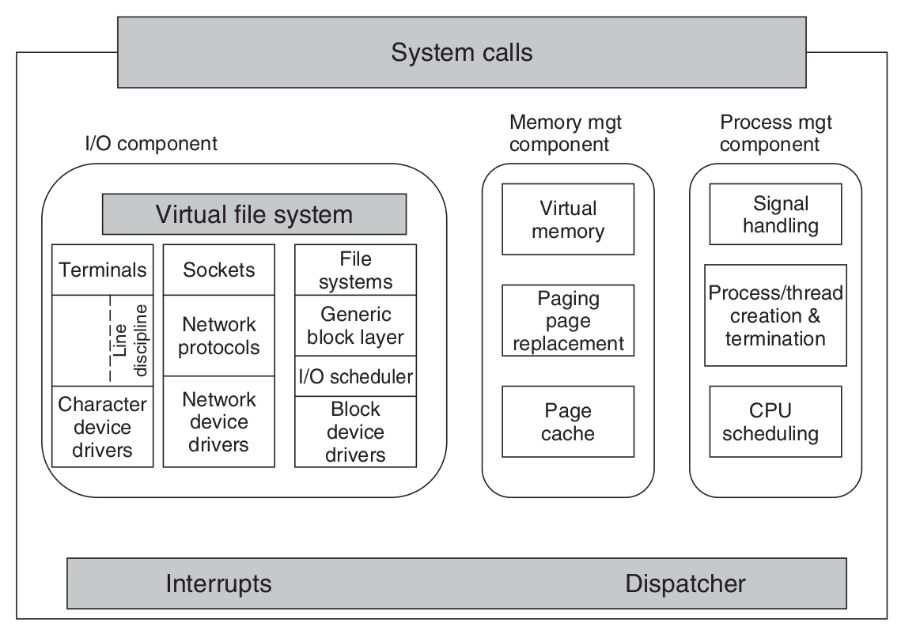

<!-- _paginate: false-->
<!-- _header: "" -->
<!-- _backgroundColor: #FCF3CF -->

   
### Sistemi Operativi
### Unità 1: Introduzione
Storia e Tipologie di Sistemi Operativi
=====================
   
[Martino Trevisan](https://trevisan.inginf.units.it/)
[Università di Trieste](https://www.units.it)
[Dipartimento di Ingegneria e Architettura](https://dia.units.it/)

---
## Argomenti
1. Storia dei sistemi operativi
2. Tipologie di sistemi operativi
3. Linux

---
# Storia dei sistemi operativi

---
## Storia dei sistemi operativi
**Condizione necessaria** per un SO: Avere un sistema di elaborazione

Primo elaboratore **progettato** da Charles Babbage nella prima metà dell'800
- Puramente meccanico.
- Non fu mai csotruito

I primi elaboratori vennero **costruiti** negli anni '40 del '900
- Basati su **valvole**
- Programmati direttamente in linguaggio macchina
- Nessun sistema operativo. L'elaboratore eseguiva un programma per volta

---
## Storia dei sistemi operativi

**Elaboratore a valvole**

---
## Storia dei sistemi operativi
**Elaboratori a transistor (1955-1965)**
- Mainframe custoditi in locali e da tecnici specializzati
- Programmi scritti su schede performate o nastri magnetici
- Primi linguaggi di programmazione (e.g., FORTRAN)
- I programmi venivano eseguiti in sequenza.
- Il sistema operativo ha il solo compito di eseguire programmi in sequenza

---
## Storia dei sistemi operativi

**Elaboratore a transistor**

 

---
## Storia dei sistemi operativi
**Circuiti Integrati (1965-1980)**
- Prestazioni maggiori. Prezzi e dimensioni minori
- IBM crea la linea di computer IBM 360, col suo SO detto **OS/360**
  - Introduce multiprogrammazione: più processi in esecuzione contemporaneamente
  - Usato ancora oggi in alcuni campi
  
- Il MIT assieme a partner indistriali sviluppa **MULTICS**
  - Progettato per main frame molto potenti
  - Permette l'utilizzo a centiaia di utenti
  - Poco successo
  
---
## Storia dei sistemi operativi

**Elaboratore a circuito integrato**

---
## Storia dei sistemi operativi
**Circuiti Integrati (1965-1980)**
- Da MULTICS nasce Unix nei Bell Labs, come progetto personale di Ken Thompson, Dennis Ritchie e altri.
- Da **UNIX** nasce tutta la famiglia **Linux**

---
## Storia dei sistemi operativi
**I personal Computer (1980-oggi)**
- Grazie a sviluppi nei CI fu possibile produrre computer a prezzi bassi.
- Nei primi anni '80 nasce **Microsoft/DOS**, inzialmente pensato per computer IBM con CPU Intel (famiglia 8086)
- La **Apple** inventa un sistema opertivo con **GUI** che ottiene molto successo, da cui **Windows** si ispirerà

---
## Storia dei sistemi operativi
**I personal Computer (1980-oggi)**
**Microsoft**: Fondata nel 1975 da Bill Gates e Paul Allen
- Nel 1981 commercializza MS-DOS
- Nel 1985 commercializza Windows
  - Sistema operativo con interfaccia grafica a finestre (da cui il nome)
  - Orientato a processori Intel
- Nel tempo ha commercializzato versioni a
  - 16 bit (Windows 1.0, 1985 – Windows 3.1, 1992)
  - 16/32 bit (Windows 9x, 1993-2000)
  - 32/64 bit (da Windows NT in poi)

---
## Storia dei sistemi operativi
**I personal Computer (1980-oggi)**

**Apple**: fondata nel 1976 da Steve Jobs, Steve Wozniak e Ronald Wayne
- Dal 1984 al 2001 commercializza Mac OS
  - SO completamente grafico
  - Raggiunge limiti strutturali di sviluppo alla fine del '90, non permettendo
    - Multitasking preemptivo
    - Memoria protetta
- Nel 2001 commercializza Mac OS X
  - Nato per computer Macintosh
  - Inizialmente retro-compatibile con Mac OS
  - Basato su architettura UNIX

---
## Storia dei sistemi operativi
**I personal Computer (1980-oggi)**
- Windows e Apple Mac OS continuano lo sviluppo fino ad ora.
  - Windows 11 e Mac OS 12 Monterey
- Dagli anno '90 in boom dei **telefoni cellulari**, porta alla nascita di sistemi operativi dedicati. Nascono:
  - Symbian: morto nel 2011
  - Android
  - Mac OS
  

---
## Tipologie di sistemi operativi

Diverse varietà di SO. Alcune ancora vive, altre morte e sepolte.
**SO per mainframe**
- Per elaboratori enormi in grandi compagnie
- Supportano tanti utenti e risorse
- In declino in favore di SO general purpose (Linux)
- Esiste ancora OS/390, discendetne di OS/360 di IBM

---
# Tipologie di sistemi operativi

---
## Tipologie di sistemi operativi
**SO per PC**
- Sono i più diffusi.
- Basati su interfaccia grafica
- Pensati per un solo utente, non esperto
- Esempi: Windows, MacOS

**SO per server**
- Per professionisti
- Spesso dotati di sola shell
- Sono varianti di quelli per PC
- Esempi: Linux, Windows Server

---
## Tipologie di sistemi operativi
**SO per Smartphone o tablet**
- Basati su GUI e input touch
- Esempi: Android, MacOS

**SO integrati**
- Per elettrodomestici, veicoli
- Non accettano programmi esterni

**SO per sensori**
- Su dispositivi con risorse molto limitate
- Molto leggeri e semplici

---
## Tipologie di sistemi operativi
**SO real time**
- Per applicazioni particolari dove il tempo è fondamentale
  - Processi industriali, aerei, autoveicoli
- Alcuni compiti devono essere svolti **tassativamente** entro una deadline
  - Design del sistema notevolmente più complicato
  
**SO per smartcard**
- Le smartcard (e.g., Bancomat) hanno un sistema di elaborazione e un SO
- Requisiti di **basso consumo** e **sicurezza**

---
# Linux

---
## Linux
### UNIX

Abbiamo detto che **Unix** nasce negli anni '70 da MULTICS
Nascono numerose varianti negli anni '80 che vengono standardizzate
- Standard **ISO C** - 1972
- Standard **Posix** - 1988

Tutte le versioni erano a pagamento, in capo ad AT&T
- Il codice era closed-source, molto lungo e complesso

---
## Linux
### MINIX

Creato da Andrew Stuart Tanenbaum
- Uno degli autori di uno dei libri consigliati in questo corso

E' un **clone** di UNIX:
- Open-Source
- A micro-kernel
- Pensato per la didattica
- Non adatto a essere un vero SO

---
## Linux

Nel 1991 Linux Torvald crea il kernel **Linux**:
- Sviluppato a partire da Minix
- Per esser un vero SO (non solo per scopi didattici)
- Tante distribuzioni: Ubuntu, Debian, Fedora
- Ormai diffuso globalmente

---
## Linux
### Definzioni

- <r>Unix</r>: sistema operativo sviluppato negli anni '80 in AT&T
- <r>Linux</r>: è un kernel Unix-like sviluppato da Linux Torvald dal 1991
- <r>GNU</r>: sistema operativo (kernel escluso) Unix-Like. Può funzionare con diversi kernel

Ora lo standard è GNU/Linux: sistema operativo GNU con kernel Linux

**Nota:** L'evoluzione diretta di Unix é il SO Berkeley Software Distribution (BSD), da cui derivano FreeBSD e Mac OS X

---
## Linux
## Diramazioni da UNIX

---
## Linux
## Linux Oggi

- Stabile, maturo e free
- Più complesso da usare di Windows
- Alla base di quasi tutte le tecnologie per:
  - Servizi web: hosting
  - Archiviazione dei dati: database, data warehouse
  - Sistemi embedded
  - Piattaforme per Intelligenza Artificiale
  
<r>Questo corso si concentrerà sull'uso di Linux<r/>

---
## Linux
### Kernel Linux

Simile rispetto alla nostra definizione generica si SO

---
## Linux
### Kernel Linux

Include librerie e utility

---
## Domande

<!-- _backgroundColor: #FFF9E3 -->

<medium>

POSIX é:
`• Uno standard` `• Un SO` `• Una famiglia di SO`

UNIX é:
`• Closed-Source` `• Open-Source`

Linux é:
`• Closed-Source` `• Open-Source`

</medium>

