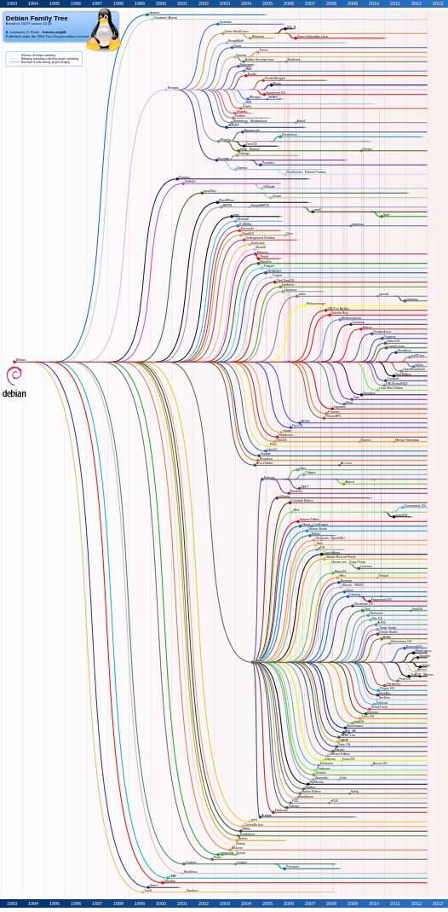

<!-- _paginate: false-->
<!-- _header: "" -->
<!-- _backgroundColor: #FCF3CF -->

   
### Sistemi Operativi
### Unità 2: Utilizzo di Linux
Ambienti Linux
=====================
   
[Martino Trevisan](https://trevisan.inginf.units.it/)
[Università di Trieste](https://www.units.it)
[Dipartimento di Ingegneria e Architettura](https://dia.units.it/)

---
## Argomenti

1. Distribuzioni di Linux
2. Alternative per usare Linux

---
# Distribuzioni di Linux

---
## Distribuzioni di Linux

Con **Linux** si intende un Kernel UNIX-like.

Con **GNU/Linux** si intende una famiglia di sistemi operativi basati su Kernel Linux

Ci sono più di 100 SO che sono della famiglia **GNU/Linux**. Condividono:
- Kernel Linux
- Programmi e utility di base di GNU per gestione di file, processi, rete

---
## Distribuzioni di Linux

Le famiglie principali OS Linux sono:

**Ubuntu**: attualmente il più diffuso.
- Basato su un'altra distribuzione chiamata **Debian**
  - Debian è il punto di partenza per tanti altri OS Linux
  - Debian contiene solo software libero, Ubuntu no
- Ha lo scopo di offrire un SO completo e facile da usare per PC (e per server)
- Ne derivano altre distribuzione che di differenziano per il software che gestisce l'ambiente grafico (desktop, finestre)

---
## Distribuzioni di Linux

**Red Hat Enterprise Linux e CentOS**: versioni professionali di Linux, per il mercato aziendale
- Particolare attenzione a stabilità e sicurezza
- Mantenute dall'azienda Red Hat, che offre supporto a pagamento
- RHEL è la versione con supporto commerciale. CentOS è la versione *consumer*
- L'OS **Fedora** è della stessa famiglia, è adotta funzionalità più innovative, sebbene meno stabili

---
## Distribuzioni di Linux

**Arch Linux**: distribuzione leggera, adatta a sistemi minimali e con poche risorse
- Non prevede un ambiente Desktop di default
- Utilizza la filosofia KISS (Keep It Simple, Stupid)

**openSUSE Linux**: sviluppata da volontari. Nei primi anni 2000 era molto diffusa

**Linux Mint**: basata su Ubuntu. Ha avuto momenti di celebrità nei primi anni 2010

---
## Distribuzioni di Linux

Impossibile enumerare tutte le distribuzioni.

Molte nascono e muoiono nel giro di pochi anni

In questo corso utilizzeremo <r>Ubuntu</r>
- Diffuso
- Semplice
- Generico
  - Ha versione per PC e per server

---
# Alternative per usare Linux

---
## Alternative per usare Linux

Per utilizzare un sistema Linux, ci sono varie alternative a seconda che:
- Si abbia in PC o un MAC
- Si abbia tanto o poco spazio su disco
- Si sia più o meno esperti nell'utilizzo del computer

---
## Alternative per usare Linux

**Installazione Nativa**: si installa un SO Linux su un PC.
- Necessario scaricare l'immagine dal sito in un SO Linux (e.g., Ubuntu)
- Il PC viene formattato e il SO è installato nativamente
- Si può mantenere Windows (o Mac OS) usando il <r>Dual Boot</r>
  - L'hard disk è partizionato il due drive logici, uno con Linux, uno con Windows
- Operazione non facilissima, e potenzialmente distruttiva

---
## Alternative per usare Linux

**Linux da USB "Live"**:
Ogni distribuzione di Linux può essere usata Live:
- Si crea una chiavetta USB *bootable*
- Si inserisce nel PC e lo si forza a fare *boot* da chiavetta
- Linux gira nativamente come se fosse installato
- Su Windows si può usare il software Rufus [https://rufus.ie/en/](https://rufus.ie/en/)
  - **Nota**: a meno che non lo si configuri esplicitamente, la chiavetta non è **persistente**. A ogni riavvio si perdono tutti i file modificati
  
---
## Alternative per usare Linux

**Macchina Virtuale**: utilizzando un software chiamato <r>virtualizzatore</r> è possibile creare un PC virtuale.
- E' a tutti gli effetti in PC completo di tutte le funzionalità
  - Ha una CPU, memoria e disco virtuali
- Che gira all'interno di un'applicazione
  - Non danneggia nè impatta il SO nativo del PC
- Tanti software per virtualizzazione
  - **VirtualBox** (consigliato)
  - **VMWare**
  - **QEMU**
  
---
## Alternative per usare Linux

- Passi necessari:
  - Installare il virtualizzatore
  - Creare una nuova macchina virtuale
    - Specificare la quantità di risorse (CPU, memoria, disco) da allocare alla macchina virtuale
  - Installare il SO Linux preferito
  - Configurarlo con i software desiderati, se necessario
  
- Questa è l'<r>opzione consigliata</r>:
  - Facile, stesse potenzialità di avere Linux installato nativamente
  - Il PC deve essere abbastanza potente:
    - Almeno 8 core, 8GB di RAM e 20GB (di spazio libero) su Hard Disk
  

---
## Alternative per usare Linux

**Cygwin**: è un software da installare su Windows
E' un layer di compatibilità POSIX che permette di usare programmi POSIX su sistemi Windows
- Mappa le system call POSIX su quelle di Windows.
- Include i tool GNU base per gestione di file, compilazione
- Necessario compilare i programmi usando Cygwin

Facile da installare:
- Si installa come un normale programma
- Sito Web: [www.cygwin.com](www.cygwin.com)

---
## Alternative per usare Linux

**Windows Subsystem for Linux (WSL)**: è anche esso un layer di compatibilità per programmi Linux su Windows.
- Sviluppato direttamente da Microsoft
- A partire da Windows 10
- Permette di eseguire eseguibili Linux senza ricompilare
- Si può installare tramite command line di Windows
- Dopodichè è possibile installare pacchetti di software Linux
  - Ad esempio si può installare l'applicazione "Ubuntu" tramite software center.
  - Nota: l'applicazione "Ubuntu" non è un vero SO. E' solo un pacchetto che contiene i software di base di Ubuntu e una shell

---
## Domande

<!-- _backgroundColor: #FFF9E3 -->

<medium>

Ubuntu é un SO che utilizza il Kernel:
`• Linux` `• UNIX` `• POSIX`

Red Hat é un:
`• Kernel` `• SO` `• Uno standard`

</medium>

