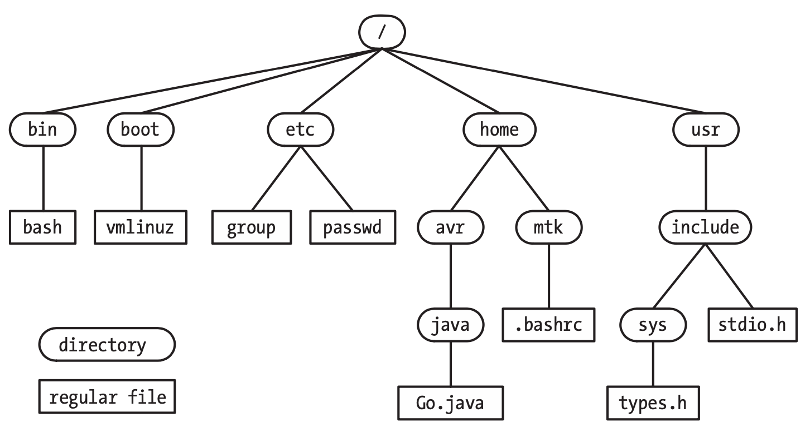
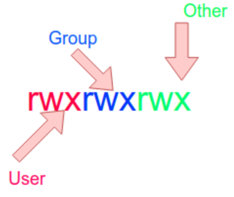

<!-- _paginate: false-->
<!-- _header: "" -->
<!-- _backgroundColor: #FCF3CF -->
<style scoped> h1, h2, h3, h4 {text-align: center;}
section {background-color: #FDEDEC;}
h1 {color:red} a:link {color: darkred;} p {text-align: center; font-size: 25px}</style>
<br/><br/><br/>
### Sistemi Operativi
### Unità 2: Utilizzo di Linux
Comandi di Linux
=====================
<br/><br/><br/>
[Martino Trevisan](https://trevisan.inginf.units.it/)
[Università di Trieste](https://www.units.it)
[Dipartimento di Ingegneria e Architettura](https://dia.units.it/)

---
## Argomenti

1. Sessione Shell
2. Comandi di base
3. File System
4. Utenti e permessi
5. Processi e programmi
6. Altri comandi
7. Esercizi


---
# Sessione Shell

---
## Sessione Shell

Per fare login, è necessario inserire le proprie credenziali sul terminale:
```
login as: <username>
password: <password>
```

Per fare logout: `CTRL+D`, `exit` o `shutdown` (solo superuser)


---
## Sessione Shell

E' possibile usare un terminale *remoto* utilizzando SSH.

Su un'altra macchina colegata in rete, digitare su terminale:
```bash
ssh <username>@<indirizzo IP della macchina>
```
Si utilizza il protocollo Secure Shell, che trasmette in maniera cifrata i comandi e il loro output tramite la rete.

---
# Comandi di base

---
## Comandi di base
Vengono digitati sul terminale.	Avviano il corrispondente eseguibile

Alcuni ammettono <r>argomenti</r>, gli oggetti su cui il comando deve agire.
- Specificati dopo il nome del comando

Alcuni ammettono <r>opzioni</r> che specificano comportamenti particolari
- Iniziano per `-` seguite da una singola lettera
- Oppure per `--` seguite da una stringa


---
## Comandi di base

**Formato**:
```bash
comando [opzioni] [argomenti]
```
**Esempio**: stampa il contenuto di `file.txt`
```bash
cat file.txt
```
**Esempio**: lista il contenuto della cartella `dir`, includendo anche i file nascosti (che iniziano per `.`):
```bash
ls -a dir
```
```bash
ls --all dir
```

---
## Comandi di base

E' possibile avere più comandi con una sola riga, separandoli con `;`.
```bash
comando1 ; comando2; ...
```

**Altri comportamenti**:
- I comandi possono essere concatenati tramite il carattere `|`.
- Si può redirezionare l'output di un comando su file tramite il carattere `>`.
- Analizzato in dettaglio più avanti


---
## Comandi di base

**Manuale in linea**: i comandi sono documentati
```
man <comando>
```
Restituisce la pagina di manuale del `<comando>`.

Comandi simili:
- `apropos`: ricerca in tutti i manuali dei comandi
- `whereis`: trova il binario, il sorgente e il manuale di un comando


---
## Comandi di base

**Altri comandi di base**:
- `date`: visualizza la data
- `who`: mostra gli utenti attualmente collegati. 
- `uptime`: tempo di vita di un sistema, numero di utenti collegati, carico del sistema negli ultimi 1, 5, 15 minuti
- `hostname`: nome della macchina


---
# File System

---
## File System

Il file system su Linux è gerarchico.
- Organizzato in directory annidate l'una dentro l'altra
- La directory radice è `/`
- Tutte le cartelle del sistema sono contenute nella directory radice.
Esempio: la home degli utenti si trova in
`/home/nomeutente`

---
## File System

Esempio di albero (parziale) delle cartelle di un sistema Linux




---
## File System

Un <r>path</r> identifica un file o una cartella.

Un terminale (e i comandi che vi vengono lanciati) sono sempre **posizionati** su una cartella.
- Ci muove da una cartella all'altra col comando `cd <path>`
- Un path può essere:
  - Assoluto: inizia con `/` e indica un path completo a partire dalla radice
  - Relativo: **non** inizia con `/` e indica un path relativo alla directory corrente
  - Ci si può riferire directory corrente con `.`
  - La directory padre di qualla corrente è indicata con `..`

---
## File System
<!-- _backgroundColor: #FFF9E3 -->
**Esempio**: si consideri il seguente albero di cartelle
```
/
└── tmp
    └── directory
        └── file.txt
```
Col comando `cd /tmp` si posiziona il terminale in `/tmp`.
A questo punto:
- `directory` identifica la directory `/tmp/directory`
- `.` identifica la directory `/tmp`
- `..` identifica la directory `/`
- `directory/../..` rappresenta la directory `/`
 
---
## File System

Su tutti i sistemi Linux, il file system è organizzato con le seguenti cartelle di sistema.

- `/`: radice
- `/bin`: file eseguibili del sistema – ls, pwd, cp, mv ....
- `/boot`: file necessari per l'avvio del sistema, boot loader ...
- `/dev`: file speciali che descrivono i dispositivi – dischi, scheda audio, porte seriali ...
- `/etc`: file eseguibili, script, inizializzazione, configurazione sistema, file password, ...

---
## File System
- `/home`: directory delle home directory degli utenti
- `/lib`: librerie di sistema
- `/lost+found`: contiene i file danneggiati
- `/mnt `: punto di montaggio file system (mount point)
- `/proc`: file system virtuale che contiene informazioni sui programmi in esecuzione 
- `/sys`: programmi di sistema
- `/tmp`: direttorio temporaneo

---
## File System
- `/usr`: file relativi alle applicazioni installate
- `/usr/include`: header file libreria standard C
- `/usr/bin`: file binari disponibili agli utenti
- `/var`: file di sistema che variano con frequenza elevata
- `/var/spool`: aree temporanee di spooling

---
## File System

**Comando `ls [opzioni] [file]`**: lista il contenuto della directory. Opzioni principali:
- `-1`: stampa su una colonna
- `-l`: formato lungo
- `-n`: come –l ma visualizza gli ID al posto del nome del proprietario e del gruppo
- `-t`: ordina per data
- `-s`: mostra la dimensione dei file in blocchi
- `-a`: mostra tutti i file compresi . e ..
- `-R`: elenca il contenuto in modo ricorsivo

---
## File System
<!-- _backgroundColor: #FFF9E3 -->

**Esempio**: differenti forme di `ls
```
$ ls
compile.txt  style.css  u1-introduzione  u2-linux
```

```
$ ls -l
total 16
-rw-rw-r-- 1 martino martino  102 set 30 14:16 compile.txt
-rw-rw-r-- 1 martino martino  199 set 30 15:27 style.css
drwxrwxr-x 3 martino martino 4096 ott  1 18:33 u1-introduzione
drwxrwxr-x 3 martino martino 4096 ott  4 10:20 u2-linux
```

---
## File System

**Comando `rm [-rfi] [filename]`**: rimuove il/i file selezionati. Opzioni principali:
- `-r`: rimozione ricorsiva del contenuto delle directories.
- `-f`: rimozione di tutti i file (anche protetti in scrittura) senza avvisare. 
- `-i`: con questa opzione `rm` chiede conferma

**Esempio**: cancella tutti i file in `cartella`
```
rm cartella/*
```

**Nota:** con `*` si intendono tutti i file dentro una cartella


---
## File System

**Comando `cd <dir>`**: cambia directory. 

**Comando `mkdir <dir>`**: crea sub-directory. 
**Comando `rmdir <dir>`**: rimuove sub-directory, solo se vuota. Altrimenti fallisce.

**Comando `cp  <file1> <file2>` e `mv <file1> <file2>`**: copia/sposta file o cartelle. Opzioni principali
- `-f`: effettua le operazioni senza chiederne conferma
- `-i`: chiede conferma nel caso che la copia sovrascriva il file di destinazione
- `-r`: ricorsivo. Copia/sposta la directory e tutti i suoi file, incluso le sottodirectory ed i loro file


---
## File System

**Comando `ln [-s] <sorgente> <destinazione>`**: crea un <r>link</r>. In Linux esistono due tipi di link:
- <r>Soft Link</r>: è un semplice rimando a un altro path. Se il path destinazione non esiste o viene spostato, il link semplicemente non funziona. Si usa l'opzione `-s`.
  - **Flessibile**: può linkare a un altro file system o a una cartella
- <r>Hard Link</r>: associa un secondo path al contenuto del file. Se il primo file viene spostato, il link rimane valido e funzionante. E' l'opzione di default
  - **Robusto**: non può può mai essere invalido. Non si può usare tra dischi diversi, nè per linkare cartelle

---
## File System

**Comando `find [path] [-n nome] [-print]`**: ricerca ricorsiva di directories
**Esempio:** cerca i file che finiscono per `.txt` nella directory `/tmp`:
```bash
find /tmp -name *.txt
```
E' possibile fitrare su varie **proprietà** dei file o cartelle:
- Tempo di creazione/modifica
- Utente o gruppo proprietario
- Grandezza

**Nota**: Non effettua ricerca nel contenuto del file

---
## File System

**Comando `cat <file>`**: stampa il contenuto di un file

**Comando `touch <file>`**: crea il file se non esiste

**Esempio**: creare un file `a.txt`, aprirlo con un editor e scrivervi dentro `ciao`, poi stampare il file
```bash
$ touch a.txt
... modificare con editor
$ cat a.txt
ciao
```
---
## File System

**Comando `less <file>`**: apre il file in un visualizzatore interno alla shell dove si può scorrere in entrambe le direzioni

Esistono svariati altri comandi per visualizzare il contenuto di un file.
- Comandi per stampare file binari
- Comandi per stampare le prime (`head`) o le ultime righe (`tail`) di un file
- Editor avanzati utilizzabili dentro la shell.
  - `nano` il più semplice
  - Ne esistono molti. Sono in competizione `emacs` e `vi`, detta *Guerra degli editor*

---
# Utenti e permessi

---
## Utenti e permessi

Un dispositivo con OS Linux può avere più <r>utenti</r>.
- Essi possono fare login su una shell o un terminale remoto
- Ogni utente ha la sua <r>Home Directory</r> in `/home/<utente>`
  Serve per permettere all'utente di immagazzinare file personali come documenti, immagini, programmi.

---
## Utenti e permessi

Un utente può essere assegnato a uno o più <r>gruppi</r>.
- Ogni utente deve avere almeno un gruppo, detto <r>gruppo primario</r>
- Un utente può essere assegnato a più gruppi

Meccanismo utente-gruppi utilizzato per gestire l'accesso a file e risorse.
L'utente <r>root</r> esiste sempre ed ha massimi privilegi

---
## Utenti e permessi

**Gestione**: Comandi per creare o rimuovere utenti e gruppi: `useradd`, `groupadd`, `userdel`, `groupdel`
- Su molti OS Linux, esistono dei comandi più facili: `adduser`, `addgroup`, `deluser`, `delgroup`

**Altri comandi**:
- `groups`: stampa i gruppi ai quali appertiene l'utente corrente
- `whoami`: stampa l'utente corrente
- `su <utente>`: cambia utente (chiede password)
- `sudo <comando>`: esegue il comando come utente `root`, dopo aver chiesto la password


---
## Utenti e permessi

I file e le cartelle hanno tre tipi di <r>permessi</r>:
- Diritto di **Lettura**: Per i file, accedere a contenuto. Per cartelle, listare i file.
- Diritto di **Scrittura**: Per i file, modificare il contenuto. Per le cartelle, crearvi file o sottocartelle.
- Diritto di **Esecuzione/Attraversamento**:
  - Per i **file**, esiste il permesso di **esecuzione**. Necessario per eseguire programmi.
  - Per le **cartelle**, esiste il permesso di **attraversamento**. Necessario per accedere a sotto cartelle.
  
---
## Utenti e permessi

I file e le cartelle hanno un **utente proprietario** e un **gruppo proprietario**.
I permessi su file sono gestibili separatamente per:
- Utente proprietario
- Utenti del proprietario
- Tutti gli altri utenti

---
## Utenti e permessi

In totale ogni file o cartella ha $3 \times 3$ permessi

Esempio:
```
$ ls -l
-rw-rw-r-- 1 martino docenti  102 set 30 14:16 compile.txt
-rw-rw-r-- 1 martino docenti  199 set 30 15:27 style.css
```

---
## Utenti e permessi

**Modifica dei permessi di un file**: si usa il comando `chmod [-r] <permessi> <file>`
I permessi possono essere indicati con varie sintassi:
- **Assoluto**, con tre cifre ottali, che raprresentano rispettivamente i permessi a utente, gruppo e altri. Ogni cifra ha 3 bit e raprresenta permessi di lettura, scrittura ed esecuzione/attraversamento.
  Esempio: `chmod 750 file.txt` dà permessi totali a utente ($7_8=111_2$), lettura/esecuzione al gruppo ($5_8=101_2$) e niente agli altri ($0_8=000_2$)

---
## Utenti e permessi

- **Mirato**: Modifica permessi esistenti tramite una stringa composta di 3 parti:
  - Quali utenti: `u` (user), `g` (gruppo), `o` (other)
  - Che operazione: `+` (aggiungi), `-` (rimuovi)
  - Quale permesso: `r` (lettura), `w` (scrittura), `x` (esecuzione/attraversamento)
    Esempio: `chmod g+w file.txt` dà permessi in scrittura agli utenti del gruppo proprietario del file
    
- `-r` applica il comando ricorsivamente a file e cartelle contenute

---
## Utenti e permessi
<!-- _backgroundColor: #FFF9E3 -->

**Esempio**: usi di `chmod`
- `chmod 600 file.txt`: l'utente può leggere e scrivere. Il gruppo e gli altri niente.
- `chmod 640 file.txt`: l'utente può leggere e scrivere. Il gruppo può leggere. Gli altri niente
- `chmod u+x file.txt`: Aggiungi i permessi di esecuzione all'utente
- `chmod go+w file.txt`: Aggiungi i permessi di scrittura al gruppo e a gli altri


---
## Utenti e permessi

**Modifica di proprietario e gruppo** di file o cartella
- `chown utente file`: modifica utente proprietario
- `chgrp gruppo file`: 
- `chown utente:gruppo file`: modifica contemporaneamente entrambi
- **Note**:
  - Posso assegnare un file solo a un gruppo che posseggo
  - Sulla maggior parte degli OS, solo `root` può cambiare utente proprietario
  - Opzione `-r`: applica il comando ricorsivamente a cartelle e file contenuti


---
## Utenti e permessi
<!-- _backgroundColor: #FFF9E3 -->

**Esempio**:
si considerino le seguenti informazioni sul file `my-program`:
```
-rwxr-xr-- 1 martino docenti  102 set 30 14:16 my-program
```
- L'utente `luca` del gruppo `docenti` può eseguire `my-program`?
  <ans>**SI**: il gruppo ha permessi `r-x`, quindi `luca` può eseguire `my-program`</ans>
- L'utente `marco` del gruppo `studenti` può eseguire `my-program`?
  <ans>**NO**: gli altri hanno permessi `r--`, quindi `marco` non può eseguire `my-program`</ans>

---
## Utenti e permessi
<!-- _backgroundColor: #FFF9E3 -->

**Esempio**:
si considerino le seguenti informazioni sulla cartella `data`:
```
dr-xr--r-- 3 martino docenti 4096 ott  1 18:33 data/
```
- L'utente `luca` del gruppo `docenti` può listare i file?
  <ans>**SI**: il gruppo ha permessi `r--`</ans>
- L'utente `luca` del gruppo `docenti` può accedere alla cartelle dentro `data`?
  <ans>**NO**: il gruppo ha permessi `r--`. Servirebbe `r-x`</ans>
- L'utente `martino` del gruppo `docenti` può creare file in `data`?
  <ans>**NO**: l'utente `martino` ha permessi `r-x`. Servirebbe `rwx`</ans>

---
# Processi e programmi

---
## Processi e programmi
Un processo è un programma in esecuzione.
In Linux, ogni processo è identificato da un'identificatore detto <r>PID</r>.
Il PID si usa per effettuare operazioni sul processo.

**`kill <PID>`**: termina il processo

**`top`**: mostra in maniera interattiva i processi in esecuzione. Simile a un Task Manager via Shell

---
## Processi e programmi

**`ps [opzioni]`**: mostra informazioni sui processi attivi.

- `a`: informazioni su tutti i processi (non solo generati dalla sessione shell corrente)
- `x`: mostra anche i processi n background
- `f`: stampa i processi in modo che se ne veda il rapporto padre-figli
- `u`: stampa più informazioni

**Esempio**: `ps fax`
<r>Nota:</r> `ps` è tra i pochi programmi in cui le opzioni non vanno iniziate con `-`. Ciò è un relitto delle primissime versioni di Unix in cui le opzioni non avevano il `-`.


---
## Altri comandi
**`lsusb`**: lista i dispositivi usb

**`lspci`**: lista i dispositivi su bus pci

**`lsblk`**: lista i dischi

**`ifconfig`**: lista le interfacce di rete

**`pwd`**: stampa la directory corrente

**`free`**: mostra quanta memoria RAM libera ed occupata ha il sistema

---
## Altri comandi

**`df [-htv]`**: visualizza informazioni sui file system del sistema.
- `-t` : nr totale di blocchi e i-node liberi
- `-v` : percentuale di blocchi e i-node
- `-h` : stampa in GB/MB anzinchè in numero di byte
```
Filesystem     1K-blocks      Used Available Use% Mounted on
udev             3923948         4   3923944   1% /dev
tmpfs             787220      1552    785668   1% /run
/dev/sda6      425085288 259786508 143682652  65% /
none                   4         0         4   0% /sys/fs/cgroup
none                5120         0      5120   0% /run/lock
none             3936080       436   3935644   1% /run/shm
none              102400        44    102356   1% /run/user
```

---
# Esercizi
<!-- _backgroundColor: #FFF9E3 -->

---
## Esercizi
<!-- _backgroundColor: #FFF9E3 -->

1. Stampare il contenuto del file `/etc/hosts`
2. Posizionarsi nella cartella `/tmp` e listare il contenuto della cartella `/home` usando un path relativo e uno assoluto
3. Usare l'editor nano per creare un file `file.txt` in una qualsivoglia cartella. Creare una link simbolico del file e cancellare l'originale. Cosa succede se si prova a stampare il contenuto del link? Ripetere con Hard Link
4. Creare una cartella e due file in essa. Cancellare la cartello con un unico comando.


---
## Esercizi
<!-- _backgroundColor: #FFF9E3 -->

5. Creare un nuovo gruppo `studenti` e un utente `studente` assengnato a tale gruppo.
   **Nota**: usare le opzioni `-m` `-g  <group>` del comando `useradd`
   E' necessario usare `sudo`?
   Un utente normale può listare i file nella home della home directory di `studente`?
   Modificare i permessi della home di `utente` affinchè tutti possano leggere, scrivere ed eseguire


