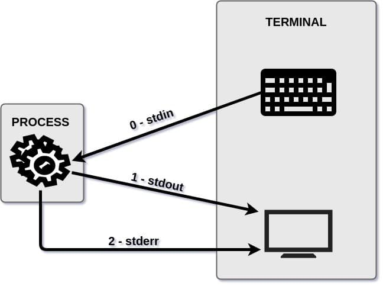
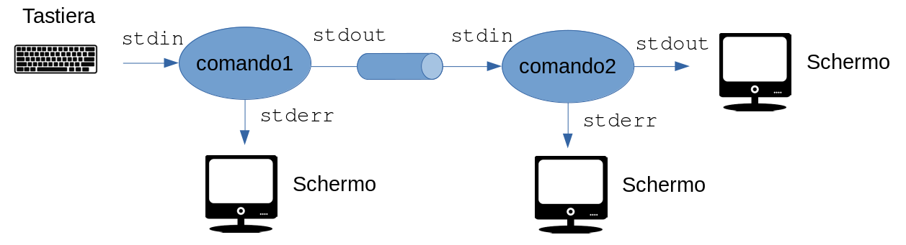

<!-- _paginate: false-->
<!-- _header: "" -->
<!-- _backgroundColor: #FCF3CF -->
<style scoped> h1, h2, h3, h4 {text-align: center;}
section {background-color: #FDEDEC;}
h1 {color:red} a:link {color: darkred;} p {text-align: center; font-size: 25px}</style>
<br/><br/><br/>
### Sistemi Operativi
### Unità 2: Utilizzo di Linux
Comandi in Bash
=================
<br/><br/><br/>
[Martino Trevisan](https://trevisan.inginf.units.it/)
[Università di Trieste](https://www.units.it)
[Dipartimento di Ingegneria e Architettura](https://dia.units.it/)

---
## Argomenti

1. Pipe e redirect
2. Filtri e simili
3. Esercizi

---
# Pipe e Redirect

---
## Pipe e Redirect

In Linux, ogni processo, ha a disposizione 3 canali standard di comunicazione.
- **Standard Input** (`stdin`): per ricevere dati in ingresso. 
- **Standard Output** (`stdout`): per stampare l'output
- **Standard Error** (`stderr`): per stampare eventuali errori


---
## Pipe e Redirect

Di default, un programma riceve lo Standard Input da tastiera, e stampa Standard Output e Standard Error su console.
<br>


---
## Pipe e Redirect

Questo implica quello che già abbiamo visto:
- `read` legge da `stdin`, quindi di default da tastiera
- `echo` stampa su `stdout` che di default è console
- Per stampare su `stderr`, si può usare: `echo "An error!" >&2`. Di default, lo `stderr` è visualizzato a schermo

Tutti i programmi ben scritti, devono attenersi a usare questi *canali standard*.
- Ciò permette una grande flessibilità
- Tutti i programmi di default di Linux lo fanno

---
## Pipe e Redirect

**Redirezione su file**: è possibile eseguire un programma e redirezionare lo `stdout` su file anzichè stamparlo
**Formato**: `comando > file` oppure `comando 1> file`
Questo perchè $1$ indica `stdout` mentre $2$ indica `stderr`
**Esempio**: `date > data.txt` La data corrente viene salvata in `data.txt` e non stampata ad output
**Nota**: se `file` esiste, il contenuto viene sovrascritto

---
## Pipe e Redirect

***Append* su file**: simile alla redirezione. Il file non viene cancellato, ma lo `stdout` del programma viene aggiunto in coda.
**Formato**: `comando >> file` oppure `comando 1>> file`
**Esempio**:

```bash
date > file.txt
sleep 5 # Pausa di 5 secondi
date >> file.txt # "Appende" a file.txt
```

---
## Pipe e Redirect

**`stderr` su file**: permette di redirigere lo `stderr` su un file.
**Formato**: `comando 2> file`
Questo perchè $1$ indica `stdout` mentre $2$ indica `stderr`

**`stdin` da file**: permette di prelevare da file anzichè da tastiera lo `stdin` un programma
**Formato**: `comando < file`

---
## Pipe e Redirect
<!-- _backgroundColor: #FFF9E3 -->
**Esempio**: Si scriva un programma che riceve due argomenti. Ricerca nella folder corrente tutti i file che hanno il nome del primo argomento e salva la lista nel file il cui nome è il secondo argomento
```bash
#!/bin/bash
if [ "$#" != "2" ]
then
    echo "Servono due argomenti"
else
    find . -name $1 > $2
fi
```

---
## Pipe e Redirect

**Pipe**: è possibile redirezionare lo `stdout` di un primo comando nello `stdin` di un secondo
**Formato**: `comando1 | comando2`
E' uno dei costrutti più potenti del bash, siccome permette di svolgere compiti complessi con poco codice



Ne vedremo le potenzialità assieme ai comuni comandi bash

---
## Pipe e Redirect
**Sostituzione**: è possibile usare lo `stdout` di un comando come una variabile.
**Formato**: `$(comando)`
**Esempi**:
- `a=$(ls /tmp)`: la stringa `a` contiene l'elenco dei file in `/tmp`
- `rm $( find / -name "*.tmp" )`: rimuove tutti i file nel sistema che terminano per `.tmp`

---
## Filtri e simili

Negli OS Linux esistono una serie di comandi per manipolare testo.
- Filtrare, ordinare, comporre

Essi si aspettano di lavorare su dati testuali organizzati in righe, come normali file di testo (o di configurazione)

Permettono di fare operazioni complesse con poco codice
- Spesso si usano assieme alle `pipe` al fine di creare pipeline di processamento

---
# Filtri e simili

---
## Filtri e simili
**`grep [options] pattern [file...]`**: stampa le linee del file che contengono il pattern. Se non metto il file usa lo standard input: posso usare grep in pipe. Alcune opzioni:

<medium>

- `-n`: stampa il numero di riga
- `-i`: case insensitive
- `-c`: stampa il numero di match
- `-c`: stampa solo le linee che **non** contengono il pattern

**Esempio**:
- `grep -r main *.c`: stampa le linee che contengono `main` in tutti i file che finiscono in `.c`
- `ps -ef | grep bash`: stampa tutti i processi che sono istanze del programma `bash`

</medium>

---
## Filtri e simili
<!-- _backgroundColor: #FFF9E3 -->
**Esempio**: si scriva un programma che riceve due argomenti: il primo argomento è una cartella, il secondo argomento un pattern. Il programma trova tutte le linee dei file `.c` o `.h` nella cartella, che contegono il pattern. Le linee vengono salvate nel file `/tmp/output.txt`.
```bash
#!/bin/bash
if [ "$#" != "2" ]
then
    echo "Servono due argomenti"
else
    cat $1/*.c $1/*.h | grep $2 > /tmp/output.txt
fi
```

---
## Filtri e simili
**`cut`**: estrare colonne (o campi) dall'input. Ha diverse modalità.
- **Modailità byte**: estrae i byte specificati da ogni righa. Si utilizza l'opzione `-b byterange`
- **Modalità campi**: estrae i campi specificati, delimitati da un separatore specifico. Si utilizza l'opzione `-d delimitatore -c campi`

---
## Filtri e simili
<!-- _backgroundColor: #FFF9E3 -->

**Esempio:** il file `file.txt` contiene:

<medium>

```
luca 1985 milano
martino 1990 torino
```
`cat file.txt | cut -b1-2` estrae i primi 2 byte (caratteri) da ogni riga, e stampa su `stdout`:
```
lu
ma
```
`cat file.txt | cut -d " " -f 2` estrae il secondo campo del file, delimitato da uno spazio. Stampa su `stdout`:
```
1985
1990
```
</medium>

---
## Filtri e simili
**`tr [-cds] [set1] [set2]`**: legge dei dati e sostituisce i caratteri specificati con altri caratteri. Opzioni comuni:
- `-d`: cancella tutti i caratteri specificati. E' necessario un solo set come argomento
- `-s`: sostituisce le ripetizioni del carattere specificato con un solo carattere

**Esempio**: `tr a A < file1 > file2`: sostituisce le `a` minuscole con `A` maiuscole. Notare lo `stdin` di `tr` è letto da file con l'operatore `<`.

---
## Filtri e simili
**`sort [-dfnru] [-o outfile] [file…]`**: Ordina i dati del file o dello `stdin`. Opzioni principali:
- `-f`: tratta maiuscole come minuscole. 
- `-n`: riconosce i numeri e li ordina in modo numerico. 
- `-r`: ordina i dati in modo inverso. 
- `-k`: ordina secondo il numero di colonna dato dopo il k
- `-u`: ordina e rimuove linee duplicate
- `-t SEP`: usa un separatore di campo diverso da quello di default (una *non-blank to blank transition*)


---
## Filtri e simili
<!-- _backgroundColor: #FFF9E3 -->

<small>

**Esempio:** il file `file.txt` contiene:

```
luca 1985 milano
martino 1990 torino
giovanni 1971 trieste
```
`sort < file.txt > sorted.txt` ordina le righe e stampa nel file `sorted.txt`, che conterrà:
```
giovanni 1971 trieste
luca 1985 milano
martino 1990 torino
```
`cat file.txt | sort -k 2 -n` ordina le righe per anno (secondo campo) e stampa su `stdout`:
```
giovanni 1971 trieste
luca 1985 milano
martino 1990 torino
```
</small>

---
## Filtri e simili
**`uniq [-cdu]`**: esamina i dati linea per linea cercando linee duplicate e può:
- Di default elimina duplicati
- `-c` per ogni riga prepende il numero di occorrenze
- `-d` stampa solo le linee duplicate
- `-u` stampa solo le linee uniche
<r>Nota:</r> il comando `uniq` <r>non</r> ordina le righe. E' necessario fornirle già ordinate.
<br>

**`wc [-lwc] [file]`**: conta linee (`l`), parole(`w`) e caratteri(`c`) dello `stdin` o del file

---
# Esercizi
<!-- _backgroundColor: #FFF9E3 -->

---
## Esercizi
<!-- _backgroundColor: #FFF9E3 -->
<small>

Dato il file `file.txt` contentente:
```
luca 1985 milano
martino 1990 torino
giovanni 1971 trieste
andrea 1984 milano
```
Si calcoli il numero di righe nel file:
```bash
wc -l < file.txt # Output 4
```
Si calcoli quante città sono incluse nel file:
```bash
cat file.txt | cut -d " " -f 3 | sort | uniq | wc -l # Output 3
```
Si trovi la città che appare il maggior numero di volte e il numero di occorrenze:
```bash
cat file.txt | cut -d " " -f 3 | sort | uniq -c | sort | tail -n 1 # Output 2 milano
```
<r>Ricorda:</r> il comando `tail -n N` stampa le ultime `N` righe di un file o dello `stdin`

</small>

---
## Esercizi
<!-- _backgroundColor: #FFF9E3 -->
<small>

Dato il file `vini.txt` contentente il nome, l'anno, la città e il prezzo di alcune bottiglie di vino:
```
ribolla 2012 udine 21
prosecco 2018 trieste 15
barbera 2009 torino 20
freisa 2010 torino 18
barbera 2013 torino 14
barolo 1984 alba 45
```

Si trovino il nome e l'anno vino più caro:
```bash
$ sort -k4 -r < vini.txt | head -1 | cut -d " " -f 1-2
barolo 1984
```

Si trovino i nomi dei vini prodotti a Torino:
```bash
$ cat vini.txt | grep torino | cut -d " " -f 1 | sort | uniq
barbera
freisa
```

</small>

---
## Esercizi
<!-- _backgroundColor: #FFF9E3 -->
<small>

Utilizzando lo stesso file dell'esercizio precedente:

Si calcoli quanti vini sono presenti per ogni città:
```bash
$ cat vini.txt | cut -d " " -f 3 | sort | uniq -c
      1 alba
      3 torino
      1 trieste
      1 udine
```
   
Si calcoli quanti anni passano tra il vino più vecchio e più nuovo:
```bash
$ min=$(sort -k2 < vini.txt | cut -d " " -f 2 | head -n 1)
$ max=$(sort -k2 < vini.txt | cut -d " " -f 2 | tail -n 1)
$ echo "Intercorrono $((max-min)) anni"
Intercorrono 34 anni
```
</small>


