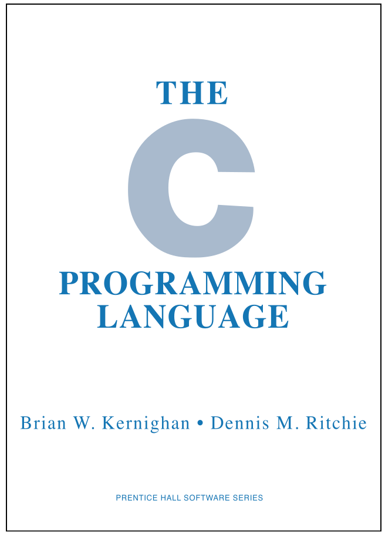
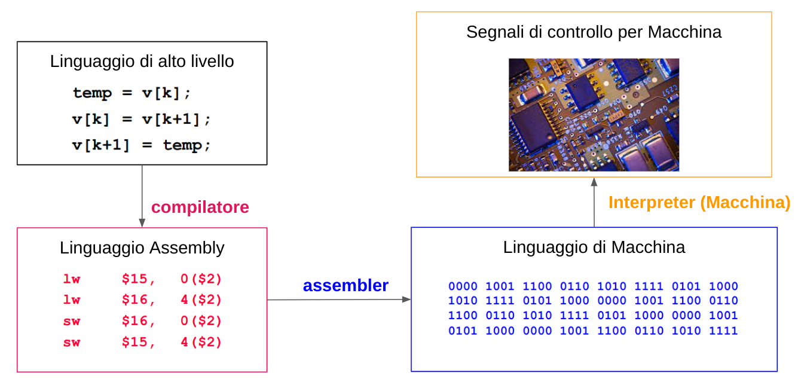

<!-- _paginate: false-->
<!-- _header: "" -->
<!-- _backgroundColor: #FCF3CF -->
<style scoped> h1, h2, h3, h4 {text-align: center;}
section {background-color: #FDEDEC;}
h1 {color:red} a:link {color: darkred;} p {text-align: center; font-size: 25px}</style>
<br/><br/><br/>
### Sistemi Operativi
### Unità 3: Programmazione in C
Introduzione al linguaggio C
=====================
<br/><br/><br/>
[Martino Trevisan](https://trevisan.inginf.units.it/)
[Università di Trieste](https://www.units.it)
[Dipartimento di Ingegneria e Architettura](https://dia.units.it/)

---
## Argomenti

1. Storia del C
2. Compilazione in C

---
# Storia del C

---
## Storia del C

Il <r>C</r> è un linguaggio di programmazione:
- **Ad alto livello**: non si scrive in istruzioni macchina
- **Imperativo**: il programma è una sequenza di istruzioni
- **Procedurale**: le istruzioni che svolgono una compito vengono raggruppate in <r>funzioni</r>, per permettere pulizia del codice e riuso

Tra i linguaggi di programmazione ad alto livello, il C è quello più vicino al linguaggio macchina.
- Libertà di utilizzo degli indirizzi di memoria
- Utilizzato dentro Linux per scrivere il kernel e i driver

---
## Storia del C

**Caratteristiche del C**:
- **Linguaggio minimalista**: pochi concetti semplici, vicini a quelli del linguaggio macchina
  - Molte istruzioni mappabili direttamente con una istruzione Assebly
  - Solo 32 parole riservate
- **Ruolo centrale dei puntatori**: i puntatori sono variabili che contengono un indirizzo di memoria.
  - Permette perciò l'<r>indirizzamento indiretto</r>. Accedo a una variabile non tramite il suo nome, ma tramite il suo indirizzo
  - Il programmatore ha un controllo molto elevato sulla memoria della macchina, consentendo di ottimizzare il codice
- **Tipizzazione statica**: ogni variabile ha un tipo di dato che deve essere esplicitamente dichiarato dal programmatore

---
## Storia del C

- Creato da Dennis Ritchie nel 1972 presso gli AT&T labs, col fine di scrivere il sistema operativo Unix
- Pubblicato nel 1978 col famoso libro ***Il linguaggio C***
- Standardizzato a partire dal 1989. Standard ANSI X3.159-1989




---
## Storia del C

Il C è in continua evoluzione. Si sono susseguiti vari standard negli anni.
Dalla prima versione **C89** ora siamo alla versione **C17**.
Nei prossimi anni ci sarà una nuova versione, per ora chiamata **C2x**

La standardizzazione garantisce la portabilità del codice sorgente. Uno stesso programma in C può essere compilato su diversi SO (Linux, Windows, MacOS).

---
## Storia del C

Attualmente il C è utilizzato per:
- Scrivere componenti di base di Linux
- Scrivere programmi che necessitano di grande efficienza
- Scrivere programmi in domini critici: telecomunicazioni, processi industriali, software real-time

**Nota didattica**: chiunque sa programmare in C impara velocemente ogni altro linguaggio.
Non vale il viceversa.

---
## Storia del C

**C vs Java**:
<table>
<tr><th>C</th><th>Java</th>
<tr><td>Compilato in codice macchina</td><td>Compilato in bytecode</td>
<tr><td>Eseguito direttamente</td><td>Eseguito nella JVM</td>
<tr><td>Gestione manuale di memoria</td><td>JVM gestisce la memoria</td>
<tr><td>Generalmente Veloce</td><td>Lento</td>
</tr>
</table>

---
# Compilazione in C

---
## Compilazione in C

Il C + un <r>linguaggio compilato</r>.
- Un software chiamato <r>compilatore</r> traduce il codice sorgente in un eseguibile in linguaggio macchina
- Altri linguaggi compilati: C++, Go

Il C non è un <r>linguaggio interpretato</r>
 - Un linguaggio interpretato viene eseguito da un <r>interprete</r>, che legge ed esegue le istruzioni.
 - Esempi di linguaggi interpretati: Python, R.

---
## Compilazione in C
**Funzionamento della compilazione**:


---
## Compilazione in C

**Fasi della compilazione**:
1. Il <r>Preprocessore</r> esegue eventuali sostituzioni testuali nel codice sorgente. Necessario per costanti e macro.
2. Il <r>Compilatore</r> crea il codice eseguibile per ogni file sorgente in C.
3. Il <r>Linker</r> assembla i codici eseguibili nel programma finale, collegando il programma alle funzioni di libreria.
    - Ogni in linguaggio C fornisce varie funzioni di libreria per calcoli matematici, interazione col SO, realizzazione di interfacce grafiche.


---
## Compilazione in C

**Compilazione in Linux**: si usa il compilatore standard `gcc`
Sintassi:
```bash
gcc [<opzioni>] file1.c file2.c file3.c  … [-l librerie]
```

Normalmente:
```bash
$gcc file.c	   # compila e linka mettendo il codice eseguibile in a.out
$gcc file.c -c # compila e non linka mettendo il codice oggetto in file.o
$gcc file.c -o outfile  # compila e linka. codice exe in outfile
$gcc file.c -o outputfile -l libreria # compila e linka con libreria
```

---
## Compilazione in C
**Primo programma in C**: il seguente programma stampa a schermo la scritta `Hello World!`

```c
#include <stdio.h>
int main() {
   printf("Hello World!\n");
   return 0;
}
```

Per compilare ed eseguire, inserire il codice sorgente nel file `hello.c` ed eseguire i seguenti comandi:
```bash
$ gcc hello.c -o hello
$ ./hello
Hello World!
```

---
## Compilazione in C

**Descrizione delle istruzioni**

`#include <stdio.h>` Indica che usiamo la libreria standard di I/O, nella quale sono definite le principali funzioni per la gestione dell’input/output

`int main() {` Definisce la funzione `main`, che costituisce il corpo principale di ogni programma. Deve esserci in ogni programma. Deve resituire un intero.

`printf("Hello World!\n");` La funzione di libreria `printf` stampa a video

`return 0;` Istruzione di ritorno dalla funzione `main`. Termina il programma


---
## Compilazione in C

**Descrizione delle istruzioni**
- Le parentesi graffe `{ ... }` delimitano i blocchi funzionali
  ```c
  int main(){
    ... istruzioni...
  }
  ```
- Lo stesso approccio é usato per delimitare blocchi funzionali in tutti i costrutti
  ```c
  if (condizione){
    ... istruzioni...
  }
  ```

---
## Compilazione in C

**Struttura minima di un programma**

```c
#include librerie
int main(void) {
    definizione variabili
    istruzioni eseguibili
}
```

---
## Compilazione in C

**Commenti:**
I commenti sono testo che non viene analizzato dal compilatore
Servono per aumentare la leggibilità del codice.
Sintassi:
```c
/* commento
   multiriga */
```
```c
// commento su singola riga
```

---
## Compilazione in C

**Spaziatura**: gli spazi e i ritorni a capo non hanno funzione in C
Le istruzioni che non iniziano un blocco sono terminate da `;`

```c
int main(){
    printf("hello\n");
    return 0;
}
```
equivale a
```c
int main(){ printf("hello\n"); return 0;}
```

---
## Compilazione in C

**Utilizzo di librerie**:
Le librerie si possono usare dopo averle menzionate con la direttiva:
```c
#include <libreria.h>
```
**Nota:**
Le istruzioni di include non vanno terminate con `;`
Non si possono inserire spazi a inizio riga


---
## Compilazione in C
<small>

**Librerie principali:**
- `<stdio.h>`: Funzioni di lettura/scrittura su terminale e su file
- `<stdlib.h>`: Funzioni base per interazione con sistema operativo
- `<unistd.h>`: API standard di POSIX
- `<math.h>`: Funzioni matematiche
- `<string.h>`: Funzioni di manipolazione delle stringhe
- `<ctype.h>`: Manipolazione di caratteri

**Altre librerie:**
- `<complex.h>`: Manipolazione di numeri complessi
- `<errno.h>`: Gestione dei codici di errore di funzioni di libreria
- `<time.h>`: Per ottenere e manipolare date e orari
- `<limits.h>` e `<float.h>`: Costanti utili per lavorare su interi e numeri reali


</small>

---
## Compilazione in C
<medium>

**Librerie e System Call:**
- Queste librerie sono raccolte nella **C standard library (clib)**
- Le funzioni di libreria <r>NON</r> sono delle System Call
  - Utilizzano al loro interno le System Call
- La `libc` é implementata su diversi SO
  - Utilizzando System Call diverse
- Permette di compilare lo stesso codice su SO diversi

**Esempio:**

Per aprire un file si usa la funzione della `libc` chiamata `fopen`
- Su Linux utilizza la System Call `open`
- Su Windows utilizza la System Call `CreateFileA`

</medium>


