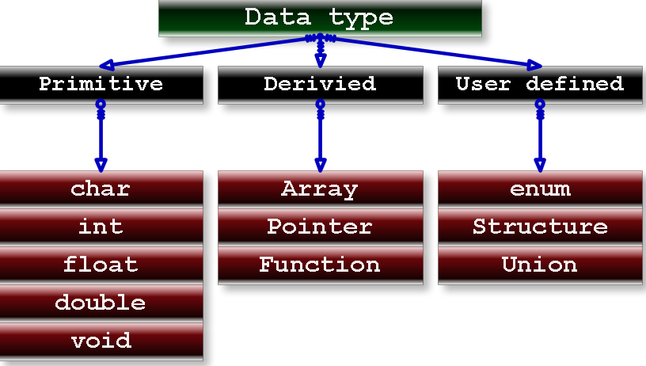
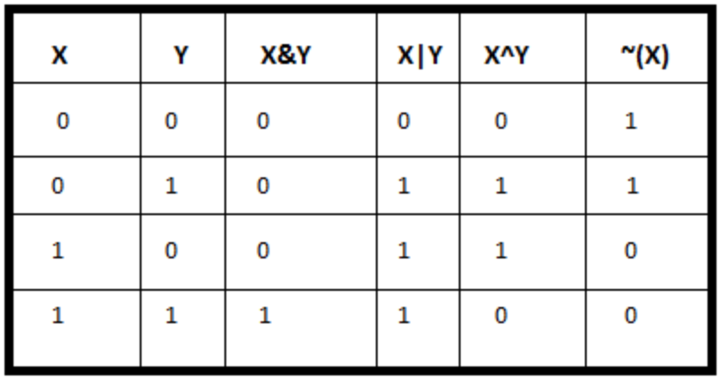

<!-- _paginate: false-->
<!-- _header: "" -->
<!-- _backgroundColor: #FCF3CF -->
<style scoped> h1, h2, h3, h4 {text-align: center;}
section {background-color: #FDEDEC;}
h1 {color:red} a:link {color: darkred;} p {text-align: center; font-size: 25px}</style>
<br/><br/><br/>
### Sistemi Operativi
### Unità 3: Programmazione in C
Variabili e utilizzo della console
==================================
<br/><br/><br/>
[Martino Trevisan](https://trevisan.inginf.units.it/)
[Università di Trieste](https://www.units.it)
[Dipartimento di Ingegneria e Architettura](https://dia.units.it/)

---
## Argomenti

1. Variabili
2. Il tipo `int`
3. Il tipo `float`
3. Gli altri tipi
4. La funzione `printf`
5. La funzione `scanf`
6. Operazioni di base
7. Esercizi

---
## Variabili

Il C é un linguaggio tipizzato
- Ogni variabile o costane ha un tipo
- Il tipo é specificato esplicitamente dal programmatore

I tipi principali sono:
- Semplici: `int`, `float`, `caratteri`
- Derivati: insiemi di tipi semplici
  - Vettori
  - Struct
- Puntatori: contengono indirizzi di memoria a variabili di un certo tipo


---
## Variabili



---
## Variabili

**Nota:** 
in C, i tipi di dato non hanno un ampiezza standard, ma varia da sistema a sistema
- Ad esempio, un `int` può essere di 16, 32 o 64 bit.
- Permette a ogni calcolatore di operare secondo la sua dimensione naturale
- Necessario fare attenzione in fase di scrittura del codice

---
## Il tipo `int`

Rappresenta un numero intero.
Rappresentato in complemento a due su 16, 32 o 64 bit.
**Dichiarazione:**
```c
int a;
```
**Assegnazione:**
```c
a = 19;
```
**Dichiarazione e Assegnazione:**
```c
int a = 19;
```

---
## Il tipo `float`

Rappresenta un numero con la virgola.
Rappresentato con numero a virgola mobile, solitamente su 32bit.
Esiste il tipo `double` che ha precisione doppia, solitamente su 64bit.
```c
float a;
```
**Assegnazione:**
```c
a = 3.14;
```

---
## Gli altri tipi

I **tipi di base** in C sono:
- `int`: sono i numeri interi.
- `float`: sono i numeri a virgola mobile
- `double`: sono i numeri a virgola mobile a precisione doppia
- `char`: sono le variabili che contengono un carattere.
- `void`: *nessun tipo*, usato in situazioni particolari

---
## Gli altri tipi

Possono essere usati dei **modificatori** sui tipi.
Esempio: `long int` indica un intero su più bit (ad es. 64 anzichè 32).
- `long`: forza l'uso di un numero maggiore di bit
- `short`:  forza l'uso di un numero minore di bit
  - `short int a;` indica un intero su 16 bit se di default è 32 bit.
- `signed`: indica che il tipo ha segno. Applicato di default
- `unsigned`: indica variabile che assume solo valori positivi
- `const`: dichiara una costante.
  - `const float pi = 3.14`

---
## Gli altri tipi

Se si vuole avere il controllo sul numero di bit di una variabile, si possono usare i tipi:
- `int8_t`
- `int16_t`
- `int32_t`
- `int64_t`
- `uint8_t`
- `uint16_t`
- `uint32_t`
- `uint64_t`

Necessario `#include <stdint.h>`

---
## Gli altri tipi
### Tipi di dato di sistema

La libreria standard del C definisce dei tipi di dato *alias*, definiti nella Man Page `system_data_types`
- Aiutano la portabilità del codice.
- L'*alias* indica l'obbiettivo del tipo, mentre su architetture diverse è implementato con tipi diversi

**Esempi**
- `size_t`: indica una lunghezza. E' solitamente `unsigned int`
- `off_t`: indica una offset. E' solitamente `int`

Ne esistono tanti: `pid_t` `uid_t` `gid_t` `time_t`


---
## Gli altri tipi
### Operatore `sizeof`

L'operatore `sizeof` fornisce la dimensione in Byte di un tipo di dato.
- Ritorna un `size_t`

**Importante** perchè la dimensione di un tipo dipende dalla macchina

**Esempio:** su PC 64bit
```c
printf("%lu\n", sizeof(char));  // Stampa 1
printf("%lu\n", sizeof(int));   // Stampa 4
printf("%lu\n", sizeof(float)); // Stampa 4
printf("%lu", sizeof(double));  // Stampa 8
```

---
## La funzione `printf`

Serve per stampare su console del testo arbitriario.
- Per interagire con utente
- Per stampare il risultato dell'elaborazione
- Per stampare informazioni che sono processate da altri programmi tramite *pipe*

Contenuta nella libreria `stdio`.
Necessaria la direttiva:
```c
#include <stdio.h>
```

---
## La funzione `printf`

**Formato:**
```c
printf("formato", args... ) ;
```
Il formato definisce il testo da stampare:
- Tutti i caratteri possono essere stampati
- Con `\n` si inserisce un ritorno a capo
- Per stampare il carattere `"` é necessario usare la sequenza di escape `\"`
- Per stampare valori numerici:
  - Inserire le sequenze `%d` (per `int`) e `%f` (per `float`) nella posizione desiderata
  - Specificare negli `args` le variabili desiderate

---
## La funzione `printf`

**Esempi:**
```c
printf("Hello ");
printf("World\n");
```
```
Hello World
```
<br>

```c
printf("Intero: %d"\n, 14);
```
```
Intero: 14
```

---
## La funzione `printf`

**Esempi:**

```c
printf("Il numero %f ", 3.14);
printf("e' pi greco\n");
```
```
Il numero 3.14 e' pi greco
```
<br>

```c
int a = 12;
float b = 1.1;
printf("a=%d\nb=%f\n", a, b);
```
```
a=12
b=1.1
```

---
## La funzione `scanf`
<medium>

La funzione `scanf` permette di richiedere un input all'utente da terminale, per leggere un `int` un `float` (o altri tipi)
**Formato:**
```c
scanf("tipo", &variabile ) ;
```

**Tipo:**
Per leggere un `int`: `%d`. Per leggere un `float`: `%f`

**Variabile:**
Inserire una variabile di tipo `int` o `float` già dichiarate
- Preceduta dal simbolo `&`
  - Vedremo che il motivo è che la funzione `scanf` richiede un puntatore
  - Con `&variabile` si passa alla `scanf` l'indirizzo di `variabile`
</medium>

---
## La funzione `scanf`
**Esempi:**
Lettura di un `int`
```c
int a;
scanf("%d", &a);
```
Lettura di un `float`
```c
float b;
scanf("%f", &b);
```

---
## La funzione `scanf`
Per ottenere un risultato gradevole, si combinano `printf` e `scanf`.
**Esempi:**
```c
int a;
printf("Inserisci un numero: ");
scanf("%d", &a);
printf("Il quadrato del numero immesso è: %d\n", a*a);
```

---
## Operazioni di base

**Assegnazione**: si utilizza l'operatore `=`.
**Esempi:**
```c
int a;
a = 12;  // Assegnazione da costante
int b;
b = a;   // Assegnazione da variabile
```
```c
float f = 12; // Assegnazione assieme a dichiarazione
f = f + 12;   // Assegnazione che incrementa
```

---
## Operazioni di base

**Operazioni aritmetiche**:
- Somma: `a + b`
- Sottrazione: `a - b`
- Somma: `a * b`
- Divisione: `a / b`
  - Nota: se entrambi gli operandi sono `int` lo è anche il risultato.
- Resto della divisione: `a % b`
- Incremento: `i++`
- Decremento: `i--`

---
## Operazioni di base

**Conversione tra tipi**: si chiama operazione di casting.
Il formato è: `(tipo) variabile`. Ad esempio: `(float) a `
**Esempio**:
```c
int a = 5;
int b = 2;
float c;
c = a/b; // contiene 2
c = ( (float) a ) / ( (float) b ); // contiene 2.5
```

**Parentesi**: si possono utilizzare per annidare operazioni nella maniera desiderata.

---
## Operazioni di base

**Operatori sui bit**: eseguono operazioni logiche bit a bit
- `a & b`: *AND* bit a bit
- `a | b`: *OR* bit a bit
- `a ^ b`: *XOR* bit a bit
- `~a`: *NOT* bit a bit (operatore unario)

**NOTA:** non confondere con operatori logici (`&&`, `||`, `!`, che vedremo più avanti)

---
## Operazioni di base

**Operatori sui bit**:



---
## Esercizi
<!-- _backgroundColor: #FFF9E3 -->
<small>

Si scriva un programma che legge due interi da tastiera e stampa la loro somma.
```c
#include <stdio.h>

int main(void)
{
    int a, b ; /* addendi */
    int c ; /* somma */
    /* LEGGI GLI ADDENDI A E B */
    printf("Somma due numeri\n\n");
    
    printf("Immetti il primo numero: ");
    scanf("%d", &a);

    printf("Immetti il secondo numero: ");
    scanf("%d", &b);
    
    /* CALCOLA LA SOMMA */
    c = a + b;
    
    /* STAMPA IL RISULTATO C */
    printf("La somma di %d + %d vale: %d\n", a, b, c);
}
```
</small>


---
## Esercizi
<!-- _backgroundColor: #FFF9E3 -->
<small>

Si scriva un programma che dato un numero di minuti, calcola a quante ore (e minuti rimanenti) equivale.
```c
#include <stdio.h>

int main(void)
{
    int a; /* minuti input*/
    int b, c ; /* ore e minuti in output */
    /* LEGGI I MINUTI */
    printf("Calcolo delle ore\n\n");
    
    printf("Immetti il numero di minuti: ");
    scanf("%d", &a);
    
    /* CALCOLA LA SOMMA */
    b = a/60;
    c = a%60;
    
    /* STAMPA IL RISULTATO C */
    printf("Una quantità di %d minuti equivale a %d ore e %d minuti\n", a, b, c);
}
```
</small>


