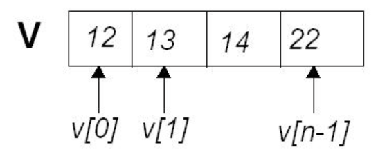
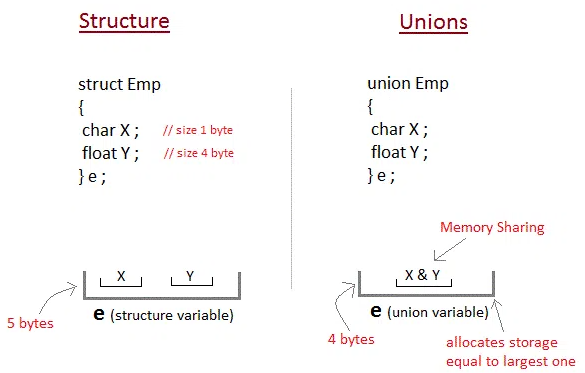

<!-- _paginate: false-->
<!-- _header: "" -->
<!-- _backgroundColor: #FCF3CF -->
<style scoped> h1, h2, h3, h4 {text-align: center;}
section {background-color: #FDEDEC;}
h1 {color:red} a:link {color: darkred;} p {text-align: center; font-size: 25px}</style>
<br/><br/><br/>
### Sistemi Operativi
### Unità 3: Programmazione in C
Tipi complessi
==================================
<br/><br/><br/>
[Martino Trevisan](https://trevisan.inginf.units.it/)
[Università di Trieste](https://www.units.it)
[Dipartimento di Ingegneria e Architettura](https://dia.units.it/)

---
## Argomenti

1. Vettori
2. Le `struct` 
3. Le `union`

---
# Vettori

---
## Vettori

I tipo di dato semplici (`int` o `float`) possono contenere un solo dato alla volta.
In C, si possono creare tipi di dato complessi, che contengono più valora. Noi vedremo:
- I vettori o `array`
- Le strutture o `struct`

---
## Vettori

**Definizione:** Un vettore o `array` è un insieme di variabili dello stesso tipo. E' composto di `N` celle, ognuna identificata da un <r>indice</r>.
<br>


**Utilizzi:** vastissimi. Permettono di trattare liste di oggetti senza ripetere il codice
<small>

- Effettuare operazioni matematiche: media, varianza
- Gestire flussi di dati

</small>

---
## Vettori

Ripetere il codice è una pratica <r>sbagliata<r/>.

```c
int dato1, dato2, dato3, dato4, dato5 ;
int dato6, dato7, dato8, dato9, dato10 ;

scanf("%d", &dato1);
scanf("%d", &dato2);
scanf("%d", &dato3);
...
```

Inutile e prono a errori!

---
## Vettori

Versione corretta:

```c
int dato[10]; // Definizione di array

for(i=0; i<10; i++)
    scanf("%d", &dato[i]);
    
for(i=9; i>=0; i--)
    printf("%d\n", dato[i]);
```

Vedremo la sintassi esatta nelle prossime slide.


---
## Vettori

**Definizione di un vettore**:
```c
tipo nome [N];
```

Esempio:
```c
int vettore [10];
```
Definisce un array chiamato `vettore` composto da $10$ interi (`int`).

---
## Vettori

<r>Nota:</r> La lunghezza del vettore deve essere nota in fase di <r>compilazione</r>. Deve essere una costante.

Il seguente codice è errato:
```c
int N;
scanf("%d",&N);
float data [N];
```
Questa è una grande <r>differenza</r> rispetto ad altri linguaggi di programmazione come Java o Python.
Esistono metodi per creare array di lunghezza arbitraria in C (la funzione `malloc`), che vedremo più avanti nel corso.

---
## Vettori

**Costanti:** esistono due modi in C per dichiarare delle costanti.
1. Tramite una direttiva `define`:
   ```c
   #define N 10
   ```
2. Tramite il modificatore `const` applicato a una variabile.
   ```c
   const int N = 10; // N non è modificabile
   int dato[N];
   ```

---
## Vettori

**Definizioni alternative**: si può definire ed inizializzare allo stesso tempo un vettore.
```c
int v[4] = {2, 7, 9, 10};
```
In questo caso, si può omettere la lunghezza, che viene inserita automaticamente dal compilatore.
```c
int v[] = {2, 7, 9, 10};
```

---
## Vettori
**Accesso agli elementi:**  Si deve specificare l'indice. La sintassi è la seguente.
```c
nomevettore[valoreindice]
```
Esempio:
```c
int v [] = {4,5,6};
printf("%d\n", v[1]); // stampa 5
```

---
## Vettori
**Indici:** 
- Partono da $0$ e arrivano a $N-1$
- Devono essere `int`
- Possono essere delle variabili o i risultati di una espressione

<r>Importante:</r> in C, non viene controllato che l'indice sia minore di $N-1$. Se si accede con indici oltre i limiti, si va a leggere locazioni di memoria arbitrarie, che contengono dati arbitrari.


---
## Vettori
<!-- _backgroundColor: #FFF9E3 -->
<medium>

**Esercizio**: si leggano 5 interi e si stampino in ordine inverso.

```c
#include <stdio.h>
#define N 5
int main ()
{
    int v[N];
    int i;
    
    for (i=0; i<N; i++){
        printf ("Inserisci l'elemento %d: ", i);
        scanf("%d", &v[i]);
    }
    for (i=N-1; i>=0; i--)
        printf ("Elemento %d: %d\n", i, v[i]);  
    
    return 0;
}
```
</medium>

---
## Vettori
**Copia di un vettore:**
- Bisogna compiare il contenuto elemento per elemento
- Tra vettori della stessa lunghezza e stesso tipo.
- Sbagliato tentare di copiare usando una sola istruzione.

Corretto:
```c
for (i=0; i<N; i++)
    v2[i] = v1[i];
```
Sbagliato:
```c
v1 = v2;
v1[] = v2[];
```

---
## Vettori
**Copia di un vettore:** Spiegazione:
- La variabile vettore è un contenitore di elementi
- Di per se è immutabile
- Si possono solo modificare gli elementi contenuti
- Approfondiremo quando vedremo i puntatori

---
## Vettori
**Altri utilizzi dei vettori:**
**Matrici**: un array di array è una <r>matrice</r>.
```c
int matrice [3][2];
matrice[1][0]=12;
float m[2][2]={{1,2,},{3,4}};
```

**Stringhe:** un array di `char` è una <r>stringa</r>.
Per definizione, in C le stringhe sono array di char, il cui ultimo elemento è $0$ (o `'\0'`)
- Perchè così se ne può derivare la lunghezza
Molti usi e funzioni sulle stringhe. Vedremo più avanti.
```c
char s[4] = {'a', 'p', 'e', '\0'};
```

---
## Vettori
<!-- _backgroundColor: #FFF9E3 -->

<verysmall>

**Esercizio**: si un numero $N$ da tastiera. Si leggano poi $N$ interi e si stampi se essi includono duplicati.

```c
#include <stdio.h>
#define MAXN 50 // Limite massimo del vettore
int main ()
{
    int v[MAXN]; // Vettore sovradimensionato
    int N, i, j;
    
    printf ("Si inserisca N: ");
    scanf("%d", &N); // Lunghezza effettiva del vettore
    
    if (N>MAXN){
        printf("N deve essere minore o uguale a %d\n", MAXN);
        return 1; // Ritorna un errore
    }
    
    for (i=0; i<N; i++){
        printf ("Inserisci l'elemento %d: ", i);
        scanf("%d", &v[i]);
    }
    
    for (i=0; i<N; i++)
        for (j=0; j<i; j++)
            if (v[i]==v[j])
                printf("L'elemento %d è duplicato dell'elemento %d\n", i,j);
    return 0;
}
```

**Osservazione:** si è scelto di sovradimensionare il vettore `v` rendendolo lungo `MAXN`, ma utilizzandolo fino all'elemento `N-1`.
Con la memoria dinamica che vedremo più avanti, questo work-around non sarà più necessario.

</verysmall>

---
# Le `struct`

---
## Le `struct` 

Le <r>strutture</r> o `struct` sono collezioni che contengono variabili non necessariamente dello stesso tipo.
Funzionamento:
1. Si definisce la `struct`, un nuovo tipo di dato complesso formato da più record.
2. Si creano e si usano variabili del tipo appena creato.


---
## Le `struct` 

**Definizione di una `struct`:**
```c
struct nome {
    campi
};
```
**Esempio:**
```c
struct punto{
    float x;
    float y;
};
```

---
## Le `struct` 

**Creazione di variabili `struct`:**
Per creare nuove variabili di un tipo `struct` definito in precedenza.
```c
struct nome;
```
**Esempio:**
```c
struct p1, p2;
```

---
## Le `struct` 

**Acesso ai campi `struct`:**
```c
variabile.campo
```
**Esempio:**
```c
p1.x = 2.5;
p1.y = 3.0;
```

---
## Le `struct`

**Utilizzo di `typedef`**: per evitare di dover premettere `struct` ogniqualvolta si crea una variabile, si può usare la keyword `typedef`, con la seguente sintassi.
```c
typedef struct {
    campi
} nome;
```
**Esempio:**
```c
typedef struct{
    float x;
    float y;
} punto;
punto p1, p2; // Si può omettere struct
```

---
## Le `struct`
<!-- _backgroundColor: #FFF9E3 -->

<verysmall>

**Esercizio**: si crei un programma che effettua la somma vettoriale tra due vettori bi-dimensionali.

```c
#include <stdio.h>

// La dichiarazione di una struct è solitamente fuori da ogni funzione
typedef struct{
    float x;
    float y;
} punto;

int main ()
{
    punto p1, p2, p3; // Tre variabili di tipo 'punto'
    
    // Lettura
    printf ("P1 -> x: ");
    scanf("%f", &p1.x);
    printf ("P1 -> y: ");
    scanf("%f", &p1.y);
    printf ("P2 -> x: ");
    scanf("%f", &p2.x);
    printf ("P2 -> y: ");
    scanf("%f", &p2.y);
    
    // Somma
    p3.x = p1.x + p2.x;
    p3.y = p1.y + p2.y;
    
    printf("La somma vettoriale è il punto: (%f, %f)\n", p3.x, p3.y);

}
```
</verysmall>


---
## Le `struct`

**Osservazioni:**
Non è possibile confrontare due `struct` con gli operatori `==` o `!=`.
E' necessario confrontare tutti i campi
```c
punto p1, p2;
if (p1==p2) // Sbagliato!
    ...
if (p1.x==p2.x && p1.y == p2.y) // Corretto
    ...
```

Inizializzazione: si può fare come coi vettori
```c
punto p1 = {1.1, 2.4} // x=1.1 e y = 2.4
```

---
## Le `struct`

Le `struct` sono molto usate per creare nuovi tipo di dato complesso:
- Sono come record di un database
- Esempi: numero complesso, indirizzo stradale, ecc...

Sono molto usate nelle librerie del C:
- Permettono di creare tipi di dato arbitrari
- Per rappresentare strutture del sistema operativo.
- Esempi: variabili di sincronizzazione, pacchetti di rete, ecc...


---
# Le `union`

---
## Le `union` 
### Definizione


Una `union` o <r>unione</r> è una variabile che può contenere **in momenti diversi** oggetti di tipo (e dimensione) diversi, con, in comune, il ruolo all'interno del programma.
- Le `union` servono per **risparmiare memoria**
- Usate particolarmente in sistemi *embedded* con stretti vincoli di risorse

Le `union` servono anche per avere un **tipo di dato generico** che ha tipo diverso a seconda della circostanza


---
## Le `union` 
### Implementazione in C

Si alloca la memoria per la **più grande delle variabili**, visto che esse non possono mai essere utilizzate contemporaneamente (la scelta di una esclude automaticamente le altre)
- I campi **condividono** il medesimo spazio di memoria.
- Se si cambia il valore a un campo, il valore di tutti gli altri campi viene sovrascritto

---
## Le `union` 
### Definizione in C


In C una unione viene definita tramite la parola chiave `union`
- La definizione di un'unione è molto simile a quella di una `struct`, ed è medesimo il modo di accedervi
- Si può usare `typedef` per evitare di dover premettere `union` ogniqualvolta si crea una variabile

```c
union student
{
  uint64_t tessera_sanitaria;
  uint32_t matricola;
};
```


---
## Le `union` 
### Utilizzo

Si dichiarano e utilizzano come le `struct`

```c
#include <stdio.h>
#include <stdint.h> /* Per uint32_t e uint64_t */
union student
{
  uint64_t tessera_sanitaria;
  uint32_t matricola;
};

int main( int argc, char *argv[] ){
    union student luca;
    luca.matricola = 1234;
    printf("Matricola: %d\n", luca.matricola);

    luca.tessera_sanitaria = 2897189786;
    /* Usare il formato %ld essendo in intero lungo */
    printf("Tessera Sanitaria: %ld\n", luca.tessera_sanitaria);
    return 0;
}
```

---
## Le `union` 
### Errori di utilizzo

L'assegnazione di un campo **sovrascrive** il valore gli altri campi.

```c
union student luca;
luca.matricola = 1234;

// Sovrascrivo luca.matricola
luca.tessera_sanitaria = 2897189786;

// Leggo correttamente tessera_sanitaria
printf("Tessera Sanitaria: %d\n", luca.tessera_sanitaria);

// Leggo matricola, che è stata sovrascritta!
printf("Matricola di Luca: %d\n", luca.matricola); // Errore!
```

---
## Le `union` 
### Casi d'uso

Si usano quando serve dichiarare variabili che possono assumere tipo diverso a seconda delle circostanze.
**Esempio:** Uno studente può essere identificato col *numero di tessera sanitaria* o con la *matricola* a seconda della situazione

```c
union student
{
  uint64_t tessera_sanitaria;                                       
  uint32_t matricola;
};
```
La `union student` **non** può contenere **contemporaneamente** tessera sanitaria e matricola
- Il programma deve essere scritto di conseguenza

---
## Le `union` 
### Memoria e `union`

Come detto, una `union` occcupa lo spazio necessario al campo più grande.

<?xml version="1.0" encoding="utf-8"?>
<svg viewBox="0 0 73.878 31.24" xmlns="http://www.w3.org/2000/svg" xmlns:bx="https://boxy-svg.com">
  <defs>
    <bx:grid x="0" y="0" width="3.518" height="3.905"/>
    <style bx:fonts="Courier Prime">@import url(https://fonts.googleapis.com/css2?family=Courier+Prime%3Aital%2Cwght%400%2C400%3B0%2C700%3B1%2C400%3B1%2C700&amp;display=swap);</style>
  </defs>
  <rect x="4.776" y="7.553" width="56.288" height="7.81" style="fill: rgb(216, 216, 216); stroke: rgb(0, 0, 0);"/>
  <path style="fill: rgb(216, 216, 216); stroke: rgb(0, 0, 0);" d="M 11.812 7.553 L 11.812 15.363"/>
  <path style="fill: rgb(216, 216, 216); stroke: rgb(0, 0, 0);" d="M 18.848 7.553 L 18.848 15.363"/>
  <path style="fill: rgb(216, 216, 216); stroke: rgb(0, 0, 0);" d="M 25.884 7.553 L 25.884 15.363"/>
  <path style="fill: rgb(216, 216, 216); stroke: rgb(0, 0, 0);" d="M 32.954 15.263 L 32.92 7.553"/>
  <path style="fill: rgb(216, 216, 216); stroke: rgb(0, 0, 0);" d="M 39.956 7.553 L 39.956 15.363"/>
  <path style="fill: rgb(216, 216, 216); stroke: rgb(0, 0, 0);" d="M 46.992 7.553 L 46.992 15.363"/>
  <path style="fill: rgb(216, 216, 216); stroke: rgb(0, 0, 0);" d="M 54.028 7.553 L 54.028 15.363"/>
  <text style="fill: rgb(51, 51, 51); font-family: Arial, sans-serif; font-size: 4px; white-space: pre;" x="6.498" y="11.152" dx="0.684" dy="1.701">1</text>
  <text style="fill: rgb(51, 51, 51); font-family: Arial, sans-serif; font-size: 4px; white-space: pre;" x="13.548" y="11.152" dx="0.684" dy="1.701">2</text>
  <text style="fill: rgb(51, 51, 51); font-family: Arial, sans-serif; font-size: 4px; white-space: pre;" x="20.49" y="11.152" dx="0.684" dy="1.701">3</text>
  <text style="fill: rgb(51, 51, 51); font-family: Arial, sans-serif; font-size: 4px; white-space: pre;" x="48.596" y="11.152" dx="0.684" dy="1.701">7</text>
  <text style="fill: rgb(51, 51, 51); font-family: Arial, sans-serif; font-size: 4px; white-space: pre;" x="41.586" y="11.152" dx="0.684" dy="1.701">6</text>
  <text style="fill: rgb(51, 51, 51); font-family: Arial, sans-serif; font-size: 4px; white-space: pre;" x="34.645" y="11.152" dx="0.684" dy="1.701">5</text>
  <text style="fill: rgb(51, 51, 51); font-family: Arial, sans-serif; font-size: 4px; white-space: pre;" x="27.499" y="11.152" dx="0.684" dy="1.701">4</text>
  <text style="fill: rgb(51, 51, 51); font-family: Arial, sans-serif; font-size: 4px; white-space: pre;" x="55.809" y="11.152" dx="0.684" dy="1.701">8</text>
  <text style="fill: rgb(51, 51, 51); font-family: &quot;Courier Prime&quot;; font-size: 4.7px; white-space: pre;" x="4.776" y="4.416">union student</text>
  <text style="white-space: pre; fill: rgb(51, 51, 51); font-family: Arial, sans-serif; font-size: 4.7px;" x="1.385" y="-2.149"> </text>
  <path style="fill: rgb(216, 216, 216); stroke: rgb(0, 0, 0);" d="M 4.974 22.044 L 61.064 21.908"/>
  <path style="fill: rgb(216, 216, 216); stroke: rgb(0, 0, 0);" d="M 61.042 20.441 L 61.064 23.224"/>
  <path style="fill: rgb(216, 216, 216); stroke: rgb(0, 0, 0);" d="M 4.738 20.703 L 4.776 23.224"/>
  <path style="fill: rgb(216, 216, 216); stroke: rgb(0, 0, 0);" d="M 4.914 28.334 L 32.882 28.283"/>
  <path style="fill: rgb(216, 216, 216); stroke: rgb(0, 0, 0);" d="M 32.916 27.078 L 32.92 29.599"/>
  <path style="fill: rgb(216, 216, 216); stroke: rgb(0, 0, 0);" d="M 4.678 27.078 L 4.716 29.599"/>
  <text style="fill: rgb(51, 51, 51); font-family: Arial, sans-serif; font-size: 4px; white-space: pre;" x="61.674" y="11.152" dx="0.684" dy="1.701">Byte</text>
  <text style="fill: rgb(51, 51, 51); font-family: &quot;Courier Prime&quot;; font-size: 4.7px; white-space: pre;" x="4.678" y="20.239">tessera_sanitaria</text>
  <text style="fill: rgb(51, 51, 51); font-family: &quot;Courier Prime&quot;; font-size: 4.7px; white-space: pre;" x="5.102" y="26.614">matricola</text>
  <text style="white-space: pre; fill: rgb(51, 51, 51); font-family: Arial, sans-serif; font-size: 3.6px;" x="-6.88" y="0.702"> </text>
</svg>

<br>

<r>Corollario:</r> non ha senso una `union` in cui ho più campi dello stesso tipo

---
## Le `union` 
### `struct` vs `union`

<medium>

- La `struct` contiene abbastanza spazio per contenere **tutti** i campi
- La `union` ha spazio per contenere **un campo alla volta**, occupando in memoria lo spazio del campo più grande



</medium>


---
## Le `union` 
### Quale campo viene usato?

Una `union` **non** contiene indicazione sul campo che è in uso
- Semplicemente, accedere a campi non valorizzati, genera un comportamento imprevedibile

Il programmatore deve **tenere traccia** del tipo della variabile di unione usata in un determinato momento:
- Determinato dal flusso del programma
- Si usa una variable esterna
- Si combinano una `struct` e una `union`
  - Una `struct` contiene una `union` e una variabile che indica il tipo dell'unione
  
---
## Le `union` 
### Combinare `struct` e `union` (1/2)

<!-- _backgroundColor: #FFF9E3 -->

<medium>

**Esempio:** si usano `struct` e `union` per definire un tipo di dato che può rappresentare velivoli diversi

I tipi di velivolo, con caratteristiche diverse. Ognuno è una una `struct` con campi diversi.

```c
typedef struct {
    int maxpassengers;
} jet;

typedef struct{
    int liftcapacity;
} helicopter;

typedef struct{
    int maxpayload;
} cargoplane;
```

</medium>

---
## Le `union` 
### Combinare `struct` e `union`  (2/2)

<!-- _backgroundColor: #FFF9E3 -->

<small>

A questo punto si definisce una `union` che contiene campi di tipo `jet`, `helicopter` e `cargoplane`.
- Ovvero, può contenere in istanti diversi un `jet`, `helicopter` e `cargoplane`

```c
typedef union{
    jet jetu;
    helicopter helicopteru;
    cargoplane cargoplaneu;
} aircraft;
```

Il tipo di dato finale è `an_aircraft`, una `struct` che contiene solamente una `union` `aircraft` e un `int` che indica di che tipo è il velivolo

```c
typedef struct {
    int kind;
    aircraft description;
} an_aircraft;
```

</small>


---
## Le `union` 
### Accedere in diversi modi allo stesso dato

<!-- _backgroundColor: #FFF9E3 -->

<small>

Una `union` si può usare per accedere in maniera diversa alla stessa variabile

```c
typedef union
{
    struct {
        unsigned char byte1;
        unsigned char byte2;
        unsigned char byte3;
        unsigned char byte4;
    } bytes;
    uint32_t dword;
} cpu_register;
```

Posso accedere a una variabile di tipo `cpu_register` in due modi:
```c
cpu_register reg;
reg.dword = 0x12345678;
reg.bytes.byte3 = 4;
```

</small>


---
## Le `union` 
### Utilizzo per `bit mask` in Sistemi *embedded*

<!-- _backgroundColor: #FFF9E3 -->

Similmente all'esempio precedente, le `union` sono un modo pratico per manipolare variabili a cui spesso si fa accesso *bit a bit*.

```c
typedef union {
    unsigned char control_byte;
    struct {
        unsigned int nibble  : 4;
        unsigned int nmi     : 1;
        unsigned int enabled : 1;
        unsigned int fired   : 1;
        unsigned int control : 1;
    };
} ControlRegister;
```

---
## Le `union` 
### Utilizzo in Linux

<!-- _backgroundColor: #FFF9E3 -->

Alcune **System Call** in Linux accettano `union` per essere più flessibili.

**Esempio:** I **segnali** permettono di mandare **messaggi** a **processi**. A seconda delle circostanze il messaggio può essere un `int` o un *puntatore* (ovvero un indirizzo di memoria)

```c
union sigval {
  int     sigval_int; /* Integer value */
  void   *sigval_ptr; /* Pointer value */
};
```


