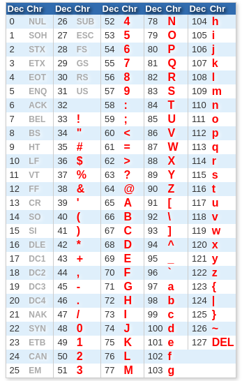

<!-- _paginate: false-->
<!-- _header: "" -->
<!-- _backgroundColor: #FCF3CF -->
<style scoped> h1, h2, h3, h4 {text-align: center;}
section {background-color: #FDEDEC;}
h1 {color:red} a:link {color: darkred;} p {text-align: center; font-size: 25px}</style>
<br/><br/><br/>
### Sistemi Operativi
### Unità 3: Programmazione in C
Stringhe
==================================
<br/><br/><br/>
[Martino Trevisan](https://trevisan.inginf.units.it/)
[Università di Trieste](https://www.units.it)
[Dipartimento di Ingegneria e Architettura](https://dia.units.it/)

---
## Argomenti

1. Il tipo `char`
2. Stringhe
3. Funzioni sulle stringhe
4. Conversione tra stringhe e altri tipi

---
# Il tipo `char`

---
## Il tipo `char`

Per ora abbiamo visto i tipi di dato:
- Intero: `int`
- Reale: `float`
- Vettori: `[]`
- Strutture: `struct`

Esiste il tipo `char` che rappresenta un singolo carattere.
Un vettore di caratteri è una stringa.
```c
char s [10]; // Stringa di lunghezza 10
```

---
## Il tipo `char`

**Il tipo `char`:** rappresenta un singolo carattere
Rappresentato in <r>ASCII</r>.
- Come numero tra 0 e 127
- Ogni numero rappresenta un possibile carattere
- Non ci sono caratteri speciali, accentati o simili
  - Lo standard per trattarli si chiama Unicode, non lo vedremo


---
## Il tipo `char`

Sono sufficienti 7bit per rappresentare un carattere ASCII.
In C, ogni carattere occupa 1B=8bit

**Esempio:**
Stringa: `ciao` è rappresentata come 4Byte:
```
99  105 97  111
c   i   a   o
```

**Nota:** non confondere numeri e caratteri
`int a = 5;   ` La variabile `a` contiene `5` 
`char c = '5';` La variabile `c` contiene `53`


---
## Il tipo `char`

In C, un carattere si rappresenta con una variabile di tipo `char`.
Un `char` è molto simile a un `int` che occupa solo 1B di memoria.
Rappresenta allo stesso tempo un carattere oppure un numero da $0$ a $256$.

```c
char c;
c = '5';
c = 53; Equivalente!
```

**Nota:** necessario usare gli apici singoli `'`.
Gli apici doppi `"` racchiudono le stringhe 


---
## Il tipo `char`

**Sequenze di escape:**

Il carattere `\` serve per introdurre un carattere speciale-
Ad esempio `\n` rappresenta il carattere di ritorno a capo
- `\n` è un singolo carattere

Per rappresentare il carattere `\` si usa la sequenza `\\`

---
## Il tipo `char`

ASCII contiene alcuni caratteri non stampabili, detti di *speciali*:
- $7$ - BEL - `\a`: emetti un bip dall'altoparlante
- $8$ - BS - `\b`: cancella l’ultimo carattere
- $9$ - TAB - `\t`: tabulazione (spazio lungo)
- $10$ - LF - `\n`: avanza di una riga
- $13$ - CR - `\r`: torna alla prima colonna

**Esempio**:
```c
char c = '\n'; //Contiene un ritorno a capo
```

---
## Il tipo `char`

**Stampare un carattere**
Tramite `printf`:
```c
char c = 'a';
printf("%c", c); // stampa: a
```

Tramite `putchar`:
```c
char c = 'a';
putchar(c); // stampa: a
```

---
## Il tipo `char`

**Lettura di un carattere**
Tramite `scanf`:
```c
char c;
scanf("%c", &c); // Legge da tastiera e mette in c
```

Tramite `putchar`:
```c
char c;
ch = getchar(); // Stesso comportamento
```

**Nota:** è complicato leggere un solo carattere. Bisogna gestire il carattere di *Invio*, che anch'esso è letto dalla `getchar`

---
## Il tipo `char`
<!-- _backgroundColor: #FFF9E3 -->
<medium>

**Esempio**: Stampare tutte le lettere maiuscole e minuscole

```c
char ch;

// Maiuscole
for( ch = 'A' ; ch <= 'Z' ; ch++)
    putchar(ch);
    
// Minuscole
for( ch = 'a' ; ch <= 'z' ; ch++)
    putchar(ch);
    
putchar('\n') ;
```
</medium>


---
# Stringhe

---
## Stringhe

Una <r>stringa</r> è una sequenza di caratteri.
In C, si rappresenta tramite un vettore di caratteri.
Esistono una serie di funzioni di libreria per processare facilmente le stringhe
- Si possono anche manipolare a mano dei vettori di caratteri.
- Ma è più veloce e sicuro usare le funzioni di libreria.


---
## Stringhe

**Lunghezza di una stringa:** ogni funzione che processa stringhe deve conoscere il vettore su cui opera e la sua lunghezza.

In C, per facilitare le operazioni si usano le **Null-terminated string**
- A una stringa si aggiunge sempre un carattere terminatore.
- Quando la stringa viene processata, il carattere terminatore indica che la stringa è finita
- Non è necessario indicare anche la lunghezza
- Ogni stringa è lunga un carattere in più

---
## Stringhe

**Lunghezza di una stringa:**
Il terminatore deve essere
- Un carattere speciale non stampabile, per non generare ambiguità
- Essere ASCII e rientrare in un `char` quindi compreso tra $0$ e $255$.
- Si utilizza per <r>convenzione</r> il carattere `\0` che corrisponde al numero $0$

<r>Errore comune</r> se si crea una stringa senza il terminatore, le funzioni di libreria hanno comportamenti inaspettati

---
## Stringhe
<!-- _backgroundColor: #FFF9E3 -->
**Esempio**: si rappresenti in un vettore di lunghezza 10 la stringa `ciao`.
```
       ┌───┬───┬───┬───┬────┬─┬─┬─┬─┬─┐
Indice │ 0 │ 1 │ 2 │ 3 │ 4  │5│6│7│8│9│
       ├───┼───┼───┼───┼────┼─┼─┼─┼─┼─┤
Valore │'c'│'i'│'a'│'o'│'\0'│?│?│?│?│?│
       └───┴───┴───┴───┴────┴─┴─┴─┴─┴─┘
```
Non è importante il valore delle ultime 5 posizioni, non verrà mai usato.

---
## Stringhe

**Definizione di stringhe:** per definire una stringa ho vari modi.
Usando le virgolette doppie `"` per indicare una stringa:
```c
char s[] = "ciao"; // Il terminatore è messo in automatico dal compilatore
```
Definendo un vettore di caratteri:
```c
char s[] = {'c', 'i', 'a', 'o', '\0'}; // Il terminatore è messo dal programmatore
```

---
## Stringhe

**Lettura di stringhe da tastiera**: si usa la `scanf` con lo specificatore di formato `%s`.
- L'argomento deve essere un vettore di caratteri
- Non si usa l'operatore `&`.
  - L'operatore `&` si utilizza per passare come argomento l'indirizzo di una variabile
  - In C, passare come argomento un vettore già significa passarne l'indirizzo
- Legge fino al primo spazio o ritorno a capo.
- Termina la stringa letta col terminatore `'\0'`

---
## Stringhe
<!-- _backgroundColor: #FFF9E3 -->

**Esempio:** leggi una stringa
```c
char s[20];
printf("Inserisci il tuo nome: ");
scanf("%s", s); // Senza &
```
 
<r>Importantissimo:</r> se la stringa letta è più lunga di 19 caratteri, la `scanf` va a scrivere in zone di memoria arbitrarie.
Fonte di molto vulnerabilità software!

---
## Stringhe

**Lettura di stringhe da tastiera**: esiste anche la funzione `gets` che legge una stringa fino al ritorno a capo.
```c
char s[20] ;
printf("Inserisci il tuo nome: ");
gets(s) ;
```
<r>Nota:</r> ha lo stesso problema della `scanf`. Può andare a scrivere fuori dal vettore. Rimossa a partire da C11.

---
## Stringhe

**Lettura di stringhe da tastiera**: per scrivere un programma sicuro, utilizzare la funzione `gets_s(vettore, N)` che non scrivere più di `N` caratteri su `vettore` (compreso terminatore)
```c
char s[20] ;
printf("Inserisci il tuo nome: ");
gets_s(s, 20) ;
```
<r>Nota:</r> in Ubuntu, `gets_s` non è ancora implementata.
Tuttavia `gets_s(s,N)` equivale a `fgets(s,N,stdin)`. 

---
## Stringhe

**Scrittura di stringhe su tastiera**: si usa la `printf` con lo specificatore di formato `%s`.
- L'argomento deve essere un vettore di caratteri
- Deve essere terminato da `'\0'`, altrimenti vengono stampati caratteri casuali finchè non si incontra un `'\0'`

**Esempio:**
```c
char nome [] = "Martino";
printf("Il mio nome: %s\n", nome);
```

---
# Funzioni sulle stringhe

---
## Funzioni sulle stringhe

Le funzioni comuni su stringhe sono implementate nella libreria standard del C.
Necessario includere:
`#include <string.h>`

Permette di non re-implementare funzioni come calcolo della lunghezza, copia, duplicazione, concatenazione.

---
## Funzioni sulle stringhe

**Lunghezza:** Si usa la funzione `strlen`. Conta i caratteri finchè trova il terminatore.
**Esempio:**
```c
char s [50];
int l;
printf("Inserisci una stringa: ");
gets_s(s, 50);
l = strlen(s);
printf("La stringa e' lunga: %d\n", l);
```
Viene stampata la lunghezza effettiva della stringa immessa.

---
## Funzioni sulle stringhe

**Copia di stringhe:** si usa la funzione `strcpy(dst,src)`
**Esempio:**
```c
char s1[]="ciao";
char s2[10];
strcpy(s2,s1)
```
La stringa `s2` conterrà `ciao`, terminata da `'\0'`.

La `strcpy` copia carattere per carattere. Infatti, come abbiamo visto non si può assegnare un vettore a un altro vettore.
```c
s2 = s1; // Sbagliato!
```

---
## Funzioni sulle stringhe

**Concatenazione:** si usa la funzione `strcat(dst,src)`
Concatena `dst` e `src` e scrive tutto in `dst`
Il vettore `dst` deve essere sufficientemente lungo!
**Esempio sbagliato:**
```c
char s1[]="ciao";
char s2[]=" mondo";
strcat(s1, s2); // Errore! s1 è lunga 5
```

**Esempio corretto:**
```c
char s1[15]="ciao";
char s2[]=" mondo";
strcat(s1, s2); // Corretto! s1 è lunga 15 > 4+6+1
```

---
## Funzioni sulle stringhe

**Confronto:** si usa la `strcmp(a,b)` che confronta le due stringhe carattere per carattere e fornisce l'ordinamento alfabetico.
Essa ritorna:
- $0$ se le stringhe sono uguali
- $<0$ se `a` precede `b` in ordine alfabetico
- $>0$ se `b` precede `a` in ordine alfabetico


---
## Funzioni sulle stringhe

**Esempio:**
```c
char s1="ciao";
char s2={'c','i','a','o','\0'}:
char s3="mondo";

strcmp(s1, s2); // ritorna 0
strcmp(s1, s3); // ritorna un numero <0
strcmp(s3, s1); // ritorna un numero >0

if (strcmp (s1, "ciao") ){ // Comparazione con costante
    ...
}
```

---
## Funzioni sulle stringhe
<medium>

**Altre funzioni**:
- Ricerca di sotto stringhe: `strchr` e `strstr`, `strspn`, `strcspn`
- Operazioni su caratteri: in `<ctype.h>` e non in `<string.h>`
  - Classificazione di caratteri: `isalpha`, `isdigit`, `isupper`, `islower`
  - Conversione tra caratteri: `toupper`, `tolower`

**Versioni sicure**: le funzioni viste finora, hanno comportamenti imprevedibili se le stringhe fornite non sono terminate da `'\0'`.
Ne essitono versioni **sicure**, in cui si forniscono la lunghezza del vettori coinvolti, per evitare di andare a leggere o scrivere oltre.
- `strncpy(src, dst, n)`: come `strcpy`
- `strncat(src, dst, n)`: come `strcat`
- `strncmp(s1, s2, n)`: come `strcmp`

</medium>


---
## Funzioni sulle stringhe
<!-- _backgroundColor: #FFF9E3 -->

<small>

**Esercizio**: si acquisisca una stringa da tastiera e si verifichi se è palindroma
```c
#include <stdio.h>
#include <string.h>
#define MAXN 100

int main ()
{
    char s[MAXN];
    int len, i;
    printf("Inserisci una parola: ");
    scanf("%s", s);
    
    len=strlen(s);
    for (i=0; i<len; i++ )
        if (s[i] != s[len-1-i]){
            printf("Parola '%s' NON palindroma\n", s);
            return 0;
        }

    printf("Parola '%s' palindroma\n", s);
    return 0;
}
```


</small>

---
# Conversione tra stringhe e altri tipi

---
## Conversione tra stringhe e altri tipi

Esistono funzioni per convertire una stringa in un numero intero o con virgola.
**Esempio:**
- Stringa: `"123"` convertibile in `int` $123$
- Stringa: `"3.14"` convertibile in `float` $3.14$

**Funzioni:** 
- `n = atoi(s)`: converte stringa in `int` 
- `f = atof(s)`: converte stringa in `float` 

<r>Nota:</r> la stringa deve avere il terminatore. Non c'è controllo di errori: `atoi("ciao")` ritorna $0$.


---
## Conversione tra stringhe e altri tipi

Si può usare la funzione `sscanf`. Equivalente alla funzione `scanf` ma ottiene i caratteri da una stringa e non da tastiera. Sintassi: `sscanf(stringa, formato, argomenti)`

**Esempio:**
```c
char s[] = "314";
int i;
sscanf(s, "%s", &i);
printf("%d\n", i); //stampa 314
```

---
## Conversione tra stringhe e altri tipi

Per convertire da `float` o `int` a stringa, si usa la funzione `sprintf(buffer, formato, argomenti)`, concettualmente identica alla `printf`, con la differenza che il risultato è salvato in `buffer`.

Esempio:
```c
char s[100];
int n = 425
sprintf(s, "%d", n); // s conterrà la stringa "425", terminata da '\0'
```

---
## Funzioni sulle stringhe
<!-- _backgroundColor: #FFF9E3 -->

<verysmall>

**Esercizio**: si acquisisca una stringa da tastiera e si trasformi in *title case*.
Una stringa in *title case* ha le iniziali (e solo le iniziali) di ogni parola maiuscole.
Esempio: `Nel Mezzo Del Cammin Di Nostra Vita`


```c
#include <stdio.h>
#include <string.h>
#include <ctype.h> // Necessario per isalpha e toupper

#define MAXN 100

int main ()
{
    char s[MAXN];
    int len, i;
    printf("Inserisci una frase: ");
    /* Notare che istruiamo fgets per leggere da standard input */
    fgets(s, MAXN, stdin);
    
    len=strlen(s);
    for (i=0; i<len; i++ )
        /* Osservare la condizione seguente. Il secondo non genera mai
           errore perché eseguito solo se il primo è falso */
        if (i==0 || !isalpha(s[i-1]) ){
            /* toupper semplicemente non ha 
               effetto su numeri */
            s[i] = toupper(s[i]);
        }

    /* Non è necessario stampare `\n`. Con la fgets è incluso nella stringa */
    printf("Title Case: %s", s);
    return 0;
}
```


</verysmall>


