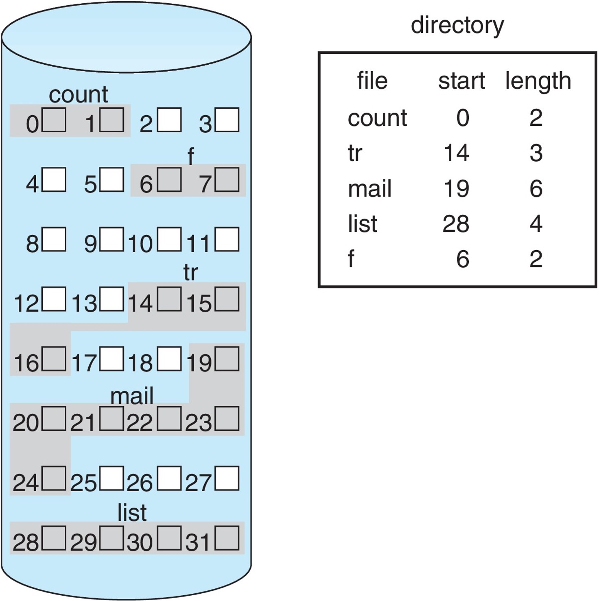

<!-- _paginate: false-->
<!-- _header: "" -->
<!-- _backgroundColor: #FCF3CF -->
<style scoped> h1, h2, h3, h4 {text-align: center;}
section {background-color: #FDEDEC;}
h1 {color:red} a:link {color: darkred;} p {text-align: center; font-size: 25px}</style>
<br/><br/><br/>
### Sistemi Operativi
### Unità 4: Il File System
I dischi e i file system
==================
<br/><br/><br/>
[Martino Trevisan](https://trevisan.inginf.units.it/)
[Università di Trieste](https://www.units.it)
[Dipartimento di Ingegneria e Architettura](https://dia.units.it/)

---
## Argomenti

1. Il disco nei sistemi di elaborazione
2. Dati e disco
3. I file
4. I Direttori
3. Allocazione dei blocchi
4. File System Comuni
5. Tabella delle partizioni


---
## Il disco nei sistemi di elaborazione
### Utilizzo

Il disco é un componente fondamentale dei sistemi di elaborazione
- Permette di avere una memoria persistente
   -  Sopravvive al riavvio dell'elaboratore
- E' una memoria riscrivibile
  - Diversamente da ROM, PROM e EPROM


---
## Il disco nei sistemi di elaborazione
### Tecnologie

Ci sono diverse tecnologie per costruire i dischi
- **Nastri magnetici:** obsoleti/storici
- **Dischi magnetici:** i piú usati
- **Stato solido (memorie flash):** in ascesa

Differenti per prestazioni, costi, affidabilità, meccanismo di accesso.
- Nei dischi magnetici la testina si sposta
  - Accesso al disco non ha un tempo costante
  - Letture sequenziali preferite
- Memorie flash: tempo di accesso quasi costante
  - Scrittura piú lenta di lettura

---
## Il disco nei sistemi di elaborazione
### Interfaccia del disco

Il disco é un dispositivo di I/O.
La CPU lo utilizza attraverso un'*interfaccia*
<br>


---
## Il disco nei sistemi di elaborazione

### Accesso al disco

In prima approssimazione:
1. La CPU scrive nell'interfaccia del disco la locazione di memoria che vuole leggere o scrivere
    - Assieme a informazioni di controllo (e.g., se Read o Write)
    - L'accesso all'interfaccia avviene come a una qualunque locazione di memoria
2. Il disco esegue l'operazione
3. Il disco setta dei flag nell'interfaccia che segnalano che l'operazione é conclusa
4. La CPU, leggendo i flag, realizza che l'operazione é terminata
    - Eventualmente legge i dati dall'interfaccia (in caso di Read)

---
## Il disco nei sistemi di elaborazione
### Tecniche di ottimizzazione

Esistono altre tecniche per rendere piú efficiente l'accesso al disco.
- **DMA**: Direct Memory Access
  - La CPU istruisce il disco sul compito da effettuare
  - Il disco legge/scrive autonomamente i dati in memoria
- **Caching**: Il sistema operativo tiene in RAM le porzioni di disco piú lette


---
## Dati e disco
### Tracce e settori

In disco magnetico, i dati sono organizzati in tracce concentriche e settori


I dischi a stato solido invece sono simili alle memorie RAM.
- Matrice di celle


---
## Dati e disco
### Blocchi


In ogni caso, i dischi sono utilizzabili come un vettore di blocchi
- Blocchi di 1-8 KB


Il <r>File System</r> permette di organizzare questi blocchi per avere
- File di grandezza variabile
- Organizzati in un albero di cartelle

---
## I File
### Definizione

<medium>

I <r>file</r> sono una sequenza ordinata di bit che contengono delle informazioni.
Hanno un nome e degli attributi:
- Identificativo nel SO
- Permessi
- Tempo di creazione, di ultimo accesso

I file sono organizzati in <r>direttori</r> o *cartelle* o *folder* o *directory*
- Possono essere create, modificate o cancellate come i file
- A differenza dei file non contengono byte ma altri direttori o file

</medium>

---
## I File
### Operazioni

Sui file, un programma (tramite System Call del SO) puó effettuare le operazioni di:
- Creazione
- Lettura
- Scrittura
- Cancellazione
- *Seek*

Le operazioni di lettura e scrittura sono sempre **sequenziali**. Il file viene letto/scritto byte per byte, tramite un cursore. E' possibile riposizionare il cursore tramite l'operazione di *seek*


---
## I Direttori
### Definizione

Sono un insieme di nodi (file o altre cartelle) con proprietá comuni
Organizzazione tipicamente ad albero.
- Un disco é diviso in una o più <r>partizioni</r>
- Ogni partizione contiene un albero di direttori
  - Vi é un direttorio radice
  - Tutti i file e direttori vi son contenuti


---
## I Direttori
### Operazioni

<medium>

Operazioni sui direttori. Simili a quelle su file:
- Creazione
- Rimozione
- *Listing*
- *Renaming*

<r>Ricordare:</r> Il SO mette a disposizione delle **System Call** per queste operazioni.
- Esse sono a basso livello. Possono essere difficili da usare
- La libreria standard del C mette a disposizione delle funzioni a più alto livello (più facili da usare) che al loro interno utilizzano le necessarie System Call.

</medium>

---
## I Direttori
### Albero delle cartelle


---
## I Direttori
### Link e cicli

L'albero é l'organizzazione più naturale.
Tuttavia i link possono creare dei cicli
- Coi link, cancellazione più complessa
  -  Sto cancellando il file originale o una copia?

I cicli complicano molto la gestione del File System
- Immaginare un processo di ricerca ricorsiva in una cartella con cicli
  - Processo potenzialmente infinito se non gestito correttamente

---
## I Direttori
### Link e cicli

I link a file non possono generare cicli:


---
## I Direttori
### Link e cicli

I link a direttori possono generare cicli:


**Possibili soluzioni:** mai visitare i link durante ricerca


---
## Allocazione dei blocchi
### Lettura e scrittura a blocchi


I file system risiedono su disco
I dischi permettono letture e scritture a <r>blocchi</r>
- Tipicamente da 512B a 8KB
- E' possibile leggere/scrivere un blocco per volta, e interamente


---
## Allocazione dei blocchi
### Lettura e scrittura a blocchi

Il <r>driver</r> del disco permettono di accedere a un blocco.
-  Ricevono comandi del tipo:
  ```
  read  block 431 to   memory address 0x5984
  write block 126 from memory address 0x9163
  ```
Un <r>File System</r> mappa accessi a file e direttory in comandi per il driver

---
## Allocazione dei blocchi
### Definizione

L'<r>allocazione</r> é il meccanismo con cui i blocchi sono allocati ai file.
- Ogni file occupa 1 o più blocchi
- <r>Frammentazione Interna</r>: spreco intrinseco di capacitá quando un file non ha dimensione multipla della grandezza dei blocchi
```
      Block size: 1KB
┌─────────────────┬───────────┐
│ 715B            │ 309B      │
└─────────────────┴───────────┘
      file.txt       sprecato
```


---
## Allocazione dei blocchi
### Allocazione contigua

<medium>

Ogni file occupa un insieme di blocchi contigui
**Vantaggi**:
- Semplice e veloce
- Banale accedere al byte $N$, visto che il file é memorizzato in maniera contigua sul disco
- Pochi metadati per file sono necessari

</medium>



---
## Allocazione dei blocchi
### Allocazione contigua


<medium>

**Svantaggi**:
- Crea <r>Frammentazione Esterna</r>: rimangono blocchi vuoti sparsi per il disco, che non possono essere utilizzati che per file molto piccoli.
- Grave spreco

</medium>


---
## Allocazione dei blocchi
### Allocazione concatenata

<medium>

Ogni File é una *Linked List* di blocchi.
- Ogni blocco contiene il numero di blocco successivo
- L'ultimo blocco contiene un numero speciale che indica la fine


</medium>


---
## Allocazione dei blocchi
### Allocazione concatenata

<medium>


**Vantaggi**:
- No <r>Frammentazione Esterna</r> 
- Tutti i blocchi sono usabili per ogni file

</medium>


---
## Allocazione dei blocchi
### Allocazione concatenata

<medium>


**Svantaggi**:
- Efficiente solo per accesso sequenziale
- Accedere ai byte finali del file richiede di scorrere tutta lista
  - Anche sono leggere il *puntatore* richiedere di leggere tutto il blocco
  - Ricorda: i dischi permettono di leggere/scrivere un blocco per volta
- Poco affidabile: un blocco invalido, invalida tutto il file
  - Problema per file grandi

</medium>


---
## Allocazione dei blocchi
### File Allocation Table (FAT)


<medium>

I primi blocchi del disco contegono una tabella della FAT
- E' una *Linked List* di blocchi
- Approccio simile a Allocazione concatenata
  - Ma la lista contenuta nei primi blocchi
  - Più veloce, la FAT può essere in cache
- Usato in Windows e MS-DOS coi File System *FAT* e *FAT32*

</medium>


---
## Allocazione dei blocchi
### File Allocation Table (FAT)

<medium>

**Vantaggi**
- La FAT é cache-abile

**Svantaggi**
- Lento accedere a ultimi byte del file (comme allocazione concatenata)
- Se perdo la FAT perdo tutto
- La FAT diventa grossa per dischi grandi

</medium>


---
## Allocazione dei blocchi
### Allocazione Indicizzata

<medium>

Ogni file ha un *blocco indice* che contiene i numberi di tutti i blocchi

**Vantaggi**
- Accedere a un byte arbitrario é veloce
  - Basta leggere il blocco indice ed il blocco desiderato

**Svantaggi**
- Si spreca un blocco per file
  - Oltre a quello del file

</medium>


---
## Allocazione dei blocchi
### Allocazione Combinata

<medium>

Utilizzata in Linux
Considerata il migliore compromesso
Ogni file o direttorio ha una strutture detta <r>inode</r>, che contiene
- Metadati e permessi del file/direttorio
- I numeri dei primi 12 blocchi
  - Alcuni invalidi, se file piú piccolo
- *Puntatori indiretti*:
  - Numeri di blocchi i quali contengono a loro volta una tabella
  - Su uno, due e tre livelli

</medium>


---
## Allocazione dei blocchi
### Allocazione Combinata

<medium>

**Vantaggi:** buon compromesso.
- No frammentazione esterna
- Come indexed per file piccoli
- Può indicizzare file anche molto grandi

**Svantaggi:**
- Può richiedere di leggere più di un blocco per accedere a posizioni avanzate nel file

</medium>


---
## File system comuni
### Panoramica

Ogni OS si porta dietro i suoi File System

- **Unix:** UFS, FFS
- **Linux:** tantissimi.
  - `ext3` and `ext4` sono gli standard di fatto. Usano allocazione Combinata
- **Windows:**
  - FAT, FAT32 basati su FAT
  - NTFS: con indirizzamento ad albero
- **Apple:** HFS, HFS+, APFS
- File System distribuiti per Big Data: GoogleFS, HDFS, CEPH


---
## Tabelle delle partizioni

Oltre ai FS, esistono degli standard per partizionare i dischi in più partizioni.
- **Master boot record (MBR):** metodo classico. I primi settori del disco indicano le partizioni
  - Contiene anche il codice iniziale per avviare l'elaboratore
  - Massimo dischi da 2 TB e 4 partizioni

- **GUID Partition Table (GPT)** moderno, parte dello Unified Extensible Firmware Interface (UEFI) standard
  - Supera le limitazioni di MBR


---
## Tabelle delle partizioni
### Esempio

**Management delle partizioni su Windows**


Su Linux si opera da riga di comando o con l'utility grafica *gparted*


---
## Domande

<!-- _backgroundColor: #FFF9E3 -->

<medium>

La CPU accede al disco:
`• Direttamente` `• Attraverso un'interfaccia` `• Attraverso la memoria`  `• Attraverso la cache`

I link a file possono generare cicli:
`• Vero` `• Falso`

I link a directory possono generare cicli:
`• Vero` `• Falso`

Un disco ha blocchi grandi 4KB (4096B). Un file di grandezza 510B. Quanto spazio viene sprecato a causa della frammentazione **interna**:
`• 4606B` `• 3586B` `• Impossibile da stabilire`

Un disco ha blocchi grandi 4KB (4096B). Un file di grandezza 510B. Quanto spazio viene sprecato a causa della frammentazione **esterna**:
`• 4606B` `• 3586B` `• Impossibile da stabilire`
</medium>

---
## Domande

<!-- _backgroundColor: #FFF9E3 -->

<medium>

Con l'allocazione concatenata si ovvia al problema della:
`• Frammentazione interna` `• Frammentazione esterna`

In Linux, il FS usa lo schema:
`• FAT` `• Allocazione concatenata` `• Allocazione combinata` `• Allocazione continua`

Quali tra questi é un formato per le tabelle delle partizioni:
`• Ext` `• MBR` `• FAT` `• NTFS` 

</medium>


