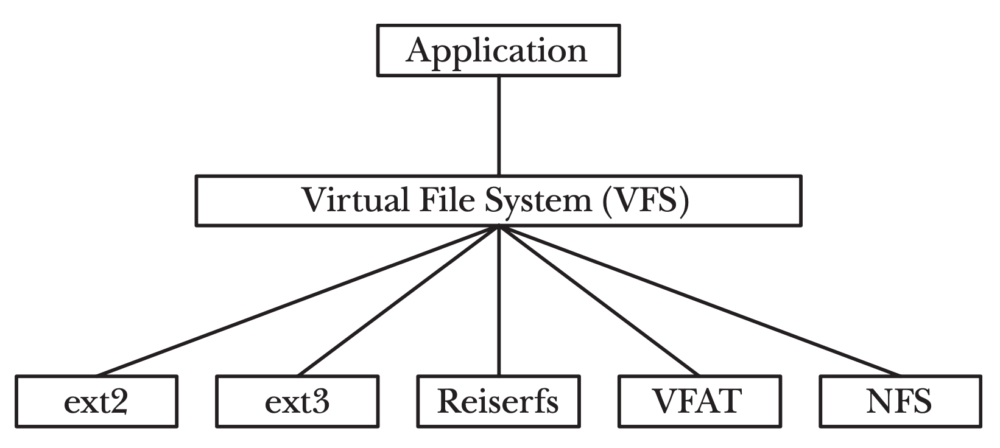
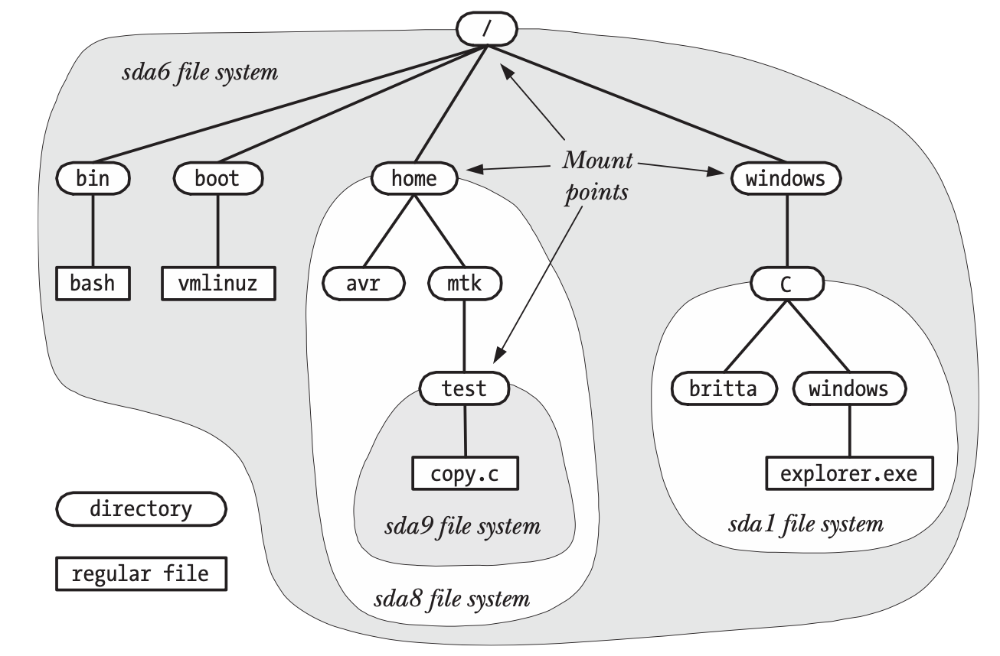
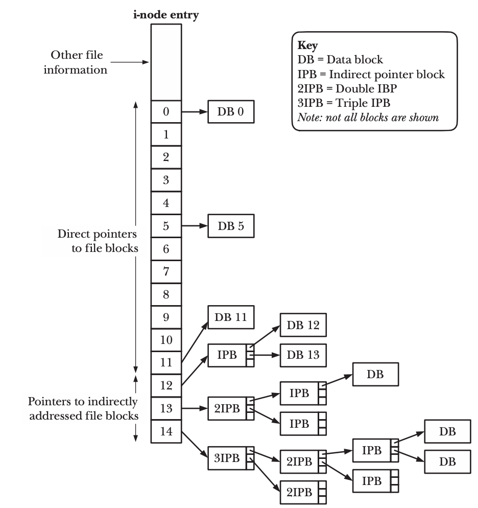
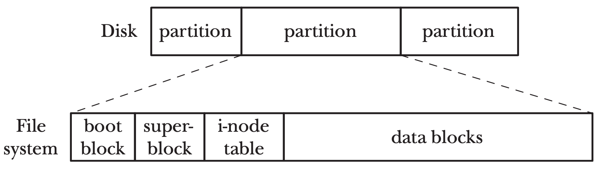
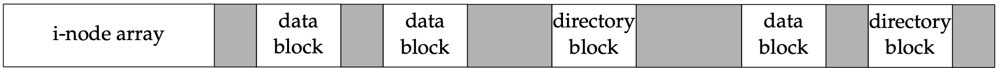
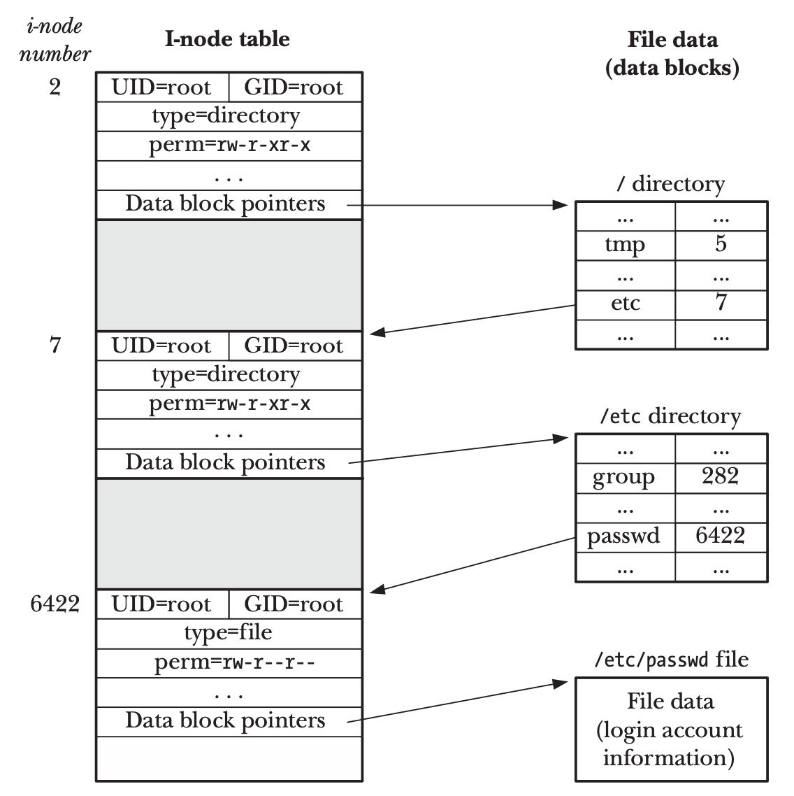
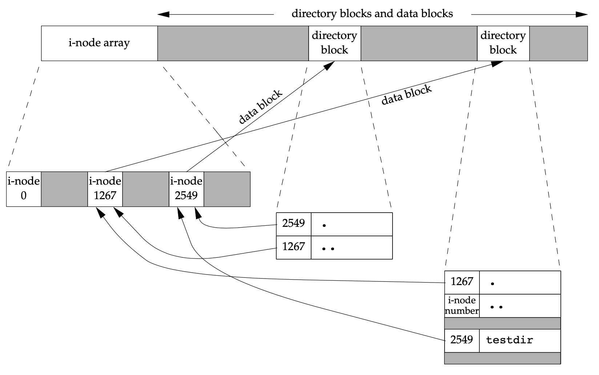
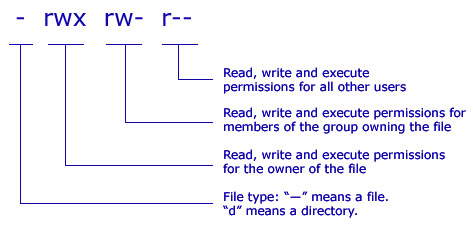
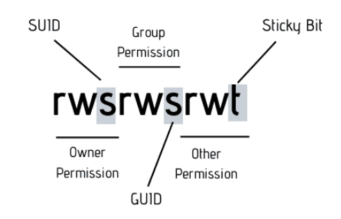
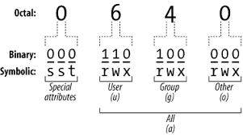

<!-- _paginate: false-->
<!-- _header: "" -->
<!-- _backgroundColor: #FCF3CF -->
<style scoped> h1, h2, h3, h4 {text-align: center;}
section {background-color: #FDEDEC;}
h1 {color:red} a:link {color: darkred;} p {text-align: center; font-size: 25px}</style>
<br/><br/><br/>
### Sistemi Operativi
### Unità 4: Il File System
I file system in Linux
==================
<br/><br/><br/>
[Martino Trevisan](https://trevisan.inginf.units.it/)
[Università di Trieste](https://www.units.it)
[Dipartimento di Ingegneria e Architettura](https://dia.units.it/)

---
## Argomenti


1. File System in Linux
2. Permessi in Linux
2. Comandi Bash per i dischi


---
# File System in Linux

---
## File System in Linux
### Storia 


Nel mondo Unix/Linux, esistono molti file system.
- Il primo é stato lo Unix File System (UFS)
- Da esso si sono gli Extended File System (`ext`) per Linux
- Ora siamo alla versione `ext4`

Come visto, basato sul concetto di inode che rappresenta un file o un direttorio

---
## File System in Linux
### Virtual File System (VFS) 

Si possono usare diversi  file system.
Devono implementare l'interfaccia **Virtual File System (VFS)**
- Ovvero permettano di effettuare alcune funzioni fondamentali:  
  ```
  open(), read(), write(), lseek(), close(), truncate(), stat(),
  mount(), umount(), mmap(), mkdir(), link(), unlink(), symlink(), rename()
  ```



---
## File System in Linux
### `mount` dei file system

Su Linux, tutti i file da ogni file system sono sotto un unico albero di cartelle
- Che nasce da `/`
- File System aggiuntivi vengono *montati* come sotto alberi di `/`

Per *montare* un FS:
```c
mount device directory
```

---
## File System in Linux
### `mount` dei file system

Per vedere i FS *montati*:
```c
$ mount
/dev/sda6 on / type ext4 (rw)
proc on /proc type proc (rw)
sysfs on /sys type sysfs (rw)
devpts on /dev/pts type devpts (rw,mode=0620,gid=5) 
/dev/sda8 on /home type ext3 (rw,acl,user_xattr)
/dev/sda1 on /windows/C type vfat (rw,noexec,nosuid,nodev)
/dev/sda9 on /home/mtk/test type reiserfs (rw)
```

---
## File System in Linux
### `mount` dei file system

**Esempio di una gerarchia di FS *montati***




---
## File System in Linux
### `mount` dei file system

In un sistema Linux, i file system che vengono montati automaticamente all'avvio sono specificati nel file `/etc/fstab`
- Contiene una riga per ogni file system
- Formato `<file system> <mount point> <type> <options> <dump> <pass>`

**Esempio:**
```
/dev/sda1   /               ext4    errors=remount-ro               0   1
/dev/hda1   /media/hda1     vfat    defaults,utf8,umask=007,gid=46  0   0
```

---
## File System in Linux
### Gli inode

Rappresentano un file. Memorizzati in una tabella nei primi blocchi
- Ogni inode é una struttura di pochi byte
- Identificati da <r>inode number</r>
- Sono in numero finito e immutabile
  - Non si possono memorizzare infiniti file minuscoli




---
## File System in Linux
### Layout di un disco

Un disco é diviso in partizione
Ogni partizione contiene 
- Informazioni di controllo
- Tabella degli inode
- Blocchi di dato



---
## File System in Linux
### Tipi di blocco

I blocchi di dato sono di due tipi:
- Data Block: hanno il contenuto di un file. Dati binari
- Directory Block: hanno il contenuto di una cartella. Lista di coppie $(nome, inode)$




---
## File System in Linux
### Directory

Ogni directory é un inode
- Ha almeno un blocco contenente la tabella dei nodi che contiene

Possiamo considerarla come un file:
- Il cui contenuto non é un insieme di byte
- Ma una lista di coppie $(nome, inode)$ 


---
## File System in Linux
### Directory Esempio

- inode $2$ é la directory `/`
  - Contiene `etc`: inode $7$
- inode $7$ é la directory `/etc`
  - Contiene `passwd`: inode $6442$
- inode $6442$ é il file `/etc/passwd`
  - Il contenuto é in un blocco dati





---
## File System in Linux
### Directory Esempio

La cartella $1267$ contiene la cartella `testdir` $2549$ che é vuota



---
# Permessi in Linux

---
## Permessi in Linux
### Utenti e Gruppi

In parte visto all'inizio del corso

In Linux, esistono:
- **Utenti**: account che possono utilizzare il sistema, creare processi, accedere a file
- **Gruppi**: insiemi di utenti. Ogni utente ha un:
  - **Gruppo principale:** solo uno
  - **Gruppi secondari:** senza limiti di numero
  
Ogni utente e gruppo è identificato da un **nome** e da un **id** numerico

---
## Permessi in Linux
### Utenti e Gruppi

**Esempio**:
- **Utenti:** `martino`, `luca`, `paolo`
- **Gruppo principale:**
  - `martino` -> `docenti`
  - `luca` -> `studenti`
  - `paolo` -> `studenti`
- **Gruppo secondario:**
  - `martino` `luca` -> `sistemioperativi`
  - `martino` `paolo` -> `reti`
  

---
## Permessi in Linux
### Utente **root**

L'utente **root** esiste su tutti i sistemi
- Ha *id* $0$
- Bypassa tutti i controlli sui permessi

<r>Nota:</r> **root** è un utente con privilegi illimitati. <r>NON</r> è parte del kernel, nè il suo codice esegue in modalità kernel.

<r>Errore comune:</r> dire che l'utente **root** esegue processi in kernel-mode!

---
## Permessi in Linux
### File per utenti e gruppi

Le informazioni su utenti e gruppi attivi salvate in file di configurazione accessibili solo a root:
- `/etc/passwd`: lista di utenti e dettagli ($ID$, *home directory*)
- `/etc/shadow`: password cifrate
- `/etc/group`: lista di gruppi e dei rispettivi componenti

---
## Permessi in Linux
### Classi

Ogni file/cartella ha un utente **proprietario** e un **gruppo** proprietario.
E' possibile separare i permessi per classi di utenti.
Ovvero si specificano permessi separatamente per:
- **Utente proprietario**: si applica quando il proprietario tenta di fare accesso
- **Gruppo proprietario**: si applica quando un utente del gruppo proprietario accede
  - Nota: il gruppo proprietario non è necessariamente il  **Gruppo principale** del proprietario, ma può essere un **Gruppo secondario**
- **Altri**: tutti gli altri utenti 

---
## Permessi in Linux
### Permessi di base

- **Lettura:** per i file, leggere il contenuto. Per le cartelle, elencare nodi contenuti
- **Scrittura:** per i file, scrivere il contenuto. Per le cartelle, aggiungere/rimuovere nodi contenuti
- **Esecuzione:** per i file, eseguirli. Per le cartelle, attraversarle, ovvero accedere a file contenuti. Diverso da listare (permesso lettura).

**Nota:** non sono i permessi su un file a determinare se esso può essere cancellato, ma sono i permessi sulla directory che lo contiene a farlo.

---
## Permessi in Linux
### Permessi speciali

Oltre i 3 permessi di base, esistono altri tre permessi speciali (o flag) che si possono applicare a file/cartelle
- **set user ID (suid):** per i **file**, se eseguito, il processo è eseguito coi privilegi di **utente proprietario**, non di esecutore. Per le **cartelle**, non ha effetto.
  **Utilizzo:** sui PC, i comandi di sistema (e.g., `reboot`) hanno il **suid**, per permettere riavvio senza chiedere password. Sui server, di solito no!

---
## Permessi in Linux
### Permessi speciali

- **set group ID (guid):** per i **file**, se eseguito, il processo è eseguito coi privilegi di **gruppo proprietario**, non di esecutore. Per le **cartelle**, i file creati hanno il gruppo della cartella e non il gruppo principale del creatore (che è azione di default) 
  **Utilizzo:** quando si creano cartelle condivise tra utenti che appartengono a un gruppo creato ad hoc.
  **Esempio**  Per un progetto si crea il gruppo `progettoSysOp`, che contiene 3 utenti. Si crea la cartella condivisa `/share/progetto` e la si assegna al gruppo `progettoSysOp`

---
## Permessi in Linux
### Permessi speciali

- **sticky bit:** per i **file**, non ha (più effetto). Per le **cartelle**, i file in essa contenuti possono essere cancellati e spostati solamente dagli utenti che ne sono proprietari, o dall'utente proprietario della cartella.
  **Utilizzo:** nelle cartelle `/tmp` e `/var/tmp` tutti gli utenti devono poter creare e modificare dei file. Nessuno eccetto il superuser deve poter rimuovere o spostare file temporanei di altri utenti.

---
## Permessi in Linux
### Collegamenti simbolici

Non hanno permessi propri, ma ereditano i permessi del file/cartella linkato.

**Nota:** la loro creazione/distruzione resa possibile dai permessi della cartella in cui si trovano

Esempio:
```bash
$ ls /lib
...
lrwxrwxrwx   1 root root  16 feb 24  2020 sendmail -> ../sbin/sendmail*
...
```

---
## Permessi in Linux
### Rappresentazione

Esistono due notazioni per indicare i permessi di un file/cartella in Linux.

### Rappresentazione Simbolica

Usata da `ls` e la più diffusa




---
## Permessi in Linux
### Rappresentazione Simbolica

Il primo carattere indica il tipo di file o directory elencata, e non rappresenta propriamente un permesso:

- `-`: file regolare
- `d`: directory
- `b`: dispositivo a blocchi
- `c`: dispositivo a caratteri
- `l`: collegamento simbolico
- `p`: named pipe
- `s`: socket in dominio Unix

---
## Permessi in Linux
### Rappresentazione Simbolica

I permessi speciali vengono *aggiunti* a questa notazione.



---
## Permessi in Linux
### Rappresentazione Ottale

La stessa informazione può essere rappresentata con $4$ cifre in base 8.



La prima cifra è quasi sempre $0$ ed è **omessa**

---
## Permessi in Linux
### Rappresentazione Ottale

Le restanti 3 cifre rappresentano i permessi per utente, gruppo, altri.
Ogni cifra è un numero su $3$ bit e può andare da $0$ e $7$.
I tre bit rappresentano lettura, scrittura, esecuzione

**Esempio**
$750$ equivale a `rwx r-x ---`
- $7 = 4+2+1$ mentre $5 = 4+1$

$644$ equivale a `rw- r-- r--`
- $6 = 4+2$ 

---
# Comandi Bash per i dischi

---
## Comandi Bash per i dischi

I SO Linux/Posix hanno dei programmi pre-installati per gestire i file
- Sono delle *utility* che permettono di svolgere compiti semplici e ripetitivi da  riga di comando
- Senza dover scrivere un programma apposito che chiami le System Call o Funzioni di Libreria necessarie.
- Documentati nella sezione 1 di `man` (*User Commands*) e nella sezione 8 (*System Administration tools and Daemons*)

---
## Comandi Bash per i dischi


- `df`: visualizza  dischi e  loro occupazione 
- `mount`: permette di:
  - vedere quali file system sono in uso
  - *montare* un disco, ovvero agganciarlo all'albero di file della macchina
  - usa la System Call `mount`
- `fdisk`: visualizza dischi e partizioni e crea partizioni
- `lsblk`: visualizza in maniera semplice le partizioni e i dischi
- `mkfs`: formatta e inizializza un File System su un disco
- `lspci` e `lsusb`: lista dispositivi PCI e USB, tra cui dischi


---
## Domande

<!-- _backgroundColor: #FFF9E3 -->

<medium>

Un inode può rappresentare:
`• File` `• Cartelle` `• File o cartelle` `• Link` `• Partizioni`

Il comando `mount` serve a:
`• Montare i File System` `• Formattare i File System` `• Manipolare directory`

Gli inode possono essere memorizzati:
`• In qualsiasi posizione del disco` `• All'inizio` `• Alla fine`

Gli elementi di una cartella sono memorizzati:
`• All'interno del suo inode` `• In un blocco dati separato`

</medium>

---
## Domande

<!-- _backgroundColor: #FFF9E3 -->

<medium>

In Linux, ogni utente può appartenere a un solo gruppo:
`• Vero` `• Falso`

L'utente root esegue i suoi processi in kernel-mode?
`• Si` `• No`

Il permesso di esecuzione sulle directory:
`• Non ha effetto` `• Permette di eseguire i programmi contenuti`
 `• Permette di attraversare la cartella`

</medium>

---
## Domande

<!-- _backgroundColor: #FFF9E3 -->

<medium>

La cartella `d` contiene un file `f`. L'utente `u` ha permessi sulla cartella `d` `r-x` e sul file `f` `rw-`. L'utente può rimuovere il file?
`• Si` `• No`

La cartella `d` contiene un file `f`. L'utente `u` ha permessi sulla cartella `d` `r-x` e sul file `f` `rw-`. L'utente può eseguire il file?
`• Si` `• No`


L'utente `u` appartiene ai gruppi `g1` e `g2`. Una cartella contiene i seguenti file.
```
-rw-r--r--  1 u g3    2577901 Jul 28  2013 f1.txt
-r--r--r--  1 v g1    5634545 Jul 13  2013 f2.txt
-rwxrwxrwx  1 z g4    8753244 Jul 29  2013 f3.txt
```
Su quali di questi file `u` ha permesso di scrittura?
`• Tutti` `• Solo f1` `• Solo f3` `• f1 e f3`

</medium>
