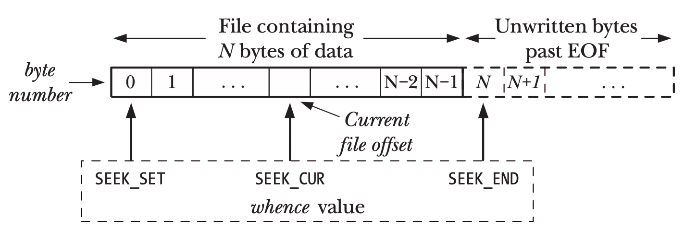
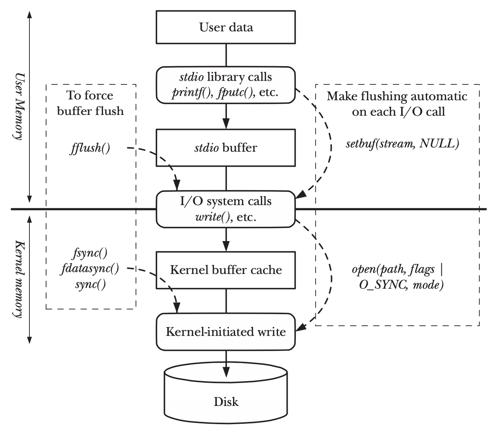
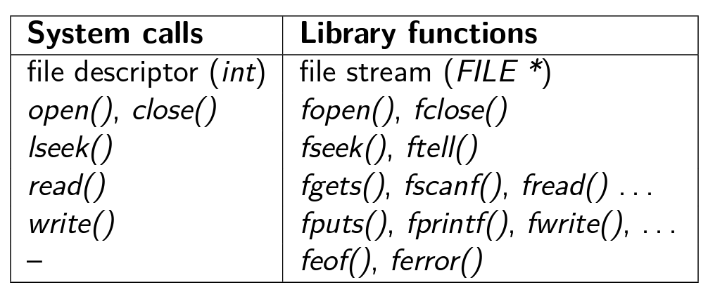
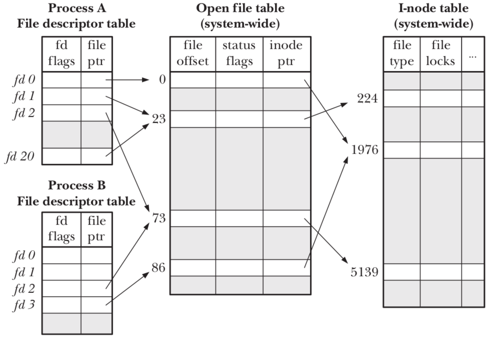
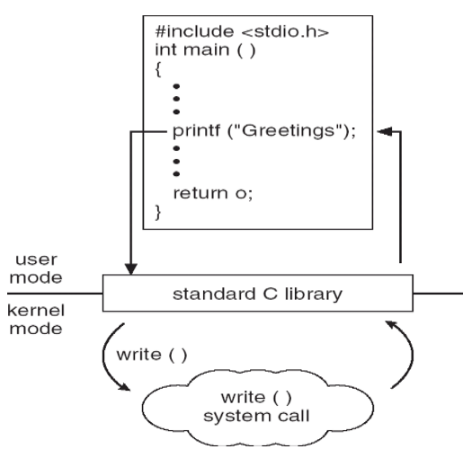
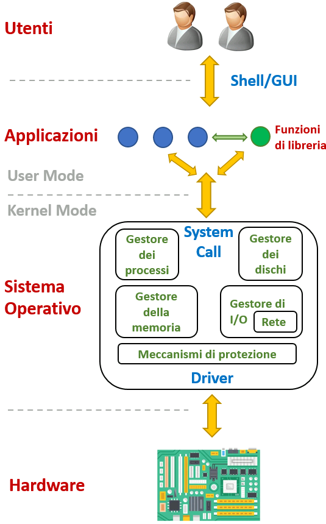
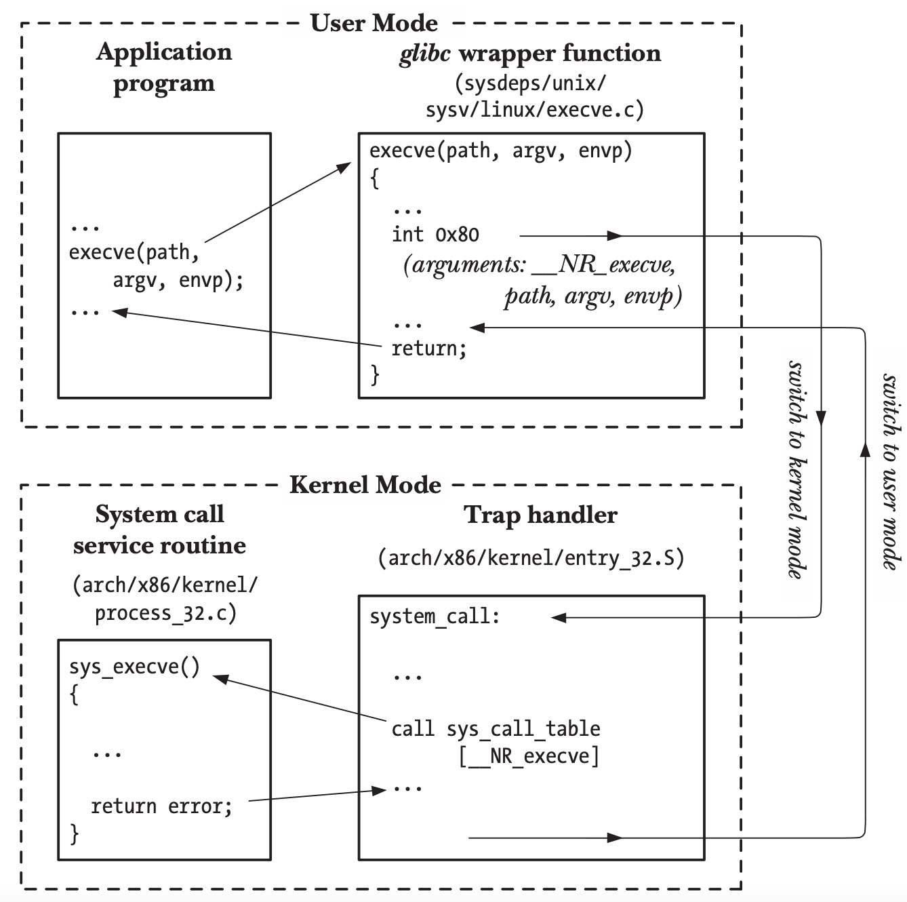
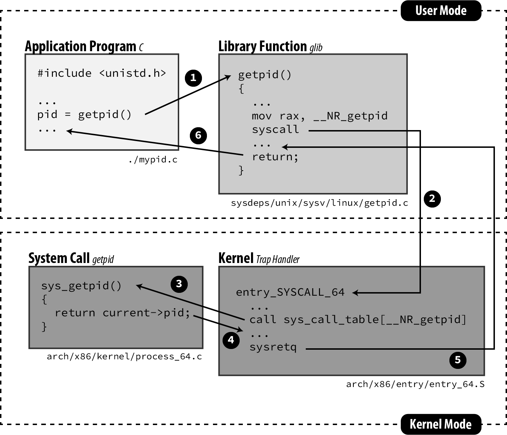

<!-- _paginate: false-->
<!-- _header: "" -->
<!-- _backgroundColor: #FCF3CF -->
<style scoped> h1, h2, h3, h4 {text-align: center;}
section {background-color: #FDEDEC;}
h1 {color:red} a:link {color: darkred;} p {text-align: center; font-size: 25px}</style>
<br/><br/><br/>
### Sistemi Operativi
### Unità 4: Il File System
I  file
==================
<br/><br/><br/>
[Martino Trevisan](https://trevisan.inginf.units.it/)
[Università di Trieste](https://www.units.it)
[Dipartimento di Ingegneria e Architettura](https://dia.units.it/)

---
## Argomenti

1. Funzioni di libreria per file
2. System Call per file
3. Funzioni di libreria vs System Call
4. Comandi Bash per File

---
# Funzioni di libreria per file

---
## Funzioni di libreria per file

Abbiamo già visto le funzioni di libreria più comuni per leggere su file.
Esse sono parte della `libc`.
- Sono utilizzabili su qualsiasi SO
- E' sufficiente ricompilare il programma
- Utilizzano System Call diverse a seconda del SO


---
## Funzioni di libreria per file

Funzioni principali:
- Puntatore a  file: `FILE *`
- Apertura/chiusura: `fopen` `fclose` 
- Lettura/scrittura di caratteri: `fgetc`, `fputc`
- Lettura/scrittura di righe: `fgets`, `fputs`
- Lettura/scrittura con formato: `fscanf`, `fgets`
- Lettura/scrittura grezza `fread`, `fwrite`
- Riposizionamento: `fseek`, `rewind`, `ftell`

---
## Funzioni di libreria per file
<!-- _backgroundColor: #FFF9E3 -->

<small>

**Esempio**: si legga un path da tastiera e se ne stampi il contenuto come file di testo
```c
#include <stdio.h>

int main ()
{
    char s[100], buffer [100];
    FILE * f;
    
    printf("Inserisci un path: ");
    scanf("%s", s);
    
    f = fopen(s, "r");
    if (f==NULL){
        printf("Impossibile aprire %s\n", s);
        return 1; /* Errore */
    }
    
    /* Non è importante la lunghezza di buffer */
    while ( fgets(buffer, 100, f) )
        fputs(buffer, stdout); // Equivale a printf("%s", s);
    
    fclose(f);
    return 0;
}
```
</small>

---
## Funzioni di libreria per file

La lettura/scrittura su file è <r>sequenziale</r>.
Un file aperto ha un <r>cursore</r> simile a quello di un editor testuale
- Determina la posizione di partenza per la prossima operazione
- Esso è posizionato a un <r>offset</r> preciso all'interno del file
- Una lettura sposta in avanti il cursore dei caratteri letti
- Una scrittura inserisce i caratteri nella posizione del cursore

Esistono delle funzioni per spostare arbitrariamente il cursore. 


---
## Funzioni di libreria per file
<!-- _backgroundColor: #FFF9E3 -->
<small>

Consideriamo un file 10 caratteri contenente la frase `ciao mondo`. Viene aperto con:
```c
FILE * fp = fopen("ciao.txt", "r");
```
Il cursore a questo punto è all'inizio del file.
```	
↓──────────┐  
│ciao mondo│
└──────────┘
```
Effettuando una lettura con la `fscanf` si legge una parola (spazio finale incluso).
```c
fscanf(fp, "%s", buffer);
```
Il cursore sarà quindi all'inizio della parola successiva. Una successiva `fscanf` leggerebbe `mondo`
```	
┌────↓─────┐  
│ciao mondo│
└──────────┘
```

</small>

---
## Funzioni di libreria per file

E' possibile spostare manualmente il cursore con la funzione
```c
int fseek(FILE *fp, long distanza, int partenza)
```
Dove:
- `FILE *fp`: è il puntatore a file sul quale agire
- `long distanza`: è il nuovo offset.
- `int partenza` o `whence` indica da dove `distanza` viene calcolata. Può assumere
  - `SEEK_SET`: inizio del file
  - `SEEK_END`: fine del file
  - `SEEK_CUR`: posizione corrente del cursore


---
## Funzioni di libreria per file


**Funzionamento di `fseek`**




---
## Funzioni di libreria per file
<!-- _backgroundColor: #FFF9E3 -->


Consideriamo un file 10 caratteri contenente la frase
`ciao mondo`.

```c
FILE * fp = fopen("ciao.txt", "r");
fscanf(fp, "%s", buffer); // Buffer contiene "ciao". Il cursore è prima di "mondo"

fseek (fp, 0, SEEK_SET);  // Il cursore torna all'inizio del file
fscanf(fp, "%s", buffer); // Leggo di nuovo "ciao"
```

Similmente:

```c
FILE * fp = fopen("ciao.txt", "r");
fgets(buffer, 2, fp); // Buffer contiene "ci". Il cursore è tra "ci" e "ao mondo"
fseek (fp, -3, SEEK_END);  // Il cursore si posiziona tra "ciao mo" "ndo"
fgets(buffer, 2, fp);// Leggo "nd"
```

---
## Funzioni di libreria per file

**Funzioni `fread` e `fwrite`**
Simili a `fgets` e `fputs`, ma per ignorano il ritorno a capo `\n`.
- Leggono una quantità fissa di caratteri indipendentemente dai ritorni a capo
- Ottime per file binari: contengono caratteri non stampabili, e anche tanti `'\0'` (terminatori).
  - Impossibile leggere correttamente i terminatori.
 
```c
size_t fread(void *restrict ptr, size_t size, size_t nmemb,
                    FILE *restrict stream);
size_t fwrite(const void *restrict ptr, size_t size, size_t nmemb,
                    FILE *restrict stream);
```


---
## Funzioni di libreria per file

**Funzioni `fread` e `fwrite`**

Permettono di leggere/scrivere file binari (che contengono `'\0'`).
- Oppure `struct` e vettori 

**Funzionamento**: leggi/scrivi nella `nmemb` oggetti, ognuno grande `size` byte dal puntatore a file `stream` e scrivili/leggili da `ptr`.
**Valore di ritorno**: il numero di elementi effettivamente letti/scritti.


---
## Funzioni di libreria per file
<!-- _backgroundColor: #FFF9E3 -->

<medium>

Lettura di un vettore di interi.
Si supponga un file contente (in binario) i 2 interi che rappresentano i numeri $1990$ e $2023$.
In esadecimale e considerando `int` su 4 byte, avremo nel file:
```
0x00 0x00 0x07 0xC6 0x00 0x00 0x07 0xE7
```

Per leggerli in C, si procede con la funzione `fread`

```c
FILE * fp = fopen("ciao.txt", "rb"); // Notare modalità "rb"
int v [2];
fread(v, sizeof(int), 2, fp);
```

<r>Nota:</r> è errato usare `fscanf(... , "%d", ...)` che si aspetta dei numeri scritti come stringhe!

</medium>


---
## Funzioni di libreria per file

**Osservazioni dall'esempio precedente:**
- `size_t` è un alias per il tipo di dato *intero senza segno* che viene usato per rappresentare grandezze di strutture dati.
- `sizeof` è un operatore che ritorna il numero di byte che un tipo di dato occupa
  - Durante la **compilazione**, il compilatore sostituisce l'espressione col suo risultato


---
## Funzioni di libreria per file

**Bufferizzazione:**

In C, l'input output su file è **bufferizzato**
- Le funzioni di scrittura come `fprintf` non invocano sempre la System Call per la scrittura su file
- Esse scrivono su un buffer in memoria
- Quando esso è pieno, il contenuto è effettivamente scritto su file

Questo comportamento migliora significativamente le prestazioni in caso di tante scritture di piccole dimensioni
- Bisognerebbe accedere al disco ad ogni operazione

---
## Funzioni di libreria per file

**Bufferizzazione:**




---
## Funzioni di libreria per file

**Bufferizzazione:**
La dimensione di default è la costante `BUFSIZ`.
E' possibile settare la dimensione del buffer:
```c
void setbuf(FILE *stream, char *buf);
```

Si può forzare una scrittura su file:
```c
int fflush(FILE *stream);
```

**Nota**: quando lo standard output è su console esso è *new line-buffered*. Un ritorno a capo, forza il *flush*.
Per rendere uno stream *new line-buffered* is usa la funzione `setvbuf`.

---
## Funzioni di libreria per file

**Rimozione:**
```c
int remove(const char *pathname);
```
Non é necessario che il file sia aperto.
In Linux, `remove()` usa la System Call:
```c
int unlink(const char *pathname);
```

---
# System Call per file

---
## System Call per file

Le funzioni viste precedentemente sono parte della libreria standard del C.
- Esse utilizzano delle System Call per compiere le operazioni richieste
- Le System Call variano a seconda del SO

System Call usate
- Linux/POSIX: `open`, `read`, `write`, `lseek`, `close`
- Windows: `CreateFile`, `WriteFile`, `ReadFile`, `CloseHandle`, `SetFilePointer`

---
## System Call per file

Noi ci soffermiamo sulle System Call di Linux.
- Esse sono simili alle funzioni di libreria, ma sono di più basso livello.
- Si possono usare su sistemi Linux e Posix
- Non esistono su Windows. Non sono parte di Libreria Standard del C



---
## System Call per file

In Linux, un file aperto è un *file descriptor*.
Esso è un numero intero non negativo
Per convenzione:
- Standard Input: descrittore $0$
- Standard Output: descrittore $1$
- Standard Error: descrittore $2$

Nelle funzioni di libreria un file aperto è un `FILE *`. Nelle System Call Linux è un `int`.

---
## System Call per file

Il sistema operativo mantiene delle tabelle che mappano i *file descriptor* ai file fisici su disco (inode)



---
## System Call per file

Per ogni processo, vi è una tabella che contiene i *file descriptor*:
- Contiene un riferimento alla tabella generale
- E dei flag

La tabella generale (una per tutto il SO), contiene:
- Access Mode: R, W, RW
- File Offset: posizione del cursore

La tabella degli inode è semplicemente una copia in memoria degli inode interessati (che si trovano su disco)


---
## System Call per file

**Apertura di un file**
```c
int open(const char *pathname, int flags);

int open(const char *pathname, int flags, mode_t mode);
```
Apre il file identificato dal path `pathname`.


---
## System Call per file

**Apertura di un file**
`flags` determinano modalità di accesso al file.
- Uno tra `O_RDONLY`, `O_WRONLY,` e `O_RDWR` deve essere obbligatoriamente presente.
- Altri flag sono:
  - `O_CREAT` crea il file se non esiste
  - `O_APPEND` apri il file in modalità aggiunta
I flag si sommano usando l'operatore OR bit a bit `|`

Esempi:
```c
int fd = open("file.txt", O_RDONLY);
int fd = open("file.txt", O_WRONLY | O_APPEND);
```

---
## System Call per file

**Apertura di un file**
Nel caso si specifichi il flag `O_CREAT`, il file viene creato coi permessi specificati in `mode`.
Esistono 9 flag:
- `S_I[RWX]USR`, `S_I[RWX]GRP`, `S_I[RWX]OTH`

Ricordiamoci che in Linux i file hanno 3 tipi di permessi (Read, Write, Execute), gestibili separatamente per il proprietario, il gruppo e gli altri utenti.

---
## System Call per file

**Chiusura di un file**:
```c
int close(int fd);
```
Chiude il *file descriptor*. Il numero `fd` non si riferisce più a nessun file aperto e può essere riutilizzato in succesive `open` da parte del SO.


---
## System Call per file

**Lettura da file**:
```c
ssize_t read(int fd, void *buf, size_t count);
```
Leggi `count` byte da `fd` e mettili nella memoria all'indirizzo `buf`.
**Valore di ritorno**: il numero di byte letti. Può essere minore di `count` se il file finisce.
- In caso di errore $-1$
- Se si è giunti a EOF $0$

---
## System Call per file

**Scrittura su file**:
```c
ssize_t write(int fd, const void *buf, size_t count);
```
Scrivi `count` byte su `fd` e prendendoli nella memoria all'indirizzo `buf`.
**Valore di ritorno**: il numero di byte scritti. Può essere inferiore a `count` se il disco si riempie.
- In caso di errore $-1$


---
## System Call per file

**Riposizionamento Cursore**:
```c
off_t lseek(int fd, off_t offset, int whence);
```

Molto simile alla funzione di libreria `fseek`.
Riposizione il file descriptor `df` all'offset `offset` secondo la direttiva `whence` come segue:
- `SEEK_SET`: `offset` è rispetto a inizio file
- `SEEK_CUR`: `offset` è rispetto a posizione corrente
- `SEEK_END`: `offset` è rispetto a file file. `offset` dovrà essere negativo

---
## System Call per file

<!-- _backgroundColor: #FFF9E3 -->

**Esempio**: scrittura utilizzando System Call

```c
const char *str = "Arbitrary string to be written to a file.\n";
const char* filename = "innn.txt";

int fd = open(filename, O_RDWR | O_CREAT);
if (fd == -1) {
    perror("open");
    exit(EXIT_FAILURE);
}

write(fd, str, strlen(str));
printf("Done Writing!\n");

close(fd);
```

---
## System Call per file

<!-- _backgroundColor: #FFF9E3 -->

**Esempio**: equivalente usando funzioni di libreria

```c
const char *str = "Arbitrary string to be written to a file.\n";
const char* filename = "innn.txt";

FILE* output_file = fopen(filename, "w+");
if (!output_file) {
    perror("fopen");
    exit(EXIT_FAILURE);
}

fwrite(str, 1, strlen(str), output_file); // Si può usare fputs o fprintf
printf("Done Writing!\n");

fclose(output_file);
```

---
## System Call per file

<!-- _backgroundColor: #FFF9E3 -->

<small>

**Esempio**: sono equivalenti le seguenti forme per stampare il messaggio `Hellp World` su console.
Usando la `printf` si stampa su Standard Output.
```c
printf("Hello World\n");
```
Si può usare la `fprintf` dicendole di stampare sul file `stdout`, che è un `FILE *` pre-definito.
```c
fprintf(stdout, "Hello World\n");
```

Si può usare la System Call `write` (solo si Linux/POSIX).
- Si stampa sul file descriptor $1$, per convenzione lo Standard Output
- E' necessario specificare quanti byte scrivere. `write` stampa dei byte, non utilizza il terminatore `'\0'` (valore $0$)
```c
write(1, "Hello World\n", 13);
```

</small>

---
# Funzioni di libreria vs System Call

---
## Funzioni di libreria vs System Call

Le funzioni di libreria utilizzando le System Call




---
## Funzioni di libreria vs System Call

Le **Funzioni di Libreria** sono eseguite in modalità utente. Non hanno nessun privilegio particolare.
- Sono semplicemente delle funzioni che facilitano l'uso delle System Call


Le **System Call** sono eseguite in modalità kernel.
- Hanno accesso alla *memoria fisica*
- Possono accedere alle interfacce dei dispositivi di I/O

---
## Funzioni di libreria vs System Call

Le **Applicazioni** possono invocare sia funzioni di libreria che System Call.
Se vogliono usufruire dei servizi del SO è sempre necessario usare le system call
- Lo fanno le applicazioni direttamente
- Oppure lo fanno le funzioni di libreria invocate dalle applicazioni




---
## Funzioni di libreria vs System Call

**Passi per l'invocazione di una System Call** Tramite `int 0x80` (metodo classico)



---
## Funzioni di libreria vs System Call

**Passi per l'invocazione di una System Call** Tramite `syscall` (metodo moderno)




---
## Funzioni di libreria vs System Call

<medium>

**Manuale:**
Il manuale di Linux è diviso in sezioni:
1. User Commands
2. System Calls
3. C Library Functions
4. Devices and Special Files
...

La `fopen` è in sezione $3$, la `open` in sezione $2$.
Invece `printf` è sia un comando bash che una funzione di libreria
- Ha due pagine di manuale
  - `man 1 printf`: comando Bash
  - `man 3 printf`: funzione di libreria C

</medium>

---
## Funzioni di libreria vs System Call

Esistono degli strumenti di debug per vedere quali System Call vengono invocate da un processo.
Si può fare tramite profile (e.g., `valgrind`), debbugger (e.g., `gdb`) o tool nativi (e.g., `strace`)

<br>

**`strace`**
Non richiede di ricompilare i programmi. Funziona sempre, anche se non ho il sorgente del programma.
E' un tool del SO.
**Funzionamento**: `strace comando`

---
## Funzioni di libreria vs System Call

<!-- _backgroundColor: #FFF9E3 -->


**Esempio:** Di default `strace` lista le system call 
```bash
$ strace pwd
execve("/usr/bin/pwd", ["pwd"], 0x7ffd37cdfc80 /* 72 vars */)       = 0
...
getcwd("/tmp", 4096)                                                = 5
fstat(1, {st_mode=S_IFCHR|0620, st_rdev=makedev(0x88, 0x5), ...})   = 0
write(1, "/tmp\n", 5/tmp)                                           = 5
```

Si può semplicemente contare le invocazioni a System Call
```bash
$ strace -c date
mar 25 ott 2022, 10:16:48, CEST
% time     seconds  usecs/call     calls    errors syscall
------ ----------- ----------- --------- --------- ----------------
  0,00    0,000000           0         6           read
  0,00    0,000000           0         1           write
  0,00    0,000000           0         9           close
  ...     ...
```


---
## Funzioni di libreria vs System Call


**`ltrace`**
Simile a `strace`. Permette di visualizzare le funzioni di libreria usate da un processo
**Funzionamento**: `ltrace comando`

**Nota:** non funziona su tutti gli eseguibili.
Solo quelli compilati con *laxy binding* (opzione del linker), di default fino a Ubuntu 16.
Per essere sicuri, compilare con l'opzione: `-z lazy`
Esempio: `gcc sample.c -o myprog -z lazy`


---
## Funzioni di libreria vs System Call

<!-- _backgroundColor: #FFF9E3 -->


**Esempio:** Di default `strace` lista le system call 
```bash
$ ltrace pwd
...
getcwd(0, 0)                                                    = ""
puts("/home/det_user/trevisan"/home/det_user/trevisan
)                                                               = 24
...
```

Per contare le funzioni invocate:
```bash
$ ltrace -c date
Tue Oct 25 10:35:00 CEST 2022
% time     seconds  usecs/call     calls      function
------ ----------- ----------- --------- --------------------
 15.59    0.000543          67         8 fwrite
 13.90    0.000484          60         8 fputc
  8.76    0.000305         305         1 setlocale
  ...
```

---
# Comandi Bash per File

---
## Comandi Bash per File

I SO Linux/Posix hanno dei programmi pre-installi per gestire i file
Sono delle *utility* che permettono di svolgere compiti semplici e ripetitivi da  riga di comando
Senza dover scrivere un programma apposito che chiami le System Call o Funzioni di Libreria necessarie.
Documentati nella sezione 1 di `man`

---
## Comandi Bash per File

**Lettura di file:**
- `cat filename`: stampa su Standard Output il contenuto di un file
- `less filename` e `more filename`: visualizzazione passo-passo
- `head  filename` e `tail filename`: stampa prime/ultime righe di un file
- `grep patter file`: stampa delle righe che contengono un `pattern`

---
## Comandi Bash per File


**Scrittura di file:**

Per scrivere su file si usa tipicamente la redirezione su file della Bash:

```c
echo "Ciao" > filename
```

Con `touch filename` creo un file se non esiste

**Rimozione di file:**
- `rm filename`: rimuove un file (se ho i permessi per farlo)

---
## Comandi Bash per File

**Altre operazioni**:
- `cp origine destinazione`: copia un file
- `chmod, chgrp, chown`: modificano permessi, gruppo e proprietario di un file


---
## Domande

<!-- _backgroundColor: #FFF9E3 -->

<medium>

La `fopen` é:
`• Una funzione di libreria` `• Una System Call` `• Una struct`

La `read` é:
`• Una funzione di libreria` `• Una System Call` `• Una struct`

<br>

Si consideri il file `f.txt` contente il testo `frase di prova`.
Dove si trova il cursore (`↓`) del file dopo il seguente codice?
```c
FILE * fp = fopen("f.txt","r");
fscanf(fp, "%s", buffer);
fseek (fp, 3, SEEK_CUR);
```
`• fra↓se di prova` `• frase di ↓prova` `• frase di pr↓ova`  `• frase ↓di prova`

</medium>


---
## Domande

<!-- _backgroundColor: #FFF9E3 -->

<medium>

Quale delle seguenti linee di codice é corretta?
`• int fd = open("file.txt", O_RDONLY);`
`• FILE * fd = open("file.txt", O_RDONLY);`
`• FILE * fd = fopen("file.txt", O_RDONLY);`
`• FILE fd = open("file.txt", "rw");`


Quale relazione c'é tra la `fprintf` e `write`?
`• fprintf é una funzione di libreria e usa la SysCall write`
`• write é una funzione di libreria e usa la SysCall fprintf`
`• fprintf e write sono due funzioni di libreria`
`• fprintf e write sono due System Call`


Quale dei seguenti comandi stampa a schermo il contenuto del file `test`?
`• echo ciao`
`• print ciao`
`• cat ciao`

</medium>


