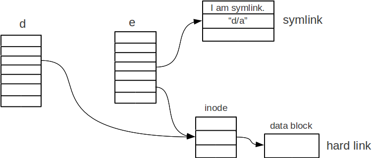
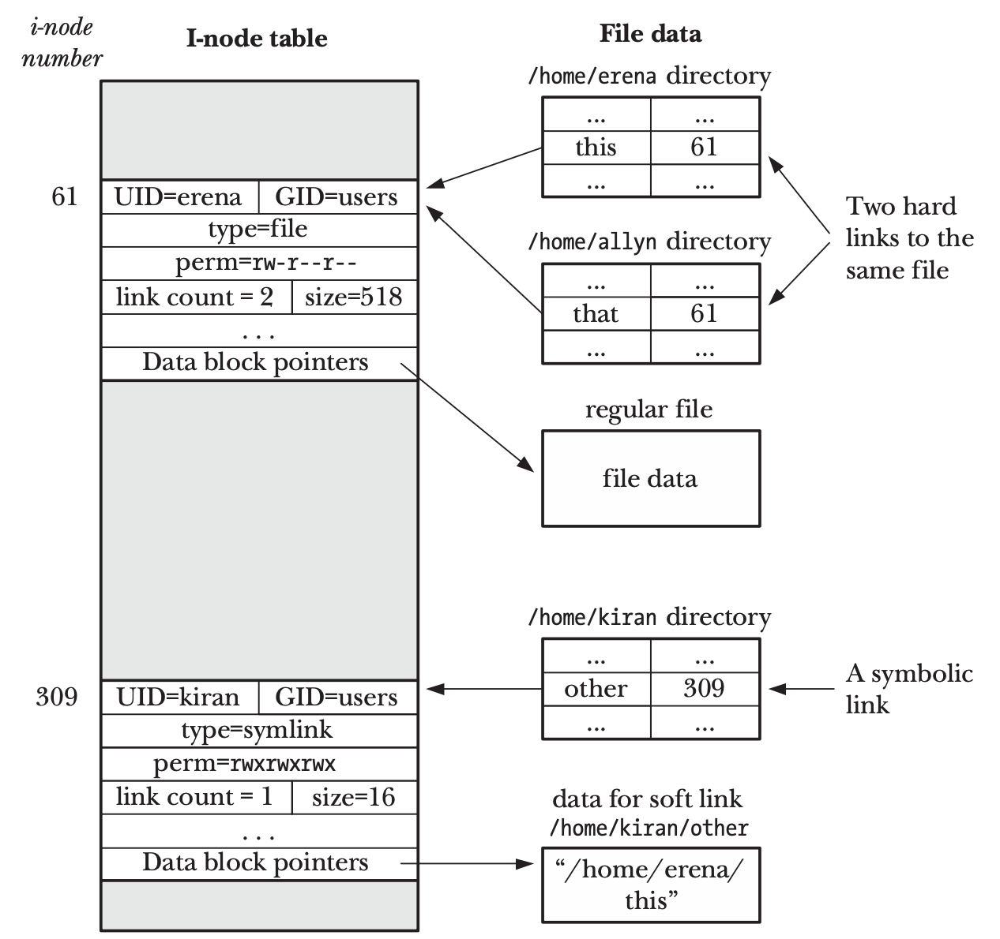

<!-- _paginate: false-->
<!-- _header: "" -->
<!-- _backgroundColor: #FCF3CF -->
<style scoped> h1, h2, h3, h4 {text-align: center;}
section {background-color: #FDEDEC;}
h1 {color:red} a:link {color: darkred;} p {text-align: center; font-size: 25px}</style>
<br/><br/><br/>
### Sistemi Operativi
### Unità 4: Il File System
Link e Directory 
==================
<br/><br/><br/>
[Martino Trevisan](https://trevisan.inginf.units.it/)
[Università di Trieste](https://www.units.it)
[Dipartimento di Ingegneria e Architettura](https://dia.units.it/)

---
## Argomenti

1. Link
1. Soft Link
2. Hard Link
3. System call per Directory
4. Funzioni di libreria per Directory
5. Comandi Bash per Link, Directory e Disco

---
## Link

Un link é un nome aggiuntivo per un altro file.
Utile per svariati compiti
- Gestione file di configurazione
- Condivisione di informazioni tra utenti
- Mantenimento ordinato dellla struttura dei file

---
## Link

Esistono due tipi di link:
- **Hard Link:** lo inode appare in una seconda directory che vi punta
- **Soft Link:** é un alias a un certo path



---
## Soft Link

Sono degli **Shortcut** per un file o una directory
- Se ho un grande file con un path lungo e complesso, ne posso creare un soft link nella mia Home Directory
- Se cancello un Soft Link, non succede niente al file originale
- Se il file originale viene cancellato, il Soft Link continua a esistere ma diventa <r>invalido</r>
- Se creo un altro file con quel nome, il Soft Link torna a essere valido

---
## Soft Link

E' un concetto di Linux
Per creare un Soft Link si usa la System Call:
```c
int symlink(const char *target, const char *linkpath);
```

Si rimuove un Soft Link come fosse un normale file

<r>Nota:</r> Si possono creare Soft Link a cartelle e verso altri dischi
Le funzioni di ricerca non devono attraversare i Soft Link per evitare cicli

---
## Hard Link

Un Hard Link é un riferimento aggiuntivo a un inode
La directory dove viene creato, contiene una nuova entry che ha lo stesso inode number


---
## Hard Link

Implicazioni:
- Un Hard Link é un link al contenuto del file
- Non può mai essere invalido
- Hard Link e file originario hanno la stessa importanza e la stessa natura
- Cancellare un Hard Link causa la cancellazione del file solo se non vi sono altri Hard Link (o il riferimento originale)

Compiti del sistema operativo
- Mantenere un *reference count* per ogni inode
- Cancellare un inode e il suo contenuto se esso va a $0$

---
## Hard Link

Si creano con la System Call:
```c
int link(const char *oldpath, const char *newpath);
```

<r>Nota</r>: La System Call per rimuovere un file in Linux é `unlink`.
Di fatto rimuovere un file, significa decrementare il suo *reference count* (e eventualmente rimuovere l'inode)
Non si possono creare Hard Link a cartelle. Concettualmente sbagliato

---
## Hard Link
### Differenza tra Soft e Hard link




---
## System call per Directory

**Lettura di informazioni su una directory o un file:**
```c
#include <sys/stat.h>
int stat(const char *restrict pathname,
                struct stat * statbuf);
```
Ritorna informazioni su `pathname`, le colloca nella struttura puntata da `statbuf`
- Passaggio di variable per riferimento che é di fatto un valore di ritorno
- Ritorna $0$ in caso di successo, $-1$ in caso di errore

---
## System call per Directory

La `struct stat` ritornata contiene i seguenti campi:
```c
struct stat {
   dev_t     st_dev;         /* ID of device containing file */
   ino_t     st_ino;         /* Inode number */
   mode_t    st_mode;        /* File type and mode */
   nlink_t   st_nlink;       /* Number of hard links */
   uid_t     st_uid;         /* User ID of owner */
   gid_t     st_gid;         /* Group ID of owner */
   dev_t     st_rdev;        /* Device ID (if special file) */
   off_t     st_size;        /* Total size, in bytes */
   blksize_t st_blksize;     /* Block size for filesystem I/O */
   blkcnt_t  st_blocks;      /* Number of 512B blocks allocated */

   struct timespec st_atim;  /* Time of last access */
   struct timespec st_mtim;  /* Time of last modification */
   struct timespec st_ctim;  /* Time of last status change */
};
```

---
## System call per Directory

Il campo `mode_t` indica se si tratta di file in forma di una *bit mask*.
Si possono usare le seguenti macro per testare facilmente `mode_t`
- `S_ISREG(m)`: True se file regolare
- `S_ISDIR(m)`: True se file directory
- `S_ISLNK(m)`: True se file un Symbolic Link


---
## System call per Directory

<!-- _backgroundColor: #FFF9E3 -->

<verysmall>

Si scriva un programma che riceve un path da riga di comando e stampa se esso é file, directory o link simbolico.

```c
#include <stdio.h>
#include <stdlib.h>   // Necessario per exit
#include <sys/stat.h> // Necessario per stat
int main (int argc, char * argv[])
{
    struct stat buf;
    if (argc!=2){
        printf("Specifica un path\n");
        return 1;
    }

    if (stat(argv[1], &buf) < 0) {
        printf ("Impossibile leggere le informazioni sul file\n");
        exit (1); /* Termina subito il programma con codice 1 */
    }

    if (S_ISREG(buf.st_mode))
        printf("%s: file\n", argv[1]);
    else if (S_ISDIR(buf.st_mode))
        printf("%s: directory\n", argv[1]);
    else if (S_ISLNK(buf.st_mode))
        printf("%s: link simbolico\n", argv[1]);
    else
        printf("%s: altro tipo di path\n", argv[1]);

    return 0;
}
```
</verysmall>

---
## System call per Directory

**Creazione di directory**
```c
int mkdir (const char *path, mode_t mode);
```

**Rimozione di directory**
```c
int rmdir (const char *path);
```

`mode` ha stesso ruolo che nella `open`
Valore di ritorno $0$ in caso di successo $-1$ in caso di errore

---
## System call per Directory

Per listare il contenuto di una directory si possono usare le System Call `open` e `getdents`e la `struct linux_dirent`.
1. Si apre una directory come fosse un file
  `intfd = open("path", O_RDONLY | O_DIRECTORY);`
2. Si leggono batch di `struct linux_dirent`
  `int nread = syscall(SYS_getdents, fd, buf, BUF_SIZE);`

Tutto ciò é difficile, poco pratico e non portabile.
Si usano sempre le funzioni di libreria POSIX per leggere il contenuto di una cartella 


---
## Funzioni di libreria per Directory

Per listare il contenuto di  una  cartella, si usano le funzioni di libreria
```c
#include <sys/types.h>
#include <dirent.h>
DIR *opendir(const char *name);
struct dirent *readdir(DIR *dirp);
int closedir(DIR *dirp);
```
Funzionano su sistemi POSIX.
Su Windows si usano `FindFirstFile()` e `FindNextFile().`


---
## Funzioni di libreria per Directory

**Apertura:** una cartella, prima di essere letta, va aperta con `opendir`. 
Essa ritorna un puntatore a `DIR *` se l'apertura va a buon fine, altrimenti `NULL`
Un `DIR *` é l'equivalente di `FILE *` per le directory
```c
DIR * d;
d = opendir("/path/");
if (d!=NULL)
  ...
```

---
## Funzioni di libreria per Directory

**Listare il contenuto:** si usa la funzione  `readdir` che ritorna **una** `struct dirent *`. Va invocata finche non ritorna `NULL`.
```c
struct dirent * entry;
while ((entry = readdir(d)) != NULL)
      printf("  %s\n", entry->d_name);
```

---
## Funzioni di libreria per Directory

Una `struct dirent` contiene i campi:
```c
struct dirent {
  ino_t          d_ino;       /* inode number */
  char           d_name[256]; /* filename */
  ...
};
```


---
## Funzioni di libreria per Directory

Bisogna chiudere una cartella per rilasciare le risorse associate.
```c
int r = closedir(d);
```
Ritorna $0$ se l'operazione va a buon fine, altrimenti $-1$


---
## Funzioni di libreria per Directory

<!-- _backgroundColor: #FFF9E3 -->

<verysmall>

Si scriva un programma che riceve un directory da riga di comando e ne lista il contenuto

```c
#include <stdio.h>
#include <stdlib.h>   // Necessario per exit
#include <sys/stat.h> // Necessario per stat
#include <dirent.h>   // Necessario per struct dirent *
int main (int argc, char * argv[])
{
    struct stat buf;
    struct dirent *dirp;
    DIR *dp;

    if (argc!=2){
        printf("Specifica un path\n"); exit (1);}
    if (stat(argv[1], &buf) < 0) {
        printf ("Impossibile leggere le informazioni sul file\n"); exit (1);}
    if (!S_ISDIR(buf.st_mode)){
        printf("%s deve essere una directory\n", argv[1]); exit(1);}
    if ( (dp = opendir(argv[1])) == NULL) {
        printf("%s impossibile da aprire\n", argv[1]); exit (1);}

    while ( (dirp = readdir(dp)) != NULL)
      printf("%s\n", dirp->d_name);

    closedir(dp);

    return 0;
}
```
</verysmall>


---
## Comandi Bash per Link, Directory

Sono programmi pre-installati che facilitano l'uso delle System Call per compiti comuni.

**Comandi per link:**
```bash
ln dst src
```
Crea un link al path `dst` verso un path esitente `src` 
- Di default crea un hard link
- L'opzione `-s`
- Si rimuovono i link con `rm`
- Si possono anche usare i comandi più grezzi `link` e `unlink`

---
## Comandi Bash per Link, Directory


**Comandi per directory:**
- `ls directory`: lista il contenuto
- `ll directory`: alias per `ls -lh directory`
- `mkdir directory` e `rmdir directory`: crea o rimuove una directory
- `find ...`: cerca all'interno di una cartella
- `tree directory`: stampa l'albero di file e cartelle contenuti
- `du directory`: ottiene la dimensione della cartella e di tutto ciò che vi é contenuto


---
## Domande

<!-- _backgroundColor: #FFF9E3 -->

<medium>

E' possibile creare link a cartelle
`• Di tipo Hard Link`
`• Di tipo Soft Link`
`• Sempre`
`• Mai`

Un Hard Link può riferirsi a un file inesistente
`• Vero` `• Falso`

Un Soft Link può riferirsi a un file inesistente
`• Vero` `• Falso`

</medium>

---
## Domande

<!-- _backgroundColor: #FFF9E3 -->

<medium>

Quale System Call permette di conoscere lo user ID del proprietario di una directory?
`• open` `• opendir` `• readdir` `• stat`

<br>

La directory `dir` contiene i file `f.txt` e `g.txt`. Il seguente codice:
```c
dp = opendir("dir1");
while ( (dirp = readdir(dp)) != NULL){
    if (strcmp(dirp->d_name,  "dir/f.txt") == 0 )
        printf("%s\n", "Found\n");
```
Stampa:
`• "Found" una volta` `• "Found" due volte` `• Niente`

</medium>

