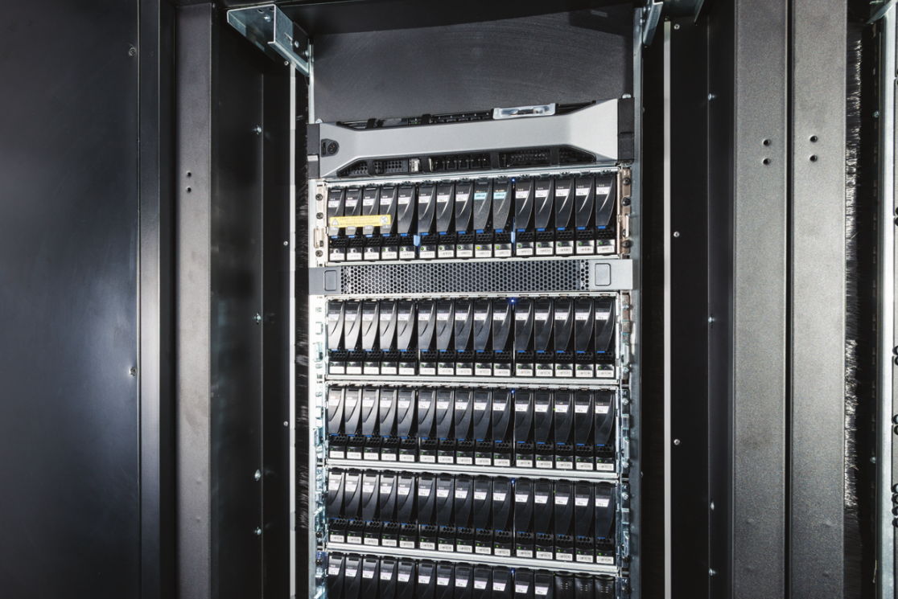
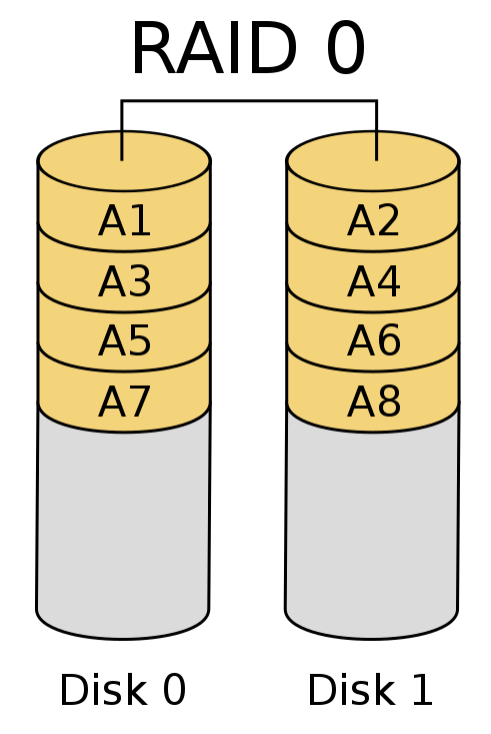
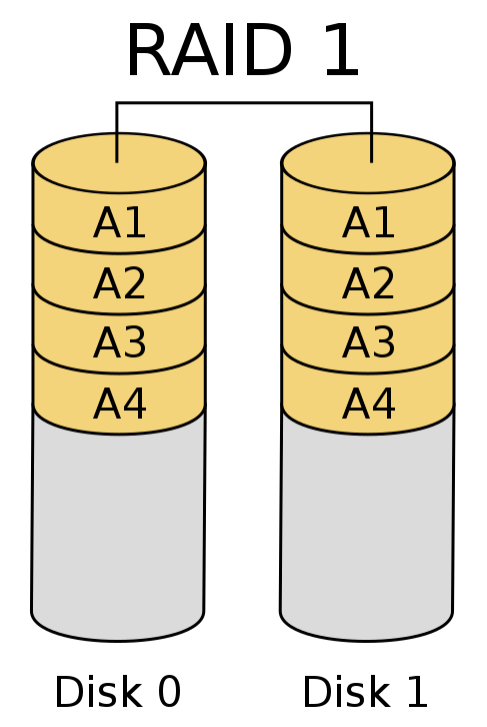
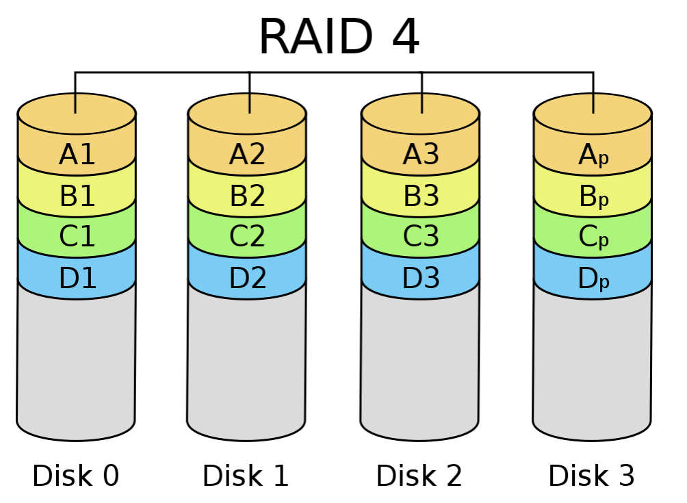
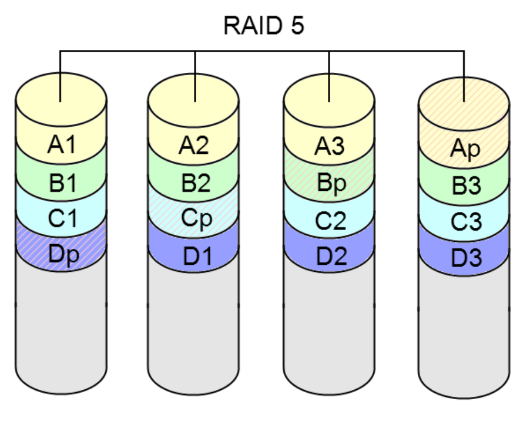
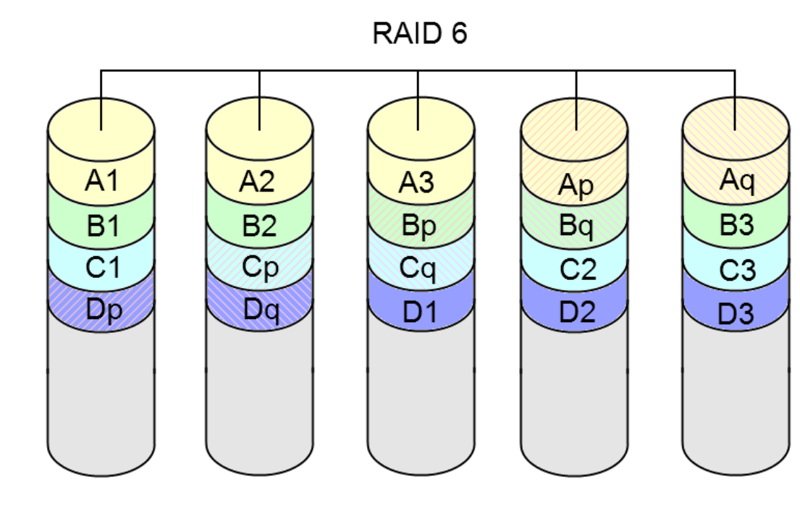
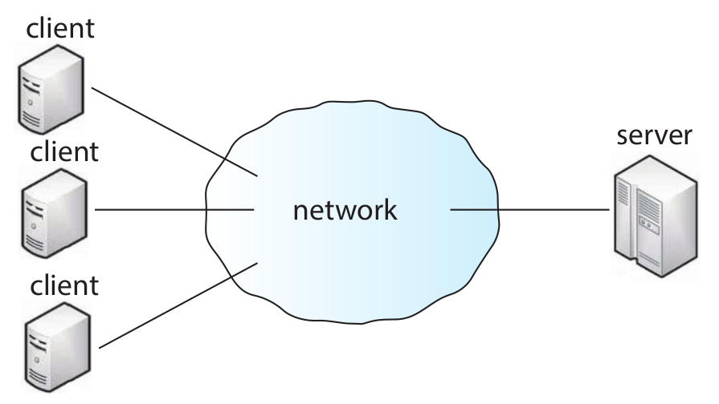
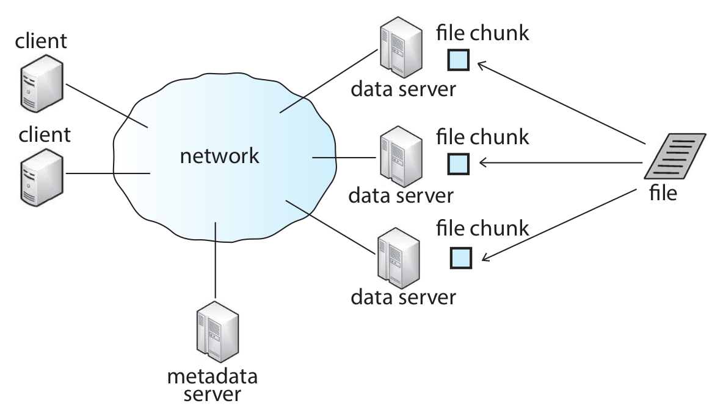
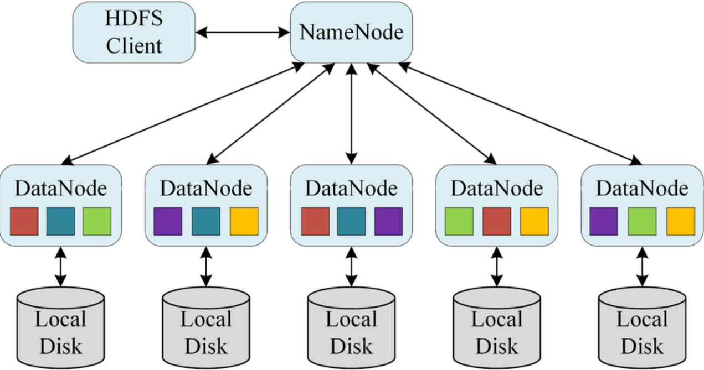
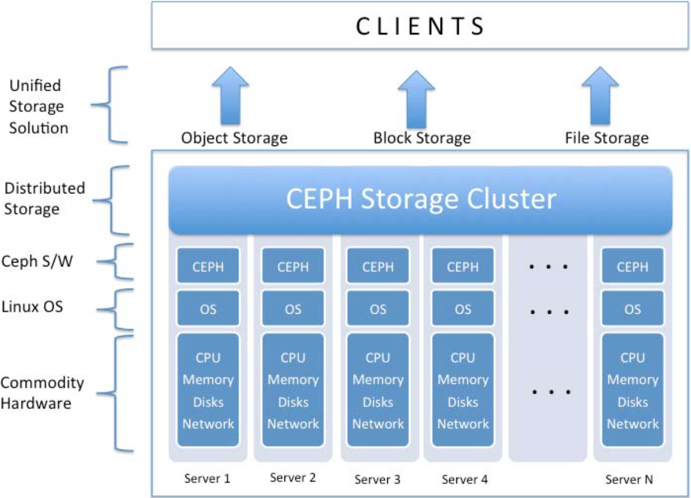

<!-- _paginate: false-->
<!-- _header: "" -->
<!-- _backgroundColor: #FCF3CF -->

   
### Sistemi Operativi
### Unità 4: Il File System
RAID e File System Distribuiti
==================
   
[Martino Trevisan](https://trevisan.inginf.units.it/)
[Università di Trieste](https://www.units.it)
[Dipartimento di Ingegneria e Architettura](https://dia.units.it/)

---
## Argomenti

1. Problematiche
2. RAID
3. File System Distribuiti

---
# Problematiche

---
## Problematiche
### Sistemi professionali

Nei sistemi di grandi dimensioni, una singola macchina ha tanti dischi
- Fino a 100 dischi su una stessa macchina
- Premettono di conservare enormi quantità di dati

Spesso ci sono server dedicati allo *storage*
- I calcolatori accedono **via rete** ai dati
- Tramite protocolli di rete

---
## Problematiche
### Esempio di server per *storage*

---
## Problematiche
### Esempio di server per *storage*

Sono necessarie tecniche per gestire i **guasti** (*failure*)
- Un disco ha l'$1\%$ di probabilità di rompersi ogni mese
  - Dato reale per i dischi magnetici
- Se ho $100$ dischi, ho in media un guasto al mese
- Non è pensabile perdere dati in sistemi professionali

Sono auspicabili tecniche per aumentare le **prestazioni**
- Se $100$ dischi vengono opportunamente usati in parallelo, possono moltiplicare  $\times 100$ la velocità del sistema

---
# RAID

---
## RAID
### Definizione

Le tecniche <r>RAID</r> (redundant array of independent disks) hanno lo scopo di affrontare i problemi di prestazioni e affidabilità
- Proposto nel 1988 da David A. Patterson (e altri) nel paper *A Case for Redundant Arrays of Inexpensive Disks (RAID)*
- Famiglia di metodi per organizzare dati su **batterie di dischi**

---
## RAID
### Concetto di RAID

Si basa su ***striping***, ovvero distribuire i dati su $N$ dischi
- A livello di **bit**: il disco $i$-esimo contiene i bit $n~|~n~mod~N=i$
- A livello di **blocco**: il disco $i$-esimo contiene i blocchi $n~|~n~mod~N=i$
- Ciò migliora le prestazioni, permettendo letture parallele

Eventualmente con l'aggiunta di **codici di parità**
- Per essere *fault-tolerant*
- Non si perdono i dati in caso di guasti di un disco

---
## RAID
### Livelli di RAID

Diverse configurazioni o schemi di dischi possibili. Differiscono
- A seconda che offrano aumenti di prestazione o affidabilità
- Numero minimo di dischi richiesto
- Robustezza a guasti multipli

---
## RAID
### RAID 0 - Sezionamento

I dati sono **divisi** tra i dischi tramite striping (a livello di blocco di solito)

**Minimo numero di dischi:** $2$

**Vantaggi:**
Alta velocità grazie ad accessi paralleli

**Svantaggi:**
Decresce affidabilità del sistema!
- Con un guasto, ho perso tutti i dati!

---
## RAID
### RAID 1 - Mirroring

I dati sono **replicati** su più dischi

**Minimo numero di dischi:** $2$

**Vantaggi:**
Con $N$ dischi, resiste a $N-1$ guasti

**Svantaggi:**
Bassa velocità di scritura limitata dal disco più lento

---
## RAID
### RAID 4 - Disco di parità

Il disco $N$ disco memorizza la parità dei dati sugli altri $N-1$ dischi

**Minimo numero di dischi:** $3$. Due di dato più parità

**Vantaggi:**
Resiste a un guasto
Permette letture parallele

**Svantaggi:**
Scrittura lenta. Necessario calcolare e scrivere parità

---
## RAID
### RAID 5 - Parità distribuita

<medium>

Come RAID 4, ma codici di parità distribuiti su tutti i dischi equalmente

**Minimo numero di dischi:** $3$

**Vantaggi:**
Resiste a un guasto
Scritture più veloci di RAID 4
- Non è necessario accedere **sempre** a disco di parità

**Svantaggi:**
Scrittura comunque lenta (a causa di parità)

**Molto usato in sistemi reali**

</medium>

---
## RAID
### RAID 6 - Doppia parità distribuita

<medium>

Codici di parità memorizzati due volte. Tra tutti i dischi

**Minimo numero di dischi:** $4$

**Vantaggi:**
Resiste a **due guasti**

**Svantaggi:**
Scrittura molto lenta (a causa di doppia parità)

**Molto usato in sistemi reali**

</medium>

---
## RAID
### Conclusioni

<medium>

Gli schemi RAID permettono di migliorare prestazioni e affidabilità quando si hanno molti dischi su una stessa macchina

Non proteggono da un failure completo della macchina
- Temporaneo: manca la corrente
- Permanente: si rompe la scheda madre

Non accettabile per servizi *mission-critical*

Le tecniche RAID non scalano:
- C'è un massimo numero di dischi collegabili a una macchina
- Il BUS PCI ha un limite

Per sistemi **molto grandi** si usano File System distrubuiti

</medium>

---
# File System Distribuiti

---
## File System Distribuiti
### File System di Rete

E' possibile usare un FS che si trova su un altra macchina
- Tipicamente un server dedicato allo storage
- Si utilizzano protocolli dedicati
  - **Network File System (NFS)**: il più usato e flessibile
  - **Samba**: Microsoft
  - **File Transfer Protocol (FTP)**: obsoleto

---
## File System Distribuiti
### Definizione

Un <r>File System Distribuito</r> è un file system che risiede su più dischi su macchine diverse
- E' necessario un software **orchestratore**
- Per far sì che l'utilizzatore ne fruisca come un unico FS

Un FS distribuito:
- E' visto da utilizzatori come un unico FS **grande e affidabile**
- Vi si accede tipicamente come disco di rete (è un File System di Rete)

---
## File System Distribuiti
### Definizione

Basati su modello **client-server**
- Client consulta il metadata server per listare directory e ottenere informazioni sui file
- Client accede al contenuto da uno o più data server

---
## File System Distribuiti
### Tecnologie per FS distribuiti

I FS distribuiti si installano con **software di orchestrazione** dedicati
- Organizzano i dati nei vari dischi e nodi
- Replicano i dati per aumentare le prestazioni
- Recuperano i dati quando un utilizzatore vi accede

---
## File System Distribuiti
### Hadoop Distributed File System

<medium>

Parte della suite Hadoop per Big Data. E' un FS distribuito
- Si installa su un **cluster** (insieme) di server/nodi
- I **Name Node** hanno l'indice dei **file**
- I **Data Node** memorizzano il contenuto dei **file**
- Tutto viene replicato $N$ volte

</medium>

---
## File System Distribuiti
### CEPH

<small>

Concettualmente simile a HDFS. Si usa su cluster di nodi. Implementa:
- **FS distribuito:** i client accedono a file e cartelle
- **Dispositivo a blocchi:** i client vedono disco grezzo a blocchi
- **Object storage:** i client accedono a bucket generici identificati da ID

</small>

---
## Domande

<!-- _backgroundColor: #FFF9E3 -->

<medium>

Un sistema di dischi basato su RAID è sempre più affidabile di un disco singolo?
`• Si` `• No`

In un sistema RAID 0, quali sono le conseguenze in caso di fallimento di un disco?
`• I dati vengono persi` `• E' possibile recuperare i dati`

In un sistema RAID 1, quali sono le conseguenze in caso di fallimento di un disco? 
`• I dati vengono persi` `• E' possibile recuperare i dati`

E' possibile creare un sistema RAID 6 con 3 dischi?
`• Si` `• No`

Qual è il sistema di accesso tipico a un FS Distribuito?
`• Bus PCI` `• Rete` `• USB` 

</medium>

