<!-- _paginate: false-->
<!-- _header: "" -->
<!-- _backgroundColor: #FCF3CF -->

   
### Sistemi Operativi
### Unità 5: I processi
Aspetti Teorici
==================
   
[Martino Trevisan](https://trevisan.inginf.units.it/)
[Università di Trieste](https://www.units.it)
[Dipartimento di Ingegneria e Architettura](https://dia.units.it/)

---
## Argomenti

1. Concetto di processo
2. Stati di un processo
3. Process Control Block
4. Scheduling
5. Algoritmi di Scheduling

---
# Concetto di processo

---
## Concetto di processo

- Un elaboratore svolge uno o più compiti
  - Esempio: Controllare la temperatura di una stanza
- Un compito si svolge tramite un procedimento formale detto <r>algoritmo</r>
- Un programma implementa un algoritmo tramite instruzioni in linguaggio macchina
  - Può essere scritto in un linguaggio di programmazione e *compilato*
- Un <r>processo</r> è un programma in esecuzione

---
## Concetto di processo

Inizialmente, ogni elaboratore eseguiva un programma per volta.
- Caricato all'avvio del sistema
- Oppure eseguiti sequenzialmente (batch processing)

I sistemi moderni hanno un SO che permette di eseguire più processi in contemporanea
- Le risorse del sistema sono gestite dal SO che le mette a disposizione tramite le System Call
- Il SO gestisce l'esecuzione dei processi: <r>scheduling</r>

---
## Concetto di processo

Un proceso risiede **in memoria** 
La struttura di un processo in memoria è generalmente suddivisa in più sezioni.
- **Sezione di testo**: contiene il codice eseguibile 
- **Sezione dati**: contiene le variabili globali
- **Heap**: memoria allocata dinamicamente durante l’esecuzione del programma 
- **Stack**: memoria temporaneamente utilizzata durante le chiamate di funzioni

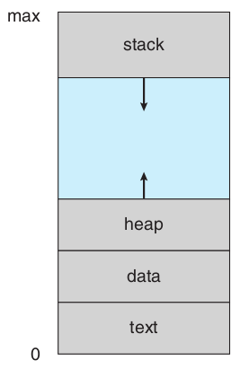

---
## Concetto di processo
### Processo *init*

Nei moderni SO, all'avvio del sistema viene avviato un processo fondamentale detto <r>init</r> 
- Eseguito fino allo suthdown

Il processo *init* avvia altri processi in background:
- Per gestire periferiche: rete, antivirus
- Per creare l'interfaccia grafica della GUI o del terminale

Un processo avviato in background da *init* é detto <r>Servizio</r>
- Formati e comandi diversi tra distribuzioni Linux per gestirli
  Comandi: `service` o `systemctl`

---
## Concetto di processo
### Processi utente

L'utente può creare dei processi per svolgere i propri compiti
- Browser
- Editor
- Programmi server: server Web, server DNS

---
## Concetto di processo

Il SO mette a disposizione delle System Call per:
- Creare nuovi processi
- <r>Sincronizzazione:</r> Attendere il completamento di altri processi per coordinare un compito complesso

I processi sono identificati dal un <r>PID</r>
- Il processo init ha PID $1$ per definizione

---
# Stati di un processo

---
## Stati di un processo

Un processo si può trovare in diversi stati

 

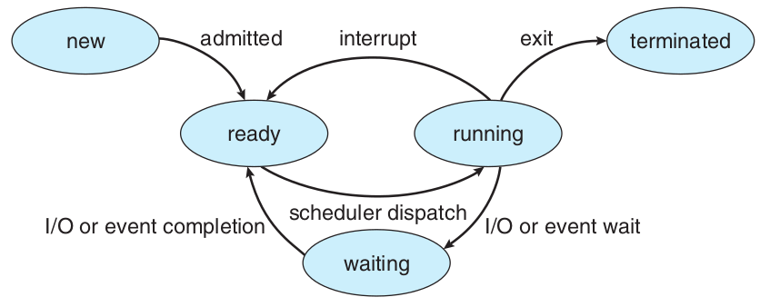

---
## Stati di un processo

Usando le System Call, un processo può creare un altro processo
- Il processo generato è <r>figlio</r> del processo generante
- Si crea un <r>albero dei processi</r>
- Se il processo padre termina, i figli <r>NON</r> vengono terminati
- I processi *senza padre* diventano figli del processo *init*

---
## Stati di un processo

Esempio di albero dei processi:

 

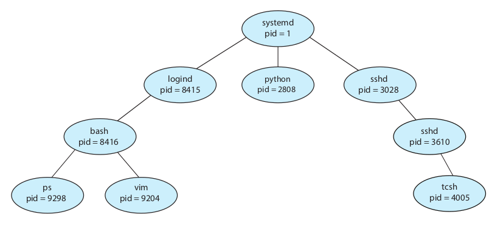

---
# Process Control Block

---
## Process Control Block

Ogni processo è rappresentato nel sistema operativo da un blocco di controllo (process control block, PCB) contenente le informazioni connesse
- **Stato del processo**: nuovo, pronto, esecuzione, attesa, arresto 
- **Program counter**: indirizzo della successiva istruzione da eseguire
- **Registri della CPU**: permettono di interrompere il processo
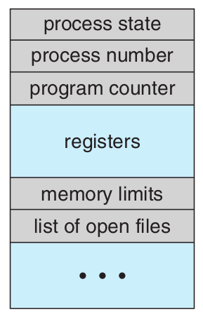

---
## Process Control Block

- **Informazioni di scheduling**: priorità, risorse consumate
- **Informazioni sulla gestione della memoria**: puntatori alle varie zone di memoria
- **Informazioni di I/O**: file aperti, operazioni in attesa, ecc...

---
# Scheduling

---
## Scheduling

Lo <r>scheduler dei processi</r> seleziona un processo da eseguire dall’insieme di quelli disponibili
- Mantiene una coda dei processi pronti
- Mantiene una coda dei processi in attesa di evento. Esempio: completare un'azione di I/O

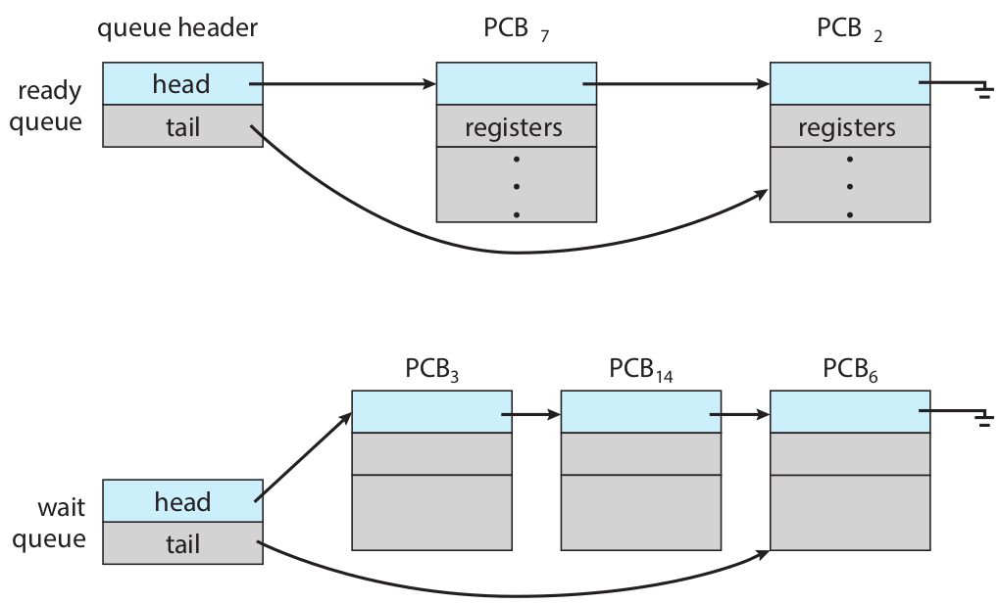

---
## Scheduling

I processi possono essere classificati in base al tipo di carico che generano e il collo di bottiglia che li limita.
- **Processo I/O bound**: impiega la maggior parte del proprio tempo nell'esecuzione di operazioni di I/O
- **Processo CPU bound**: impiega la maggior parte del proprio tempo nelle elaborazioni

Il computo di uno scheduler è di <r>ottimizzare</r> l'esecuzione dei processi per farli eseguire nel minor tempo possibile
- Interviene più volte al secondo
- Gestisce l'esecuzione col meccanismo del <r>time sharing</r>

---
## Scheduling

Ogni processo inizia dalla <r>Ready Queue</r> e segue il <r>diagramma di accodamento</r> finchè non termina

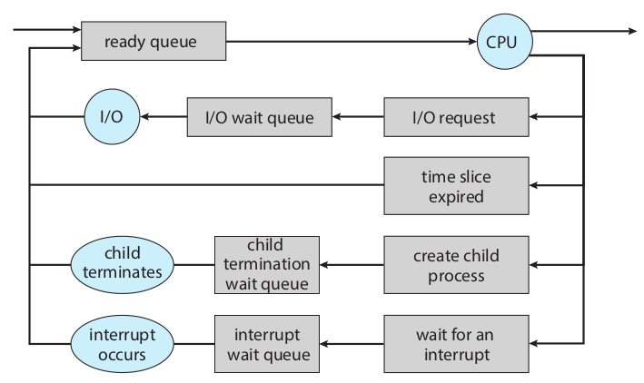

---
## Scheduling

Lo scheduler decide a quale processa assegnare la/le CPU
Quando decide che (una) CPU deve essere assegnata a un altro processo, esso deve:
- Salvare lo stato del processo corrente
  - Per poterlo poi ripristinare quando il processo stesso potrà ritornare in esecuzione
- Caricare un nuovo processo ripristinandone lo stato salvato precedentemente
Si esegue un salvataggio dello stato e, in seguito, un corrispondente ripristino dello stato, detto <r>Context Switching</r>

---
## Scheduling

Il Context Switching deve essere rapido, siccome è tempo sprecato, che non svolge nessun compito utile
- Il SO è ottimizzato per compiere questa azione velocemente
- Attualmente nell'ordine di pochi micro secondi
- Dipende da hardware e dalle caratteristiche del processo, specialmente la quantità di memoria usata

---
## Scheduling

Diagramma di cambio di contesto:

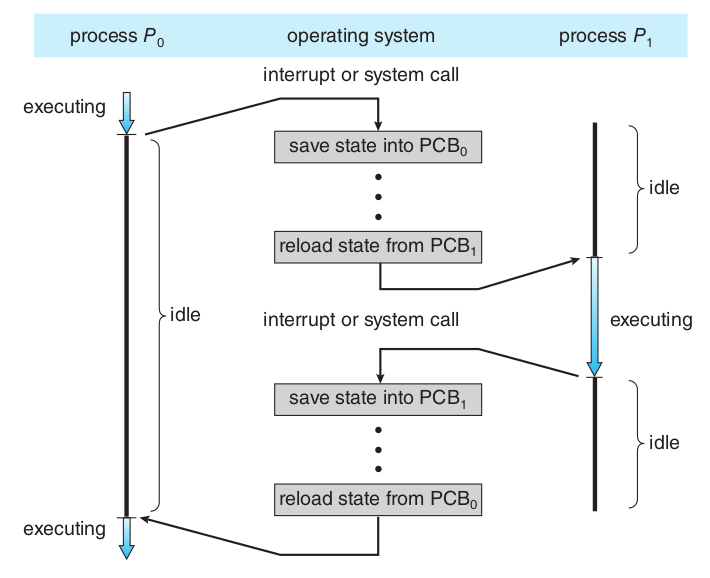

---
## Scheduling

**Operazione di Yield**: un processo dice al kernel, che per il momento non ha operazioni da fare.
Il kernel rimuove dalla CPU il processo e lo riaccoda nella lista dei processi pronti.
- E' un modo per rilasciare la CPU prima che scada il quanto di tempo assegnato
- Specialmente usato per processi *real time*

---
# Algoritmi di Scheduling

---
## Algoritmi di Scheduling

L'obbiettivo di un SO è di ridurre il tempo di esecuzione dei processi
- Obbiettivo ambiguo: conviene eseguire prima un lavoro lungo o uno corto?
- Obbiettivo complesso: il SO non sa se un processo è lungo/corto, *CPU/I/O intensive*

Esistono diversi <r>Algoritmi di Scheduling</r> che si usano per determinare quale processo assegnare a una CPU

---
## Algoritmi di Scheduling
### First-Come First Served

Il primo processo che richiede la CPU, la ottiene finchè non termina
**Pro** Semplice
**Contro:** Inefficiente. Sconveniente eseguire un processo lungo per primo

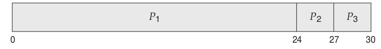

---
## Algoritmi di Scheduling
### Shortest-Job First Served

Il primo più breve, la ottiene la CPU per primo
**Pro** efficiente. Il tempo medio di completamento si abbassa
**Contro:** Un processo lungo viene lasciato eseguire fino alla fine

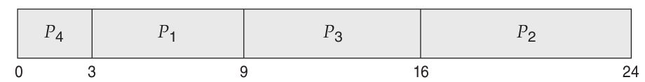

---
## Algoritmi di Scheduling
### Round Robin

A turno, ogni processo prende la CPU per un tempo fissato
**Pro** Semplice ed equo
**Contro:** Non si possono avere processi ad alta priorità

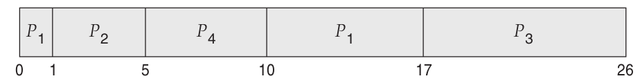

---
## Algoritmi di Scheduling
### Priority Scheduling

Ogni processo ha una priorità data dall'utente. Viene eseguito il processo a priorità più alta
**Pro** Gestisce la priorità
**Contro:** Un processo a bassa priorità potrebbe non venire mai eseguito

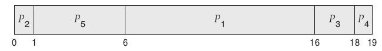

---
## Algoritmi di Scheduling
### Multi-Level Queue Scheduling

Ci sono code diverse per ogni livello livello di priorità.
- Ogni coda ha un suo algoritmo di scheduling: RR, FCFS
- C'è un algoritmo di scheduling tra code

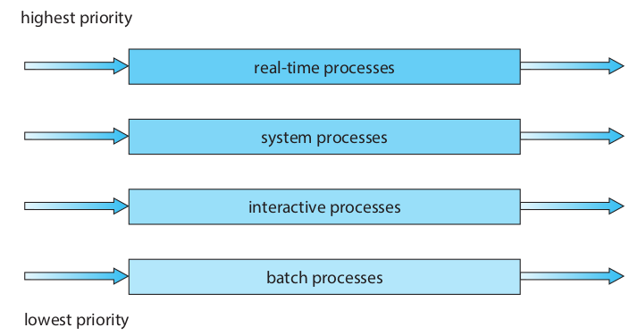

---
## Algoritmi di Scheduling
### Multi-Level Queue Scheduling

In questo modo c'è flessibilità: si può avere priorità ma non c'è il rischio che un processo non venga mai eseguito 

**Pro** Flessibile
**Contro:** Complesso

Usato in Linux, con varianti

---
## Algoritmi di Scheduling
### Linux: Completely Fair Scheduler

<medium>

**In Linux** lo scheduler si chiama **Completely Fair Scheduler**
I processi sono assegnati a una **Policy di Scheduling** dall'utente, ognuna con meccanismi diversi
Il sistema provvede a eseguire processi in ogni policy, che hanno diversi requisiti
Le policy al loro interno possono gestire priorità, deadline, ecc...

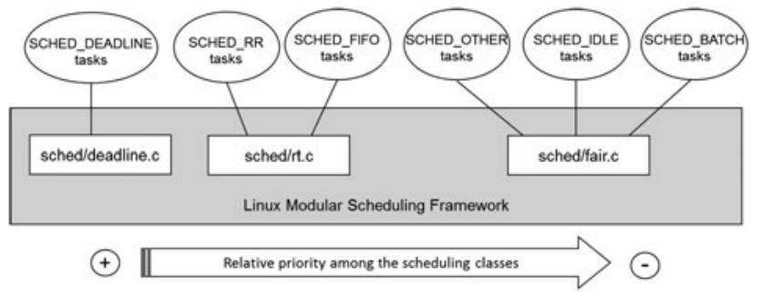
</medium>

---
## Algoritmi di Scheduling
### Linux: Completely Fair Scheduler

La Policy di default è `SCHED_OTHER`: time-sharing scheduling con priorità
Esistono System Call per definire priorità a un processo
`nice(2) getpriority(2) setpriority(2) sched_setscheduler(2) sched_getscheduler(2) sched_setparam(2) sched_getparam(2) sched_yield(2)`

---
## Domande

<!-- _backgroundColor: #FFF9E3 -->

<small>

Un processo è
`• Una componente del sistema operativo`
`• Il codice eseguibile di un programma`
`• Un programma in esecuzione` 

I processi sono identificati da:
`• Un nome` `• Un ID numerico` `• Non hanno identificativi`

I processi sono in relazione tra loro in una struttura:
`• Ciclica` `• Ad albero`

Il Context Switching è:
`• La momentanea sospensione di un processo`
`• La terminazione di un processo`

Nello scheduler di Linux, processi:
`• Hanno tutti la stessa priorità di scheduling`
`• Hanno una priorità assegnabile dall'utente`
`• Hanno una priorità calcolata automaticamente dal SO`

</small>

