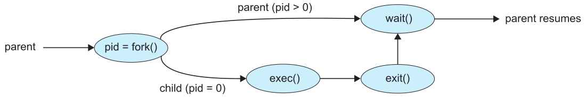
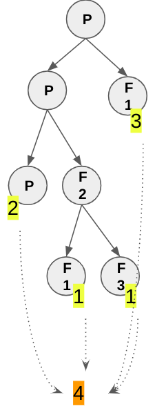
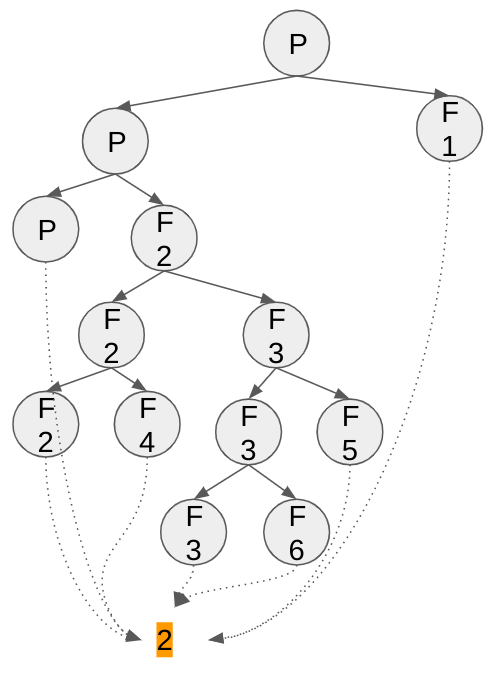
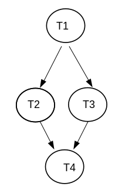
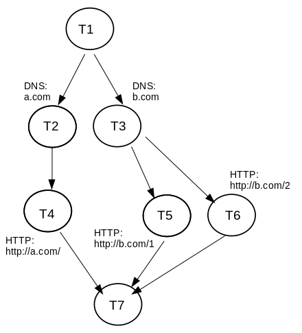
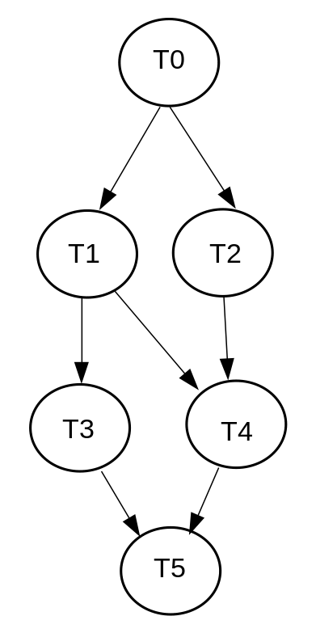
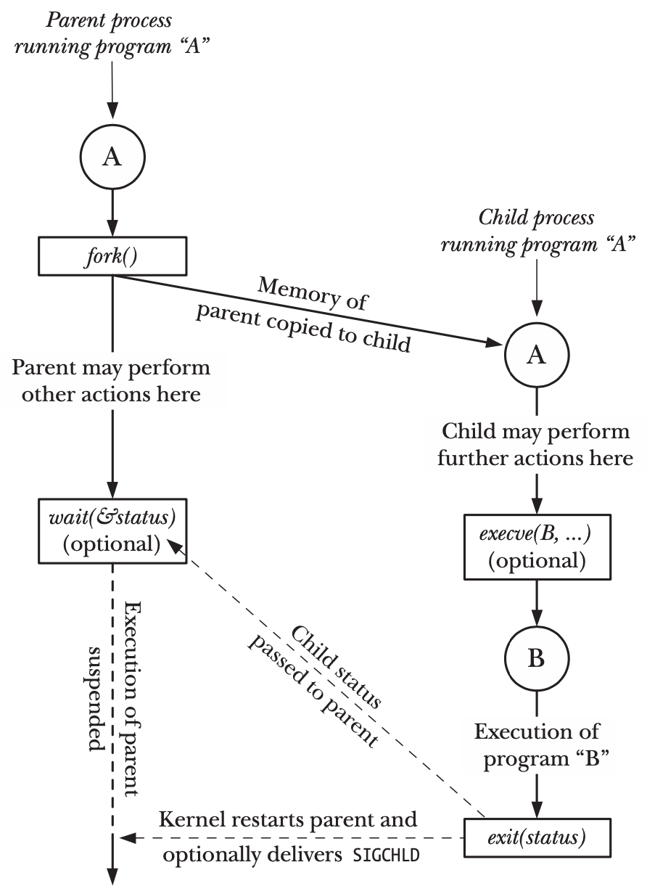
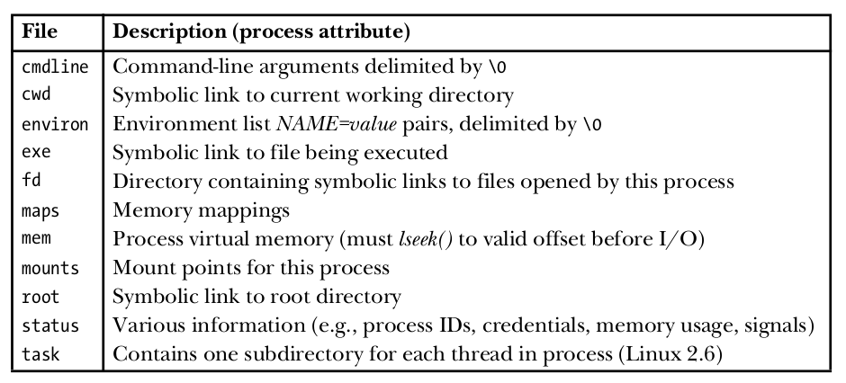
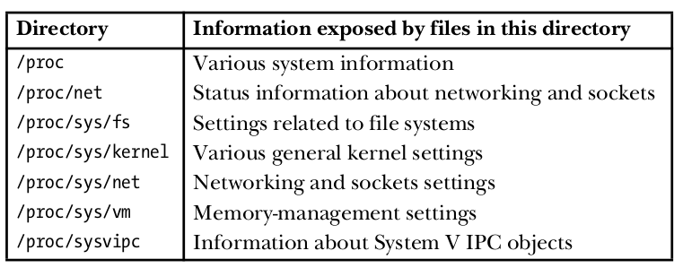

<!-- _paginate: false-->
<!-- _header: "" -->
<!-- _backgroundColor: #FCF3CF -->
<style scoped> h1, h2, h3, h4 {text-align: center;}
section {background-color: #FDEDEC;}
h1 {color:red} a:link {color: darkred;} p {text-align: center; font-size: 25px}</style>
<br/><br/><br/>
### Sistemi Operativi
### Unità 5: I processi
Operazioni sui processi
=======================
<br/><br/><br/>
[Martino Trevisan](https://trevisan.inginf.units.it/)
[Università di Trieste](https://www.units.it)
[Dipartimento di Ingegneria e Architettura](https://dia.units.it/)

---
## Argomenti

1. Creazione di un processo
2. Funzione `fork`
2. Funzione `wait`
2. Funzione `exec`
2. Funzione `system`
2. Funzione `exit`
2. Altre funzioni
3. Comandi Bash per Processi

---
# Creazione di un processo

---
## Creazione di un processo

In un SO, la manipolazione dei processi è effettuata tramite System Call
**In Windows:**
```c
BOOL CreateProcessA(
  LPCSTR                lpApplicationName,
  LPSTR                 lpCommandLine,
  LPSECURITY_ATTRIBUTES lpProcessAttributes,
  LPSECURITY_ATTRIBUTES lpThreadAttributes,
  BOOL                  bInheritHandles,
  DWORD                 dwCreationFlags,
  LPVOID                lpEnvironment,
  LPCSTR                lpCurrentDirectory,
  LPSTARTUPINFOA        lpStartupInfo,
  LPPROCESS_INFORMATION lpProcessInformation
);
```


---
## Creazione di un processo

In Linux, esistono 6 System Call principali
- `fork`: crea un processo duplicato
- `exec`: carica un codice eseguibile   
- `wait`: aspetta la terminazione del processo
- `signal`: cattura un segnale
- `kill`: invia un segnale
- `exit`: termina il processo corrente



---
## Creazione di un processo

**Windows vs Linux**:
Windows ha una System Call complessa (`CreateProcessA`)
- Molto verboso
- Molti parametri
- Molto tipizzata

Linux preferisce System Call semplici:
- `fork` clona un processo
- `exec` permette di eseguire un file eseguibile nel processo corrente


---
# Funzione `fork`

---
## Funzione `fork`

```c
#include <unistd.h>
pid_t fork (void);
```
Crea un nuovo processo figlio, copiando completamente l’immagine di memoria del processo padre (data, heap, stack)
- I due processi evolvono indipendentemente
- La memoria è completamente indipendente tra padre e figlio 
- Il codice viene generalmente condiviso tra padre e figlio
  - Codice copy-on-write (copiato quando viene modificato)

Nota: `pid_t` è un alias per un `int`, come `size_t`


---
## Funzione `fork`

- Tutti i descrittori dei file aperti nel processo padre sono duplicati nel processo figlio
- Sia il processo child che il processo parent continuano ad eseguire l’istruzione successiva alla `fork`
- Valore di ritorno:
  - Processo figlio: $0$
  - Processo padre: PID del processo figlio
  - Errore della fork:  PID negativo (solo padre)


---
## Funzione `fork`

<!-- _backgroundColor: #FFF9E3 -->

<small>

```c
#include  <stdio.h>
#include  <sys/types.h>
void Figlio(void);               
void Padre(void);
void  main(void)
{
     pid_t  pid;
     pid = fork();
     if (pid == 0)
        Figlio(); 
     else
        Padre();
}
void  Figlio(void)
{
     int i=0;
     for(i=0;i<10;i++){	
		usleep(200);
		printf("\tSono il figlio. i= %d\n",i);                                     
     }
}
void Padre(void)
{
     int   i=1;
     for(i=0;i<10;i++){
		usleep(250);
		printf("Sono il padre. i= %d\n",i);
     }
}
```
</small>

---
## Funzione `fork`

**Osservazioni:**
Il valore di ritorno della `fork` è fondamentale
Un programma scritto in termini di `fork` non è immediatamente comprensibile
- Operazione atomica, ma effetti complessi
- E' possibile creare alberi di processi complessi, con codice complesso

---
## Funzione `fork`

**Fork Bomb:** un programma che chiama la `fork` in un ciclo infinito, blocca la macchina a causa dei troppi processi
```c
#include <unistd.h>
int main(void)
{
    while(1) 
        fork(); 
}
```

---
## Funzione `fork`
**Fork Bomb in Bash:**
```bash
:(){ :|:& };:
```
che equivale a:
```bash
myfork() {
    myfork | myfork &
}
myfork
```


---
## Funzione `fork`

<!-- _backgroundColor: #FFF9E3 -->
<small>

**Esercizio:** si determini l'albero di processi generato dal seguente codice e l'output generato
```c
#include <stdio.h>
#include <unistd.h> 
int main(){
    if (fork()){
        if (!fork()){
            fork();
            printf("1 "); 
        }
        else
            printf("2 ");
    }
    else
        printf("3 ");
    printf("4 ");
    return 0;
}
```

**Output**:
`
2 4 3 4 1 4 1 4
`
</small>




---
## Funzione `fork`

<!-- _backgroundColor: #FFF9E3 -->

<small>

**Esercizio:** si determini l'albero di processi generato dal seguente codice e l'output generato
```c
#include <stdio.h> 
#include <unistd.h>

int main(){
  printf("\n");
  if (fork() && (!fork())) { 
    if (fork() || fork()) {
      fork();
    }
  }

  printf("2 "); 
  return 0;
}
```

**Output**:
`
2 2 2 2 
`



</small>

---
## Funzione `fork`

<!-- _backgroundColor: #FFF9E3 -->
<small>

**Esercizio:** si determini l'output generato dal seguente programma
```c
#include <stdio.h> 
#include <unistd.h>
int main(int argc,char *argv[]){
  printf("A\n"); 
  fork();
  printf("B\n"); 
  fork();
  printf("C\n"); 
  return 0;
}
```

**Output**:
```
A
B
B
C
C
C
C
```
</small>


---
## Funzione `fork`

<!-- _backgroundColor: #FFF9E3 -->
<small>

**Esercizio:** si determini l'output generato dal seguente programma
**Nota:** non ci sono i `\n` nelle `printf`
```c
#include <stdio.h> 
#include <unistd.h>
int main(int argc,char *argv[]){
  printf("A "); 
  fork();
  printf("B "); 
  fork();
  printf("C "); 
  return 0;
}
```

**Output**:
```
A B C A B C A B C A B C
```
**Perchè?**
Dipende dalla duplicazione della memoria dopo la `fork` e dall'I/O bufferizzato della `printf`

</small>

---
# Funzione `wait`

---
## Funzione `wait`

```c
#include <sys/wait.h>
pid_t wait (int *status);
```

Attende la prima terminazione di **un** figlio
Argomento `status`:
- Puntatore ad un intero; 
- Se non è NULL specifica lo stato di uscita del processo figlio (valore restituito dal figlio)

Valore di ritorno:
- Il PID del figlio terminato
- $0$ in caso di errore


---
## Funzione `wait`

**Casistica:**
- Se il processo non ha figli: Errore
- Se il processo ha dei figli che sono già terminati: ritorna istantaneamente
- Se il processo ha dei figli non ancora terminati: blocca il chiamante finchè non termina un figlio

---
## Funzione `wait`

La funzione `wait` *consuma* un figlio per volta.
Dopo che un figlio è stato *ritornato* al padre tramite una `wait`:
- Il SO rilascia le risorse del processo figlio
  - Il SO mantiene informazioni su processi terminati di cui non è ancora stata effettuata una `wait`
  - Traccia che il processo è esistito
  - Valore di ritorno e informazioni su esecuzione
- Non verrà ritornato in succesive invocazioni


---
## Funzione `wait`

**Processi Zombie:** processo terminato il cui padre non ha ancora effettuato una `wait`
- Dopo che viene effettuata, il processo è morto definitivamente e non ne rimane traccia

**Processi Orfani:** processi in cui padre è morto.
- Se il padre muore, i figli continuano l'esecuzione
- Diventano figli del processo *init* ($PID=1$)
- Periodicamente, *init* esegue delle `wait` per consumare gli orfani morti


---
## Funzione `wait`

```c
#include <sys/wait.h>
pid_t waitpid(pid_t pid, int *status, int options);
```

Attende la prima terminazione di:
- Un qualsiasi figlio se `pid == -1` (come `wait` classica)
- Un figlio con PID `pid` se `pid>0`
- Un qualsiasi figlio il cui **group ID** è uguale a quello del chiamante se `pid == 0`
- Il figlio il cui **group ID** è uguale a `abs(pid)` se `pid <-1`

---
## Funzione `wait`

**group ID**: intero positivo associato a un processo. Serve per definire gruppi di processi creati dall'utente. Utile per mantenere ordine.

**Altri argomenti di `waitpid`**:
- `status` come nella `wait`
- `options`: controlla se la funzione è bloccante. E' una bitmask.
  - $0$ bloccante
  - `WNOHANG`: non blocca in caso di assenza di figlio già morto
  - Altri flag per intercettare solo figli morti in condizioni particolari


---
## Funzione `wait`

<!-- _backgroundColor: #FFF9E3 -->

**Esercizio:** si scriva un programma che implementa il seguente grafo di precedenze con `fork` e `wait`.

**Nota:**
Ogni biforcazione si implementa tramite una `fork` e ogni rcongiungimento tramite una `wait`

**Importante:** questi esercizi permettono di scrivere codice che parallelizza diverse operazioni
Fondamentale per programmazione parallela




---
## Funzione `wait`

<!-- _backgroundColor: #FFF9E3 -->

```c
#include <stdio.h>
#include <unistd.h>
#include <sys/types.h>
#include <sys/wait.h>
int main() {
    pid_t pid;
    printf ("T1\n");
    pid = fork();
    if (pid == 0) {
        printf ("T3\n");
        return 0;
    } else {
        printf ("T2\n");
        wait ((int *) 0);
    }
    printf ("T4\n");
    return 0;
}
```

---
## Funzione `wait`

<!-- _backgroundColor: #FFF9E3 -->

<small>

**Esercizio:** si scriva un programma che implementa il seguente grafo di precedenze con `fork` e `wait`.

**Nota:** questo è il grafo per eseguire in maniera efficiente 3 richieste HTTP alle URL.
- `http://a.com/`
- `http://b.com/1`
- `http://b.com/2`

Prima di ogni richiesta, è necessario effettuare la risoluzione DNS. Due URL hanno lo stesso dominio.

**Nota**: nei casi reali, il programmatore deve risolvere il problema efficientemente. Deve costruire da solo il grafo di precedenze.



</small>

---
## Funzione `wait`

<!-- _backgroundColor: #FFF9E3 -->

<verysmall>

```c
#include <stdio.h>
#include <unistd.h>
#include <sys/types.h>
#include <sys/wait.h>
int main() {
    pid_t pid;
    printf ("T1 - Start\n");
    pid = fork();
    if (pid == 0) {
        printf ("T3 - DNS b.com\n");
        pid_t pid2;
        pid2=fork();
        if (pid2==0){
            printf ("T6 - HTTP http://b.com/1\n");
            return 0;
        }
        else{
            printf ("T5 - HTTP http://b.com/2\n");
            wait ((int *) 0);  /* Attende T6 */
            return 0;
        }
    } else {
        printf ("T2 - DNS a.com\n");
        printf ("T4 - HTTP http://a.com/\n");
        wait ((int *) 0); /* Attende T3 - T5 */
    }
    printf ("T7 - Utilizzo i risultati\n");
    return 0;
}
```

**Nota:** T5 aspetta T6 che è suo figlio. T7 non può *aspettare* T6, in quanto non è suo figlio
La `wait` *aspetta* solo sui figli, <r>NON</r> sui nipoti

</verysmall>


---
## Funzione `wait`

<!-- _backgroundColor: #FFF9E3 -->

<small>

**Esercizio:** si scriva un programma che implementa il seguente grafo di precedenze con `fork` e `wait`.

Questo grafo è <r> impossibile</r> da realizzare mediante sole `fork` e `wait`

T4 non può *attendere* T1. Non è suo figlio!
In generale:
- Si possono *attendere* solo i figli
- Ogni figlio può essere atteso una volta sola




</small>


---
## Funzione `wait`

<!-- _backgroundColor: #FFF9E3 -->

<small>

```c
#include <stdio.h>
#include <unistd.h>
#include <sys/types.h>
#include <sys/wait.h>
int main() {
    pid_t pid;
    printf ("T0\n");
    pid = fork();
    if (pid == 0) {
        printf ("T2\n");
        wait ( ??? ) /*  <--------- IMPOSSIBILE! */
        printf ("T4\n");
    } else {
        printf ("T1 -\n");
        wait ((int *) 0); /* Attende T4 */
    }
    printf ("T7 - Utilizzo i risultati\n");
    return 0;
}
```

</small>


---
## Funzione `exec`

La `fork` permette di duplicare un processo
- Usata quando il figlio deve eseguire lo stesso programma del padre
- In programmi paralleli: web server, database

La `exec` permette di cambiare la natura di un processo corrente
- Caricando ed eseguendo un programma diverso
- Usata ogniqualvolta bisogna avviare un nuovo programma


---
# Funzione `exec`


---
## Funzione `exec`

Quando un processo chiama una `exec`:
- Il processo viene rimpiazzato <r>completamente</r> dal codice contenuto nel file specificato (text, data, heap, stack vengono sostituiti)
- Il nuovo programma inizia a partire dalla sua funzione `main`
- Il PID non cambia

---
## Funzione `exec`

Cosa eredita il processo dopo una `exec`:
- Variabili d'ambiente
- PID e PPID
- current working directory, root e home directory

Cosa non viene ereditato:
- File aperti se hanno il flag `close-on-exec`
- Altrimenti lasciati aperti

---
## Funzione `exec`

Esistono 7 versioni della `exec`.
Hanno la stessa funzione, varia il modo in cui ricevono gli argomenti.

```c
#include <unistd.h>

int execl(const char *pathname, const char *arg, ...);
int execlp(const char *file, const char *arg, ...);
int execle(const char *pathname, const char *arg, ..., char *const envp[]);
int execv(const char *pathname, char *const argv[]);
int execvp(const char *file, char *const argv[]);
int execve(char *pathname, char *argv[], char* envp[]);
int execvpe(const char *file, char *const argv[], char *const envp[]);
```

---
## Funzione `exec`

Le funzioni con `p` ricevono il nome dell'eseguibile e non il path.
- Il SO rintraccia l'eseguibile nelle cartelle dei programmi installati nel sistema
- Che sono definite nella variabile d'ambiente `PATH`

Esempio:
```c
execlp("ls");
execl("/usr/bin/ls");
```

---
## Funzione `exec`

- Le funzioni con `l` specificano gli **argomenti** del nuovo programma tramite una lista di argomenti. Simile a `printf`
- Le funzioni con `v` specificano gli **argomenti** del nuovo programma tramite un unico puntatore a puntatore a `char`. Equivalente a `argv` nel `main`
  - Il primo argomento deve contenere il nome del file associato all'eseguibile che viene caricato
  - L'array di puntatori deve essere terminato da un puntatore NULL
    - Mancando `argc`, questo serve a comunicare la lunghezza del vettore
      
---
## Funzione `exec`

Esempio:
```c
// Semplice
execlp("cp", "file1", "file2");

// Generico
const char *args[4];
args[0] = "cp";
args[1] = "file1";
args[2] = "file2";
args[3] = NULL;
execvp("cp", args);
```


---
## Funzione `exec`

Le funzioni con `v` ricevono un vettore di variabili d'ambiente. Quindi esse <r>non</r> vengono eridate dal processo padre.
- Le variabili d'ambiente sono specificate nell'ultimo argomento tramite un puntatore a puntatore a `char`
  - Terminato da puntatore `NULL`


```c
char *const args[] = {"ls", "/tmp", NULL};
execv("/usr/bin/ls", args);

char *const envs[] = {"a=1", "b=2", NULL};
execle("/usr/bin/ls", args, envs);
```

---
## Funzione `exec`

**Osservazione:**
- La funzione `execve` è una System Call.
- Le altre funzioni sono di libreria, e invocano la `execve` dopo aver correttamente gestito e aggiustato i parametri


---
## Funzione `exec`

<!-- _backgroundColor: #FFF9E3 -->

<small>

**Esercizio:** si scriva una semplice shell usando le funzioni `fork`, `wait` e `exec`

```c
#include <stdio.h>
#include <unistd.h>
#include <sys/types.h>
#include <sys/wait.h>
#define MAXLINE 128
int main() {
	char	buf[MAXLINE];	
	pid_t	pid;
	int		status;
	printf("%% ");	/* prompt */
	while (fgets(buf, MAXLINE, stdin) != NULL) {
		if (buf[strlen(buf) - 1] == '\n')
		    buf[strlen(buf) - 1] = 0; 
		if ((pid = fork()) < 0) {
			printf("errore di fork "); exit(1);
		} else if (pid == 0) {		/*figlio */
			execlp(buf, buf, NULL);
			printf("non posso eseguire: %s\n", buf);                                  
			exit(127);
		} else
		if ((pid = waitpid(pid, &status, 0)) < 0) /* padre */
			{printf("errore di waitpid"); exit(1);}
		printf("%% ");
	}
	exit(0);
}
```
**Nota:** per gestire gli argomenti dei comandi invocati, bisognerebbe manipolare le stringhe
</small>


---
## Funzione `exec`

<!-- _backgroundColor: #FFF9E3 -->


**Esercizio:** si consideri il seguente programma.


```c
#include <stdio.h>
#include <stdlib.h>
#include <unistd.h>
int main (int argc, char ** argv) {
    char str[10];
    int n;
    n = atoi(argv[1]) - 1;
    printf ("%d\n", n);
    if (n>0) {
        sprintf (str, "%d", n);
        execl (argv[0], argv[0], str, NULL);
    }
    printf ("End!\n");
    return 1;
}
```


---
## Funzione `exec`

<!-- _backgroundColor: #FFF9E3 -->
Cosa viene stampato  eseguendo `./prog 5` ?
```
4
3
2
1
0
End!
```

---
# Funzione `system`
 
---
## Funzione `system`

E' una funzione di libreria che invoca un comando Bash e ne attende la conclusione
- Utile per chiamare facilmente programmi esterni in un programma
- Combina: `fork`, `exec` e `wait`

```c
#include <stdlib.h>

int system(const char *command);
```

Equivale a una `fork` il cui figlio esegue:
```c
execl("/bin/sh", "sh", "-c", command, (char *) NULL);
```


---
## Funzione `system`

**Implementazione semplice**:

```c
int system(const char *cmd)
{
    int stat;
    pid_t pid;
    if (cmd == NULL)
        return(1);
    if ((pid = fork()) == 0) { /* Son */
        execl("/bin/sh", "sh", "-c", cmd, (char *)0);                              
        _exit(127);
    }
    if (pid == -1) {
        stat = -1; /* Error */
    } else { /* Father */
        while (waitpid(pid, &stat, 0) == -1) {
            if (errno != EINTR){
                stat = -1;
                break;
            }
        }
    }
    return(stat);
}
```

---
## Funzione `system`

<!-- _backgroundColor: #FFF9E3 -->
<small>

**Esercizio:** Si scriva un programma che fa il listing dettagliato di una cartella.
- La cartella è passata come argomento
  - Se non ci sono argomenti, lista la directory corrente
- Usando `ls -lh cartella`


```c
#include <stdio.h>
#include <stdlib.h>
#include <string.h>

int main (int argc, char * argv[1]) {
   char command[50] = "ls -lh ";

   if (argc == 2)
     strcat(command, argv[1]);
     
   system(command);

   return(0);
} 
```

</small>


---
# Funzione `exit`

---
## Funzione `exit`

Ci sono diversi modi per terminare un processo:

**1. Modo Standard**
- Dal `main` avviene una `return`
    ```c
    return status;
    ```
- Viene chiamata la funzione `exit`
    ```c
    #include <stdlib.h>
    void exit(int status);
    ```
Tutti i buffer (di console e file) vengono *flushed*
L'argomento `status` è ritornato al SO


---
## Funzione `exit`

Per permettere queste operazioni di pulizia, vegono chiamate tutte le funzioni di chiusura registrate tramite la funzione `atexit`.
```c
void fun(void) { printf("Exiting\n"); }
  
int main()
{
    atexit(fun);
    exit(10);
}
```
Viene stampato `Exiting`

---
## Funzione `exit`


**2. Funzione `_exit`**
```c
#include <unistd.h>
void _exit(int status);
```
Termina immediatamente senza controllare i buffer.
Invocata nei processi **figli** che potrebbero leggere *buffer* in stato intermedio dei padri
Usata specialmente dopo `exec` fallite
- Il figlio non dovrebbe eseguire nessuna istruzione dopo la `exec`!
- I buffer possono contenere dati del padre che non devono essere scritti dai figli


---
## Funzione `exit`

**Nota:**
- La `_exit` è una System Call
- La `exit` è una funzione di libreria. Fa pulizia e poi invoca la `_exit`


**3. Terminazione Anomala:**
  - Viene ricevuto un **segnale** non gestito (vedremo)
  - Il programma chiama la `abort`.
    ```c
    #include <stdlib.h>
    void abort(void);
    ```

    
---
## Funzione `exit`

In qualunque modo termini il processo, il kernel compie le seguenti azioni:
- Rimozione della memoria utilizzata dal processo
- Chiusura dei descrittori aperti

Stato di un processo: raccolto con wait(), waitpid()


---
## Funzione `exit`
### Per riassumere

- `fork` duplica il processo corrente
- `execve` tramuta il processo corrente in un altro programma
- `exit` termina il processo corrente (uguale a `return` dal `main`)
- `wait` blocca finchè un processo figlio non termina



---
# Altre funzioni

---
## Altre funzioni

```c
#include <unistd.h>

pid_t getpid(void);
pid_t getppid(void);
```
La `getpid()` ritorna il PID del processo chiamante

La `getppid()` ritorna il PID del **padre** del processo chiamante

---
# Comandi Bash per Processi

---
## Comandi Bash per Processi

- `ps`: lista i processi del sistema
  - Di default mostra solo processi figli del terminale corrente.
    Con l'opzione `a` mostra tutto
  - Di default, mostra solo processi che sono in foreground (hanno una shell)
    Con opzione `x` mostra anche quelli in background
  - Opzioni utili: `u` mostra utente proprietario. `f` rende graficamente gerarchia padre-figlio
- `top`: mostra i processi in maniera interattiva
- `htop`: come `top` ma grafica migliorata

---
## Comandi Bash per Processi

- `which`: fornisce il path assoluto di un programma di sistema
  ```bash
  $ which ls
  /usr/bin/ls
  ```
- `pgrep`: stampa il PID di tutti i processi di un certo programma
  ```bash
  $ pgrep chrome
  480492
  480498
  480505
  ```

---
## Comandi Bash per Processi

Esecuzione di processi figli da script bash:
- Un comando che termina con `&` viene eseguito in background
  - Viene eseguita una `fork` e una `exec` per eseguire il comando
  - Non esegue la `wait`. Lo script e il programma eseguono in parallelo
- Lo script ottiene il PID del processo può essere ottenuto con `$!`
  - Sovrascritto a ogni processo creato!
- Si può usare il comando `wait [PID]`
  Attende il figlio `PID` se specificato, altrimenti un figlio qualsiasi


---
## Comandi Bash per Processi

<!-- _backgroundColor: #FFF9E3 -->

**Esempio:** Quanto ci mette a eseguire questo codice?
```bash
sleep 4 &   # Sleep viene eseguito in background
PID=$!      # Lo script recupera il PID
sleep 2     
wait $PID   # Lo script attende che sleep termini
```

Ci mette $4$ secondi, non $6$


---
## Comandi Bash per Processi
### Il `/proc` file system

I sistemi Linux/POSIX espongono informazioni sui processi correnti tramite un File System Virtuale
- Montato in `/proc` in automatico
- Permette a chiunque di conoscere lo stato dei processi in esecuzione
- Tramite normali letture da file


---
## Comandi Bash per Processi
### Il `/proc` file system

Le informazioni su un processo $PID$ si trovano nella **directory** `/proc/PID`

Il **file** `/proc/PID/status` contiene varie informazioni:
```bash
$ cat /proc/1566/status
Name:   cat
State:  R (running)
Tgid:   5452
Pid:    5452
PPid:   743
...
VmPeak:     5004 kB
VmSize:     5004 kB
VmLck:         0 kB
VmHWM:       476 kB
VmRSS:       476 kB
```


---
## Comandi Bash per Processi
### Il `/proc` file system

La **subdirectory** `/proc/PID/fd` contiene un link per ogni file aperto dal processo
- Il nome di questi link è il numero del descrittore usato nel processo
- Ricordare: ogni file aperto identificato da un numero

**Esempio:**
```bash
/proc/1968/1
```
Rappresenta lo `stdout` del processo $1968$.
- Ricorda: $0$ è `stdin`, $1$ è `stdout`, $3$ è `stderr`

---
## Comandi Bash per Processi
### Il `/proc` file system

Altri **file**/**subdirectory** del processo $PID$ sotto `/proc/PID`



---
## Comandi Bash per Processi
### Il `/proc` file system

Il file system `/proc` fornisce anche molte informazioni sul sistema e possibilità di configurazione
- `/proc/cpuinfo`: informazioni su CPU
- `/proc/meminfo`: informazioni su memoria



---
## Domande

<!-- _backgroundColor: #FFF9E3 -->

<small>

L'esecuzione del seguente codice quanti processi genera (incluso il processo che esegue il `main`) ?
```c
#include <stdio.h>
#include <unistd.h>
int main(){
    int N = 2;
    for (i=0; i<N; i++)
        fork();
}
```
`• 2` `• 3` `• 4`  `• 6` 

<br>

Un processo il cui processo padre muore:
`• Viene terminato dal SO`
`• Riceve un segnale dal SO`
`• Viene ereditato (diventa figlio) dal processo init` 

</small>

---
## Domande

<!-- _backgroundColor: #FFF9E3 -->

<small>

Cosa stampa il seguente codice?
```c
#include <stdio.h>
#include <unistd.h>
int main(){
    if ( fork() ){
        printf("A\n");
    }else{
        fork();
        printf("B\n");
    }
}
```
```
• A         • A         • A         • A
  B           A           B           A
  B           A                       B
```

<br>

La System Call `execve` crea un nuovo processo?
`• Sempre` `• Mai` `• Dipende da come viene invocata` 

La funzione `system` crea un nuovo processo?
`• Sempre` `• Mai` `• Dipende da come viene invocata` 

</small>


