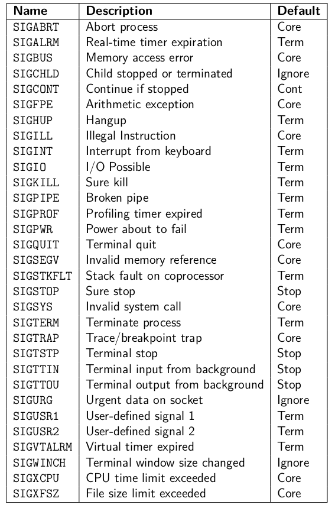

<!-- _paginate: false-->
<!-- _header: "" -->
<!-- _backgroundColor: #FCF3CF -->
<style scoped> h1, h2, h3, h4 {text-align: center;}
section {background-color: #FDEDEC;}
h1 {color:red} a:link {color: darkred;} p {text-align: center; font-size: 25px}</style>
<br/><br/><br/>
### Sistemi Operativi
### Unità 5: I processi
I Segnali
=======================
<br/><br/><br/>
[Martino Trevisan](https://trevisan.inginf.units.it/)
[Università di Trieste](https://www.units.it)
[Dipartimento di Ingegneria e Architettura](https://dia.units.it/)

---
## Argomenti

1. Concetto di segnale
2. Segnali in Linux
3. System Call `sigaction`
4. System Call `kill`
5. System Call `raise`
6. System Call `pause`
7. System Call `alarm`
7. Considerazioni
7. Segnali nella shell

---
## Concetto di segnale

In quasi tutti i sistemi ad elaboratore, esistono gli <r>interrupt</r>:
Un interrupt informa la CPU che deve interrompere il compito corrente per eseguire un'azione impellente
Un interrupt viene generato da:
- Un dispositivo hardware che vuole notificare al sistema un evento
- Particolari istruzioni nel codice (e.g., istruzione `INT`)
  - Quando un processo chiama una System Call genera un interrupt software

---
## Concetto di segnale

Un <r>segnale</r> permette la gestione di eventi asincroni che interrompono il normale funzionamento di un processo
- E' un interrupt software
- Notifica un evento a un processo specifico

Possono essere **generati** da
- Kernel per comunicare eventi eccezionali:
  - Condizioni di errore
  - Azioni dell'utente (e.g.,  `CTRL+C` su tastiera)
- Un altro processo (se ne ha i permessi):
  - Permettono una primitiva comunicazione tra processi
  - Usando la system call `kill`
 
---
## Concetto di segnale

Esistono dalle prime versioni di **Unix**
- Formalizzati in Unix 4

In principio erano inaffidabile e gestiti in modo *best-effort*
- Potevano andare perduti
- La gestione era complicata
- Poca configurazione possibile

I segnali esistono anche in **Windows**, sebbene abbiano un funzionamento leggermente diverso


---
## Segnali in Linux

Esistono diversi tipi di segnali in Linux
- Dipende dalle versioni di Linux
- Comando `kill -l` lista i segnali
  - 64 in Ubuntu 20

Ogni segnale ha un identificatore mnemonico e numerico
- Identificatori di segnali iniziano con i tre caratteri SIG
- Es. `SIGINT` è il segnale di interruzione e ha numero $2$  
- I nomi simbolici corrispondono ad un intero positivo ( `signal.h` )
  
---
## Segnali in Linux

Ogni segnale viene generato da un evento specifico nel SO, o *manualmente* da un processo.
Un segnale può avere i seguenti effetti su un processo:
- Viene ignorato
- Termina il processo
- Crea un <r>core dump</r>: un file che contiene lo stato del programma per poter essere debuggato
- Stoppa il processo
- Fa ripartire il processo


---
## Segnali in Linux


**Segnali ignorati di default:**
- `SIGCHLD`: inviato al padre quando un figlio termina

**Segnali che di default terminano il processo:**

- `SIGINT`: viene inviato al processo in esecuzione quando si preme `CTRL+C`
- `SIGABRT`: inviato da system call `abort()`
- `SIGFPE`: inviato da eccezione aritmetica
    

---
## Segnali in Linux 
  
- `SIGHUP`: Inviato ad un processo se il terminale viene disconnesso
- `SIGKILL`: Maniera sicura per uccidere un processo.
  **Nota**: Non si può creare un handler per `SIGKILL`
- `SIGSEGV`: Accesso di memoria non valido
- `SIGTERM`: Segnale di terminazione normalmente usato. Generato dal comando `kill` di default
- `SIGUSR1` e `SIGUSR2`: generati solo da processi utente, mai dal SO. Servono per comunicazione tra processi

---
## Segnali in Linux 

Lista più completa.
Il comportamento di default può essere modificato:
- Per ignorare un segnale
- Per *gestirlo* tramite un *handler*
- <r>NON</r> per indurre Terminazione o Core Dump
- Tranne `SIGKILL` e `SIGSTOP` 



---
## Segnali in Linux 

Un processo può definire un <r>signal handler</r>.
- Una funzione che viene eseguita quando il processo riceve il segnale
- Se non lo fa, c'è il comportamento di default 

*"Se e quando avviene un segnale, esegui questa funzione"*
  
  
---
## Segnali in Linux 

Fasi di vita di un segnale:
1. Generazione: da parte del kernel o di un processo
2. Consegna: nel più breve tempo possibile consegna il segnale al processo.
    - Finchè un segnale non è consegnato è *pending*
3. Gestione:
    - Il kernel avvia la funzione handler del processo nel caso ce ne sia una
    - Altrimenti compie l'azione di default per quel segnale (termina o ignora)

---
## Segnali in Linux 


**Osservazione:**
I segnali non vengono accodati.
I segnali pendenti per un processo sono una *mask*
- Se lo stesso segnale è generato più volte prima che sia consegnato, esso lo sarà una volta sola


---
## System Call `sigaction`

```c
#include <signal.h>
int sigaction(int signum, const struct sigaction *act,
              struct sigaction *oldact);
```
Modifica il comportamento del processo corrente a un segnale particolare
**Argomenti**:
- `signum`: segnale da trattare
- `act`: puntatore a struttura che definisce trattamento
- `oldact`: puntatore a comportamento precedente. Può servire per ristabilire il comportamento precedente

**Ritorna** -1 se c’è stato errore

---
## System Call `sigaction`

```c
struct sigaction {
    void   (* sa_handler )( int );
    sigset_t  sa_mask ;
    int       sa_flags ;
    void   (* sa_restorer )( void );
};
```
- `sa_handler` specifica il comportamente
  - Se funzione, specifica un handler
  - Se `SIG_IGN` ignora
  - Se `SIG_DFL` ripristina comportamento di default

---
## System Call `sigaction`

```c
struct sigaction {
    void   (* sa_handler )( int );
    sigset_t  sa_mask ;
    int       sa_flags ;
    void   (* sa_restorer )( void );
};
```

- `sa_mask`: segnali da bloccare mentre l'handler è in esecuzione
  Inizializzato da funzione di libreria `int sigemptyset(sigset_t *set);`
- `sa_flags`: flag (no vediamo)
- `sa_restorer`: per uso interno


---
## System Call `sigaction`
<!-- _backgroundColor: #FFF9E3 -->

**Esempio:** si crei una funzione per ignorare un segnale definito dal chiamante
```c
int ignoreSignal ( int sig )
{
    struct sigaction sa ;
    sa.sa_handler = SIG_IGN ;
    sa.sa_flags = 0;
    sigemptyset (&sa.sa_mask );
    return sigaction ( sig , &sa , NULL );
}
```

---
## System Call `sigaction`

La funzione handler deve prendere un argomento `int`
- Quando invocata dal SO, contiene il numero del segnale

E ritornare `void`

```c
void myHandler ( int sig )
{
    /* Actions to be performed when signal
    is delivered */
}
```

---
## System Call `sigaction`

Viene invocata automaticamente dal kernel alla consegna del segnale
Il programma si interrompe, esegue l'handler
Infine, continua l'esecuzione dal punto di interruzione


---
## System Call `sigaction`
<!-- _backgroundColor: #FFF9E3 -->
<small>

**Esempio:** si crei un programma che gestisce i segnali `SIGINT`, `SIGHUP` e `SIGTERM`


```c
#include 	<signal.h>
#include	<stdio.h>
void func(int signum)
{
  printf("ricevo %d\n", signum);
}
int main (void)
{
  struct sigaction new_action, old_action;                                           

  new_action.sa_handler = func;
  sigemptyset (&new_action.sa_mask); /* Si noti l'uso di sigemptyset */
  new_action.sa_flags = 0;

  sigaction (SIGINT, &new_action, NULL);
  sigaction (SIGHUP, &new_action, NULL);
  sigaction (SIGTERM, &new_action, NULL);

   while(1) ;
}
```
Per terminare il programma, bisogna mandargli un segnale `SIGKILL`.
`pkill -KILL <nome prog>`

</small>


---
## System Call `sigaction`

Esiste la System Call `signal`, più a basso livello.

```c
#include <signal.h>
typedef void (*sighandler_t)(int);
sighandler_t signal(int signum, sighandler_t handler);
```

Argomenti:
- `sig`: quale segnale gestire
- `handler` specifica il comportamento. E' puntatore a funzione.

<r>Nota:</r> consigliato usare `sigaction`


---
## System Call `kill`

<medium>

Spedisce un segnale ad un processo oppure a un gruppo di processi

```c
#include <sys/types.h>
#include <signal.h>
int kill(pid_t pid, int sig);
```

Argomenti:
- `sig`: segnale da mandare
- `pid`:
  - se `> 0`: spedito al processo identificato da pid
  - se `0`: spedito a tutti i processi appartenenti allo stesso gruppo del processo che invoca kill
  - se `0`: spedito al gruppo di processi identificati da –pid
  - se `-1`: non definito

</medium>


---
## System Call `sigaction`
<!-- _backgroundColor: #FFF9E3 -->

<small>

**Esercizio:** si crei un programma che genera un processo figlio. Il padre manda al figlio un segnale `SIGURS1` ogni secondo. Il figlio stampa l'avvenuta ricezione.

```c
#include <signal.h>
#include <stdio.h>
#include <unistd.h>

void handler(int signum){
  printf("Ricevuto\n");
}

int main (){
  pid_t pid;
  struct sigaction action;
  
  pid = fork();
  if (pid!=0){ /* Father */
    while(1){
        sleep(1);
        kill (pid, SIGUSR1);
    }
  } else{ /* Child */
    action.sa_handler = handler;
    sigemptyset (&action.sa_mask);
    action.sa_flags = 0;
    sigaction (SIGUSR1, &action, NULL);                                                      
    while (1);
  }
}
```

</small>


---
## System Call `raise`

```c
#include <signal.h>
int raise (int sig);
```
Permette a un processo di inviare un segnale a se stesso.
Di fatto:
```c
raise (sig)
```
equivale a:
```c
kill (getpid(), sig);
```

---
## System Call `pause`

```c
#include <unistd.h>
int pause (void);
```

Sospende il processo fino all’arrivo di un segnale
Serve a implementare l’attesa passiva di un segnale
Ritorna dopo che il segnale è stato catturato ed il gestore è stato eseguito, restituisce sempre (-1)

---
## System Call `alarm`

```c
#include <unistd.h>
unsigned int alarm (unsigned int seconds);
```

Implementa un timeout
Il SO manda un segnale `SIGALRM` al processo dopo `seconds` secondi

Se non vi era già un timeout settato, restituisce $0$
Altrimenti, restituisce i secondi che mancano allo scadere dell’ultimo allarme settato. Cancella il vecchio timeout e inserisce il nuovo
Se `seconds` è $0$, si disattiva il timeout

---
## System Call `alarm`

**Osservazioni:**
Il timeout è gestito dal kernel.
Il tempo effettivo può essere leggermente maggiore a causa del tempo di reazione del kernel

---
## System Call `alarm`

<!-- _backgroundColor: #FFF9E3 -->


**Esempio:** funzione `sleep` implementata con `alarm` e `pause`
```c
static void myAlarm (int signo) {
    return;
}
void mySleep (unsigned int nsecs) {
    signal(SIGALRM, myAlarm)
    alarm (nsecs);
    pause ();
}
```


---
## Considerazioni

Un handler è un flusso di esecuzione concorrente
- Può iniziare in qualsiasi istante
- Mentre il flusso principale sta compiendo qualsiasi azione

<r>Importante:</r>
L'handler non deve modificare variabili globali che sono usate anche dal flusso principale
- Potrebbe portare in stato inconsistente

---
## Considerazioni

<small>

**Esempio**:
- Il flusso principale legge un variabile globale, vi somma un valore e sovrascrive la variabile
  ```c
  1 int tmp = globalval;
  2 tmp = tmp + 10;
  3 globalval = tmp;
  ```
- L'hanlder fa la stessa operazione

Se il flusso principale viene interrotto alla riga `2` dal segnale, `globalval` viene incrementato di $10$, mentre dovrebbe essere incrementato di $20$
- Sia flusso principale che handler dovrebbero aver fatto un incremento di $10$
- Handler però ha letto `globalval` durante un incremento da parte del flusso principale

</small>

Problema che vedremo molto diffusamente in caso di programmi multi-thread

---
## Considerazioni

**Definizioni:**
**Funzione rientrante:** può essere usata con sicurezza in più flussi
**Funzione non rientrante:** <r>NON</r> può essere usata con sicurezza in più flussi

In generale, negli handler, bisogna:
- Chiamare solo funzioni rientranti
- Evitare di manipolare variabili globali che sono usate dal flusso principale.


---
## Considerazioni

La maggior parte delle funzioni di libreria C <r> </r>sono rientranti
- `printf`, `scanf`
- Non vanno chiamate dentro un handler!

Alcune funzioni sono rientranti e possono essere interrotte senza problemi:
- `read`, `write`, `sleep`, `wait`

**Nota:** un programma può ricevere un segnale mentre è eseguita una sua system call (e.g., `read`).
Il kernel interrompe la System Call ed esegue handler.
A seconda dei casi essa riprende dopo handler.


---
## Segnali nella shell

```bash
kill pid
```
Invia un segnale al processo `PID`.
Di default manda `SIGTERM`.
Possibile specificare con opzioni `-KILL` `-INT`

```bash
pkill nome
killall nome
```
Stesso comportamente, ma manda il segnale a tutti i processi del programma `nome`

---
## Segnali nella shell

<!-- _backgroundColor: #FFF9E3 -->


**Esercizio:** si scriva un programma in C che memorizza quanti `SIGTERM` ha ricevuto. Alla pressione di `CTRL+C` stampa tale numero e termina. Si nomini il programma `sample`.

Si scriva anche uno script bash che manda 10 segnali `SIGTERM` al processo.

**Programma Bash:**
```bash
for i in $( seq 5) ; do
    pkill sample
done
```


---
## Segnali nella shell

<!-- _backgroundColor: #FFF9E3 -->

<small>


```c
#include <signal.h>
#include <stdio.h>
#include <unistd.h>

int c;

void handler(int signum){
  if (signum==SIGTERM)
    c+=1;
  else if (signum==SIGINT){
    printf("Ricevuti %d SIGTERM\n", c);
    exit (0);
  }
}

int main (){
    struct sigaction action;
    c=0;
    action.sa_handler = handler;
    sigemptyset (&action.sa_mask);
    action.sa_flags = 0;
    sigaction (SIGTERM, &action, NULL);
    sigaction (SIGINT, &action, NULL);
                                                      
    while (1);
}
```

</small>


---
## Segnali nella shell

<!-- _backgroundColor: #FFF9E3 -->


<small>

Quando si preme `CTRL+C`, viene mandato un `SIGINT` al programma, che stampa `c` e termina

**Extra:** si faccia uno script bash che automatizza tutta la sequenza: avvio del programma in C, consegna segnali e chiusura.

```bash
./sample &
PID=$!
for i in $( seq 5) ; do
    kill $PID
done
kill -INT $PID
```
</small>

---
## Segnali nella shell

Se `CTRL+C`, viene inviato `SIGINT`
- Programma termina se non c'è un handler

Se `CTRL+Z` viene inviato `SIGTSTP`
- Di default l'applicazione viene sospesa
- E messa in background dalla shell
- A questo punto:
  - `fg` fa riprendere l'esecuzione in foreground
  - `bg` far riprendere l'esecuzione in background

---
## Segnali nella shell

**Molto utile** se ho lanciato un comando lungo e voglio usare la shell mentre esegue  
```bash
$ ./longjob
^Z
[1]+  Stopped                ./longjob
$ bg
[1]+ ./longjob &
$ terminale libero
```

---
## Segnali nella shell

<medium>

Quando eseguo un programma in background (`./job &`) e chiudo il terminale, viene mandato il segnale di Hang Up `SIGHUP`
- Di default il programma viene terminato
- Si può modificare comportamento

Oppure uso il comando `nohup` che esegue un comando immune a `SIGHUP`
``` bash
nohup ./job
```
Utile se lancio job su terminale remoto e devo andare a casa!
**Alternativa più pulita**: comando `screen` che genera terminale virtuale

</medium>

---
## Segnali nella shell

Handler di segnali in script bash
```bash
trap command SIGNAL
```
Esegue il comando o la funzione `command` se lo script riceve il segnale `SIGNAL`
Esiste lo pseudo-segnale aggiuntivo `EXIT`, chiamato quando lo script termina

**Esempio tipico:**
```bash
tempfile=/tmp/tmpdata
trap "rm -f $tempfile" EXIT
```


---
## Segnali nella shell

<!-- _backgroundColor: #FFF9E3 -->

<small>

**Esercizio:** si crei un programma bash che conta quanti SIGUSR2 riceve, e li stampa quando viene premuto `CTRL+C` e lo si nomini `sample.sh`

```bash
#!/bin/bash

count=0
function husr(){
    let count++
}
function hint(){
    echo "Ricevuti $count SIGUSR2"
    exit 0
}

trap husr SIGUSR2
trap hint SIGINT

while true; do
    sleep 1
done
```


Si inviino i segnali col comando: `bash pkill -USR2 sample.sh`
<r>Nota:</r> dichiarazione di funzione in Bash
</small>


---
## Domande

<!-- _backgroundColor: #FFF9E3 -->

<small>

Quale System Call si usa per generare un segnale?
`• signal` `• kill` `• write`  `• send` 

Una funzione handler riceve degli argomenti?
`• No` `• Riceve una stringa` `• Riceve un intero`

Quale è il comportamento di default di un processo quando riceve un segnale?
`• Il segnale viene ignorato` `• Il processo termina` `• Dipende dal segnale` 

Un signal handler può modificare le variabili globali del processo?
`• Si` `• No` 

Quale segnale viene inviato dal SO quando si preme `CTRL+C` sulla tastiera?
`• SIGKILL` `• SIGINT` `• SIGHUB` `• SIGSTP` 

</small>


