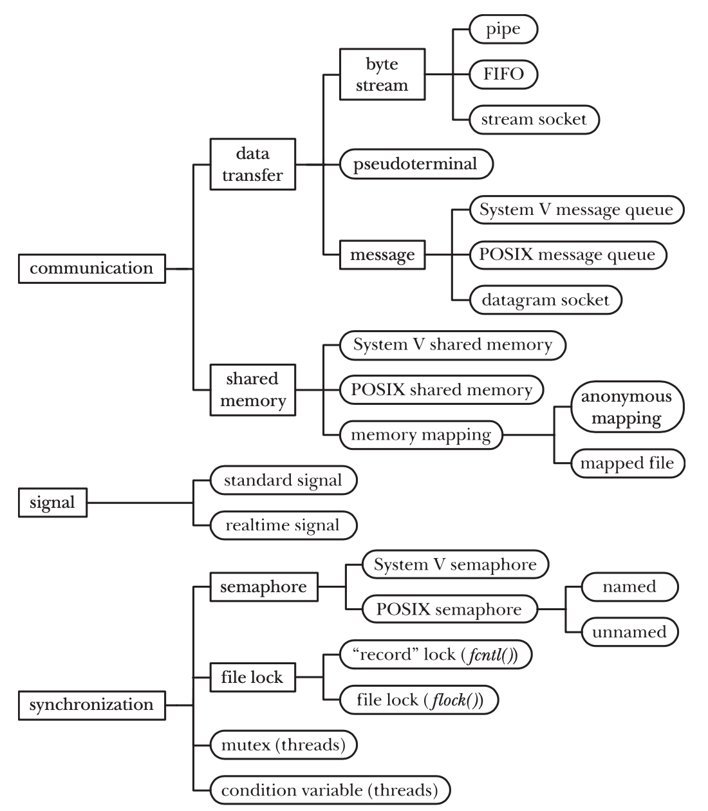
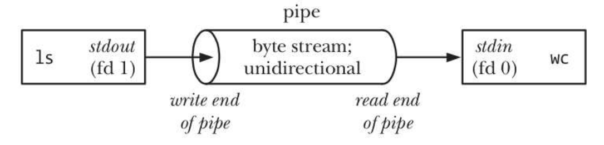
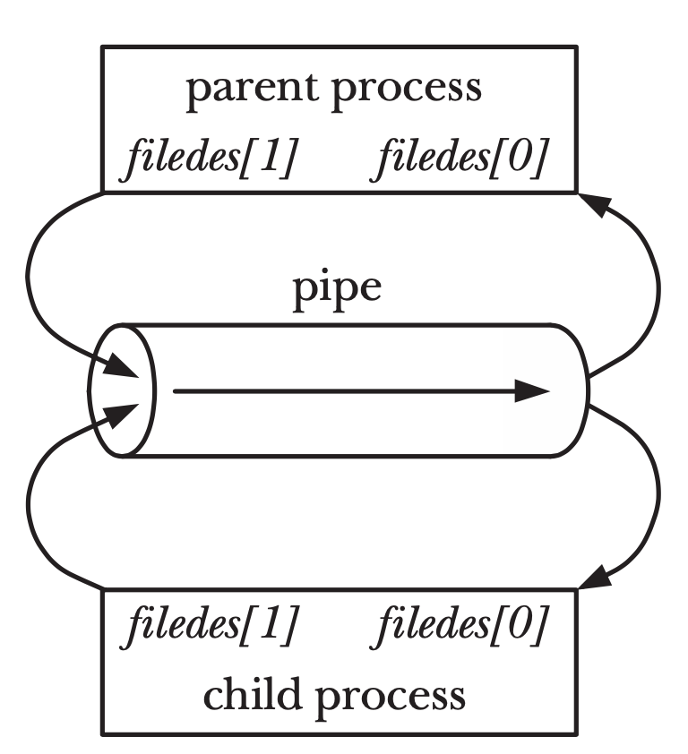
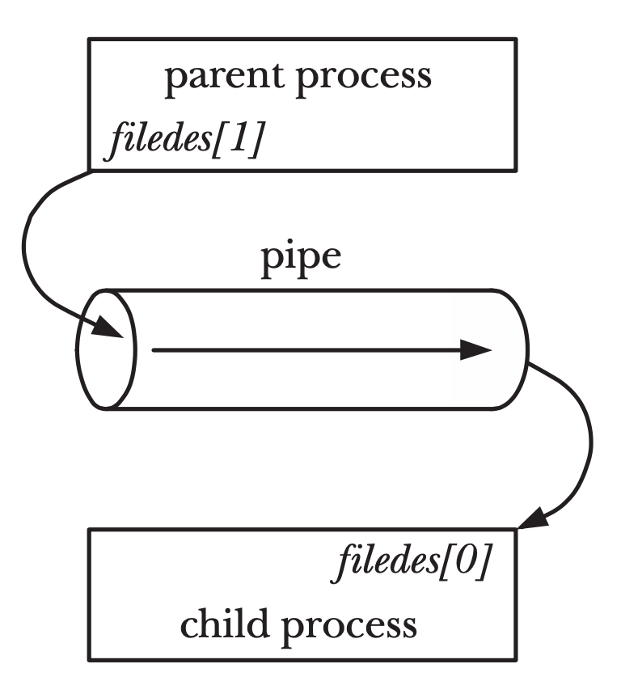
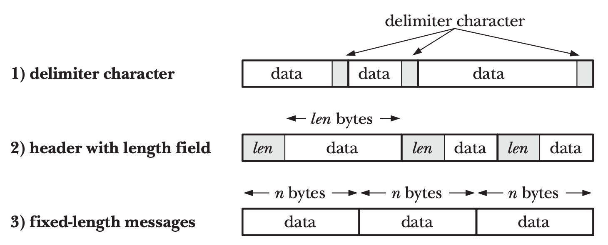
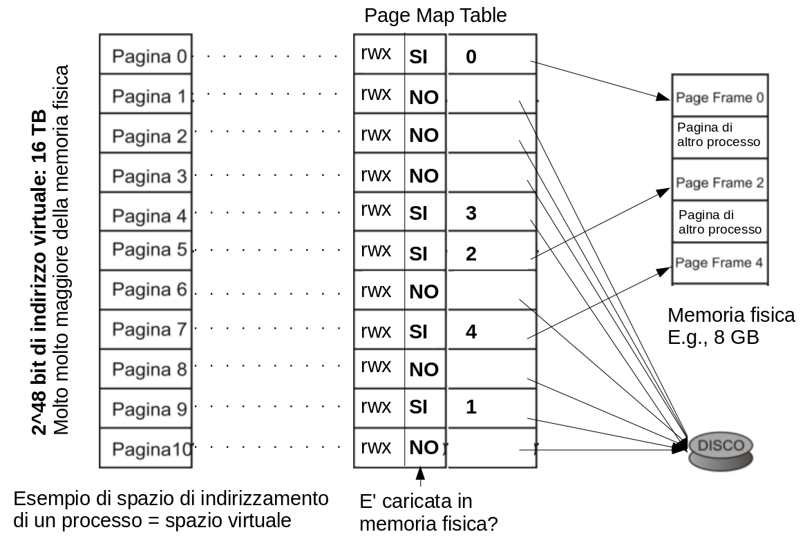
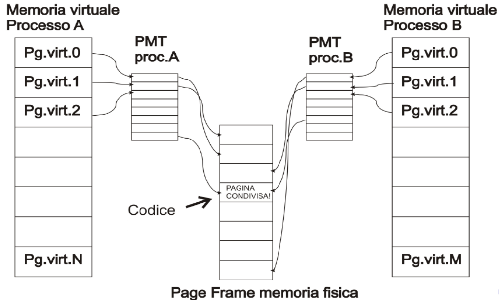
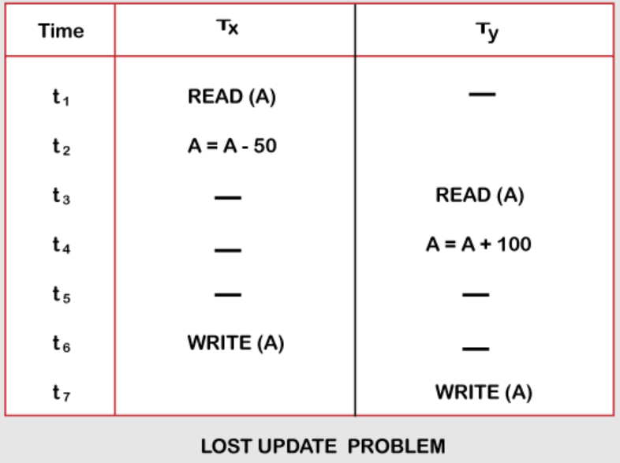

<!-- _paginate: false-->
<!-- _header: "" -->
<!-- _backgroundColor: #FCF3CF -->
<style scoped> h1, h2, h3, h4 {text-align: center;}
section {background-color: #FDEDEC;}
h1 {color:red} a:link {color: darkred;} p {text-align: center; font-size: 25px}</style>
<br/><br/><br/>
### Sistemi Operativi
### Unità 5: I processi
Inter-Process Communication
=======================
<br/><br/><br/>
[Martino Trevisan](https://trevisan.inginf.units.it/)
[Università di Trieste](https://www.units.it)
[Dipartimento di Ingegneria e Architettura](https://dia.units.it/)

---
## Argomenti

1. Obbiettivi
2. Le *pipe*
3. Le *FIFO*
4. Cenni di memoria virtuale
5. Memoria condivisa con `shmget`
6. Memoria condivisa con `mmap`
7. Problematiche

---
# Obbiettivi

---
## Obbiettivi

In un sistema dotato in SO, diversi processi sono in esecuzione contemporaneamente.
Essi possono essere classificati in:
- **Processi indipendenti**: non sono influenzati né influenzano altri processi
- **Processi cooperanti**: interagiscono con altri processi. Devono usare meccanismi opportuni per farlo

---
## Obbiettivi

Tutti i SO mettono a disposizione strumenti per la <r>Inter-Process Communication</r>
Sono tipicamente basati su:
- **Scambio di messaggi**
- **Scambio di dati** 
- **Memoria condivisa** 

---
## Obbiettivi
Ogni SO utilizza meccanismi diversi.

In Linux, ci sono tanti meccanismi.
- Storicamente stratificati
- Ereditati da System V
- Parte di standard POSIX



---
## Obbiettivi

Noi vediamo:
- **Scambio di messaggi:** Segnali (già visto)
- **Scambio di dati:** *Pipe* e *FIFO*
- **Memoria condivisa:** utilizzo di System Call `shmget` e `mmap`


---
# Le *pipe*

---
## Le *pipe*

Le *pipe* sono la più vecchia e la più usata forma di IPC introdotta in Unix
- Permettono di scambiare dati tra processi
- Modello **produttore-consumatore**
- Si usano con le stesse System Call dei file: `read`, `write`
- Risiedono in memoria
- Non sono persistenti: quando i processi terminano, tutto ciò che rimane viene distrutto

---
## Le *pipe*

**Limitazioni:**
- Sono half-duplex (comunicazione in un solo senso)
- Utilizzabili solo tra processi con un "antenato" in comune

**Come superare queste limitazioni?**
- Le *FIFO* (o *named pipe*) possono essere utilizzati tra più programmi
  - Si identificano tramite un nome


---
## Le *pipe*

<medium>

Le *pipe* sono comunemente usate nella shell, per redirezionare gli `stdout` e `stdin`.
**Esempio:**
```
ls | wc -l
```

Per fare questa operazione, la shell:
- Usa due `fork` e `exec` per creare io processi `ls` e `wc`
- Crea una *pipe* per connettere lo `stdout` di `ls` con lo `stdin` di `wc`


</medium>

---
## Le *pipe*
<medium>

**Definizione:**
Le pipe sono un **byte stream**
- Vi si scrivono/leggono byte
- Non solo caratteri stampabili

Sono **unidirezionali**:
- Hanno un ingresso e una uscita

Hanno **capacità limitata**:
- I dati accodati (scritti ma non ancora letti) non possono eccedere una soglia
- Soglia configurabile: 65 KB di default
  - Si può variare con `fcntl(fd, F_SETPIPE_SZ, size)`
</medium>


---
## Le *pipe*

**Creazione:**
```c
#include <unistd.h>
int pipe (int filedes [2]);
```

Ritorna due descrittori di file  attraverso l'argomento fd (passato per riferimento)
- `fd[0]` è aperto in lettura
- `fd[1]` è aperto in scrittura
- L'output di `fd[0]` è l'input di `fd[1]`


---
## Le *pipe*

**I/O su *pipe*:**
Si usano le funzioni `read` e `write`
- Il valore di ritorno è il numero di byte scritti/letti

**Lettura**:
- La `read` è bloccante finchè non è letto almeno un byte

**Scrittura**:
- Se la *pipe* è piena, la `write` è bloccante

---
## Le *pipe*

**Nota:** se scrivo su una *pipe* che non ha un *reader* (`fd[0]` è stato chiuso), il processo riceve il segnale `SIGPIPE` (*broken pipe*)
Teminazione del processo, se non c'è un **Signal Handler** opportuno

---
## Le *pipe*

**Condivisione tra processi:**
Per utilizzare una pipe tra più processi:
- Il processo padre crea la pipe e ottiene i due `fd`
- Esso fa una `fork`
- Entrambi i processi possono accedere alla *pipe* usando i due `fd`




---
## Le *pipe*

**Chiusura di una pipe:**
- Solitamente un processo (e.g., padre) scrive, e un altro (e.g., figlio) legge
- Tecnicamente possibile che un processo legga e scriva
  - Crea però problemi di sincronizzazione
- Ogni processo chiude i `fd` che non usa
  


---
## Le *pipe*

<!-- _backgroundColor: #FFF9E3 -->

**Esempio:**
```c
int pfd [2] ;
pipe ( pfd ); /* Crea la pipe */
switch ( fork () ) {
case -1: exit(1);
case 0:
    /* Child */
    close ( pfd [1]);
    /* Può ora leggere */
    break ;
default :
    /* Parent */
    close ( pfd [0]);
    /* Scrive nella pipe */
    break ;
}
```

---
## Le *pipe*

**Chiusura di una pipe:**
La `read` blocca finchè non viene letto almeno 1 byte
Se la `read` ritorna $0$, vuol dire che non c'è nessun `fd` aperto in scrittura
- La *pipe* è morta


---
## Le *pipe*
### Messaggi su pipe

Ci sono diverse strategie per scambiare messaggi tramite *pipe*




---
## Le *pipe*

<!-- _backgroundColor: #FFF9E3 -->
<small>

**Esercizio:** si crei un programma che con due processi. Il processo padre riceve una stringa da riga di comando e la passa al figlio tramite una *pipe*. Il figlio riceve la stringa e la stampa.

```c
#include <unistd.h>
#include <stdlib.h>
#include <stdio.h>
#include <sys/wait.h>
#define MAXLINE 1024

int main(int argc, char *argv[])
{
	int pfd[2], status;
	char line[MAXLINE];
	
	pipe(pfd);
	if (fork() > 0) { /* Padre */
		close(pfd[0]);
		write(pfd[1], argv[1], strlen(argv[1]));                           
		wait(&status);
	} else { /* Figlio */
		close(pfd[1]);
		read(pfd[0], line, MAXLINE);
		printf("Ricevuto: %s\n", line);
	}
	exit(0);
}
```

</small>


---
## Le *pipe*

<!-- _backgroundColor: #FFF9E3 -->
<small>

**Esercizio:** si crei un programma con due processi. Il processo padre riceve il nome di un file da riga di comando e ne passa il contenuto al figlio tramite una *pipe*. Il figlio riceve il contenuto e lo stampa.

```c
#include <stdio.h>
#include <string.h>
#include <stdlib.h>
#include <unistd.h>
#include <sys/wait.h>
#define MAXSIZE 1000

int main(int argc, char * argv[]){
    int pfd[2], status;   
    
    pipe(pfd);
    if(fork()>0){
        close(pfd[0]);
        FILE * fp;
        char line[MAXSIZE];

        fp=fopen(argv[1],"r");
        while(fgets(line,sizeof(line),fp)!=NULL) /* Itera riga per riga*/
           write(pfd[1],line,sizeof(line));      /* Scrive nella pipe */
        close(pfd[1]);
        wait(&status);
        exit(0);
    }
    else {
        char buffer [MAXSIZE];
        close(pfd[1]);
        while (read(pfd[0],buffer,sizeof(buffer)) > 0)  /* Quando read ritorna 0, la pipe è morta*/             
        exit(0);
    }
}
```

</small>


---
# Le *FIFO*

---
## Le *FIFO*

**Pipe "normali"**
- Possono essere utilizzate solo da processi che hanno un "antenato" in comune
- Motivo: unico modo per ereditare descrittori di file

**Named pipe o *FIFO***
- Permettono a processi non collegati di comunicare
- Utilizzano il file system per "dare un nome" alla pipe
- Le *FIFO* sono un tipo di file
  - La macro `S_ISFIFO` dopo una `stat` restituirà `true`
- La procedura per creare un fifo è simile alla procedura per creare file

---
## Le *FIFO*

```c
#include <sys/types.h>
#include <sys/stat.h>
int mkfifo(const char *path, mode_t mode);
```

Crea un *FIFO* dal `pathname` specificato
Argomento `mode` funziona come nella `open` (`O_RDONLY`, `O_WRONLY`, `O_RDWR`, etc.)
Valore di ritorno: $0$ se successo, $-1$ se errore

**Utilizzo:**
Come file e *pipe*: tramite `read` e `write`
Ogni processo che ha i permessi per `pathname` può usarla


---
## Le *FIFO*

**Apertura:**

<medium>

File aperto senza flag `O_NONBLOCK`
- Se il file è aperto in lettura, la chiamata si blocca fino a quando un altro processo non apre il FIFO in scrittura
- Se il file è aperto in scrittura, la chiamata si blocca fino a quando un altro processo non apre il FIFO in lettura

File aperto con flag `O_NONBLOCK`
- Se il file è aperto in lettura, la chiamata ritorna immediatamente
- Se il file è aperto in scrittura, e nessun altro processo è stato aperto in lettura, la chiamata ritorna un messaggio di errore

</medium>


---
## Le *FIFO*

**Input/Output:**
Con `read` e `write`
I dati nella *FIFO* sono bufferizzati dal kernel

**Importante:**
Una *FIFO* ha un pathname ma è solo un espediente per permettere a diversi processi di accedervi
Quando un *FIFO* viene chiusa (o i processi terminano) il nome del file persiste nel file system, ma esso non contiene alcun dato

---
## Le *FIFO*

Si possono creare e usare le *FIFO* in Bash in maniera semplice:
```bash
mkfifo myfifo
tr 'aeiou' 'AEIOU' < myfifo &
man 2 pipe > myfifo
```

---
## Le *FIFO*

<!-- _backgroundColor: #FFF9E3 -->
<verysmall>

**Esercizio:** si crei un programma che legge da una FIFO e stampa il contenuto in maiuscolo.

```c
#include <stdio.h>
#include <ctype.h>
#include <sys/stat.h>
#include <string.h>
#include <stdlib.h>

int main(int argc, char * argv[]){
    int i, n, l;
    FILE * f;
    char buffer[512];
    
    i = mkfifo("myfifo", S_IRWXU);
    if (i<0){
        printf("Impossible creare la FIFO\n"); /* Potrebbe già esistere */
    }
   
    f = fopen("myfifo", "r");
    if (f==NULL){
        printf("Impossible aprire la FIFO\n");
        exit(1);     
    }
    while(fgets(buffer,sizeof(buffer),f)!=NULL){
        l = strlen(buffer);
        for (i=0; i<l; i++)
            putc(toupper(buffer[i]), stdout);   
    }
}
```
La si testi con: `echo "ciao mondo" > myfifo`
</verysmall>

---
# Cenni di memoria virtuale

---
## Cenni di memoria virtuale

I processi emettono indirizzi virtuali
- Permettono di indirizzare più memoria di quella disponibile
  - Su architettura AMD64: 48bit; 256TB di memoria virtuale. La memoria fisica è di solito minore (e.g., 16 GB)
- Evitano che un processo acceda a memoria di altri

La memoria è divisa in <r>pagine</r> e una tabella mappa le pagine da spazio di indirizzi virtuali a indirizzi fisici
- Azione compiuta dalla <r>Memory Management Unit</r> in Hardware
  - Il sistema operativo interviene a collocare pagine in memoria


---
## Cenni di memoria virtuale




---
## Cenni di memoria virtuale

Ogni processo ha uno spazio di indirizzi virtuali dedicato
- C'è una tabella delle pagine per processo
- Isolamento della memoria tra processi
  - Essenziale per sicurezza
  - Non permette la condivisione di memoria
  
Per condividere la memoria, è necessario condividere una o più pagine
- Il SO mette a disposizione delle System Call per questo scopo

---
## Cenni di memoria virtuale





---
## Cenni di memoria virtuale

Esistono due set di System Call per avere memoria condivisa tra processi in Linux:
- `shmget shmat shmdt ftok`
- `mmap munmap shm_open shm_unlink`

L'approccio con `mmap` è più moderno e flessibile

In Windows si usa la System Call `CreateFileMapping`


---
# Memoria condivisa con `shmget`

---
## Memoria condivisa con `shmget`

<small>

```c
#include <sys/shm.h>
int shmget(key_t key, size_t size, int shmflg);
```

Crea un segmento di memoria condivisa.
Argomenti:
- `key`: identificativo definito dall'utente. Usare `IPC_PRIVATE` se anonimo (usato solo con  `fork`)
- `size`: dimensione della memoria condivisa
- `shmflg`: flag e permessi. `IPC_CREAT` crea se non esistente.
  - Uso tipico `IPC_CREAT | 0666`

Valore di ritorno:
- Un identificativo della zona create
- $-1$ se insuccesso

</small>

---
## Memoria condivisa con `shmget`


<small>

```c
#include <sys/shm.h>
void *shmat(int shmid, const void *shmaddr, int shmflg);
```

Mappa il segmento di memoria virtuale nello spazio degli indirizzi del processo.
Argomenti:
- `shmid`: identificativo ritornato da `shmget`
- `shmaddr`: se non nullo, la memoria viene mappata a `shmaddr` (arrodondato per difetto al *page size*)
- `shmflg`: flag. `SHM_RDONLY` mappa in Read Only

Valore di ritorno:
- L'indirizzo virtuale del segmento mappato
- $-1$ se insuccesso

</small>

---
## Memoria condivisa con `shmget`


<medium>

```c
#include <sys/shm.h>
int shmdt(const void *shmaddr);
```

Rimuove in mapping del segmento all'indirizzo virtuale `shmaddr`

Valore di ritorno:
- $0$ in caso di successo
- $-1$ se insuccesso

</medium>


---
## Memoria condivisa con `shmget`


<small>

```c
#include <sys/ipc.h>
key_t ftok(const char *pathname, int proj_id);
```

Crea una `key` a partire da un path, garantendo che:
- Due path daranno sempre chiavi diverse
- Stesso path e stesso `proj_id` darà sempre chiavi uguali 
- Evita che programmi diversi che per sfortuna hanno scelto stessa chiave usino la stessa memoria

Argomenti:
- `pathname`: il path
- `proj_id`: usato per creare la `key`. Non deve essere nullo.


Valore di ritorno:
- $key$ in caso di successo
- $-1$ se insuccesso

</small>

---
## Memoria condivisa con `shmget`

**Utilizzo:** Memoria condivisa con figlio creato tramite `fork`
```c
int shmid = shmget(IPC_PRIVATE, 1*sizeof(int), IPC_CREAT | 0666);
void * shm = shmat(shmid, NULL, 0);
if (fork()){ /* Padre */
    ...
} else { /* Figlio */
    ...
}
shmdt(shm);
```

---
## Memoria condivisa con `shmget`

**Utilizzo:** Memoria condivisa tra due processi indipendenti
- Proceso creatore
    ```c
    key_t key = ftok(path, proj ));
    int shmid = shmget(key, size, IPC_CREAT | 0666));
    void * data = shmat(shmid, NULL, 0);
    ...
    shmdt(data);
    ```
- Proceso utilizzatore
    ```c
    key_t key = ftok(path, proj ));
    int shmid = shmget(key, size, 0666));
    void * data = shmat(shmid, NULL, 0);
    ...
    shmdt(data);
    ```


---
## Memoria condivisa con `shmget`

<!-- _backgroundColor: #FFF9E3 -->
<small>

**Esercizio:** Si creino due programmi che hanno una memoria condivisa con `shmget`.
Il primo programma permette di scrivere una stringa nella memoria, mentre il secondo permette di leggerla.
**Programma 1:**
```c
#include <sys/ipc.h>
#include <sys/shm.h>
#include <stdio.h>
#include <stdlib.h>
int main(){
    key_t key = ftok("test",123);
    if (key <0){printf("Errore. Il file per la chiave esiste?"); exit(1);}
    printf("Key: %d\n", key);
    
    int shmid = shmget(key,1024,0666|IPC_CREAT);
    char *str = (char*) shmat(shmid,(void*)0,0);
    while(1){
        printf("Input Data : ");
        scanf(" %s", str);
    }      
    shmdt(str);
    return 0;
}
```

</small>

---
## Memoria condivisa con `shmget`

<!-- _backgroundColor: #FFF9E3 -->
<small>

**Programma 2:**

```c
#include <sys/ipc.h>
#include <sys/shm.h>
#include <stdio.h>
#include <stdlib.h>
int main(){
    key_t key = ftok("test",123);
    if (key <0){printf("Errore. Il file per la chiave esiste?"); exit(1);}
    printf("Key: %d\n", key);

    int shmid = shmget(key,1024,0666|IPC_CREAT);  
    char *str = (char*) shmat(shmid,(void*)0,0);
    while(1){
        printf("Premi enter per leggere");
        getchar();
        printf("Data: %s\n\n", str);
    }  

    shmdt(str);
    return 0;
}
```
</small>

---
# Memoria condivisa con `mmap`

---
## Memoria condivisa con `mmap`

<small>

```c
#include <sys/mman.h>
void *mmap(void *addr, size_t length, int prot, int flags,
          int fd, off_t offset);
```

Crea una zona di memoria condivisa.

Argomenti:
- `addr`: se non nullo, la memoria viene mappata a `addr` (arrodondato per difetto al *page size*)
- `length`: dimensione
- `prot`: può essere: `PROT_READ`, `PROT_WRITE`, `PROT_EXEC`, `PROT_NONE`
  - Cioè la pagina può essere letta, scritta, eseguita, non può essere acceduta
  - Normalmente `prot = PROT_READ|PROT_WRITE`
- `flags` determina come i cambiamenti sono visibili o meno ad altri processi 
  - `MAP_ANONYMOUS, MAP_SHARED, MAP_PRIVATE`
  - Normalmente `flags=MAP ANONYMOUS | MAP SHARED`
- `fd offset` sono usati per mappare la memoria su un file
</small>

---
## Memoria condivisa con `mmap`

<medium>

```c
#include <sys/mman.h>
void *mmap(void *addr, size_t length, int prot, int flags,
          int fd, off_t offset);
```

Valore di ritorno:
- L'indirizzo virtuale del segmento mappato
- $-1$ se insuccesso

<br>

```c
int munmap(void *addr, size_t length);
```

Rimuove la mappatura e rende disponibile la memoria all'indirizzo `addr`

</medium>


---
## Memoria condivisa con `mmap`

<medium>

**Utilizzo:** ci sono tre modi per usare la `mmap`
1. Zona di memoria anonima: utilizzata con `fork`
    ```c
    mmap(NULL, size, PROT_READ|PROT_WRITE, MAP_SHARED|MAP_ANONYMOUS, -1, 0);
    ```
2. Zona di memoria mappata su file:
    ```c
    fd = open("/home/martino/file.txt", O_RDWR|O_CREATE);
    mmap(NULL, size, PROT_READ|PROT_WRITE, MAP_SHARED, fd, 0);
    ```
3. Zona di memoria mappata su file temporaneo:
    ```c
    fd = shm_open("temporaneo.txt", "rw");
    mmap(NULL, size, PROT_READ|PROT_WRITE, MAP_SHARED, fd, 0);
    ```

</medium>

---
## Memoria condivisa con `mmap`

**1. Zona di memoria anonima:**
- La zona di memoria non ha un nome
- Solo un figlio nato con una `fork` può accedervi
- Semplicissimo da usare

```c
void* shmem = mmap(NULL, size, PROT_READ | PROT_WRITE,
                   MAP_SHARED | MAP_ANONYMOUS, -1, 0);

if (fork()){ /* Padre */
    ...
} else { /* Figlio */
    ...
}
munmap(shmem, size);
```

---
## Memoria condivisa con `mmap`

**2. Zona di memoria mappata su file:**
- Si usa un file come contenitore
- Il contenuto della zona condivisa verrà salvato su file
- Più programmi possono accedere alla memoria condivisa
  - Il path va identificatore
- Efficace ma lento a causa del disco

---
## Memoria condivisa con `mmap`

**2. Zona di memoria mappata su file:**

E' necessario che il file sia grande a sufficienza per contenere la regione mappata

```c
#include <unistd.h>
int truncate(const char *path, off_t length);
int ftruncate(int fd, off_t length);
```

Assicura che il file aperto `fd` o il file `path` si lungo almeno `length`.
- Se necessario il file è troncato
- Se necessario esteso e riempito con caratteri `'\0'` (o `0X00` in hex).

---
## Memoria condivisa con `mmap`

**2. Zona di memoria mappata su file:**
Flusso tipico:

```c
fd = open(path, O_RDWR|O_CREATE); /* Non è una fopen()*/
ftruncate(fd, size);
void* shmem = mmap(NULL, size, PROT_READ|PROT_WRITE,
                   MAP_SHARED, fd, 0);
...
munmap(shmem, size);
```


---
## Memoria condivisa con `mmap`

**3. Zona di memoria mappata su file temporaneo**
- A volte è necessario avere un file temporaneo identificabile
  - Per utilizzo da parte di più programmi
- Una zona di memoria mappata su file è inutilmente lenta
  - Se non è necessario che i dati della zona di memoria sopravvivano

Si possono utilizzare le funzioni `shm_open` e `shm_unlink`
- Creano e rimuovono un file temporaneo
- Che si trova nella cartella `/dev/shm/` che ha montato un FS temporaneo (`tmpfs`)
- I dati sono **in memoria**

---
## Memoria condivisa con `mmap`

**3. Zona di memoria mappata su file temporaneo**
```c
#include <sys/mman.h>
int shm_open(const char *name, int oflag, mode_t mode);
int shm_unlink(const char *name);
```

Creano e rimuovono zone di memoria temporanee.
- Semantica analoga a `open` e `unlink`
- Operano su zone di memoria/file temporanee
- `name` è un nome di file, non un path completo
  - Tutte le zone di memoria sono file sotto `/dev/shm/`


---
## Memoria condivisa con `mmap`

**3. Zona di memoria mappata su file temporaneo**
Flusso tipico
```c
int fd = shm_open(nome, O_RDWR, 0);
ftruncate(fd, size);
void * mem = mmap(NULL, size,  PROT_READ | PROT_WRITE,
                  MAP_SHARED, fd, 0);
...
munmap(shmem, size);

/* Non obbligatorio */
shm_unlink(nome)
```


---
## Memoria condivisa con `mmap`

<!-- _backgroundColor: #FFF9E3 -->
<small>

**Esercizio:** Si creino due programmi che hanno una memoria condivisa con `mmap` e `shm_open`.
Il primo programma permette di scrivere una stringa nella memoria, mentre il secondo permette di leggerla.
**Programma 1:**
```c
#include <stdio.h>
#include <stdlib.h>
#include <unistd.h>
#include <sys/mman.h>
#include <fcntl.h>  /* Per O_RDWR */
int main(){
    int fd;
    char * mem;
    
    fd = shm_open("mymem",  O_RDWR | O_CREAT, S_IRUSR | S_IWUSR);
    ftruncate(fd, 512); 
    mem = (char *) mmap(NULL, 512, PROT_READ | PROT_WRITE, MAP_SHARED, fd, 0);
    while(1){
        printf("Scrivere: ");
        scanf("%s", mem);
    }      
    munmap(mem, 512); /* Inutile causa loop infinito*/
}
```

</small>

---
## Memoria condivisa con `mmap`

<!-- _backgroundColor: #FFF9E3 -->
<small>

**Programma 2:**

```c
#include <stdio.h>
#include <stdlib.h>
#include <unistd.h>
#include <sys/mman.h>
#include <fcntl.h>  /* Per O_RDWR */
int main(){
    int fd;
    char * mem;
    
    fd = shm_open("mymem",  O_RDWR | O_CREAT, S_IRUSR | S_IWUSR);
    ftruncate(fd, 512);
    mem = (char *) mmap(NULL, 512, PROT_READ | PROT_WRITE, MAP_SHARED, fd, 0);  
    while(1){
        printf("Premi enter per leggere");
        getchar();
        printf("Data: %s\n\n", mem);
    }  
    munmap(mem, 512);
}
```
<r>Nota:</r> Compilare con `gcc prog.c -lrt -o prog`
Include `librt, libposix4 - POSIX.1b Realtime Extensions library`
</small>

---
# Problematiche

---
## Problematiche

L'utilizzo della memoria condivisa è complesso
- Preferire le *pipe* o *FIFO* quando possibile

La memoria condivisa ha problemi di sincronizzazione e *race conditions*
- Processi concorrenti possono leggere dati in stato inconsistente
- Mentre un'altro processo li stava modificando
- Come abbiamo già visto coi segnali


---
## Problematiche

**Esempio:** 



La variabile $A$ viene incrementata di $100$.
- Il decremento di $50$ viene perso


---
## Problematiche

Per ovviare a questi problemi esistono le <r>tecniche di sincronizzazione</r>
- Permettono di evitare che un processo sia interrotto mentre effettua un'operazione critica
- Permettono a un processo di attendere il verificarsi di una condizione

**Vedremo più avanti**


---
## Domande

<!-- _backgroundColor: #FFF9E3 -->

<small>

Le *pipe* sono
`• Monodirezionali` `• Bidirezionali` `• Dipende dai parametri di creazione` 

Le *pipe* sono identificate da un nome?
`• Si` `• No`

Le *FIFO* sono identificate da?
`• Un ID numerico` `• Una stringa``• Un Path`

<br>

Si consideri il seguente codice C che opera sulla FIFO `myfifo`:
```c
int n;
FILE * f = fopen("myfifo", "r");
fscanf (f, "%d", &n);
```
Che operazione compie?
`• Crea la FIFO myfifo`
`• Scrive un intero in myfifo`
`• Legge un intero da myfifo`

</small>


---
## Domande

<!-- _backgroundColor: #FFF9E3 -->

<small>

Una zona di memoria condivisa creata tramite `shmget` e `shmat` può essere condivisa anche tra processi senza legami di parentela?
`• Si` `• No` 

Le funzioni `shmat` e `mmap` hanno valore di ritorno:
`• char *` `• int` `• int*` `• void*` `• void`

<br>

Si consideri il seguente spezzone di codice:
```c
int fd = open("/tmp/mymem", O_RDWR|O_CREATE);
ftruncate(fd, 64);
void* shmem = mmap(NULL, size, PROT_READ|PROT_WRITE, MAP_SHARED, fd, 0);
sprintf( (char*)shmem, "Ciao Mondo!");
```
Dopo che il programma è terminato, il contenuto della zona di memoria presiste?
`• Si, in memoria` `• Si, nel file /tmp/mymem` `• No` 


</small>


