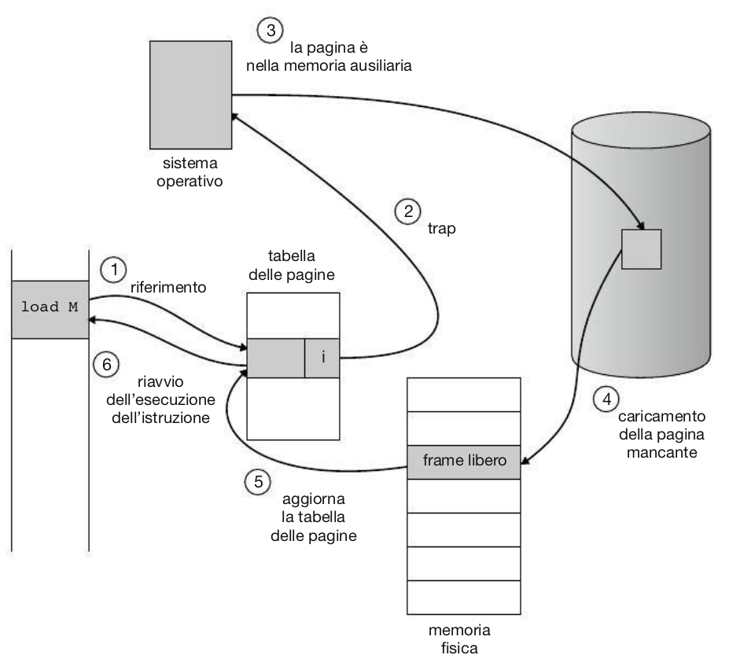

<!-- _paginate: false-->
<!-- _header: "" -->
<!-- _backgroundColor: #FCF3CF -->

   
### Sistemi Operativi
### Unità 6: La memoria
Organizzazione delle memoria
============================
   
[Martino Trevisan](https://trevisan.inginf.units.it/)
[Università di Trieste](https://www.units.it)
[Dipartimento di Ingegneria e Architettura](https://dia.units.it/)

---
## Argomenti

1. Memoria nei sistemi ad processore
2. Approcci storici
3. La memoria virtuale
4. Rimpiazzamento delle pagine
5. Layout della memoria
6. Loader, librerie e pagine condivise
7. Gestione della memoria in Bash

---
# Memoria nei sistemi ad processore

---
## Memoria nei sistemi ad processore

I sistemi ad processore possiedono molte *memorie*

---
## Memoria nei sistemi ad processore

Il compito del SO è gestire l'utilizzo della memoria da parte dei processi, con gli obbiettivi di:
- Alte prestazioni: usare la memoria più veloce possibile
- Isolamento tra processi: evitare problemi di sicurezza e stabilità
- Facilita per il programmatore: si vorrebbe che il SO fosse *trasparente* per chi programma

---
# Approcci storici

---
## Approcci storici

Inizialmente, non vi era SO: l'elaboratore eseguiva un programma per volta
- Un programma poteva accedere a qualsiasi locazione di memoria

Nei primissimi SO, era ancora così
- Il SO aveva il compito di sostituire l'intera memoria ad ogni *Context Switching*

---
## Approcci storici
### Approccio a Sostituzione totale

Un SO che sostituisce completamente la memoria principale del programma in esecuzione**

---
## Approcci storici
### Approccio Base e Limit

- Più processi condividono la memoria
- Hanno il permesso di accedere a una sola zona di memoria

---
## Approcci storici
### Approccio Base e Limit

- La CPU ha i registri  *Base* e *Limit*, settati dal SO
- Essa permette ai processi di emettere solo indirizzi consentiti

---
## Approcci storici
### Approccio Base e Limit

**Pro:**
- Permette di avere più processi
- Sicuro: un processo non può accedere a memoria di altri

**Contro:**
- Allocazione contigua: si rischia spreco di memoria
- Poca flessibilità

---
## Approcci storici
### Approccio a memoria segmentata

Come Base + Limit, ma ogni processo ha a disposizione più <r>segmenti</r>
Solitamente, ogni segmento ha scopi diversi:
- Segmento di Codice
- Segmento di Dati (Variabili Globali e Costanti)
- Segmento di Stack (Variabili di funzioni)

---
## Approcci storici
### Approccio a memoria segmentata

---
## Approcci storici
### Approccio a memoria segmentata

---
## Approcci storici
### Approccio a memoria segmentata

**Pro:**
- Abbastanza flessibile

**Contro:**
- Segmenti di lunghezza diversa sono problematici da gestire
- Introducono frammentazione come in *Base + Limit*

E' stato comunque molto usato negli anni '80 e '90

---
## Approcci storici
### Approccio a paginazione

Un processo emette <r>Indirizzi Virtuali</r>
- Un modulo hardware detto <r>Memory Management Unit</r> li traduce in <r>Indirizzi Fisici</r>

Lo spazio degli indirizzi virtuali è diviso in blocchi di lunghezza fissa dette <r>pagine<r>
- Una tabella mappa la posizione delle pagine dallo spazio virtuale a quello fisico

---
## Approcci storici
### Approccio a paginazione

---
## Approcci storici
### Approccio a paginazione

---
## Approcci storici
### Approccio a paginazione

- Il processo vede uno spazio virtuale che è diviso in pagine di grandezza dimensione
- La tabella delle pagine indica come sono state allocate nella memoria fisica
- La MMU effettua la traduzione
- Il SO imposta/programma la MMU

---
## Approcci storici
### Approccio a paginazione

- Tipicamente lo spazio degli indirizzi virtuali è più grande di quello degli indirizzi fisici
- **Esempio:** Il programma può emettere indirizzi su 1024 pagine, ma in memoria ce ne stanno solo 80
- Il programmatore non deve sapere quanta memoria ha il sistema

---
## Approcci storici
### Approccio a paginazione

**Pro:**
- No frammentazione
- Flessibile

**Contro:**
- Richiede un Hardware veloce, che assiste tutto il processo

<r> E' lo standard *de-facto* </r>
- Utilizzato in tutti i moderni processori e SO

---
# La memoria virtuale

---
## La memoria virtuale

E' il naturale effetto della memoria paginata
- Il processo vede uno spazio di indirizzi virtuale, mappato sulla memoria fisica

**Architettura x86-64**:
- Indirizzi Virtuali su 64bit, ma solo 48 utilizzati
  - Memoria virtuale di 256TB
- Pagine da 4KB
  - Offset da 12 bit
- La MMU traduce ad indirizzi di 48bit
  - Ma la memoria fisica è sempre **molto** più piccola

---
## La memoria virtuale

<medium>
Ciò che non sta in memoria si mette su disco.
Lo spazio su disco che contiene le pagine non in memoria si chiama <r>Swap</r>

</medium>

---
## La memoria virtuale

Se il processo emette un indirizzo di una pagina che non è in memoria, si verifica un <r>Page Fault</r>:
- La MMU avverte il SO
- Il SO interrompe il processo
- Il SO carica la pagina (o la crea) da disco
- Il SO reimposta la MMU
- Il processo riprende

---
## La memoria virtuale

---
# Rimpiazzamento delle pagine

---
## Rimpiazzamento delle pagine

La memoria fisica è sempre più piccola di quella virtuale

Se è piena di pagine utilizzate da processi attivi, il SO deve scegliere quale pagine eliminare e salvare su disco

Esistono diversi algoritmi di rimpiazzamento per effettuare ciò in maniera furba

---
## Rimpiazzamento delle pagine
### Algoritmo FIFO

Rimuovo dalla memoria la pagina caricata da più tempo

Semplice, ma inefficace

---
## Rimpiazzamento delle pagine
### Algoritmo Ottimo

Rimuovo la pagina che non mi servirà per più tempo **nel futuro**

Ottimo, ma impossibile prevedere il futuro

---
## Rimpiazzamento delle pagine
### Algoritmo Least Recently Used

Rimuovo la pagina che non viene usata da più tempo

Semplice, efficace.
Serve collaborazione della MMU per tenere traccia di accessi
Usato quasi sempre (con varianti)

---
# Layout della memoria

---
## Layout della memoria

Un processo può accedere a qualsiasi locazione di memoria nello spazio degli indirizzi virtuali
- Lo spazio degli indirizzi virtuali è diviso in pagine
- Se la pagina è in memoria, la MMU traduce in indirizzo fisico
- Se la pagina non è in memoria, il SO la creerà/prelevera da disco

---
## Layout della memoria

Un programma che accede a indirizzi "casuali" non è efficiente
- Utilizzo di pagine e memoria sarebbe molto penalizzato

Storicamente si cominciavano a usare indirizzi a partire da quelli "bassi":
- Si inizia a utilizzare indirizzo `00 00 00 00`, poi `00 00 00 01`
- Così si riempie una pagina completamente, poi se inizia a usare un'altra

Ci sono diverse convenzioni, che dipendono da architettura dell'elaboratore e OS. Noi vediamo **Linux**

---
## Layout della memoria

Attualmente, si usano sia indirizzi all'estremo alto che all'estremo basso
- La memoria può crescere in due direzioni
- Posso avere due zone di memoria che crescono a seconda dell'esigenza del programmatore

1. **Heap:** cresce dal basso verso l'alto. Usato dal programmatore per allocare memoria quando gli serve
1. **Stack:** cresce dall'alto verso il basso. Usato dal compilatore per posizionare le variabili delle funzioni

---
## Layout della memoria

Un processo può accedere a qualsiasi locazione di memoria.
Per convenzione e prestazioni si preferisce inziare gli estremi

Ci sono 4 zone di memoria:
- Codice
- Dati
- Stack
- Heap

---
## Layout della memoria
### Codice

Il SO copia il codice del programma dal disco verso gli indirizzi più bassi
- Il codice deve obbligatoriamente trovarsi in memoria
- Il registro *Program Counter* della CPU punta a un indirizzo in questo range

Questa parte della memoria è *Read Only*: un programma non può modificare se stesso

---
## Layout della memoria
### Dati

Gli indirizzi immediatamente *maggiori* del codice, sono usati per le variabili globali
- Il compilatore usa questi indirizzi per le variabili globali
- Le variabili globali *inizializzate* vengono riempite direttamente dal SO quando viene avviato il processo
- Le altre contengono tutti `'\0'`

---
## Layout della memoria
### Heap

Usato per la <r>Memoria Dinamica</r>
- Il programmatore può aver bisogno di memoria la cui dimensione non viene prevista in fase di programmazione
- Gestita tramite le funzioni di libreria *malloc* e *free*
- Vedremo in seguito

---
## Layout della memoria
### Stack

Usato per le variabili relative a funzioni: argomenti e variabili interne
- Come dice, questa zona è gestita come se fosse una **pila**

I dati vengono:
- Impilati per essere aggiunti: <r>Push<r>
- Tolti dalla pila quando devono essere usati: <r>Pop<r>

---
## Layout della memoria
### Stack

I dati vengono aggiunti e tolti dalla cima della pila

---
## Layout della memoria
### Stack

<small> 

Concetto pratico per gestire le funzioni!
Quando viene chiamata una funzione, si aggiunge un blocco allo stack contente (**Push**):
- Indirizzo di ritorno
- Parametri
- Variabili globali

Quando la funzione ritorna, il blocco si elimina (**Pop**)

</small> 

---
## Layout della memoria
### Stack

Ogni blocco si chiama **Stack Frame**
- Creato quando la funzione viene invocata
- Cancellato quando la funzione ritorna

---
## Layout della memoria
### In Linux

<medium>

Il layout visto prima é generico.

In Linux, precisiamo che:
- Un segmento per variabili globali inizializzate e uno per quelle non inizializzate
- `argc` e `argv` in indirizzi alti
- <r>Program Break</r>: indirizzo massimo per parte bassa
- <r>Top of Stack</r>: indirizzo minimo per parte alta

</medium>

---
# Loader, librerie e pagine condivise

---
## Loader, librerie e pagine condivise

Il <r>Loader</r> è il componente del SO che avvia i processi.
I suoi compiti sono:
- Verificare che l'utente abbia i permessi
- Copia il codice del programma e le variabili glboali inizializzate in memoria
- Caricare le librerie condivise
- Valorizzare `argc` e `argv` 
- Avviare il processo dal `main` impostando lo scheduler del SO

---
## Loader, librerie e pagine condivise

Il compilatore crea il codice macchina

Il loader lo carica e ne avvia l'esecuzione
- Deve caricare anche le librerie di sistema, se sono usate

---
## Loader, librerie e pagine condivise

I programmi possono usare <r>librerie condivise</r>:
- Offerte dal SO per facilitare la chiamata a System Call
- Installate da utente per scopi particolari (e.g., trigonometria)

Le librerie sono codice che gira in *User Mode*
- Non hanno alcun privilegio rispetto al codice utente
- <r>Non</r> sono parte del Kernel

---
## Loader, librerie e pagine condivise

Le **librerie condivise** sono codice eseguibile in cartelle predefinite del sistema

In Linux:
- `/lib`
- `/usr/lib`
- Directory elencate nel file `/etc/ld.so.conf`

In Windows:
- `C:\Windows\SYSTEM32`
- Cartella corrente

---
## Loader, librerie e pagine condivise

Gli eseguibili in Linux sono in formato ELF
- Oltre il codice, contengono la lista delle librerie di sistema che useranno
- Contenute in una posizione predefinita

Le librerie e condivise sono identificate dal nome e dalla versione

---
## Loader, librerie e pagine condivise

Le librerie sono caricate dal Loader in indirizzi intermedi
Se più processi usano la stessa libreria, la pagina viene condivisa

---
## Loader, librerie e pagine condivise

La memoria condivisa tra processi funziona nello stesso modo
- Gli indirizzi tra heap e stack sono usati per tutto ció che é condiviso

---
## Loader, librerie e pagine condivise

Tutto ciò è possibile grazie alla MMU
- Il SO imposta la MMU per implementare questo schema

---
## Loader, librerie e pagine condivise

In caso di `mmap` con persistenza su file, il kernel si occupa di allineare la zona di memoria condivisa su disco

---
#  Gestione della memoria in Bash

---
##  Gestione della memoria in Bash

- `free`: mostra quanta memoria è disponibile/utilizzata/libera nella macchina
- `top`: mostra varie informazioni sui processi
  - Colonna `RES`: *Resident Set Size* quante pagine dello spazio virtuale di un processo sono caricate in memoria fisica
  - Colonna `VIRT`: *Virtual Set Size* quante pagine sono state usate dal processo nella sua storia
  - Colonna `%MEM`: `RES/totale`, ovvero percentuale di memoria fisica della macchina contente pagine del processo

---
##  Gestione della memoria in Bash

- `cat /proc/meminfo`: mostra informazioni dettagliate su memoria della macchina
- `ldd eseguibile`: mostra quali libreri condivise esso richiede

---
## Domande

<!-- _backgroundColor: #FFF9E3 -->

<medium>

Il compito della Memory Management Unit è:
`• Gestire il funzionamento della cache`
`• Allocare zone di memoria`
`• Tradurre gli indirizzi da virtuali a fisici` 

Cosa fa la MMU quando una pagina non è in memoria?
`• La carica`
`• Termina il processo che ha generato l'indirizzo`
`• Avverte il SO`

La zona di memoria Stack viene utilizzata per:
`• Memorizzare variabili globali`
`• Memorizzare il codice del programma`
`• Contenere le variabili relative alle funzioni`
`• Allocare la memoria dinamica`

</medium>

---
## Domande

<!-- _backgroundColor: #FFF9E3 -->

<small>

Un sistema ha pagine da 1KB, indirizzi virtuali da 32bit e fisici da 16bit. Quanti bit sono dedicati all'offset di pagina?
`• 6` `• 10` `• 22`

Un sistema ha pagine da 1KB, indirizzi virtuali da 32bit e fisici da 16bit. Di quante pagine dispone un processo nello spazio degli indirizzi virtuali?
 `• 64` `• 1024` `• circa 4 Milioni`

In Linux, il Loader è:
`• Un componente del SO`
`• La funzione principale di un programma`
`• La zona di memoria dove è memorizzato il codice del programma in esecuzione`

In Linux, le librerie condivise sono mappate in memoria:
`• In una zona intermedia tra stack e heap`
`• Nella zona di dati`
`• Nella zona di codice`
`• Nello stack`

</small>

