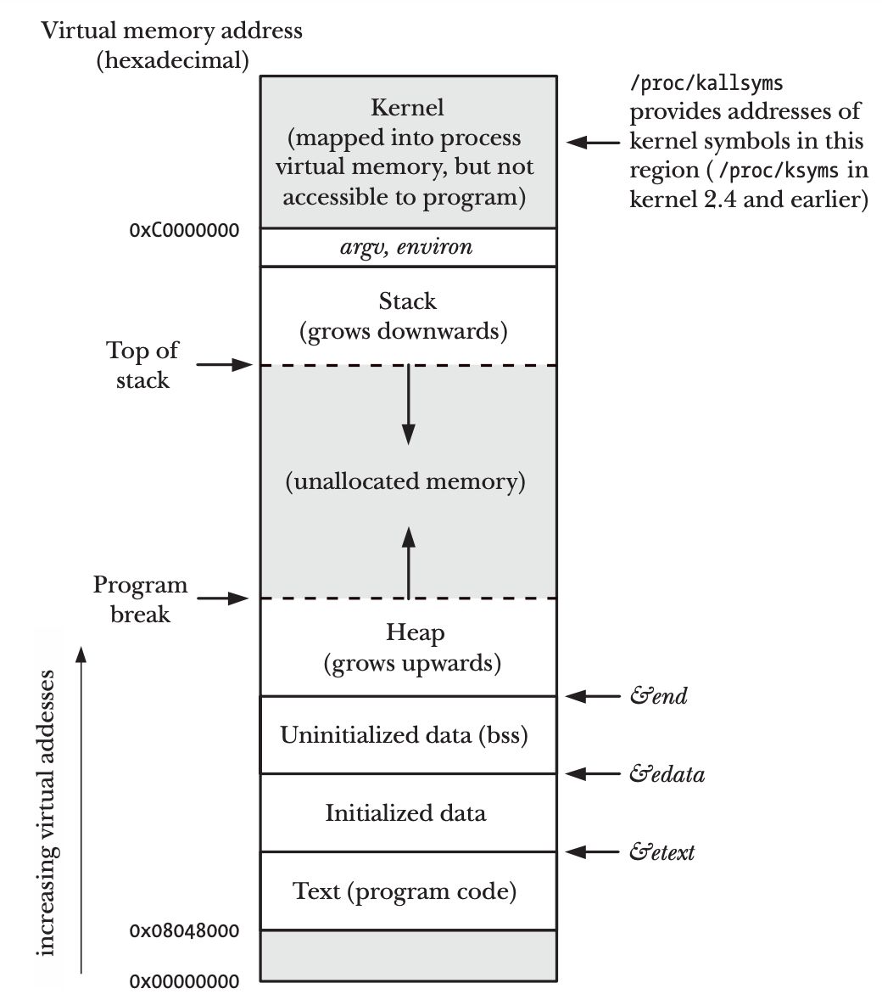
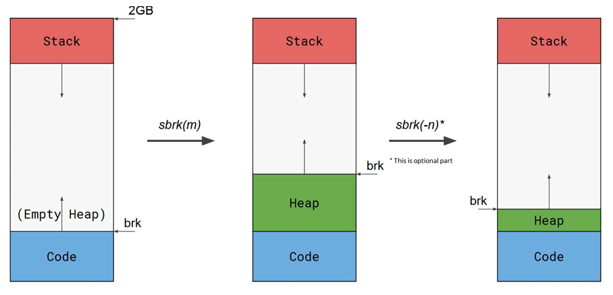
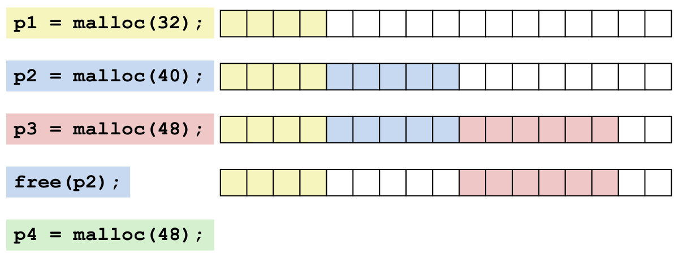
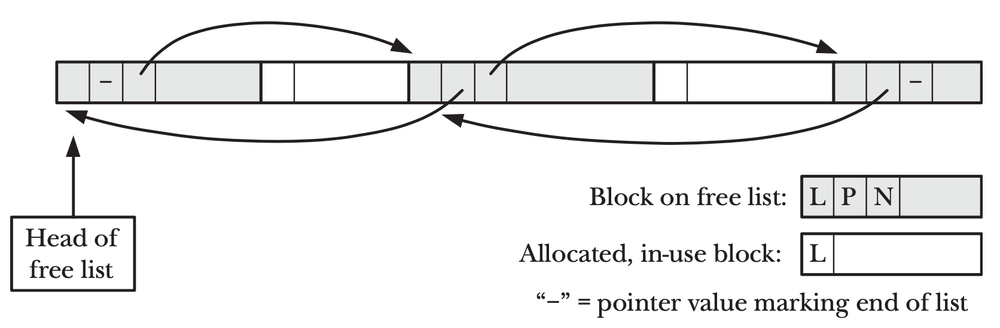
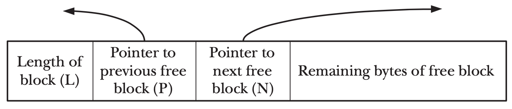
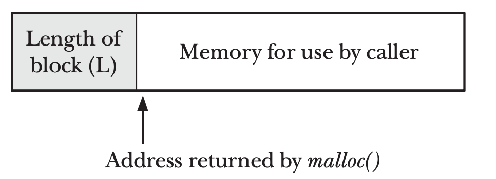
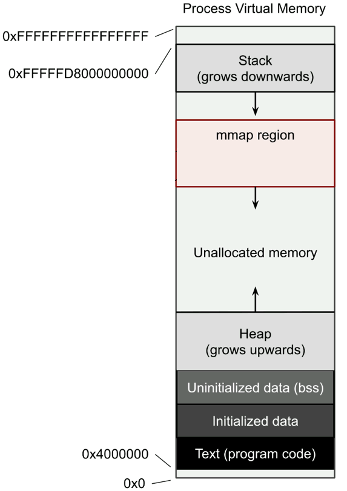

<!-- _paginate: false-->
<!-- _header: "" -->
<!-- _backgroundColor: #FCF3CF -->
<style scoped> h1, h2, h3, h4 {text-align: center;}
section {background-color: #FDEDEC;}
h1 {color:red} a:link {color: darkred;} p {text-align: center; font-size: 25px}</style>
<br/><br/><br/>
### Sistemi Operativi
### Unità 6: La memoria
La memoria Dinamica
============================
<br/><br/><br/>
[Martino Trevisan](https://trevisan.inginf.units.it/)
[Università di Trieste](https://www.units.it)
[Dipartimento di Ingegneria e Architettura](https://dia.units.it/)

---
## Argomenti

1. Limiti della memoria statica
2. La memoria dinamica
3. La funzione `malloc`
4. La funzione `calloc`
5. La funzione `realloc`
6. La funzione `free`
7. Cenni di funzionamento interno

---
## Limiti della memoria statica

Le variabili globali sono allocate nella segmento di **dati**.
Il loader inizializza il valore
```c
int a = 40; /* Inizializzata dal loader*/
int main(){...}
```
Se non specificato, la variabile è inizializzata a $0$.
```c
int a; /* Inizializzata a 0 */ 
int main(){...}
```


---
## Limiti della memoria statica

Le variabili di funzione sono allocate nello **stack**.
<r>NON</r> viene inizializzato il valore! Possono contenere dati arbitrari
```c
int f(int a, int b){
    int s = a + b;
    return s;
}
```
Gli argomenti `a` e `b`, la variabile `s` e il valore di ritorno si trovano nello stack


---
## Limiti della memoria statica

<medium>

**Variabili Statiche:**
le variabili in una funzione con la keyword `static` sono allocate nel segmento dati e non nello stack.
Inizializzate dal loader.
Conservano in valore dopo il termine della funzione.
```c
#include<stdio.h>
int fun(){
  static int count = 0; /* Inizializzata UNA volta sola dal loader all avvio del processo.
                           E NON ogni volta che la funzione viene invocata*/
  count++;
  return count;
}
  
int main(){
  printf("%d ", fun());
  printf("%d ", fun());
  return 0;
}
```
**Stampa** `1 2`

</medium>


---
## Limiti della memoria statica

Ci sono casi in cui il programmatore non sà quanti dati deve caricare in memoria
- Lettura di una struttura dati da file
- Input utente di lunghezza variabile

Con quello che abbiamo visto, in C gli array hanno lunghezza fissa, nota a tempo di compilazione
```c
#define N 50
int v [N];
```

---
## Limiti della memoria statica

In C, <r>NON</r> si possono creare array di lunghezza non nota al complilatore
Il seguente codice è <r>sbagliatissimo</r>
```c
scanf("%d", &n);
int v[n];
```

Questo porterebbe i programmatori a **sovradimensionare** i vettori (se non ci fosse la memoria dinamica)


---
## Limiti della memoria statica

<!-- _backgroundColor: #FFF9E3 -->

**Esempio di sovradimensionamento:** media di $N$ numeri letti da tastiera
<small>

```c
#include <stdio.h>
#define MAXN 50 /* Se n>50 il programma non funziona */
int main() {
    int n, i;
    float v[MAXN], s = 0;

    printf("Quanti numeri vuoi leggere? ");
    scanf("%d", &n); /* Se n>50 il programma non funziona */
    printf("Inserisci %d numeri:\n", n);

    for (i=0; i<n; i++) 
        scanf("%f", &v[i]); //  &v[i] == v+i
    for (i=0; i<n; i++)
        s += v[i];
    printf("Media: %f\n", s/n);

    return 0;
}
```

**Nota:** la media di $N$ numeri si può calcolare anche senza tenerli in memoria

</small>


---
## La memoria dinamica

In C è possibile utilizzare la <r>memoria dinamica</r> per creare strutture dati la cui dimensione non è nota in fase di compilazione

**Uso tipico**: creazione di vettori di lunghezza arbitraria e decisa a *run time*

**Funzionamento**: si utilizzano indirizzi virtuali nel segmento **Heap**. Esso può crescere durante l'esecuzione del programma




---
## La memoria dinamica

**In Linux**
Per utilizzare la memoria dinamica si utilizzano delle **funzioni di libreria** per allocare o liberare blocchi di memoria.

Le funzioni di libreria utilizzano la System Call `sbrk` che informa il sistema operativo che il processo emetterà indirizzi virtuali in zone precedentemente non usate.
- In pratica si informa il SO che l'Heap sta crescendo e il processo accederà a pagine di memoria virtuale aggiuntive

---
## La memoria dinamica

Tutte le funzioni di libreria per la memoria dinamica sono *Thread Safe*.
- Possono essere invocate in parallelo da molteplici *thread*
- Internamente mantengono e usano *mutex* per regolare l'accesso alle strutture dati


---
## La funzione `malloc`

```c
#include <stdlib.h>
void *malloc(size_t size);
```

Alloca `size` byte di memoria e ritorna il puntatore alla memoria allocata.
La memoria <r>NON</r> è inizializzata, può contenere qualsiasi valore
Se l'allocazione fallisce (e.g., manca memoria), ritorna `NULL`


---
## La funzione `malloc`

**Utilizzo**
La `malloc` richiede `size` in byte. Bisogna utilizzare l'operatore `sizeof` per conoscere la dimensione del tipo di variabile da allocare.

Il valore di ritorno è `void *`, ovvero un puntatore senza tipo.
Per utilizzare la memoria allocata, conviene assegnarla a un puntatore al tipo desiderato

```c
/* Vogliamo allocare un vettore di float*/
float * v;
/* La lunghezza è determinata a run time */
scanf("%d", &n);
/* I byte da allocare sono n blocchi ognuno lungo quanto un float */
v = malloc(n * sizeof(float)); /* Un void* è assegnato a un float* */
v[0] = 12.2; /* Aritmetica dei puntatori */
```


---
## La funzione `calloc`

```c
#include <stdlib.h>
void *calloc(size_t nmemb, size_t size);
```
Simili alla `malloc`
Alloca memoria pe run array di `nmemb` elementi ognuno di `size` byte e ne ritorna il puntatore.
La memoria **é inizializzata** a $0$.

**Osservazione:** a differenza della `malloc`, la `calloc` riceve `size` e `nmemb` e fa la moltiplicazione internamente.

---
## La funzione `realloc`

<small>

```c
#include <stdlib.h>
void *realloc(void *ptr, size_t size);
```
Modifica la dimensione della zona di memoria puntata da `ptr` a `size` byte.
Il valore di ritorno è il puntatore alla zone estesa
- Se comporta un restringimento della zona di memoria, i dati in eccesso sono persi
- Se comporta un aumento, la zona aggiuntiva **NON** è inizializzata

**Nota:** `ptr` deve essere stato ottenuto con `malloc` `calloc` o `realloc`

**Osservazione:** se possibile, la `realloc` estende la zona di memoria corrente, e il valore di ritorno è uguale a `ptr`
Se non è possibile, i dati vengono copiati in una nuova regione, il cui indirizzo viene ritornato 

</small>


---
## La funzione `free`

```c
#include <stdlib.h>
void free(void *ptr);
```

Dealloca (o liberia) la zona di memoria indicata da `ptr`.
`ptr` deve essere stato ottenuto con `malloc` `calloc` o `realloc`

Se si tenta di liberare più volta una zona di memoria, il comportamento non è definito.


---
## La funzione `free`

<!-- _backgroundColor: #FFF9E3 -->
<small>

**Esercizio:** si scriva un programma che memorizza un numero $N$ di `float` letti da tastiera.
Il numero $N$ è letto da tastiera all'inizio del programma.
Infine il programma ne stampa la media.

```c
#include <stdio.h>
#include <stdlib.h>
int main() {
    int n, i;
    float * v, s = 0;

    printf("Quanti numeri vuoi leggere? ");
    scanf("%d", &n);
    printf("Inserisci %d numeri:\n", n);

    v = malloc (n*sizeof(float)); /* Allocazione */
    for (i=0; i<n; i++)
        scanf("%f", &v[i]);
    for (i=0; i<n; i++)
        s += v[i];
    printf("Media: %f\n", s/n);
    free (v); /* Deallocazione */
    return 0;
}
```

</small>

---
## La funzione `free`

Tutte le zone di memoria vanno deallocate tramite la `free`
Se non viene fatto, la memoria è liberata al termine del processo

<r>Importante:</r>
Non deallocare la memoria è sempre un errore!
Nei programmi che devono essere eseguiti per lungo tempo, la memoria non deallocata causa <r>Memory Leak</r>
A un certo punto, viene allocata tutta la memoria del sistema!

---
## La funzione `free`

**Errori comuni:**
Valore di ritorno di `malloc` non assegnato a un puntatore
```c
// Errato
float v = malloc(5*sizeof(float));
float v [10] = malloc(5*sizeof(float));
// Corretto
float * v = malloc(5*sizeof(float));
```

Creare un array la cui dimensione non è nota durante la compilazione
```c
// Errato
float v [n];
// Corretto
float * v = malloc(n*sizeof(float));
```

---
## La funzione `free`

<medium>

**Errori comuni:**
Utilizzo errato dell'aritmetica dei puntatori
```c
float * v = malloc(5*sizeof(float));
// Errato
v+2 = 43.5; // v+2 è un puntatore
&(v+2) = 43.5;  // (v+2) è già un puntatore. Usare '&' non ha senso
// Corretto
*(v+2) = 43.5;
v[2] = 43.5;
```
Utilizzo errato nella `scanf`
```c
// Errato
scanf("%f", v[2]);
scanf("%f", *(v+2) );
// Corretto
scanf("%f", &v[2]);
scanf("%f", v+2 );
```

</medium>


---
## La funzione `free`

<!-- _backgroundColor: #FFF9E3 -->
<small>

**Esercizio:** si scriva una funzione che ritorna un sequenza di $N$ `float` equispaziati tra $a$ e $b$

```c
#include <stdlib.h>
#include <string.h>
float * seq(int N, float a, float b){
    int i;
    float * v;
    
    v = malloc(N*sizeof(float));
    for (i=0; i<N; i++)
        v[i] = a + (float)i/N*(b-a); /* Cast a float necessario per 'i' */
    
    return v;
}
```

**Utilizzo:**
```c
int i ;
float * s = seq(10, 2, 5);
for (i=0; i<10; i++)
    printf("s[%d]==%f\n", i, s[i]);
free(s); /* Importante! */
```

</small>


---
## La funzione `free`

<!-- _backgroundColor: #FFF9E3 -->
<small>

**Esercizio:** si scriva una funzione che ritorna una stringa lunga $N$.
Essa contiene una pattern stringa passata come argomento ripetutamente.

```c
#include <stdio.h>
#include <stdlib.h>
#include <string.h>

char * repeat(int N, char * pattern){
    int i, l;
    char * s;
    
    s = malloc((N+1)*sizeof(char));
    s[N] = '\0';
    l = strlen(pattern);
    
    for (i=0; i<N; i++)
        s[i] = pattern[i%l];
    
    return s;
}
```

**Utilizzo:** `printf("%s\n",  repeat(15, "ciao! ") );` stampa: `ciao! ciao! cia`

</small>


---
## Cenni di funzionamento interno

Le funzioni `malloc calloc realloc free` sono delle funzioni di libreria. 
Esse usano la System Call `sbrk`.

```c
void *sbrk(intptr_t increment);
```

Incrementa di `increment` il *data segment*, inteso come unione di segmento codice, dati e heap.
In pratica, informa il SO che l'heap si sta espandendo.
- Il SO, se necessario, impostarà la MMU per accogliere pagine aggiuntive

---
## Cenni di funzionamento interno

Chiamare la `sbrk` è di per se sufficiente per poter usare indirizzi virtuali più alti





---
## Cenni di funzionamento interno

<medium>

Tuttavia, per il programmatore sarebbe difficile gestire la memoria dinamica solo usando la `sbrk`
- Dovrebbe tenere traccia di ogni allocazione e di ogni de allocazione
- Dovrebbe avere una tecnica per riusare i *buchi* lasciati liberi da una deallocazione
  - Nel momento in cui si fa una nuova allocazione
- Invocare la `sbrk` a ogni allocazione è inefficiente
  - Una System Call è lenta (implica un Context Switch)

Le funzioni di libreria `malloc`, etc., gestiscono tutto ciò per il programmatore
- Utilizzando opportune strutture dati

</medium>


---
## Cenni di funzionamento interno


La moderna funzione `malloc` deriva dalla proposta di Doug Lea, professore della *State University of New York at Oswego*

Internamente usa una **linked list** per tenere traccia delle zone occupate.

**Nota:** *heap* ha due significati!
1. Una struttura dati che implementa una coda a priorità tramite un albero 
    - Permette di trovare facilmente il massimo di un insieme di numeri
    - Veloce da aggiornare
2. La zona della memoria virtuale dove viene allocata la memoria dinamica


---
## Cenni di funzionamento interno

La `malloc` gestisce blocchi di grandezza variabile
- Non c'è nessuna discretizzazione o utilizzo di blocchi di grandezza fissa
- Porta ad avere **frammentazione esterna**: memoria sprecata perchè è una zona contigua troppo piccola per essere allocata


---
## Cenni di funzionamento interno

E' possibile che si giunga a  situazione come questa:



`malloc(48)` potrebbe essere evasa, se la memoria libera fosse contigua

---
## Cenni di funzionamento interno

La `malloc` gestisce indipendentemente più di una zona di memoria, dette **Arenas**.
- Le strutture dati sono replicate
- Rende più efficiente l'utilizzo in contesti multithread
  - Le funzioni `malloc`, etc., sono Thread Safe
- Evita che diversi thread vengano rallentati aspettando il relase di un lock
  - I lock sono necessari, ma l'utilizzo di più di un strutture ne diminuisce l'impatto

---
## Cenni di funzionamento interno

Una zona di memoria gestita dalla `malloc` é amministrata tramite una **linked list** 
- I segmenti ancora liberi sono una **Doubly linked list**
- Le zone allocate sono momentaneamente rimosse dalla lista



---
## Cenni di funzionamento interno

Ogni zona libera o allocata ha una `struct` nei primi byte che fornisce informazioni su di essa e sui blocchi adiacenti
- **Zona Libera**
  
- **Zona Allocata**
  


---
## Cenni di funzionamento interno

<small>

In caso la `malloc` debba allocare grandi regioni di memoria (tipicamente $>128~kB$) usa la System Call `mmap` per allocare una zona di memoria.
- `malloc` chiede una regione di tipo `MAP_ANONYMOUS`. Non deve essere condivisa con nessuno!
- Il SO crea una o più pagine per il processo
- Le colloca in una posizione a sua scelta nello spazio degli indirizzi virtuali



</small>


---
## Domande

<!-- _backgroundColor: #FFF9E3 -->

<medium>

Si consideri il seguente codice C:
```c
int c = 40;
int main(){
    int i;
    static int j;
    ...
}
```
Quali variabili risiedono nello stack?
`• Tutte` `• i e j` `• i`


<br>

Il seguente codice è corretto in C?
```c
#define size 1024
int i [size];
```
`• Si` `• No`

</medium>


---
## Domande

<!-- _backgroundColor: #FFF9E3 -->

Si completi il seguente codice C
```c
double * a, int i;
scanf("%d", &i);
a = ...
```
`• float[i]` `• malloc(i);`
`• malloc(i * sizeof(double));`
`• malloc(sizeof(double));`

<br>

La `malloc`:
`• è una System Call`
`• è utilizzata dalla funzione sbrk`
`• utilizza la System Call sbrk`


