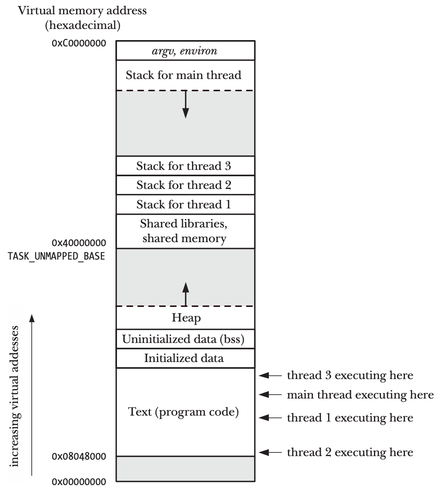

<!-- _paginate: false-->
<!-- _header: "" -->
<!-- _backgroundColor: #FCF3CF -->
<style scoped> h1, h2, h3, h4 {text-align: center;}
section {background-color: #FDEDEC;}
h1 {color:red} a:link {color: darkred;} p {text-align: center; font-size: 25px}</style>
<br/><br/><br/>
### Sistemi Operativi
### Unità 7: I Thread
I Thread in Linux
============================
<br/><br/><br/>
[Martino Trevisan](https://trevisan.inginf.units.it/)
[Università di Trieste](https://www.units.it)
[Dipartimento di Ingegneria e Architettura](https://dia.units.it/)

---
## Argomenti

1. Concetto di Thread
2. Thread in Linux
3. Funzioni per i Pthread
4. Esempi
5. Thread in Bash

---
## Concetto di Thread
### Definizione

In Linux (e in quasi tutti i SO), un **processo** può avere molteplici flussi di esecuzione, detti <r>Thread</r>
- I thread possono essere visti come un insieme di processi che condividono la memoria
- Ma eseguono lo stesso programma

**Nota:** anche Windows permette di creare thread con la System Call `CreateThread()`

---
## Concetto di Thread
### Thread e memoria

<medium>

Ogni Thread esegue lo stesso programma e condivide gli stessi dati
- I segmenti *data*, *heap* e *code* sono convidivisi

Un Thread é un flusso  in esecuzione
- Ha il suo stack
- Contiene lo stato delle funzioni in esecuzione


</medium>

---
## Concetto di Thread
### Comunicazione tra Thread

I Thread possono comunicare tra loro più facilmente che i processi, usando:
- Variabili globali
- Costrutti di sincronizzazione
  - *Mutex*
  - *Condition Variable* (vedremo solo sommariamente)
  - Semafori

Oggigiorno é più spesso usata un'architettura **multi-thread** che **multi-process**


---
## Thread in Linux
### POSIX Thread o `pthread`

Nei sistemi POSIX (e Linux), le **funzioni di libreria** per gestire i thread sono chiamate <r>Pthread</r>
I thread permettono a un processo:
- Di svolgere più task in maniera concorrente
  - Mentre un thread attende l'I/O o la rete, un altro thread può svolgere un altro compito
- Di sfruttare un sistema  **multi-core**
  - Più flussi davvero in esecuzione parallela


---
## Thread in Linux
### Storia

<medium>

Inizialmente i Pthread erano implementati dalla libreria **LinuxThreads**
- I thread erano dei processi che condividevano la memoria, i file aperti, ecc.
- Ognuno aveva diverso PID
- **Implementazione problematica:** si mischiava concetto di thread e processo

Ora (da 2002), Linux/POSIX usa la libreria **Native POSIX Threads Library (NPLT)**
- Coopera col kernel, che offre supporto ai thread
- Migliori prestazioni

</medium>

---
## Thread in Linux
### Cosa condividono i thread

Diversi thread di uno stesso processo condividono:
- La memoria globale
- PID e PPID
- File aperti
- Privilegi
- Working directory


---
## Thread in Linux
### Cosa NON condividono i thread

Ogni thread ha:
- Un **Thread ID**
  - Il Kernel mantiene la lista dei thread e li *schedula*, facendoli eseguire sulla CPU
- Il suo *stack*
  - Per poter eseguire le funzioni
  - Un thread mal configurato puó comunque accedere/corrompere lo *stack* di un altro thread
- Metadati: scheduling, etc.


---
## Thread in Linux
### Compilazione coi Pthread

Il codice deve includere la direttiva:
```c
#include <pthread.h>
```


Per compilare, bisogna includere la libreria `pthread`
```bash
gcc MyProgram.c -o MyProgram -lpthread 
```

---
## Funzioni per i Pthread
### Creazione di un thread


```c
#include <pthread.h>
int pthread_create(pthread_t *thread, const pthread_attr_t *attr,
                   void *(*start)(void *), void *arg);
```

Crea un nuovo thread che esegue la funzione `start` chiamata con l'argomento `arg`
- Come se si invocasse `start(arg)` su un flusso di esecuzione separato

**Nota:** Ogni programma, quando nasce, ha un solo thread, detto *main thread*


---
## Funzioni per i Pthread
### Creazione di un thread

```c
#include <pthread.h>
int pthread_create(pthread_t *thread, const pthread_attr_t *attr,
                   void *(*start)(void *), void *arg);
```

- L'argomento `arg` é un `void*`, ovvero un puntatore a un tipo di dato a piacere.
- Similmente, il valore di ritorno di `start` é un `void*`.
- Non ci interessa l'argomento `attr` che specifica attributi particolari


---
## Funzioni per i Pthread
### Creazione di un thread

```c
#include <pthread.h>
int pthread_create(pthread_t *thread, const pthread_attr_t *attr,
                   void *(*start)(void *), void *arg);
```

- L'argomento `thread` é un puntatore a una variabile `pthread_t` che andrá a contenere il Thread ID, per poterlo usare in successive funzioni di libreria


- In caso di successo, ritorna $0$, altrimenti un codice di errore


---
## Funzioni per i Pthread
### Terminazione di un thread

Un thread termina se:
- La funzione di lancio `start` esegue una `return`
- Il thread esegue una `pthread_exit()`
- Il thread viene cancellato tramite una `pthread_cancel()`
- Il processo termina
  - Un qualsiasi thread invoca una `exit()` o il thread principale termina il `main` 


---
## Funzioni per i Pthread
### Terminazione di un thread

```c
include <pthread.h>
void pthread_exit(void *retval);
```

Termina il thread corrente col valore `retval`.

Equivalente a effettuare una `return` nella funzione di avvio del thread.


---
## Funzioni per i Pthread
### Thread ID

```c
include <pthread.h>
pthread_t pthread_self(void);
```

Permette a un thread di ottenere il proprio Thread ID.


Il Thread ID va trattato come un *handle opaco*
- Su Linux é un `long int`
- Ma potrebbe essere un puntatore a una struttura dati arbitraria
- Non é affidabile decifrarne il valore


---
## Funzioni per i Pthread
### *Join* di un thread

```c
include <pthread.h>
int pthread_join(pthread_t thread, void **retval);
```

Attende che il thread `thread` termini.
- Se é già terminato, ritorna istantaneamente

Immagazzinail valore di ritorno all'indirizzo `retval`
- `retval` é specificato dal thread morente tramite `pthread_exit()` o `return`
- `retval` é un `void**`, ovvero un puntatore a puntore a `void`
  - E' l'indirizzo di una variabile che contiene un puntatore


---
## Funzioni per i Pthread
### *Join* di un thread


I thread devono essere tutti attesi tramite una `pthread_join()`, altrimenti diventano zombie
- Come avviene per i processi

Usando la funzione `int pthread_detach(pthread_t thread )` è possibile indicare che il thread `thread` non necessita di una `join`
- Il valore di ritorno viene scartato
- Il sistema rimuove ogni informazione sul thread quando esso termina 


---
## Funzioni per i Pthread
### *Join* di un thread


I thread sono pari tra loro
- Qualunque thread può fare una `pthread_join` su un altro

<r>Non</r> esiste un modo per aspettare la terminazione di un  **qualsiasi** thread
- Coi processi si puó invece usare la `wait`

Una `pthread_join` é  sempre bloccante
- Diverso da `waitpid`  con flag `WNOHANG`


---
## Esempi
### Creazione di un thread

<!-- _backgroundColor: #FFF9E3 -->

<verysmall>

```c
#include <pthread.h>
#include <stdio.h>
#include <stdlib.h>
#include <string.h>

static void * threadFunc(void *arg){
    char *s = (char *) arg; // Cast da void * a char *
    printf("From Thread: %s", s);
    return (void *) strlen(s); // Valore di ritorno del thread
    // Equivale a pthread_exit((void *) strlen(s))
}

int main(int argc, char *argv[]){
    pthread_t t1;
    void *res; // Per valore di ritorno
    int s;

    s = pthread_create(&t1, NULL, threadFunc, "Hello world\n"); // Creazione
    if (s != 0){
        printf("Cannot create thread");
        exit(1);
    }

    printf("Message from main()\n");
    s = pthread_join(t1, &res); // Join. Richiede un void **, ovvero &res
    if (s != 0){
        printf("Cannot join thread");
        exit(1);
    }
    printf("Thread returned %ld\n", (long) res); // Utilizzo del valore di ritorno
    exit(0);
}
```

</verysmall>
  


---
## Esempi
### Vettore di thread

<!-- _backgroundColor: #FFF9E3 -->

<verysmall>

Si crei un programma che avvia $10$ thread che attendono un tempo casuale tra $0$ e $5$ secondo prima di terminare

```c
#include <pthread.h>
#include <stdio.h>
#include <stdlib.h>
#include <unistd.h>
#define MAXSLEEP 5
#define THREADNB 10

static void * sleepFunc(void *arg){
    char thread_number = *((char*)arg);
    int n=rand() % MAXSLEEP;
    sleep(n);
    printf("Thread %c terminated\n", thread_number);
    return NULL;
}

int main(int argc, char *argv[]){
    int i;
    pthread_t t [THREADNB];
    char names [THREADNB];
    
    for (i=0;i<THREADNB;i++){
        names[i] = 'A' + i;
        pthread_create(&t[i], NULL, sleepFunc, &names[i]);
    }
    for (i=0;i<THREADNB;i++)
        pthread_join(t[i], NULL);
    return 0;
}
```

</verysmall>


---
## Thread in Bash

Normalmente, i comandi `ps` e `top` mostrano solo i processi

Per visualizzare i thread:
- `ps -T opzioni`. Esempio: `ps Tax`
- `top -H`


---
## Domande

<!-- _backgroundColor: #FFF9E3 -->


Due Thread dello stesso processo condividono le variabili globali?
`• Si` `• No`

La funzione `pthread_join` attende la terminazione:
`• Di un qualsiasi thread del sistema`
`• Di un qualsiasi thread del processo corrente`
`• Di un thread specifico`

Quando un thread invoca la funzione `pthread_exit`:
`• Il thread corrente termina`
`• Il processo corrente termina`
`• Il thread specificato come argomento della funzione termina`

---
## Domande

<!-- _backgroundColor: #FFF9E3 -->

Si consideri il seguente codice:
```c
void * func(void *arg){
    sleep(5);
    exit(0);
}

int main(){
    ...
    pthread_create(&t, NULL, func, NULL);
    sleep (10)
    pthread_join(t, NULL);
    exit(0);
}
```
Dopo quanti secondi temina il processo?
`• 5` `• 10` `• 15` 


