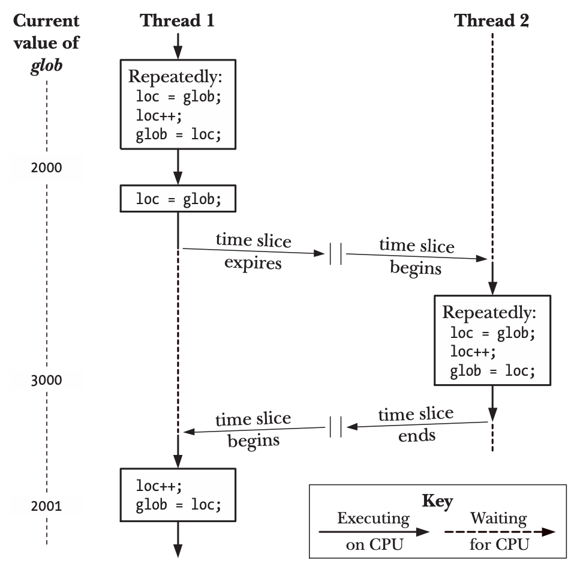
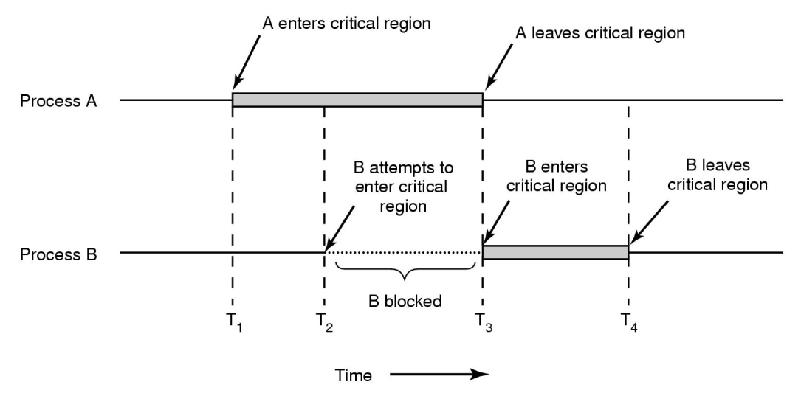
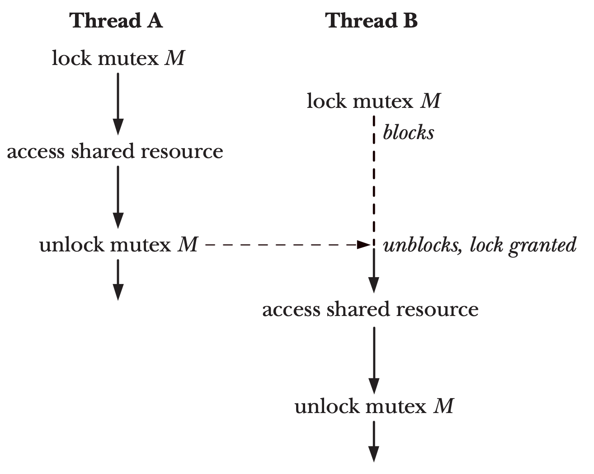
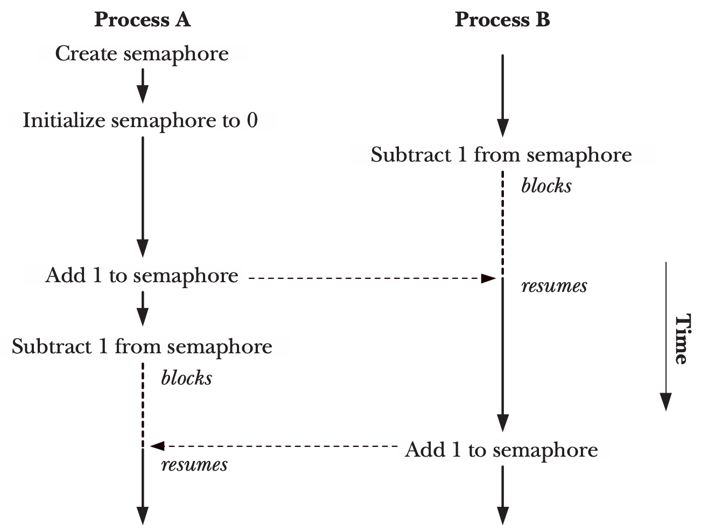
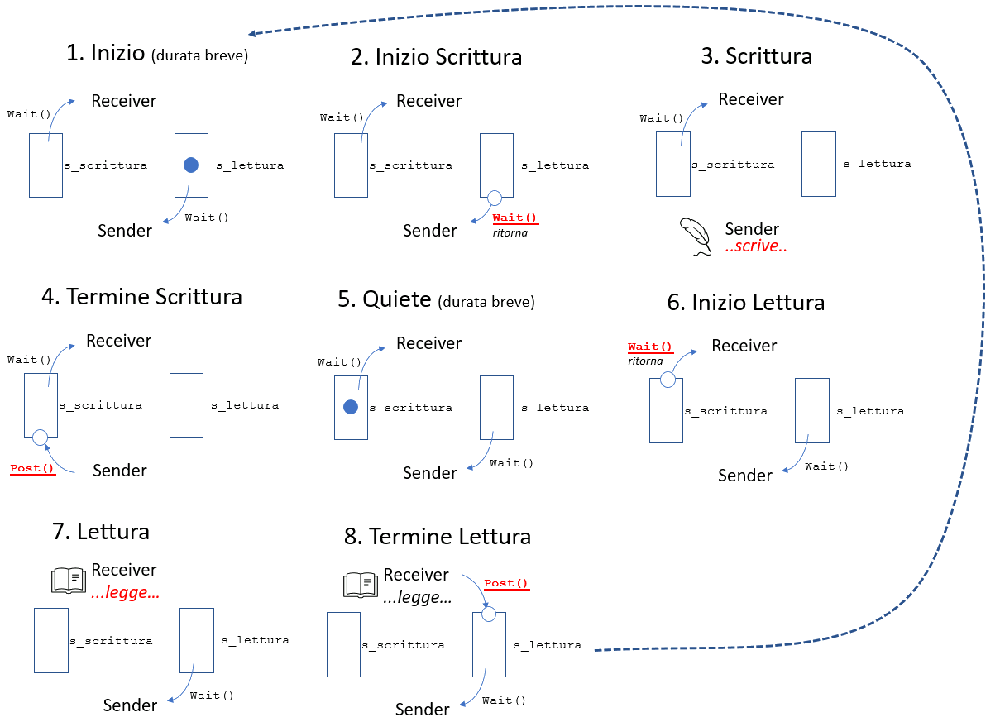

<!-- _paginate: false-->
<!-- _header: "" -->
<!-- _backgroundColor: #FCF3CF -->
<style scoped> h1, h2, h3, h4 {text-align: center;}
section {background-color: #FDEDEC;}
h1 {color:red} a:link {color: darkred;} p {text-align: center; font-size: 25px}</style>
<br/><br/><br/>
### Sistemi Operativi
### Unità 7: I Thread
Sincronizzazione
============================
<br/><br/><br/>
[Martino Trevisan](https://trevisan.inginf.units.it/)
[Università di Trieste](https://www.units.it)
[Dipartimento di Ingegneria e Architettura](https://dia.units.it/)

---
## Argomenti

1. Perché é necessaria
2. I mutex
3. I semafori

---
# Perché é necessaria

---
## Perché é necessaria
### Definizioni

**Concorrenza:** un programma con più flussi di esecuzione

**Parallelismo:** un programma che esegue su più calcoli contemporaneamente

Un programma può essere **concorrente senza essere parallelo**
- Ha tanti thread che eseguono su un sistema con una sola CPU


---
## Perché é necessaria
### Definizioni

Un programma può essere **parallelo senza essere concorrente**
- Le moderne CPU hanno istruzioni che manipolano più dati
- Paradigma **Single Instruction Multiple Data (SIMD)**
- Una singola istruzione per sommare due vettori
- La CPU ha una ALU che permette di effettuare più operazioni in parallelo
- Usando un singolo thread/processo


---
## Perché é necessaria
### Obbiettivi della programmazione parallela

Teoricamente, parallelizzando e usando $N$ core anzinché $1$, dovremmo avere:
$Tempo~Impiegato = \frac{Tempo~con~un~core}{N}$

In realtà, vale solo per un numero ridotto di processori e core.
- Solitamente, con un numero ridotto di core, si ha davvero un incremento
- Poi c'è un appiattimento


---
## Perché é necessaria
### Legge di Amdahl

"*Il miglioramento delle prestazioni di un sistema che si può ottenere ottimizzando una certa parte del sistema è limitato dalla frazione di tempo in cui tale parte è effettivamente utilizzata*"

**Ovvero:** la parte di codice non parallelizzabile, penalizza tutto il programma

**Problema:** non tutti gli algoritmi sono parallelizzabili!


---
## Perché é necessaria
### Parallelizzazione

**Definizione:** Esecuzione di un algoritmo tramite più flussi simultanei

Non tutti gli algoritmi sono parallelizzabili

**Parallelizzabile:**
- Calcolare la somma di un vettore

**Non Parallelizzabile:**
- Calcolare le cifre di $\sqrt{2}$ 


---
## Perché é necessaria
### Parallelizzazione

C'è molta ricerca per tentare di parallelizzare gli algoritmi
- Trovando espedienti matematici
- Calcolando soluzioni approssimate

Problema sentito nel **machine learning**
- Addestrare una rete neurale usando molti core (e nodi)
  - Problema risolto
- Algoritmi di **clustering** paralleli
  - Problema in parte aperto

---
# I mutex

---
## I mutex
### Il problema delle sezione critiche

I thread condividono la memoria
- Possono condividere informazioni usando <r>Variabili Condivise</r>

E' necessario sincronizzare l'accesso alle variabili condivise
- Due thread non devono scrivervi contemporaneamente
- Un thread non deve leggere una variabile condivisa mentre un'altro la scrive


---
## I mutex
### Il problema delle sezione critiche

<medium>

Immaginiamo due thread che eseguono il seguente codice:
```c
static int glob = 0;
static void * threadFunc(void *arg){
    int loops = *((int *) arg);
    int loc, j;
    for (j = 0; j < loops; j++) {
        loc = glob;
        loc++;
        glob = loc;
    }
    return NULL;
}
```

</medium>




---
## I mutex
### Il problema delle sezioni critiche

<medium>

Il seguente codice produce risultati non predicibili.
**Esempio:**
- Thread 1 è interrotto durante l'incremento
- Thread 2 effettua l'incremento 
- Thread 1 completa l'incremento

L'incremento effettuato dal Thread 2 **è perso!**

</medium>


---
## I mutex
### Il problema delle sezioni critiche

<small>

**Osservazioni**
Sostituire:
```c
loc = glob;
loc++;
glob = loc;
```
con `glob++;` non risolve il problema.
In molti processori (e.g., ARM) non hanno una istruzione di incremento
- Il compilatore traduce `glob++;` in istruzioni Assembly equivalenti alle 3 righe di codice di cui sopra

</small>


---
## I mutex
### Definizione di sezione critica

Una <r>Sezione Critica</r> è una sezione di codice la cui esecuzione deve essere atomica
- Non può essere interrotta da un altro thread
- Nessun altro thread può eseguire quel codice contemporaneamente

Una sezione critica accede a risorse condivise
- Solo un thread per volta vi può fare accesso

Le sezioni critiche sono anche dette **Regioni Critiche**


---
## I mutex
### Funzionamento di sezione critica

<small>

L'accesso a una sezione critica avviene in <r>Mutua Esclusione</r>
- Un thread si **prenota** per l'accesso
  - Se la sezione critica non è utilizzata, il thread vi accede
  - Altrimenti attende finchè non si libera
- Al termina della sezione critica, il thread **rilascia** la sezione 



</small>


---
## I mutex
### Definizione

Un <r>Mutex</r> è un costrutto di sincronizzazione che gestisce l'accesso a una sezione critica

Un mutex ha due stati
- **Locked**: la sezione è occupata
- **Free**: la sezione è libera

Un thread può fare due azioni su un mutex:
- **Lock**: prenota l'accesso per l'occupazione della sezione critica
- **Release/Unlock**: rilascia la sezione critica


---
## I mutex
### Definizione




---
## I mutex
### Nei Pthread

I mutex sono variabili di tipo `pthread_mutex_t`
- Sono solitamente variabili globali
- Inizializzate dal `main`
- Usate da qualsiasi thread 

Necessario includere:
```c
#include <pthread.h>
```
Si utilizzano con le funzioni di libreria `pthread_mutex_*`


---
## I mutex
### Inizializzazione

```c
#include <pthread.h>
int pthread_mutex_init(pthread_mutex_t * mutex , const pthread_mutexattr_t * attr );
```

Inizializza il mutex `mutex`, che viene passato per riferimento (tipo `pthread_mutex_t *` )
L'argomento `attr` specifica gli attributi, che non vedremo
- Può essere `NULL`

Valore di ritorno, come in tutte le funzioni di Pthread (omesso nelle successive slide):
- $0$ in caso di successo
- Il codice di errore altrimenti


---
## I mutex
### *Lock*

```c
#include <pthread.h>
int pthread_mutex_lock(pthread_mutex_t * mutex );
```

Acquisisce il *lock* del mutex
- Blocca il chiamante finchè il lock non diventa libero


### *Release*

```c
#include <pthread.h>
int pthread_mutex_unlock(pthread_mutex_t * mutex );
```

Rilascia il lock

**Nota:** `mutex` è **sempre** passato per riferimento! 


---
## I mutex
### Varianti di *Lock*

```c
#include <pthread.h>
int pthread_mutex_trylock ( pthread_mutex_t *mutex);
```
Acquisisce il lock
- Se il lock è già preso da qualcun'altro fallisce con errore (valore di ritorno) `EBUSY`


### Distruzione

```c
#include <pthread.h>
int pthread_mutex_destroy ( pthread_mutex_t *mutex );
```

Rilascia la memoria occupata dal lock mutex
Tale lock non sarà più utilizzabile

---
## I mutex
### Esempio 1/2

<!-- _backgroundColor: #FFF9E3 -->
<small>

Realizzazione del precedente programma (incremento di una variabile da parte di due thread in parallelo) usando in mutex

```c
#include <stdio.h>                                                                                                                 
#include <stdlib.h>
#include <stdlib.h>
#include <pthread.h>

static int glob = 0;
static pthread_mutex_t mtx;

static void * threadFunc(void *arg){
    int loops = *((int *) arg);
    int loc, j;
    for (j = 0; j < loops; j++) {
        pthread_mutex_lock(&mtx);   /*    LOCK            */
        loc = glob;                 /* ┰                  */
        loc++;                      /* ┃ Critical Section */
        glob = loc;                 /* ┻                  */
        pthread_mutex_unlock(&mtx); /*    RELEASE         */
    }
    return NULL;
}
int main(int argc, char *argv[]){
    pthread_t t1, t2;
    int loops = 10000000;
    
    pthread_mutex_init(&mtx, NULL);
    pthread_create(&t1, NULL, threadFunc, &loops);
    pthread_create(&t2, NULL, threadFunc, &loops);
    pthread_join(t1, NULL);
    pthread_join(t2, NULL);
    pthread_mutex_destroy(&mtx);   
    printf("glob = %d\n", glob);
    exit(0);
}
```

</small>


---
## I mutex
### Esempio 1/2

<!-- _backgroundColor: #FFF9E3 -->
<small>

Il programma senza l'uso di mutex:

```c
#include <stdio.h>                                                                                        
#include <stdlib.h>
#include <pthread.h>

static int glob = 0;

static void * threadFunc(void *arg){
    int loops = *((int *) arg);
    int loc, j;
    for (j = 0; j < loops; j++) {
        loc = glob;                 /* ┰                  */
        loc++;                      /* ┃ Critical Section */
        glob = loc;                 /* ┻                  */
    }
    return NULL;
}

int main(int argc, char *argv[]){
    pthread_t t1, t2;
    int loops = 10000000;    
    pthread_create(&t1, NULL, threadFunc, &loops);
    pthread_create(&t2, NULL, threadFunc, &loops);      
    pthread_join(t1, NULL);
    pthread_join(t2, NULL);      
    printf("glob = %d\n", glob);
    exit(0);
}
```

La somma non è correttamente $20000000$, ma un numero inferiore (e.g., $10493368$)

</small>


---
## I mutex
### Deadlock

Un <r>Deadlock</r> o stallo è una situazione in cui due o più thread risultano bloccati
- Ognuno attende una condizione che non potrà mai verificarsi
- Il programma cessa di eseguire

Quando si usano due o più mutex possono capitare situazioni di questo tipo
- Necessario che il programmatore le preveda e le eviti

---
## I mutex
### Deadlock - Esempio

**Thread A:**
```c
pthread_mutex_lock(mutex1); // <--- LOCK 1
pthread_mutex_lock(mutex2); // <--- LOCK 2
... Sezione Critica ...
pthread_mutex_unlock(mutex2);
pthread_mutex_unlock(mutex1);
```

**Thread B:**
```c
pthread_mutex_lock(mutex2); // <--- LOCK 2
pthread_mutex_lock(mutex1); // <--- LOCK 1
... Sezione Critica ...
pthread_mutex_unlock(mutex1);
pthread_mutex_unlock(mutex2);
```

---
## I mutex
### Deadlock

Come evitare i deadlock:
- Usare altri tipi di sincronizzazione quando possibile:
  - Pipe, FIFO
- Usare un basso numero di mutex
- Modellare l'uso di tanti mutex
  - Tecniche basate sui grafi
  - Non vediamo in questo corso

---
# I Semafori

---
## I Semafori
### Definizione

<medium>

Un <r>Semaforo</r> è un numero **Intero Positivo** condiviso da più thread
- Inizializzato a un certo valore in fase di creazione

Thread concorrenti possono fare due operazioni:
- **Incremento di $1$**
- **Decremento di $1$**

Il semaforo non può **mai** assumere **valori negativi**.
Se il decremento comporta che il semaforo diventi negativo
- Il thread si **blocca**
- **Attende** che un altro thread faccia un incremento

</medium>

---
## I Semafori
### Funzionamento

<small>

**Esempio:**
1. Il semaforo è inizializzato a $0$
2. $B$ decrementa
    - Il semaforo non può asumere valori negativi
    - $B$ entra in attesa
3. $A$ incrementa
    - $B$ si sblocca
    - Il semaforo ha valore $0$
4. $A$ decrementa
    - $A$ si blocca
5. $B$ incrementa
    - $A$ si sblocca
5. Il semaforo ha valore $0$


</small>

---
## I Semafori
### Storia

<medium>

Sono un costrutto di sincronizzazione semplice, potente e flessibile
- Inventato da Dijkstra nel 1965
- Usato per svariati scopi in tutti i linguaggi di programmazione e sistemi operativi

In Linux, due implementazioni
- *System V semaphores*: più vecchi, complessi. Non vedremo
- ***POSIX semaphores***: <r>vediamo nelle slide</r>
  **NOTA:** possono essere usati anche tra processi diversi (e non solo tra thread di uno stesso processo)

</medium>


---
## I Semafori
### Named e unnamed semaphores

I *POSIX semaphores* possono essere:
- ***Named***: hanno un nome univoco. Possono essere usati da più processi indipendenti (anche senza relazioni di parentela)
- ***Unnamed***: non hanno nome. Possono essere condivisi tra:
  - Thread, senza particolari accorgimenti
  - Processi: se creati tramite  `fork` e risiedono in una zona di memoria condivisa (con `shmget` o `mmap`)


---
## I Semafori
### Named e unnamed semaphores

Il principio di funzionamento è lo stesso:
1. Il semaforo viene creato/inizializzato
2. I processi/thread possono effettuare delle:
    - *Post* per incrementare il semaforo
    - *Wait* per decrementare il semaforo (ed eventualmente attendere)
3. Il semaforo viene distrutto/chiuso

---
## I Semafori
### Named semaphores

Si utilizzano le seguenti funzioni:
1. `sem_open()`
2. `sem_post(sem)`, `sem_wait(sem)` e `sem_getvalue()`
3. `sem_close()` e `sem_unlink()`

Necessario includere l'header:
```c
#include <semaphore.h>
```
I semafori sono handle opachi di tipo:
```
sem_t
```

---
## I Semafori
### Named semaphores - Creazione

```c
#include <fcntl.h> /* Defines O_* constants */
#include <sys/stat.h> /* Defines mode constants */
#include <semaphore.h>

sem_t *sem_open(const char * name , int oflag , ...
                /* mode_t mode , unsigned int value */ );
```

Crea un semaforo dal nome `name`
- Deve iniziare con `/`
- Può essere un qualsiasi identificativo
  Esempio: `/mysem`

---
## I Semafori
### Named semaphores - Creazione

```c
#include <fcntl.h> /* Defines O_* constants */
#include <sys/stat.h> /* Defines mode constants */
#include <semaphore.h>

sem_t *sem_open(const char * name , int oflag , ...
                /* mode_t mode , unsigned int value */ );
```

L'argomento `oflag` specifica cosa fare se il semaforo esiste o no:
- `O_CREAT`: crea e apre se non esiste. Apre se esiste
- `O_CREAT | O_EXCL`: crea e apre. Fallisce se già esiste

---
## I Semafori
### Named semaphores - Creazione

```c
#include <fcntl.h> /* Defines O_* constants */
#include <sys/stat.h> /* Defines mode constants */
#include <semaphore.h>

sem_t *sem_open(const char * name , int oflag , ...
                /* mode_t mode , unsigned int value */ );
```

**Argomenti opzionali:**
- `value` specifica il valore iniziale
- `mode` specifica i permessi, come per i file

Se si usa il flag `O_CREAT`, `value` vanno specificati!

**Valore di ritorno**: il semaforo in caso di successo, se no `SEM_FAILED`


---
## I Semafori
### Named semaphores - Chiusura e distruzione

```c
#include <semaphore.h>
int sem_close(sem_t * sem );
int sem_unlink(const char * name );
```

`sem_close` chiude il semaforo per il processo corrente
`sem_unlink` rimuove il semaforo per tutti i processi

**Valore di ritorno**: $0$ in caso di successo, se no $-1$

---
## I Semafori
### Named semaphores - Operazioni

```c
#include <semaphore.h>
int sem_wait(sem_t * sem );
int sem_post(sem_t * sem );
```

`sem_wait` decrementa di $1$ il semaforo
- Se il semaforo dovesse assumere valori negativi, blocca il chiamante

`sem_post` incrementa di $1$ il semaforo

**Valore di ritorno**: $0$ in caso di successo, se no $-1$


---
## I Semafori
### Named semaphores - Operazioni particolari

```c
#include <semaphore.h>
int sem_trywait(sem_t *sem);
int sem_getvalue(sem_t *restrict sem, int *restrict sval);
```

`sem_trywait` come la `sem_wait`
- Ma non blocca in caso il semaforo vada in negativo
- Ma fallisce

`sem_getvalue` colloca nell'intero puntato da `sval` il valore del semaforo

---
## I Semafori
### Named semaphores - Esempio

<!-- _backgroundColor: #FFF9E3 -->
Si creino due programmi che comunicano tramite un semaforo.
- Il primo effetua una `post` ogni volta che l'utente preme *Enter*
- Il secondo stampa una stringa ogni volta che il primo effettua una `post`

---
## I Semafori
### Named semaphores - Esempio

<!-- _backgroundColor: #FFF9E3 -->


**Programma 1**

```c
#include <stdio.h>
#include <fcntl.h>
#include <stdlib.h>
#include <errno.h>
#include <semaphore.h>
#include <string.h>

int main(int argc, char *argv[]){
    sem_t * s;
    
    s = sem_open("/semaforo", O_CREAT , S_IRUSR | S_IWUSR, 0);
    if(s == SEM_FAILED) {
        printf("Error creating/opening the semaphore %s\n", strerror(errno));            
        exit (1);
    }
    
    while(1){
        printf("Premi enter per una post: ");
        getchar();
        sem_post(s);
    }
    sem_close(s); /* Codice irraggiungibile*/
    return 0;
}
```


---
## I Semafori
### Named semaphores - Esempio

<!-- _backgroundColor: #FFF9E3 -->

**Programma 2**

```c
#include <stdio.h>
#include <fcntl.h>
#include <stdlib.h>
#include <errno.h>
#include <semaphore.h>
#include <string.h>

int main(int argc, char *argv[]){
    sem_t * s;
    int i = 0;
    
    s = sem_open("/semaforo", O_CREAT , S_IRUSR | S_IWUSR, 0);
    if(s == SEM_FAILED) {
        printf("Error creating/opening the semaphore %s\n", strerror(errno));           
        exit (1);
    }
    
    while(1){
        sem_wait(s);
        printf("Wait %d effettuata\n", i);
        i++;
    }
    sem_close(s); /* Codice irraggiungibile*/
    return 0;
}
```


---
## I Semafori
### Named semaphores - Esempio

<!-- _backgroundColor: #FFF9E3 -->

**Osservazioni:**
- Il valore del semaforo è persistente. Se Programma 2 non viene eseguito, il semaforo può crescere di valore
- Si possono eseguire più istanze di entrambi i programmi
  - Più istanze di Programma 1 accumulano valore nel semaforo
  - Se ci sono più istanze di Programma 2, solo una può essere sbloccata per ogni incremento
  - Il sistema operativo tendezialmente è *fair*. Fa load balancing tra più semafori in attesa


---
## I Semafori
### Unnamed semaphores

Si utilizzano in maniera simile, ma più semplice rispetto ai *Named Semaphores*
Diversa procedure di aperture chiusura

```c
#include <semaphore.h>
int sem_init(sem_t * sem , int pshared , unsigned int value );
```

Crea il semaforo e lo colloca in `sem`, inizializzato a `value`

---
## I Semafori
### Unnamed semaphores

```c
#include <semaphore.h>
int sem_init(sem_t * sem , int pshared , unsigned int value );
```

**Importante:**
`sem_open` ritorna un puntatore a semaforo (`sem_t *`), che viene allocato dalla libreria
`sem_init` colloca il puntatore a semaforo in `sem`
- Il programmatore deve devidere dove allocare il semaforo, di tipo `sem_t`
- Può esser una variabile globale, locale, allocata dinamicamente o su una regione di memoria condivisa

---
## I Semafori
### Unnamed semaphores

```c
#include <semaphore.h>
int sem_init(sem_t * sem , int pshared , unsigned int value );
```

Se `pshared` è $0$, il semaforo non viene condiviso tra processi, ma solo tra thread
- `sem` può essere una comune variabile globale

Se `pshared` è $\neq 0$, il semaforo viene condiviso tra processi (tramite `fork`)
- `sem` deve essere in una zona di memoria condivisa

**Conseguenza:** meglio usare Named Semaphore con applicazioni multi-processo

---
## I Semafori
### Unnamed semaphores

```c
#include <semaphore.h>
int sem_destroy(sem_t * sem );
```

Distrugge il semaforo `sem`.
Se esso è condiviso tra processi, tutti i processi devono invocare `sem_destroy`

Nota: `sem_close` e `sem_unlink` sono usato solo coi *Named Semaphores*

### Utilizzo

Si usano `sem_post()` e `sem_wait()` come per i *Named Semaphores*


---
## I Semafori
### Unnamed semaphores - Esempio

<!-- _backgroundColor: #FFF9E3 -->

<small>

Si crei un programma con due thread. Il primo ogni secondo manda un messaggio al secondo.
Il secondo lo stampa.

**Struttura del programma:**

```c
#include <stdio.h>                                                                                      
#include <unistd.h>
#include <semaphore.h>
#include <pthread.h>

sem_t s_scrittura, s_lettura;     /* Due semafori */
char buffer [50]; /* Buffer condiviso tra Thread */

void * sender(void *arg){
    ...
}

void receiver(){
    ...
}

int main(int argc, char *argv[]){
    pthread_t t;
    sem_init(&s_scrittura, 0, 0);
    sem_init(&s_lettura, 0, 1);
    pthread_create(&t, NULL, sender, NULL); /* Thread creato per sender */
    receiver();                             /* Il Main fa da receiver */
}
```

</small>


---
## I Semafori
### Unnamed semaphores - Esempio

<!-- _backgroundColor: #FFF9E3 -->

<small>

**Logica del programma:**
Bisogna evitare che un thread legga mentre un altro scrive
- Si potrebbe leggere una stringa in stato inconsistente!
- Senza terminatore!
 
Servono due semafori:
- `s_scrittura` notifica che `sender` ha terminato una scrittura
  - `sender` mette un *gettone* quando finisce la scrittura, `receiver` attende il gettone per iniziare la lettura
- `s_lettura` notifica che `receiver` ha terminato la lettura
  - `receiver` mette un *gettone* quando finisce la lettura, `sender` attende il gettone per iniziare la nuova scrittura
  
`s_scrittura` deve essere inizializzato a $0$ perchè `receiver` aspetti la prima scrittura
`s_lettura` deve essere inizializzato a $1$ perchè `sender` possa fare la prima scrittura

</small>

---
## I Semafori
### Unnamed semaphores - Esempio

<!-- _backgroundColor: #FFF9E3 -->

<small>

**Sender:**
1. `sem_wait(s_lettura)`: per essere sicuro che `receiver` abbia terminato la lettura
2. Scrive su `buffer`
3. `sem_wait(s_scrittura)`: per notificare termine scrittura

**Receiver:**
1. `sem_wait(s_scrittura)`: per essere sicuro che `sender` abbia terminato la scrittura
2. Legge su `buffer`
3. `sem_post(s_lettura)`: per notificare termine lettura

</small>


---
## I Semafori
### Unnamed semaphores - Esempio

<!-- _backgroundColor: #FFF9E3 -->

<small>

**Sender e Receiver:**

```c
void * sender(void *arg){
    int i = 0;    
    while (1){
        sem_wait(&s_lettura);
        sprintf(buffer, "Message %d\n", i);
        sem_post(&s_scrittura);
        i++;
        sleep(1);
    }
}

void receiver(){
    while (1){
        sem_wait(&s_scrittura);
        printf("Received: %s\n", buffer);
        sem_post(&s_lettura);
    }
}

...
sem_init(&s_scrittura, 0, 0);
sem_init(&s_lettura, 0, 1);
```

</small>


---
## I Semafori
### Unnamed semaphores - Esempio

<!-- _backgroundColor: #FFF9E3 -->





---
## Domande

<!-- _backgroundColor: #FFF9E3 -->
<medium>

La parallelizzazione è una soluzione per migliorare le prestazioni:
`• di qualsiasi algoritmo`
`• solo di algoritmi che accedono al disco`
`• solo di algoritmi che posono eseguiti per mezzo di più flussi contemporanei`

<br>

Il seguente codice è corretto?
```c
pthread_mutex_lock(&mtx);
var++;
pthread_mutex_lock(&mtx);
```
`• Si, il lock viene rilasciato`
`• No, il thread entra in uno stato di attesa perpetuo`
</medium>


---
## Domande

<!-- _backgroundColor: #FFF9E3 -->
<small>

Un semaforo può essere inizializzato:
`• A qualsiasi valore intero`
`• A qualsiasi intero non negativo`
`• A qualsiasi intero positivo`

<br>

Un programma esegue il seguente codice:
```c
sem_init(&s, 0, 0);
for (i = 0; i<10; i++){
    sem_wait(&s);
    sem_post(&s);
}
```
Al termine del programma che valore assume il semaforo?
`• 0`
`• 10`
`• Il programma non termina perché entra in uno stato di attesa perpetuo`

</small>


---
## Domande

<!-- _backgroundColor: #FFF9E3 -->
<small>


Si immaginino due thread di un processo che operano su semaforo `s` inizializzato a $1$.
Il Thread 1 esegue:
```c
void * t1(void *arg){
    sem_post(&s);
    sem_post(&s);
}
```
Il Thread 2 esegue:
```c
void * t2(void *arg){
    sem_wait(&s);
    sem_wait(&s);
    sem_wait(&s);
    sem_post(&s);
}
```
Il programma:
`• Termina`
`• Entra in uno stato di attesa indefinito`

</small>


