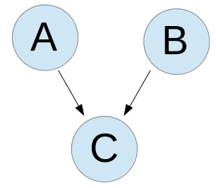
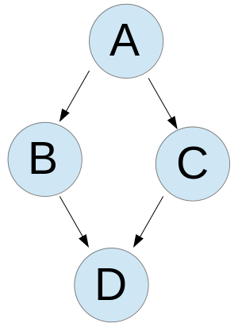
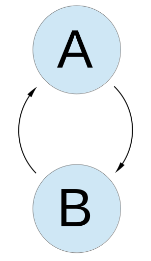
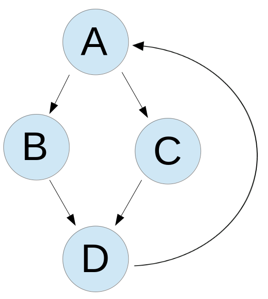
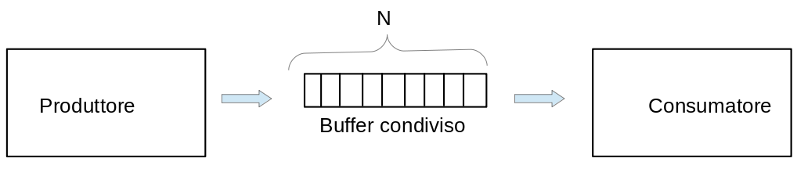

<!-- _paginate: false-->
<!-- _header: "" -->
<!-- _backgroundColor: #FCF3CF -->
<style scoped> h1, h2, h3, h4 {text-align: center;}
section {background-color: #FDEDEC;}
h1 {color:red} a:link {color: darkred;} p {text-align: center; font-size: 25px}</style>
<br/><br/><br/>
### Sistemi Operativi
### Unità 7: I Thread
Problemi di Sincronizzazione
============================
<br/><br/><br/>
[Martino Trevisan](https://trevisan.inginf.units.it/)
[Università di Trieste](https://www.units.it)
[Dipartimento di Ingegneria e Architettura](https://dia.units.it/)

---
## Argomenti

1. Mutex e Semafori
2. Grafi di precedenza
3. Produttore e consumatore

---
# Mutex e Semafori

---
## Mutex e Semafori

I **Mutex** regolano l'accesso a una sezione critica:
- Solo un thread per volta può avere il lock
- Operazioni: `lock` `unlock`

I **Semafori** sono degli interi positivi condivisi:
- Simili a un contenitore di gettoni
- Operazioni: `post` `wait`

I *Semafori* sono un costrutto più generale
- Un *Semaforo*  può facilmente essere usato come *mutex*


---
## Mutex e Semafori
### Costruire un Mutex con un Semaforo

**Inizializzazione:**
*Mutex*
```c
pthread_mutex_t lock;
pthread_mutex_init(&lock, NULL);
```

*Semaforo*: deve essere inizializzato al valore $1$
```c
sem_t sem;
sem_init(&sem, 0, 1);
```


---
## Mutex e Semafori
### Costruire un Mutex con un Semaforo

<small>

**Lock:**
*Mutex*
```c
pthread_mutex_lock(&lock);
```

*Semaforo*
```c
sem_wait(&sem); 
```


**Release:**
*Mutex*
```c
pthread_mutex_unlock(&lock);
```

*Semaforo*
```c
sem_post(&sem); 
```
</small>

---
## Mutex e Semafori
### Costruire un Mutex con un Semaforo

Vedi implementazione in `esercizi/myMutex.c`

```c
typedef struct{                                              
    sem_t s;
} myMutex;

myMutex myMutex_init(){
    myMutex m;
    sem_init(&(m.s), 0, 1);
    return m;
}

void myMutex_lock(myMutex * m){
    sem_wait( &(m->s) );
}

void myMutex_unlock(myMutex * m){
    sem_post( &(m->s) );
}
```


---
# Grafi di precedenza

---
## Grafi di precedenza

I semafori sono pratici da usare per costruire **grafi di precedenza**
- Un insieme di task che devono essere eseguite in un ordine particolare

I grafi di precedenza modellano molto bene sistemi distribuiti e concorrenti
- Le <r>Reti di Petri</r> sono un astrazione per trattare grafi di precedenza con l'utilizzo di semafori
- Non vedremo


---
## Grafi di precedenza
### Esempio 1
 
<!-- _backgroundColor: #FFF9E3 -->


 

```c
sem_t s1;
void* t_A(void* arg){
    A();
    sem_post(&s1);
}
void* t_B(void* arg){
    B();
    sem_post(&s1);
}
void* t_C(void* arg){
    sem_wait(&s1);
    sem_wait(&s1);
    C();
}
```


---
## Grafi di precedenza
### Esempio 2
 
<!-- _backgroundColor: #FFF9E3 -->


 
 
```c
sem_t s1, s2;                                  
void* t_A(void* arg){
    A();
    sem_post(&s1);
    sem_post(&s1);
}
void* t_B(void* arg){
    sem_wait(&s1);
    B();
    sem_post(&s2);
}
void* t_C(void* arg){
    sem_wait(&s1);
    C();
    sem_post(&s2);
}
void* t_D(void* arg){
    sem_wait(&s2);
    sem_wait(&s2);
    D();
}
```


---
## Grafi di precedenza
### Esempio 3
 
<!-- _backgroundColor: #FFF9E3 -->



 
```c
sem_t s1, s2;                                      
sem_init(&s1, 0, 1); // Inizializzato a 1
sem_init(&s2, 0, 0); // Inizializzato a 0
void* t_A(void* arg){
    while (1){
        sem_wait(&s1);
        A();
        sem_post(&s2);
    }
}
void* t_B(void* arg){
    while (1){
        sem_wait(&s2);
        B();
        sem_post(&s1);
    }
}
```

**NOTA:** esercizio uguale a lettore/scrittore visto in precedenza


---
## Grafi di precedenza
### Esempio 4
 
<!-- _backgroundColor: #FFF9E3 -->


 

```c
sem_t s1, s2, s3; // s1 inizializzata a 1, gli altri a 0            
void* t_A(void* arg){
    while (1){
        sem_wait(&s1);
        A();
        sem_post(&s2);
        sem_post(&s2);
    }
}
void* t_B(void* arg){
    while (1){
        sem_wait(&s2);
        B();
        sem_post(&s3);
    }
}
void* t_C(void* arg){
    while (1){
        sem_wait(&s2);
        C();
        sem_post(&s3);
    }
}
void* t_D(void* arg){
    while (1){
        sem_wait(&s3);
        sem_wait(&s3);
        D();
        sem_post(&s1);
    }
}
```

---
# Produttore e consumatore

---
## Produttore e consumatore
### Il problema

<small>

Problema classico dell'informatica, applicabile in molti contesti
- Pacchetti di rete
- Calcolo parallelo

**Definizione**:
- Due thread comunicano tramite un buffer di grandezza limitata, che contiene massimo $N$ oggetti
- Il thread *producer* inserisce gli oggetti nel buffer
- Il thread *consumer* estrae gli oggetti dal buffer, nell'ordine in cui sono stati inseriti

</small>




---
## Produttore e consumatore
### Algoritmo

<verysmall>

**Variabili condivise:**
```c
<tipo> buffer [N];
int contatore = 0;
```

**Produttore:**
```c
while (1) {
    while (contatore == BUFFER_SIZE); /* non fa niente se il buffer è pieno */
    buffer[in] = next_produced;
    in = (in + 1) % BUFFER_SIZE;
    contatore++;
}
```

**Consumatore:**
```c
while (1) {
    while (contatore == 0); /* non fa niente se il buffer è vuoto */
    next_consumed = buffer[out];
    out = (out + 1) % BUFFER_SIZE;
    contatore--;
}
```

</verysmall>


---
## Produttore e consumatore
### Problema di sincronizzazione

Il codice della slide precedente non funziona.
- C'è accesso concorrente a variabili condivise
Le istruzioni `contatore++;` e `contatore--;` non possono essere eseguite simultaneamente
- Alcuni incrementi o decrementi potrebbero essere persi
- Il programma ha un **baco**


---
## Produttore e consumatore
### Problemi da risolvere

<medium>

**1. Accesso concorrente a `contatore`**: è possibile usare un **mutex**

**2. Attesa efficiente:**
Le istruzioni `while (contatore == BUFFER_SIZE);` e `while (contatore == 0);` effettuano **Busy Waiting**
- Controlla continuamente la variabile `contatore`
- Spreco enorme di CPU

Approccio efficiente:
- Il thread attende che arrivi un nuovo dato senza consumare risorse
- Si implementa con un **semaforo**

</medium>


---
## Produttore e consumatore
### Soluzione classica

Si usano un mutex e due semafori
- Mutex `mutex` per sincronizzare l'accesso alle variabili condivise
- Semaforo `empty`: conta quanti posti **liberi** ci sono nel buffer
- Semaforo `full`: conta quanti posti **occupati** ci sono nel buffer

Soluzione completa nel **materiale** in `esercizi/myProdCons.c`

---
## Produttore e consumatore
### Soluzione classica

**Inizializzazione**

```c
int contatore = 0;
<tipo> buffer [N];
pthread_mutex_t mutex;
sem_t empty, full;

int main(){
    ...
    pthread_mutex_init(&mutex, NULL);
    sem_init(&empty, 0, N); /* Inizialmente N posti liberi */
    sem_init(&full, 0, 0);  /* e 0 occupati */
    ...
}
```


---
## Produttore e consumatore
### Soluzione classica

**Produttore**

```c
int in = 0;
while (1) {
    sem_wait(&empty); /* Attende che ci posto libero nel buffer */
    pthread_mutex_lock(&mutex); /* Acquisisce lock */
    
    buffer[in] = next_produced;
    in = (in + 1) % N;
    contatore++;
    
    pthread_mutex_unlock(&mutex); 
    sem_post(&full); /* Un dato un più nel buffer */
}
```


---
## Produttore e consumatore
### Soluzione classica

**Consumatore**

```c
int out = 0;
while (1) {
    sem_wait(&full); /* Attende che ci siano dati da consumare */
    pthread_mutex_lock(&mutex); /* Acquisisce lock */
    
    <type> next_consumed = buffer[out];
    out = (out + 1) % N;
    contatore--;
    
    pthread_mutex_unlock(&mutex);
    sem_post(&empty); /* Un posto libero in più nel buffer */
}
```


