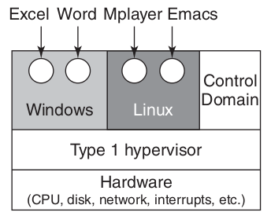

<!-- _paginate: false-->
<!-- _header: "" -->
<!-- _backgroundColor: #FCF3CF -->
<style scoped> h1, h2, h3, h4 {text-align: center;}
section {background-color: #FDEDEC;}
h1 {color:red} a:link {color: darkred;} p {text-align: center; font-size: 25px}</style>
<br/><br/><br/>
### Sistemi Operativi
### Unità 8: Altri Argomenti
Macchine Virtuali e Container
=============================
<br/><br/><br/>
[Martino Trevisan](https://trevisan.inginf.units.it/)
[Università di Trieste](https://www.units.it)
[Dipartimento di Ingegneria e Architettura](https://dia.units.it/)

---
## Argomenti

1. Necessità di isolamento
2. Macchine Virtuali
3. Container
4. Cloud
5. Layer di compatibilità

---
# Necessità di isolamento

---
## Necessità di isolamento

**Premessa 1:** Le organizzazioni comprano macchine molto potenti
- Una server potente costa meno di tanti server piccoli

**Premessa 2:** Ogni utente/dipartimento ha bisogno un macchina dedicata
- Un crash in una macchina non compromette l'altra  

**Conseguenza:** Si vuole *dividere* una macchine potente in più macchine meno potenti

---
## Necessità di isolamento
### Esempio

Un organizzazione compra una macchina potente, e necessità di un server Web, FTP e mail
- Non vuole far girare i 3 software sulla stessa macchine
- Un problema in uno solo, può compromettere tutto
  - Esempio: memory leak, disco pieno, ecc...
- Una vulnerabilità di sicurezza compromette tutti e 3 i sistemi  
  
**Soluzione:** il server viene diviso in tre <r>Macchine Virtuali</r>

---
# Macchine Virtuali

---
## Macchine Virtuali
### Definizione

Una <r>Macchina Virtuale (VM)</r> è un ambiente virtuale che emula un sistema ad elaboratore

Un <r>Hypervisor</r> è il software che rende possibile ciò, usando tecniche di **virtualizzazione**

Tecnica usata **quasi sempre** nelle aziende IT moderne:
- I servizi sono sempre in VM dedicate
- Vengono eseguiti su server potenti dotati di Hypervisor

I servizi **Cloud** offrono la possibilità di usare VM (vedremo)


---
## Macchine Virtuali
### Storia

Il concetto nasce negli anni '60, nell'epoca dei mainframe
Poco utilizzati fino ai primi anni 2000
- Gli hypervisor erano lenti, e non vi era grande necessità
- Si comprava una macchina fisica per ogni servizio

Tornano alla ribalta negli anni 2000
- Gli Hypervisor hanno fatto un salto tecnologico, diventando efficientissimi
- I server sono diventati molto potenti, rendendo conveniente *dividerli* in più macchine di potenza intermedia

---
## Macchine Virtuali
### Hypervisor

Sono un software che permette di emulare un sistema ad elaboratore.
Devono essere:
- **Sicuri:** una VM non deve compromettere il sistema o accedere ad altre VM
- **Affidabili:** una VM non deve essere meno affidabile di una macchina fisica
- **Efficienti:** una VM non deve essere **significativamente** meno veloce di una macchina fisica
  - Tante tecniche per arrivare a ciò

Ci sono due tipo di Hypervisor

---
## Macchine Virtuali
### Hypervisor di Tipo 1

E' un SO dedicato che serve solo a creare VM
Efficienti perchè hanno il controllo completo della macchina
**Esempi:** Xen, Microsoft Hyper-V, VMware ESXi 



---
## Macchine Virtuali
### Hypervisor di Tipo 2

E' un software eseguito in un normale SO
Meno efficienti, ma ormai i SO offrono assistenza a Hypervisor di Tipo 2
**Esempi:** VMWare Player, Virtual Box, QUEMU, Parallels


---
## Macchine Virtuali
### Usare un Hypervisor

Un Hypervisor permette di creare un sistema ad elaboratore virtuale, con CPU, memoria e disco virtuali
- Eventualmente con accesso rete e dispositivi di I/O fisici o virtuali


---
## Macchine Virtuali
### Ottimizazione della CPU

Un Hypervisor permette di emulare in software una CPU virtuale
- Potenzialmente di architettura diversa rispetto alla macchina fisica
- **Esempio:** emulare ARM su CPU x86
- **Molto lento:** Si deve implementare il software una CPU!

Solitamente ciò non avviene e si **ottimizza** l'uso della CPU
- La VM esegue le istruzioni direttamente sulla CPU fisica
- Necessaria cautela


---
## Macchine Virtuali
### Ottimizazione della CPU

<medium>

Nei moderni Hypervisor, la VM esegue le istruzioni sulla **CPU fisica**
- Le CPU moderne permettono il **virtual kernel mode**
  - Permette di eseguire istruzioni in *kernel-mode*
  - Limitando i privilegi
- Il kernel della VM esegue il suo codice in **virtual kernel mode**
  - Altrimenti potrebbe leggere tutta la memoria della macchina fisica!


</medium>

---
## Macchine Virtuali
### Ottimizazione della Memoria

<medium>

Un Hypervisor semplice e lento implementa la memoria in software
- Ogni volta che una VM accede a una locazione di memoria, l'Hypervisor esegue del codice per fornigli il risultato
- Lentissimo!

Gli Hypervisor moderni permettono alle VM di accedere **direttamente** a **porzioni di memoria fisica**
- Necessari due livelli di **paginazione**
  - All'interno della VM: da memoria virtuale di processo a memoria della VM
  - Da memoria della VM a memoria fisica

Serve cooperazione del sistema fisico e della CPU!  

</medium>

---
## Macchine Virtuali
### Ottimizazione della Memoria

<medium>

Le CPU moderne supportano **Page Table annidate**
- **Primo livello:** mappa tra processo nella VM a memoria della VM
- **Secondo livello:** mappa tra memoria della VM e memoria fisica


</medium>

---
## Macchine Virtuali
### Situazione odierna

Tecnologia pienamente matura:
- **Sicura**
- **Efficiente:** meno del 5% di penalizzazione rispetto a macchina fisica

Tutte le aziende hanno **cluster** dedicati a ospitare VM
- Un team specializzato gestisce il cluster e il software di virtualizzazione
- I team di sviluppo installano i servizi su VM dedicate


---
## Macchine Virtuali
### Su Linux

- Per giocare: **VirtualBox**
- Per installare VM su un server: **Kernel-based Virtual Machine (KVM)** + **Libvirt**
- Per un cluster di VM: **OpenStack**

Altre alternative possibili, non tutte *open source* e *free*

---
# Container

---
## Container
### Limitazioni delle VM

Una VM ha allocate **staticamente** una certa quantità di risorse della macchina fisica
**Esempio:** un server con $16$ core e $64GB$ di RAM
- Posso fare $3$ VM con $5$ core e $20GB$ di RAM ognuna
- Alcune risorse vanno mantenute per il funzionamento della macchina fisica: $1$ core $4GB$ di RAM

Questo può essere **inefficiente**
- Non sempre tutte le VM hanno necessità di $5$ core!


---
## Container
### Limitazioni delle VM

Con l'approccio ***una VM - un'applicazione***, su tutte le VM gira un SO, che di fatto esegue pochi processi
- Quelle per cui è dedicata la VM
- **Inefficiente!** proliferazione di SO che non fanno quasi niente!

Quando voglio avviare una **nuova applicazione**, devo:
- Creare una VM
- Installare il SO
- Avviare la mia applicazione

Ci metto tanto tempo (di lavoro umano)

---
## Container
### VM vs SO

Ricordiamoci a cosa servono le **VM**:
- **Isolare** sistemi indipendenti
- **Controllare** che essi non si danneggino a vicenda

Ma è simile allo scopo di un **SO**:
- **Isolare** processi diversi
- **Controllare** l'accesso alle risorse tramite utenti e privilegi

---
## Container
### VM vs SO

Purtroppo, in un SO, un'applicazione problematica può bloccare il sistema, se:
- Usa al 100% la CPU
- Riempie il disco o la RAM

Un'applicazione potrebbe provocare problemi a un'altra applicazione
- Se modifica i suoi file di configurazione
- Satura le risorse di I/O rete, ecc...

---
## Container
### VM vs SO

**Soluzione:** Potrei avviare un processo che ha risorse limitate
- Il SO si occupa di limitare l'accesso a CPU/memoria/disco

Sarebbe *quasi* come una VM
- Un'applicazione che gira senza poter influenzare le altre applicazioni!

I sistemi Linux forniscono queste funzionalità:
- Ovvero far girare processi con privilegi limitati

---
## Container
### Definizione

Un <r>container</r> è un albero di processi che gira con privilegi limitati
- Non ha accesso completo alle risorse
- Pensa di essere l'unico processo in esecuzione

I container sono un'illusione: illudono un processo di avere poche risorse.
Vedi: [Containers as an illusion](https://man7.org/conf/ndcsecurity2022/containers_as_an_illusion-NDC-Security-2022-Kerrisk.pdf)

---
## Container
### Definizione

I processi di un container non possono:
- Vedere gli altri processi della macchine
- Vedere le risorse che non gli sono state assegnate

Ovviamente un container non deve poter compromettere l'intera macchina
- Si utilizzano varie funzionalità di Linux per raggiungere questi scopi

---
## Container
### Isolare il file system

Linux permette di avviare un processo che vede solo un sotto albero del FS
**Funzionalità `chroot`:** *cambia radice del FS*

Permette di evitare che un processo (e i suoi figli) legga/modifichi file fuori dall'albero

**Sintassi:**
```bash
chroot /path/to/new/root command
```

---
## Container
### Isolare i CPU e memoria

E' possibile limitare quanta CPU e memoria un processo usa.
**Funzionalità `cgroup`:** offerta dalle System Call Linux
- Permettono di limitare:
  - Uso della CPU
  - Uso della memoria
  - Velocità di I/O
  - Traffico di rete
  
Ovvero, permettono di evitare che un processo sovraccarichi il sistema


---
## Container
### Isolare i CPU e memoria

<medium>

I `cgroup` sono relativamente nuovi. Stabili dal 2018
Vengono usati attraverso uno pseudo file system 
- In `/sys/fs/cgroup`

Operazioni:
- Creazione di un gruppo di processi:
  `mkdir /sys/fs/cgroup/my-group`
- Limitazione delle risorse:
  `echo 50000 10000 > /sys/fs/cgroup/my-group/cpu.max`
  Significa che i processi del gruppo, in totale, non possono usare più del 50% del tempo CPU della macchina
- Collocazione di un processo nel gruppo:
  `echo 8764 > /sys/fs/cgroup/my-group/cgroup.procs`

</medium>

---
## Container
### Isolare i namespace

E' possibile creare processi che non vedono le risorse globali della macchina fisica, ovvero:
- Quali sono gli altri processi in esecuzione
- Le interfacce di rete
- I dispositivi di I/O
- Gli utenti e gruppi sulla macchina

**Funzionalità *Namespace*:** offerta dalle System Call Linux
- Vedi comandi `unshare` e `nsenter`


---
## Container
### Container Engine

Queste funzioni del SO sono **potenti**, ma **poco usabili**:
- Per usarle, necessario conoscerle a fondo
- Errori nell'utilizzo possono compromettere il sistema
- Non c'è sicurezza by default:
  - Necessario **togliere** privilegi ai processi

Esistono dei software che si chiamano <r>Container Engine</r> che permettono di usare in maniera semplice queste funzionalità
- Avviare container: gruppi di processi isolati
- Monitorarne il funzionamento


---
## Container
### Container Engine

Offrono comandi/API semplici per creare container. Popolari:
- **Linux Containers (LXC):** tra i primi a nascere nel 2008
- **Docker:** Nato nel 2013. Standard *de facto*

**Principio di funzionamento:** eseguono processi con risorse limitate, che vivono in un file system limitato
- Di **default**, i container hanno privilegi minimi
- Possibile configurarli per avere maggiori privilegi: e.g., accedere a porzioni del FS

---
## Container
### Docker

Si può installare su ogni macchina Linux
- Disponibile anche su MacOS e Windows (ma implementato tramite una VM)

Permette di avviare container a partire da una <r>Immagine</r>:
- E' un File System che contiene il programma da eseguire
- Ed eventuali dipendenze: librerie condivise, altri programmi, file di configurazione

La componente interna di Docker che permette di eseguire i container si chiama `containerd`

---
## Container
### Docker: container e immagine


Un <r>Container</r> è una <r>Immagine</r> in esecuzione:
- Un insieme di processi che può operare solo sui file presenti nell'immagine
- I file dell'immagine vengono copiati
- I processi possono creare nuovi file o modificare quelli esistenti
- Non può accedere ai file della macchina fisica

---
## Container
### Docker Hub

Esiste una libreria di immagini pre-costruite su **Docker Hub** (https://hub.docker.com/)
- Ognuna contiene un software installato con le sue dipendenze
- Può essere scaricata ed eseguita, creando un container
- Ogni immagine ha una versione identificata da un **tag**
  - *latest* indentifica l'ultima versione

E' anche possible creare la propria immagine col proprio software


---
## Container
### Docker: Comandi

- `docker pull <immagine>`: scarica un `immagine` da Docker Hub
- `docker ps`: mostra i container in esecuzione
- `docker run --name <nome> <immagine>`: esegue un container da `immagine` e gli assegna il `<nome>`
- `docker stop <nome>`: termina il container identificato da `nome`
Molti altri comandi...

Necessari permessi di *superuser*, da fornire con `sudo`


---
## Container
### Docker e file montati

Di default, un container **non** può accedere ai file della macchina fisica, ma solo a una copia di quelli dell'immagine

L'opzione `-v pathLocale:pathContainer` permette al container di accedere a `pathLocale`, che viene **montato** in `pathContainer` all'interno del FS del container

**Esempio:**
```bash
docker run --name nome \
	-v /home/martino:/opt/home-di-martino \
	immagine
```
Il container `nome` può accedere al path fisico `/home/martino` tramite il path `/opt/home-di-martino`

---
## Container
### Docker e rete

Ogni container ha un **indirizzo IP** in una rete virtuale che collega tutti i container
- Possibile comunicazione tra container
- Possibile comunicazione tra macchina fisica e container
- Possibile comunicazione tra container e Internet tramite Default Gateway virtuale

### Docker, CPU e memoria

**Limitazione di CPU:** `docker run --cpus 2 <immagine>`

**Limitazione di memoria:** `docker run --memory=512m <immagine>`


---
## Container
### Docker: esempio

Creazione di container per eseguire il DBMS *PostgreSQL*
- Un DBMS relazionale
- Un processo del database deve essere in esecuzione
- Vi si accede tramite rete e un protocollo dedicato

**Scaricamento dell'immagine:**
`docker pull postgres`


---
## Container
### Docker: esempio

<medium>

**Avviamento del container:**
```bash
docker run -d \
	--name some-postgres \
	-e POSTGRES_PASSWORD=mysecretpassword \
	-e PGDATA=/var/lib/postgresql/data/pgdata \
	-v /home/martino/db:/var/lib/postgresql/data \
	postgres                                                                
```

Opzioni usate:
- `-d`: fai partire il processo in background
- `-e VAR=VAL`: specifica variabili d'ambiente visibili nel container
  - Usato per password del DB e per specificare dove esso salva i dati
- `-v /home/martino/db:/var/lib/postgresql/data`: i dati sono salvati sulla macchina fisica in `/home/martino/db` ma nel container al path `/var/lib/postgresql/data`

</medium>

---
## Container
### Docker: esempio

**Privilegi del container:**
Il container `some-postgres` esegue l'immagine `postgres`.
Ha accesso alle risorse fisiche di:
- CPU e memoria senza limiti
- File System: solo `/home/martino/db`
- Rete: ha un indirizzo IP. Il server si mette in ascolto sulla porta di default $5432$

---
## Container
### Docker: esempio

**Monitoriaggio:**
Se tutto è andato a buon fine, il container è in esecuzione. Si osserva con:
```bash
$ docker ps
CONTAINER ID  IMAGE    COMMAND                CREATED        STATUS        PORTS    NAMES
c6320fa9eb9b  postgres "docker-entrypoint.s…" 50 seconds ago Up 49 seconds 5432/tcp some-postgres
```

Si può ottenere il suo IP con
```bash
$ docker inspect some-postgres
...
"IPAddress": "172.17.0.2",
...
```

---
## Container
### Docker: esempio

<small>

**Sulla macchina fisica:**

I processi di `postgres` sono normali processi in esecuzione, ma con privilegi **molto limitati**
```bash
$ ps fax
 443964 ?        Sl     0:05 /usr/bin/containerd-shim-runc-v2 -namespace moby ....     
 443985 ?        Ss     0:01  \_ postgres
 444080 ?        Ss     0:00      \_ postgres: checkpointer 
 444081 ?        Ss     0:00      \_ postgres: background writer 
 444083 ?        Ss     0:00      \_ postgres: walwriter
 444085 ?        Ss     0:00      \_ postgres: logical replication launcher
...
```

I file dove il DB salva i suoi dati sono in 
```bash
$ sudo tree /home/martino/db/ -L 2                                                    
/home/martino/db/
└── pgdata
    ├── base
    ├── global
    ├── pg_commit_ts
...
```

</small>


---
## Container
### Docker: esempio

**Utilizzo:**

Il DB si può usare installando il client `psql`, col comando:
```bash
$ PGPASSWORD=mysecretpassword psql -U postgres -h 172.17.0.2 
psql (12.12 (Ubuntu 12.12-0ubuntu0.20.04.1), server 15.1 (Debian 15.1-1.pgdg110+1))
WARNING: psql major version 12, server major version 15.
         Some psql features might not work.
Type "help" for help.

postgres=# 
```

Il DB salva i dati nella cartella fisica: `/home/martino/db`
Con 3 semplici comandi si è installato PostgreSQL!

---
## Container
### Utilizzo odierno

L'utilizzo di container sta prendendo il posto dell'utilizzo delle VM.
- Più scalabile
- Costringe a separare codice da dati

Nelle grandi aziende, si utilizzano **cluster di nodi** che eseguono container.
Esistono software di orchestrazione di container basati su Docker:
- **Kubernetes**: il più usato. Open-Source
- **OpenShift** e **OKD**: proprietari di Red Hat

---
# Cloud

---
## Cloud
### Scenario

Le tecnologie di VM e container permettono a un'azienda di collocare i propri servizi in qualsiasi luogo del mondo

Per molte aziende è conveniente affittare una VM da un'azienda specializzata, anzichè comprare server fisici
- Avere server farm è costoso: necessario raffreddamento e sorveglianza
  - Economia di scala con data center grandi
- Il personale specializzato è poco e costa molto!
- Malfunzionamenti possono provocare gravi danni economici!


---
## Cloud
### Cloud Provider

**Conseguenza:** sempre più spesso le aziende comprano servizi da <r> Cloud Provider</r>
Tra i più popolari cloud provider:
- **Amazon Web Services**
- **Google Cloud**
- **Microsoft Azure**
- **Aruba** (in Italia)


---
## Cloud
### Servizi offerti

<medium>

Diverse tipologie di servizi offerti dai cloud provider
- **IAAS (Infrastructure As A Service)**: possibilità di creare e utilizzare **VM** o **container**
- **PAAS (Platform As A Service**: il cloud provider offre anche una **piattaforma di sviluppo**. L'utente scrive solo l'applicazione
  **Esempio 1:** Database SQL remoto in Cloud
  **Esempio 2:** servizio di hosting per siti web dinamici: supporto a hosting HTML, esecuzione server-side di PHP e SQL
- **SAAS (Software As A Service)**: l'utente compra una *subscription* a un servizio completo
  **Esempio:** un'azienda compra un abbonamento a Microsoft Teams
  
</medium>

---
## Cloud
### Servizi offerti


---
## Cloud
### Prospettive

Sempre più spesso aziende ed enti pubblici fanno ricorso a Cloud Provider per IAAS/PAAS/SAAS

**Vantaggi:**
- Minore costo iniziale
- Maggiore affidabilità

**Svantaggi:**
- *Vendor Lock-in*
- Perdita di *Know How*


---
# Layer di compatibilità

---
## Layer di compatibilità
### VM e Software

Le VM permettono di avere un sistema ad elaboratore **virtuale**
- Su cui installare un SO a piacere
- Esempio: VM con Linux su PC Windows

Spesso, la VM serve solo a usare un **software** scritto per un SO diverso
- Esso può girare solo su $(Architettura,SO)$ per cui é stato compilato
- Non é possible usare su altro $SO$, anche se stessa $Architettura$. **Le System Call sono diverse!**


---
## Layer di compatibilità
### Definizione

Un <r>Layer di compatibilità</r> é un **software** che permette di eseguire un programma scritto per un $SO$ diverso
- Ma compilato su stessa $Architettura$

Implementa le **System Call** di un altro SO, tramite quelle del SO corrente.
- **Esempio:** POSIX `read` ⇒ Win32 `ReadFile` 

Funzionamento **complesso** e problematico
- Esistono meccanismi *non-mappabili*
- Gestione di I/O complessa: dipende da SO e da driver

---
## Layer di compatibilità
### Mapping tra SO


---
## Layer di compatibilità
### Tipologie


**Layer di compatibilità a livello Application Programming Interface (API):** Richiede ricompilazione del software
- Basato su una libreria software implementa le System Call di un SO tramite quelle di un altro 

**Layer di compatibilità a livello Application Binary Interface (ABI):** NON</r> richiede ricompilazione del software
- Il programma usa le System Call del proprio SO. Il Layer le intercetta e invoca quelle del SO corrente

---
## Layer di compatibilità
### Cygwin

Permette di usare programmi che usano System Call **POSIX** su Windows
- A livello **API**
- Richiede ricompilazione

**Nota:** POSIX $\neq$ Linux

**Cygwin** é semplicemente un'altro ambiente per compilare ed eseguire programmi POSIX che usano le System Call e Librerie POSIX

---
## Layer di compatibilità
### Windows Subsystem For Linux $1$

Permette di usare programmi per **Linux** su Windows
- A livello **ABI**
- Non richiede ricompilazione

### Windows Subsystem For Linux $2$ (da 2019)

E' una VM minimale con un vero kernel
- **NON** é un Layer di compatibilità
- Più flessibile, ma più lenta

---
## Layer di compatibilità
### Wine

Permette di usare programmi per **Windows** su Linux e MacOS
- A livello **ABI**
- Non richiede ricompilazione
  - Non sarebbe possibile con software closed-source Windows

Molto matura e usata:
- Funzionano anche programmi con interfaccia grafica
- Alcuni programmi complessi invece non si possono usare

---
## Domande

<!-- _backgroundColor: #FFF9E3 -->


<medium>

Quale tra questi non è una motivazione per l'uso di VM?
`• Maggiore sicurezza` `• Maggiore affidabilità` `• Maggiore velocità della memoria`

Una macchina fisica sta eseguendo una VM. Quanti kernel sono in esecuzione?
`• Nessuno` `• 1` `• 2` `• 3`

Una VM può usare direttamente la memoria fisica della macchina?
`• Mai` `• Sempre` `• Se la CPU lo permette`

Una macchina fisica sta eseguendo una container. Quanti kernel sono in esecuzione?
`• Nessuno` `• 1` `• 2` `• 3`

</medium>

---
## Domande

<!-- _backgroundColor: #FFF9E3 -->


<medium>

Cosa è un container?
`• Un FS isolato` `• Un namespace` `• Un gruppo di processi con privilegi limitati`

Un container può accedere al File System della macchina ospitante?
`• Sempre` `• Mai` `• Dipende da come è stato creato`

Quale tra questi non è un servizio offerto dai Cloud Provider?
`• Esecuzione di VM` `• Abbonamento a database remoto` `• Licenze di software da eseguire su PC`

Quali delle seguenti affermazioni é vera? Un layer di compatibilità:
`• é una VM` `• é un insieme di container`
`• permette di esguire programmi compilati su un'architettura diversa`
`• permette di esguire programmi compilati su un SO diverso`

</medium>


