<!-- _paginate: false-->
<!-- _header: "" -->
<!-- _backgroundColor: #FCF3CF -->
<style scoped> h1, h2, h3, h4 {text-align: center;}
section {background-color: #FDEDEC;}
h1 {color:red} a:link {color: darkred;} p {text-align: center; font-size: 25px}</style>
<br/><br/><br/>
### Sistemi Operativi
### Unità 8: Altri Argomenti
Rete e socket in Linux
=============================
<br/><br/><br/>
[Martino Trevisan](https://trevisan.inginf.units.it/)
[Università di Trieste](https://www.units.it)
[Dipartimento di Ingegneria e Architettura](https://dia.units.it/)

---
## Argomenti

1. Lo stack di rete TCP/IP in Linux
2. I Socket
3. Funzioni e System Call per i Socket
4. Comandi per Networking in Linux

---
# Lo stack di rete TCP/IP in Linux

---
## Lo stack di rete TCP/IP in Linux
### Internet

Internet è un l'insieme di nodi e apparati di rete che permettono una comunicazione mondiale
- Internet è l'unnione di tante ***Network***
- Collegate tramite ***Router***
- Ogni nodo è identificato da un **Indirizzo IP**

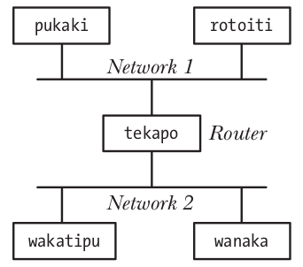

---
## Lo stack di rete TCP/IP in Linux
### Indirizzi IP

Un indirizzo IP identifica univocamente un nodo in Internet
- Numero su 32 bit
- Composto da una parte di network e una di host
  - La netmask delimita le due parti
  - Necessario per la trasmissione di pacchetti tramite Ethernet
L'indirizzo IP $127.0.0.1$ identifica per convensione il *Local Host*
  - Ovvero serve per mandare un pacchetto a se stesso

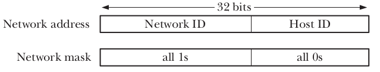

---
## Lo stack di rete TCP/IP in Linux
### I protocolli

<medium>

I protocolli formano una **Pila**:
- Il livello $N$ usa i serizi del livello $N-1$
- Li migliora e li offre al livello $N+1$
- Il livello $N$ parla col suo omologo su un altro nodo


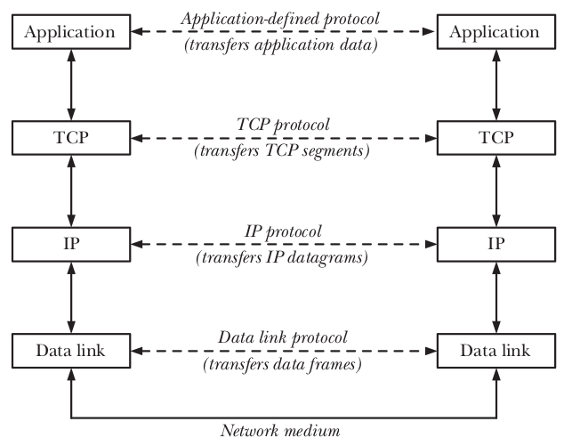

</medium>

---
## Lo stack di rete TCP/IP in Linux
### I protocolli

<medium>

I protocolli vengono **inscatolati** uno dentro l'altro:
- Un frame **Ethernet** trasporta un pacchetto **IP**
- Un pacchetto **IP** trasporta un segmento **TCP**
- Un segmento **TCP** contiene i dati dell'**applicazione**

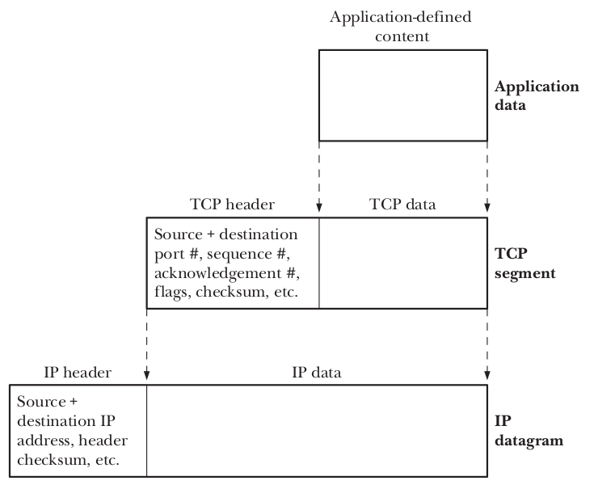

</medium>

---
## Lo stack di rete TCP/IP in Linux
### Utilizzo dei protocolli

<medium>

Le applicazioni in Linux possono usare i servizi di:
- TCP per avviare una comunicazione orientata al flusso
- UDP per mandare datagrammi
- Pacchetti IP generici

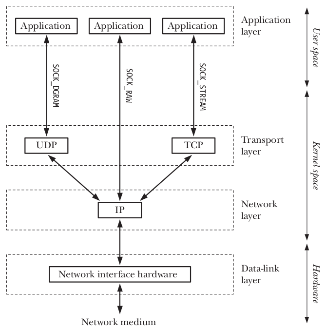

</medium>

---
## Lo stack di rete TCP/IP in Linux
### Utilizzo dei protocolli

<medium>

Il **kernel** implementa i moduli TCP, UDP, IP
Offre delle **System Call** per poterne utilizzare i servizi
- Oggetto di questa lezione


</medium>


---
## Lo stack di rete TCP/IP in Linux
### Domain Name System

<small>

Il Domain Name System (DNS) è un sistema di directory distribuito e gerarchico
- Serve per identificare nodi di Internet tramite un **nome di dominio** anzichè un indirizzo IP
- Permette la conversione tra indirizzi IP e nomi di dominio

Linux offre funzioni per usare il DNS in maniera semplice

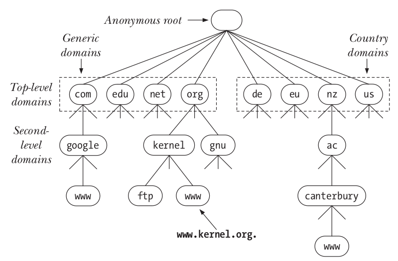

</small>

---
# I Socket

---
## I Socket
### Definizione

I <r>Socket</r> uno strumento di Inter-Process Communication per scambiare dati tra diversi **nodi di rete**

Utilizzo simile alle *pipe* e alle *FIFO*
- Identificati da un *file descriptor*
- Vi si accede con le System Call `read` e `write`

A differenza di  *pipe* e alle *FIFO*
- Connettono nodi diversi
- Vengono creati in maniera diversa con System Call dedicate

---
## I Socket
### Tipologie di Socket

Esistono quattro tipologie di socket:
- **UNIX**: permettono comunicazione tra processi di uno stesso nodo
- **Stream Socket**: permettono comunicazione tramite TCP
- **Datagram Socket**: permettono comunicazione tramite UDP
- **Raw Socket**: permettono comunicazione tramite pacchetti grezzi IP

Basati su modello **client/server**

---
## I Socket
### UNIX Socket

Comunicazione tra processi di uno stesso nodo
- Concettualmente **molto simili** a una *pipe* o *FIFO*

**Differenza**
- Usano modello **client/server**
- Un server si mette in ascolto
- Un client contatta il server e inizia la comunicazione

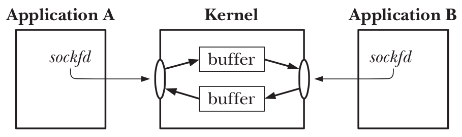


---
## I Socket
### Stream Socket

Comunicazione tramite TCP
- Servizio orientato alla connessione
- Client e server comunicano tramite un flusso di byte

Simile a una *pipe* o *FIFO* tra **nodi diversi**

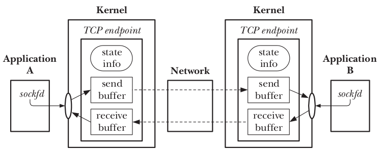


---
## I Socket
### Datagram Socket

Comunicazione tramite UDP
- Client e server si scambiano **messaggi**
- Servizio non affidabile
  - Possibile perdita di pacchetti

**Differenze:**
- Datagram Socket:
  - Orientato ai **messaggi**
  - Non affidabile
- UNIX Socket e Stream Socket:
  - Orientato allo **stream**
  - Affidabile


---
## I Socket
### Active/Passive socket

I socket sono basati su modello **client/server**

Un **Passive Socket** aspetta connessioni in arrivo
- Implementa un server

Un **Active Socket** è effettivamente connesso a un altro nodo
- Permette lo scambio di dati
- Usato da un client per comunicare col server
- Usato anche dal server, **dopo** aver accettato una nuova connessione

---
# Funzioni e System Call per i Socket

---
## Funzioni e System Call per i Socket

I sistemi Linux/POSIX mettono a disposizione System Call per usare i socket
- Ogni socket è identificato da un File Descriptor
- Similmente ai file o *FIFO* aperti, o *pipe*. 
- Si effettua I/O usando le System Call `read` e `write`
  - Tranne che per i *Datagram Socket*
  
Per creare un socket, si usano System Call dedicate
- Bisogna specificare indirizzi IP e porte
- Attendere che il kernel stabilisca la connessione

---
## Funzioni e System Call per i Socket
### UNIX e Stream Socket

Un client usa: `socket` e `connect`

Un server usa `socket`, `bind`, `listen` e `accept`

Entrambi usano `read` `write` e `close`

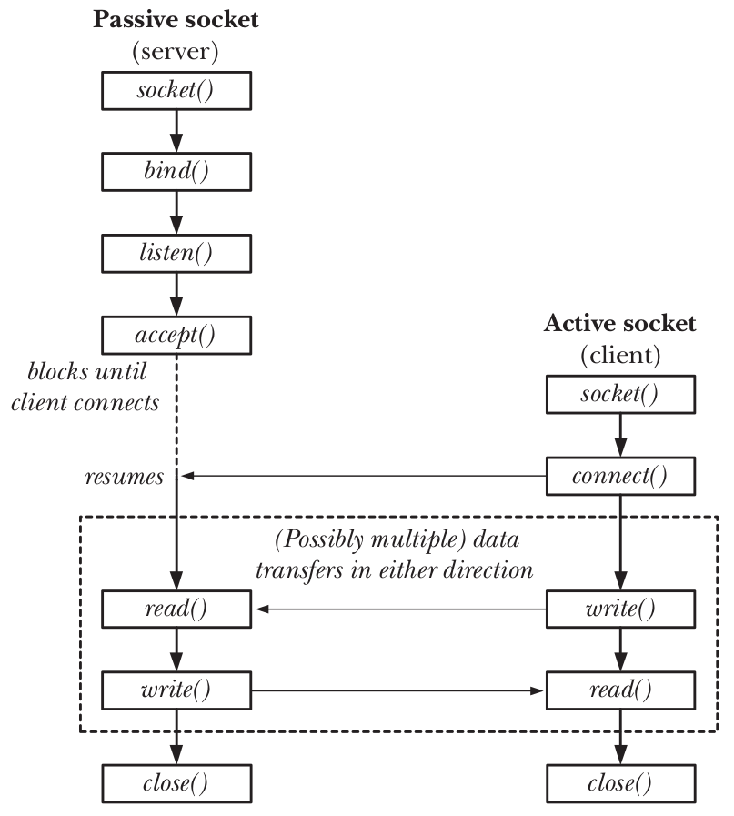


---
## Funzioni e System Call per i Socket
### Datagram Socket

Un client usa: `socket`

Un server usa `socket`, `bind`

Entrambi usano `sendto` e `recvfrom` e `close`

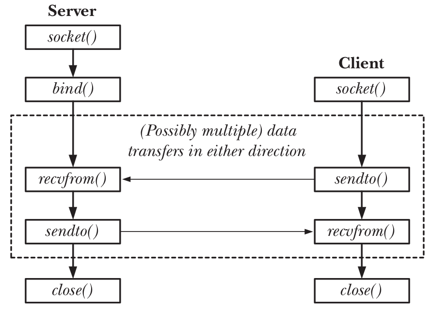


---
## Funzioni e System Call per i Socket

Noi vediamo in dettaglio solo gli Stream Socket
- Che utilizzano TCP
- Sono affidabili
- Orientati alla connessione
- Client e server comunicano tramite un stream di byte
- Semantica simile a *pipe*, ma **bidirezionale**

Nelle prossime slide, sono presentate le System Call, ipotizzando di creare uno **Stream Socket**

---
## Funzioni e System Call per i Socket
### Creazione di un socket

<medium>

```c
#include <sys/socket.h>
int socket(int domain , int type , int protocol);
```

Crea un socket. Gli argomenti `domain` e `protocol` ne specificano la natura.
Ritorna il File Desciptor, se no $-1$ 

**Esempio:**
**Stream Socket** `int fd = socket(AF_INET, SOCK_STREAM, 0)`
**UNIX Socket** `int fd = socket(AF_UNIX, SOCK_STREAM, 0);`
**Datagram Socket** `int fd = socket(AF_INET, SOCK_DGRAM, 0))`

</medium>

---
## Funzioni e System Call per i Socket
### Trasformazione in Socket Attivo

```c
#include <sys/socket.h>
int connect(int sockfd , const struct sockaddr * addr , socklen_t addrlen );
```

Rende il socket `sockfd` attivo e si connette a indirizzo IP e porta specificati in `addr` e `addrlen`
Ritorna 0 in caso di successo, se no $-1$

La `struct sockaddr` contiene un indirizzo IP, una porta o entrambi
- Entrambi in questo caso

La `connect` è **bloccante** finchè non viene stabilita la connessione (TCP).

---
## Funzioni e System Call per i Socket
### `struct sockaddr`

```c
struct sockaddr {
    sa_family_t sa_family;  /* Address family (AF_* constant) */
    char sa_data[14];       /* Socket address (size varies
                               according to socket domain) */
};
```

La `struct sockaddr` contiene un indirizzo IP, una porta o entrambi.
Deve essere **generica**: supportare protocolli potenzialmente diversi da suite TCP/IP

---
## Funzioni e System Call per i Socket
### `struct sockaddr`

Il campo `sa_data` deve contenere gli indirizzi e le porte
Quando si usano socket con TCP/IP si utilizza la `struct sockaddr_in`

```c
struct sockaddr_in {
    sa_family_t    sin_family; /* address family: AF_INET */
    in_port_t      sin_port;   /* port in network byte order */
    struct in_addr sin_addr;   /* internet address */
};
```

Viene usata in tutte le System Call che richiedono una `struct sockaddr`.
- Le System Call solo generiche
- Se noi usiamo TCP/IP, usiamo `struct sockaddr_in`

---
## Funzioni e System Call per i Socket
### Trasformazione in Socket Passivo

```c
#include <sys/socket.h>
int bind(int sockfd , const struct sockaddr * addr , socklen_t addrlen );
```

Rende il socket `sockfd` passivo, ovvero lo mette in ascolto sulla porta specificata in `addr` e `addrlen`
Ritorna 0 in caso di successo, se no $-1$

La `struct sockaddr` contiene un indirizzo IP, una porta o entrambi
- Solo una porta in questo caso


---
## Funzioni e System Call per i Socket
### Attivazione di un Socket Passivo

```c
#include <sys/socket.h>
int listen(int sockfd , int backlog);
```

Dopo che un socket `sockfd` è stato specificato come passivo (con `bind`), la `listen` lo mette effettivamente in ascolto sulla porta specificata.
Il parametro `backlog` determina quanto connessioni in attesa possono accodarsi prima di essere servite
Ritorna 0 in caso di successo, se no $-1$


---
## Funzioni e System Call per i Socket
### Accettazione di connessioni a Socket Passivo

```c
#include <sys/socket.h>
int accept(int sockfd , struct sockaddr * addr , socklen_t * addrlen);
```

Attende che una connessione arrivi al socket passivo `sockfd`
- Bloccante finchè non arriva una connessione

Nel momento in cui arriva una nuova connessione:
- La funzione ritorna
- Il valore di ritorno è un **nuovo socket attivo**
- In `addr` (e `addrlen`) è specificato l'indirizzo del client


---
## Funzioni e System Call per i Socket
### I/O su socket attivi

Un socket attivo viene creato:
- Direttamente da un client dopo che si è connettersi
- In un server, ogni volta che la `accept` ritorna, e permette la comunicazione con un client

Un socket è **bidirezionale**. In caso di **Stream Socket**:
- Si effettua I/O con `read` e `write`, o volendo con le funzioni specifiche per i socket `send` e `recv`
- Un socket viene chiuso tramite la `close`


---
## Funzioni e System Call per i Socket
### Conversione di indirizzi IP

<medium>

Necessarie funzioni per convertire indirzi IP in stringa e in formato binario su $4B=32bit$

```c
char *inet_ntoa(struct in_addr in);
int inet_aton(const char *cp, struct in_addr *inp);
```

IP in formato stringa specificato come `char *`
IP in formato binario specificato come `struct in_addr`
- Tipicamente si usa:
  ```c
  struct sockaddr_in s;
  inet_aton("127.0.0.1", &s.in_addr`);
  ```
  
Le varianti `inet_ntop` e `inet_pton` sono equivalenti, ma più moderne

</medium>

---
## Funzioni e System Call per i Socket
### Network Byte Order

<medium>

Indirizzi IP  e porte sono numeri interi su $32$ e $16$ bit.
Diverse architetture usano **convenzioni diverse** per l'ordine delle cifre
Necessario mettersi d'accordo quando si trasmettono via rete!
- Si usa **Big Endian**, anche detto **Network Byte Order**

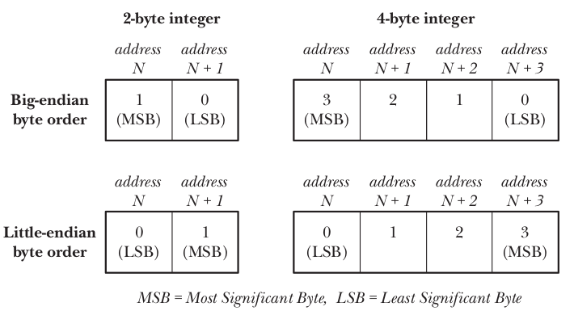
</medium>

---
## Funzioni e System Call per i Socket
### Network Byte Order

```c
#include <arpa/inet.h>
uint32_t htonl(uint32_t hostlong);
uint16_t htons(uint16_t hostshort);
uint32_t ntohl(uint32_t netlong);
uint16_t ntohs(uint16_t netshort);
```
Convertono da formato dell'architettura corrente (`h`) a Network Byte Order (`n`), numeri su $32bit$ `l` e su $16bit$ (`s`)

**Esempio:**
```c
uint16_t port_h = 4242;
uint16_t port_n = htons(port_h);
```


---
## Funzioni e System Call per i Socket
### Modificare le opzioni di un socket


```c
#include <sys/socket.h>
int getsockopt(int sockfd, int level, int optname,
               void *restrict optval, socklen_t *restrict optlen);
int setsockopt(int sockfd, int level, int optname,
               const void *optval, socklen_t optlen);
```

Manipolano le opzioni per il socket `sockfd`.
Modificano comportamenti di default:
- Forzare la bind a una certa porta: `SO_REUSEADDR`
- Parametri di funzionamento di TCP
- Molte altre

---
## Funzioni e System Call per i Socket
### Flusso di Stream Socket (Client)

```c
// Creazione
int fd = socket(AF_INET, SOCK_STREAM, 0);

/* Connessione: specifica indirizzo IP
   e porta del server */
connect(fd,
        (struct sockaddr*)&address,
        sizeof(address)));

// Input/Output
write(fd, buffer, n);
read(fd, buffer, SIZE);

// Chiusura
close(fd);
```

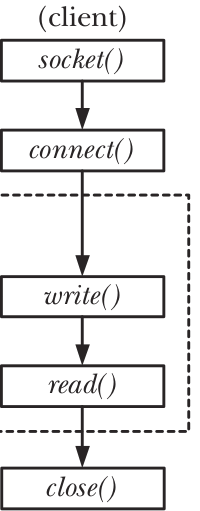


---
## Funzioni e System Call per i Socket
### Flusso di Stream Socket (Server)

```c
// Creazione                                                 
int fd = socket(AF_INET, SOCK_STREAM, 0);

// Bind: specifica porta
bind(fd, (struct sockaddr*)&address, sizeof(address));

// Listen: specifica lunghezza della coda in attesa
listen(fd, 3);

// Servizio ai client
while (1){

    /* Attesa di un client: ottiene indirizzo IP
       e porta del client */
    int active_fd  = accept(fd,
                            (struct sockaddr*)&address,
                            (socklen_t*)&addrlen));
                            
    // Input/Output
    write(active_fd, buffer, n);
    read(active_fd, buffer, SIZE);

    // Chiusura
    close(active_fd);
}

// Chiusura
close(fd);
```

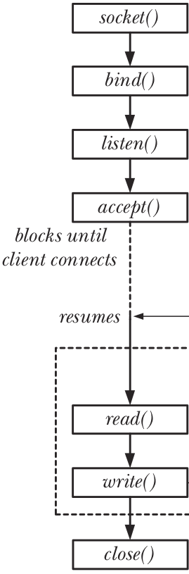


---
## Funzioni e System Call per i Socket
### Risoluzione DNS

Esistono funzioni di libreria per effettuare risoluzioni DNS:
```c
#include <netdb.h>
struct hostent *gethostbyname(const char *name);
```

Effettua una risoluzione DNS per il dominio `name`.
Ritorna una `struct hostent`, una struttura molto complessa che contiene i risultati della risoluzione

E' deprecata, ora si usa la simile `getaddrinfo`

Non vediamo in dettaglio


---
## Funzioni e System Call per i Socket
### Esercizio

<!-- _backgroundColor: #FFF9E3 -->

Il server $45.79.112.203$ alla porta TCP $4242$ offre un servizio di `echo`.
Se un client vi si connette e manda un messaggio, il server risponde con lo stesso messaggio.
Si crei un programma che si connette al suddeto endpoint, manda un messaggio e stampa la risposta un messaggio.


---
## Funzioni e System Call per i Socket
### Esercizio

<!-- _backgroundColor: #FFF9E3 -->


```c
#include <stdio.h>                                                                                                         
#include <stdlib.h>
#include <unistd.h>
#include <sys/socket.h>
#include <arpa/inet.h>
#define SIZE 1024
#define MESSAGGIO "Ciao Mondo!\n"

int main(int argc, char *argv[]){

        int fd, n;
        char buffer[SIZE];
        struct sockaddr_in address;

        if ((fd = socket(AF_INET, SOCK_STREAM, 0)) < 0) {
            perror("socket failed");
            exit(EXIT_FAILURE);
        }

        address.sin_family = AF_INET;
        address.sin_port = htons(4242);
        if (inet_aton("45.79.112.203", &address.sin_addr) <=0){
            perror("convert server ip failed");
            exit(EXIT_FAILURE);        
        }

        if ((connect(fd, (struct sockaddr*)&address,sizeof(address)))< 0){
            perror("connect failed");
            exit(EXIT_FAILURE);        
        }
        
        write(fd, MESSAGGIO, sizeof(MESSAGGIO));
        printf("Tramesso: %s\n", MESSAGGIO);
        
        n = read(fd, buffer, SIZE);
        buffer[n] = 0;
        printf("Ricevuto: %s\n", buffer);
        close(fd);
        
}
```


---
# Comandi per Networking in Linux

---
## Comandi per Networking in Linux
### Interfacce

La gestione della rete cambia a seconda di distribuzione Linux/POSIX.

In un sistema Linux, ogni interfaccia di rete è identificata da un nome, e viene configurata tramite file di configurazione.
- `/etc/network/interfaces`: indirizzo IP, subnet mask e default gateway
- `/etc/resolv.conf`: resolver DNS
Ora, quasi tutti i sistemi hanno meccanismi di più alto livello per queste configuazioni

---
## Comandi per Networking in Linux
### Comandi

**Listing e configurazione di interfacce:** `ifconfig` o `ip addr`
**Esempio**:
```bash
$ ifconfig
eno1: flags=4163<UP,BROADCAST,RUNNING,MULTICAST>  mtu 1500
        inet 140.105.50.104  netmask 255.255.255.0  broadcast 140.105.50.255              
        inet6 fe80::bf0b:ea7e:b8a9:d363  prefixlen 64  scopeid 0x20<link>
        ether 2c:f0:5d:c3:7b:b5  txqueuelen 1000  (Ethernet)
        RX packets 42847340  bytes 24715980225 (24.7 GB)
        RX errors 0  dropped 8658136  overruns 0  frame 0
        TX packets 20885569  bytes 25752872016 (25.7 GB)
        TX errors 0  dropped 0 overruns 0  carrier 0  collisions 0
        device interrupt 16  memory 0xb1200000-b1220000  

lo: flags=73<UP,LOOPBACK,RUNNING>  mtu 65536
        inet 127.0.0.1  netmask 255.0.0.0
        inet6 ::1  prefixlen 128  scopeid 0x10<host>
        loop  txqueuelen 1000  (Boucle locale)
        RX packets 617547  bytes 136313227 (136.3 MB)
        RX errors 0  dropped 0  overruns 0  frame 0
        TX packets 617547  bytes 136313227 (136.3 MB)
        TX errors 0  dropped 0 overruns 0  carrier 0  collisions 0
```

---
## Comandi per Networking in Linux
### Comandi

**Risoluzioni DNS:**
`host <dominio>` o `dig <dominio>`

**Troubleshooting:**
`ping <destinazione>` e `traceroute <destinazione>`

**Richieste HTTP**:
`curl <URL>` o `wget <URL>`


---
## Comandi per Networking in Linux
### Socket da riga di comando

Il comando `nc` permette di creare e usare in maniera semplice un socket da riga di comando
**Client:**
```bash
nc <indirizzo> <porta>
```

**Server:**
```bash
nc -l <porta>
```

Quando il socket è connesso, si può scrivere e leggere nel socket usando il terminale

**Esercizio:** usare `nc` per scambiare messaggi tra due PC

---
## Domande

<!-- _backgroundColor: #FFF9E3 -->

<medium>

Un server, per compiere pienamente le sue funzioni, usa:
`• Socket Passivi` `• Socket Attivi` `• Socket Passivi e Attivi` 

Un client, per compiere pienamente le sue funzioni, usa:
`• Socket Passivi` `• Socket Attivi` `• Socket Passivi e Attivi`

Un Socket Stream è:
`• Monodirezionale` `• Bidirezionale`

E' possibile usare anche le funzioni `read` e `write` per effettuare I/O su Socket Stream?
`• Si` `• No`

A cosa serve il comando `ifconfig`?
`• Configurare il comportamento di un socket`
`• Configurare le interfacce di rete`
`• Inviare pacchetti di configurazione`

</medium>
