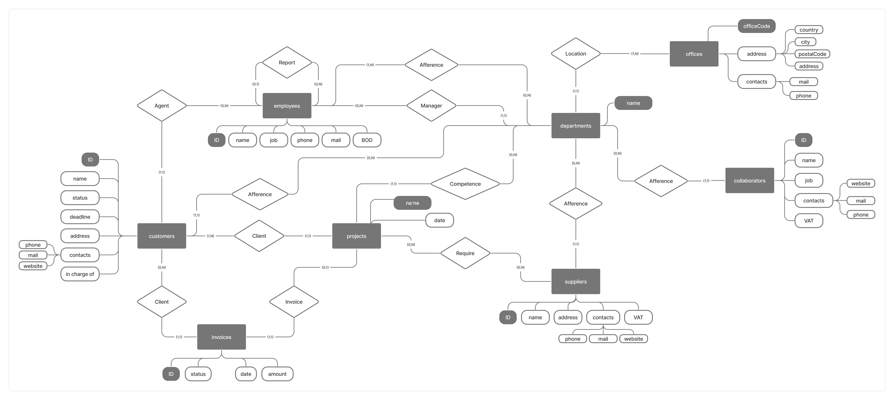
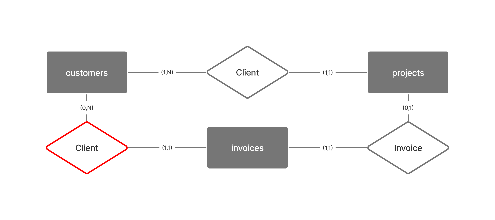
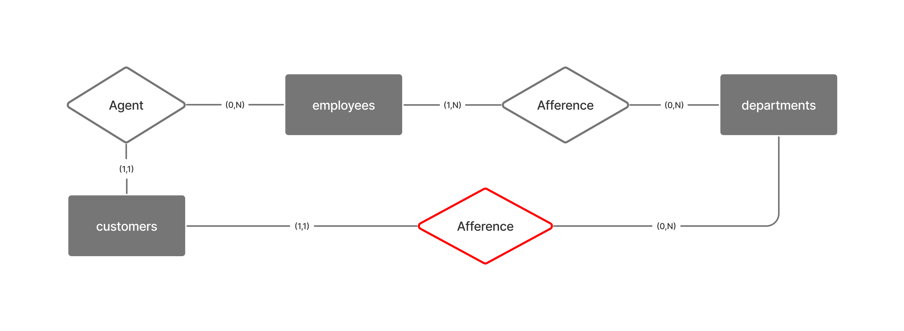
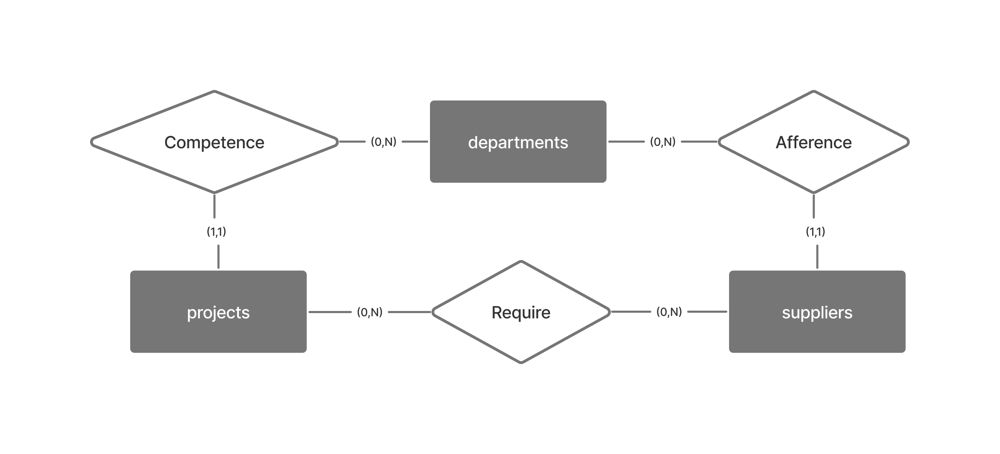
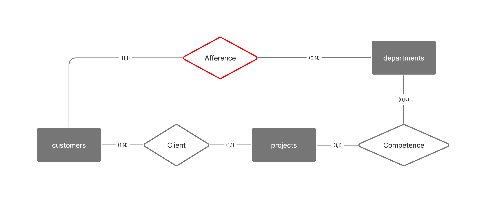
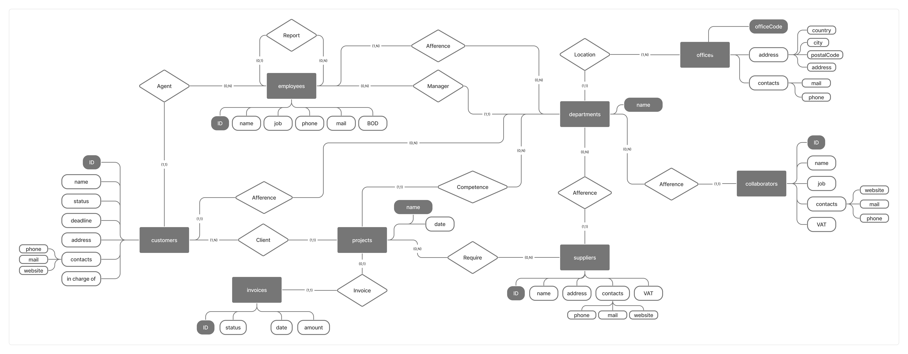
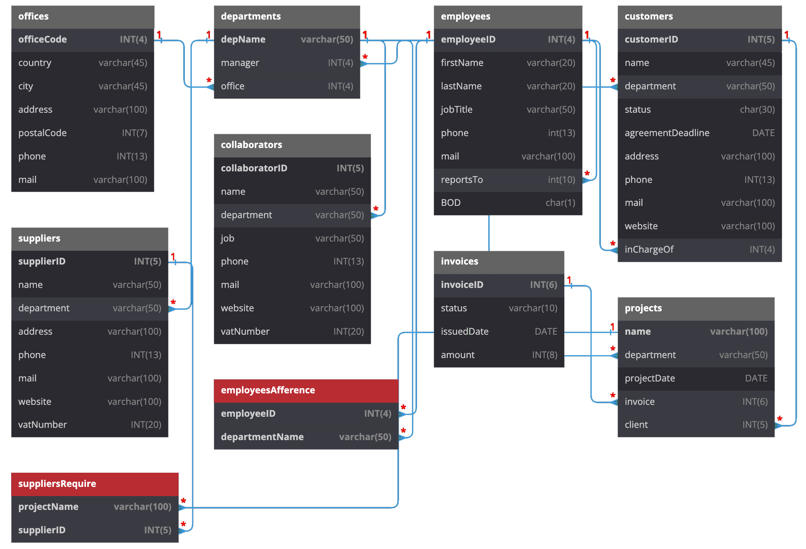

---
title: "Final Project"
author: [Enrico Lacchin | IN0501156]
date: "30-05-2023"
subject: "Final Project Database"
keywords: [Markdown, Project]
subtitle: "079IN - Database"
lang: "it"
titlepage: true
titlepage-color: "767676"
titlepage-text-color: "FFFFFF"
titlepage-rule-color: "FFFFFF"
titlepage-rule-height: 2
...

# Project Presentation
A database is to be created for COMPANY LTD, a company that operates in the world of event organisation, online communication (websites, social media, advertising, etc.) and carries out some operations in the world of aviation.
The company needs a relational database to manage all the operations and projects they carry out on a daily basis. 
The company often relies on external suppliers and collaborators and these will have to be represented with tables.

## Database Requirements
* For each employee there must be a relationship with his superior, his department of competence and it must be indicated whether he is a member of the board of directors.
* Each project must be assigned a customer, an invoice (initially there may not be one), a competence department and the necessary suppliers for that project.
* There must be a reference department for each customer.
* Each department must have an office reference and a manager.
* Each supplier/collaborator must have a department of competence.
* Each customer and invoice must have a status in a specific list.
* Each employee must refer to at least one department.

## Database Actions
COMPANY LTD shall perform the following actions on the database:

* Once a year, the view of all members on the board of directors is requested in order to convene the board meeting
* Once a day, the projects and invoices are updated and, if necessary, customers, suppliers and collaborators are added.
* Once a year, all invoices issued during the year and the total turnover are displayed in order to be able to draw up the balance sheet.
* Depending on the company's development, there must be the possibility of adding departments and/or offices
* Twice a year COMPANY LTD wants to know to which customers $N$ or more invoices have been issued (since 1 January of the current year).
* The company needs to see the invoices issued between two specific dates in order to monitor progress.

# Entity - Relationship Schema


# Data Dictionary
## Entity

|   **Entity**    |                    **Description**                    |                                  **Attributes**                                  | **Identificator** |
|:---------------:|:-----------------------------------------------------:|:-------------------------------------------------------------------------------:|:------------------:|
|   *Customers*   |                 Company clients                       | ID, name, status, agreement deadline, address, contacts, company agent      |         ID         |
|   *Employees*   |               Company employees                |              ID, name, role, phone, mail, flag if he/she is in the BoD              |         ID         |
|   *Projects*    |       List of projects carried out by the company        |                                   Name, project date                                    |        name        |
|   *Invoices*    |              List of issued invoices              |                      ID, status, invoice date, amount                       |         ID         |
|  *Departments*  |          List of company departments          |                                      Name, manager, office                                       |        Name        |
|   *Suppliers*   |           List of company suppliers            |                      ID, name, address, contacts, VAT number                      |         ID         |
| *Collaborators* | People/Companies cooperating with COMPANY LTD |                        ID, name, job, contacts, VAT number                       |         ID         |
|    *Offices*    |                  Company's offices                  |                       Office code, address, contacts                       |   Office Code   |

## Relationship

|    **Relazione**     |                    **Descrizione**                     |           **Componenti**           |
|:--------------------:|:------------------------------------------------------:|:----------------------------------:|
|       *Agent*       |          Employee responsible for customer          |        Customers, employees         |
|       *Report*       |        Contact person for the employee        |             Employees             |
|      *Manager*       |                Department Manager                |      Departments, employees      |
|      *Client*       |             Project-related customer             |         Projects, customers          |
|      *Client*       |             Customer relating to an invoice             |          Invoices, customers          |
|      *Invoice*       |              Project invoice              |         Invoices, projects          |
|      *Require*      |     Whether or not suppliers are needed for a project      |        Suppliers, projects         |
|     *Competence*     |       Department of competence for a project       |       Projects, departments       |
|     *Location*      |            Department Headquarters            |        Offices, departments        |
|     *Afference*      |    Department of reference for the collaborator    |    Departments, collaborators     |
|     *Afference*      |      Department of reference for the supplier      |      Departments, suppliers       |
|     *Afference*      |     Department of reference for the employee      |      Departments, employees      |
|     *Afference*      |       Department of reference for the customer       |       Departments, customers        |

# Non-expressible constraints
Analysis of the [Database requirements](#database-requirements) reveals the following non-expressible constraints:

* Invoice status must be within a list, which we will later define as: *Draft*, *Not Paid* and *Paid*.
* Customer status must be included in a list, which we will later define as: *Ongoing Negotiation*, *Agreed*, *In Progress* and *Done*.
* The column where we determine whether the employee is in the BOD or not (column *BOD*) can only have the value TRUE (T) or FALSE (F)

# Volume table
Assume that COMPANY LTD is an SMB with: 

* 100 employees
* 10 departments
* 10 offices
* 500 customers
* 100 suppliers
* 20 collaborators
* 1000 invoices issued per year for 1000 projects
* 4 suppliers per 10 projects (400 suppliers per 1000 projects)

The volume table then follows:

|  **Concept**   | **Type** | **Volume** |
|:---------------:|:--------:|:----------:|
|  *Employee*   |    E     |    100     |
|    *Office*    |    E     |     10     |
| *Department*  |    E     |     10     |
|    *Customer*    |    E     |    500     |
| *Collaborator* |    E     |     20     |
|   *Supplier*   |    E     |    100     |
|    *Invoice*    |    E     |    1000    |
|   *Project*    |    E     |    1000    |
|   *Require*    |    R     |    400     |

I have omitted many relationships in the volume table, as they are easily calculated from the volumes of the entities.

# Redundancy analysis
In order to improve the [Entity - Relationship](#entity---relationship-schema) scheme, I went and analysed all the cycles present to see if any redundant relationships could be eliminated.

**Cycles analysed**:

* ***Customers - Projects - Invoices***:
  
  

  In particular, I am going to analyse the redundancy of the "Client" relation identified by the colour **red**.
  I note that the "Client" relationship between the entities "projects" and "customers" is compulsory (cardinality $(1,1)$), so that if you want to see the client of a given invoice, you could easily find it by looking at the related project.

  In conclusion, that relationship can be eliminated and in the table "invoices" there will be no entry "client" but only the project related to that invoice.

* ***Customers - Employees - Departments***:

  

  In this case I am going to analyse the redundancy "Afference" always identified in **red**.
  From the ER diagram it can be seen that each employee must be assigned a department and each customer must be assigned an agent. From this analysis one could say "*I can derive the customer's department from the agent's department*".

  If, however, we go to see the cardinality between employees $\rightarrow$ Afference $\rightarrow$ departments we notice that it is equal to $(1,N)$ i.e. an employee can refer to $1$ or $N$ departments so, in certain cases, I could not identify a specific department.

  In conclusion, the "Afference" relation between "customers" and "departments" is not duplicated but rather necessary, also considering the fact that otherwise one of the requirements of the database would be violated.

* ***Projects - Departments - Suppliers***:

  

  In this cycle, no redundancy results since each project and each supplier must be assigned a department, but suppliers are not necessarily required in each project (given the cardinality $(0,N)$).

  It follows that the relationship projects $\rightarrow$ Require $\rightarrow$ suppliers is also not redundant given its nature as a "many-to-many" relationship.

* ***Customers - Departments - Projects***:

  

  In this cycle, I want to analyse whether I can remove the 'Afference' relationship between 'customers' and 'departments' highlighted in **red**.

  I immediately notice that each project must be assigned to a customer and a department. I could think "*I get the customer's department from one of the projects with the same customer*", but this statement does not hold up because a customer can submit several projects under the responsibility of different departments.

  I could however, given the cardinality of customers $\rightarrow$ Afference $\rightarrow$ departments equal to $(1,1)$, add as a department the one with the most projects. In this case, however, I would be violating what is a requirement of the database in that for each customer the reference department must be displayed.

  Also in this case the relationship customers $\rightarrow$ departments is required


# Entity - Relationship Schema Revised

After analysing all the sub-cycles, I go on to remove only the relationship customers $\rightarrow$ Client $\rightarrow$ invoices.

The revised schema follows:



# Logic Schema


In the logic schema I wanted to highlight the tables *suppliersRequire* and *employeeAfference* that I had to implement in order to realise the two many-to-many relationships in the [Entity - Relationship schema](#entity---relationship-schema-revised).

# Physical Design
In order not to make this file too heavy, I wanted to create SQL scripts for creating tables, views and store procedures respectively, which can be downloaded from the [***repo github***](https://github.com/enricolacchin/database-2023-final-project/) of the project or from the links below.

* File table_creation.sql: [***download***](../../../SQL/table_creation.sql)
* File view_sp_creation.sql: [***download***](../../../SQL/view_sp_creation.sql)
* File data_insert.sql: [***download***](../../../SQL/data_insert.sql)

In the physical design, I want to focus on the control used for the [non-expressible constraints](#non-expressible-costraints) mentioned above:

```sql 
CREATE TABLE customers(
  /* ... */
  status char(30) CHECK(status IN ('Ongoing Negotiation', 'Agreed', 'In Progress', 'Done')),
  /* ... */
);
```
Using the keyword **CHECK** I went to check that that particular column was only part of a defined list.

As far as Stored Procedures are concerned, the most interesting one is the one that returns to me the invoices between two chosen dates.
Two dates are given as input and with the keyword **BETWEEN** I go to extrapolate only the required invoices. The **JOIN** keyword is used to represent the data in a nicer way so that I can also see the customer's name.

```sql
CREATE PROCEDURE invoicesBetweenDates(IN startDate DATE, IN endDate DATE)
BEGIN
  SELECT customerID, customers.name, invoiceID, issuedDate FROM invoices
  INNER JOIN projects ON projects.invoice = invoices.invoiceID
  INNER JOIN customers ON customers.customerID = projects.client
  WHERE issuedDate BETWEEN startDate AND endDate;
END;
```