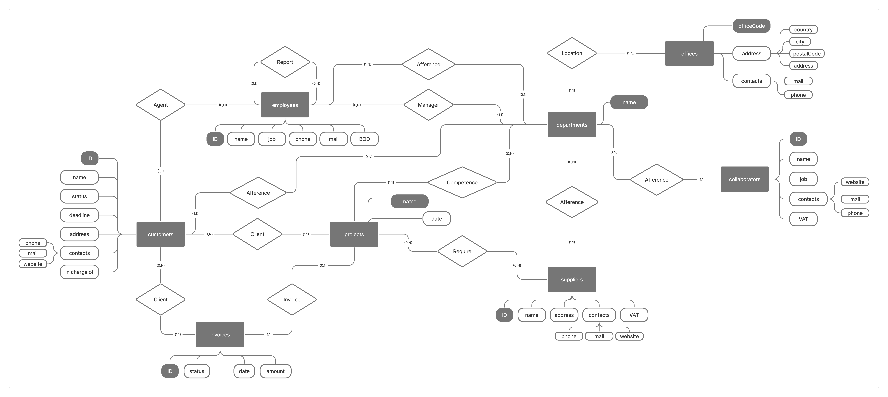
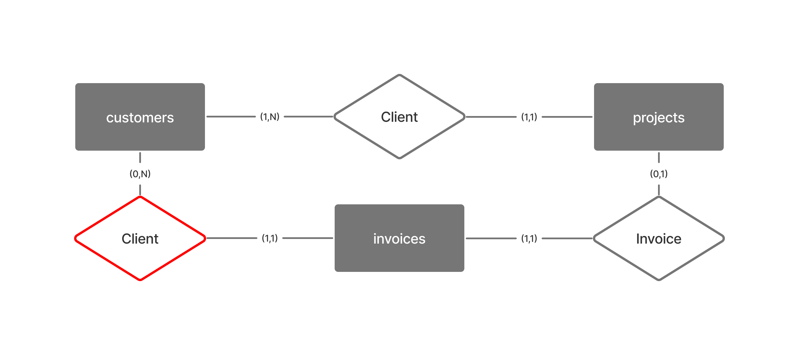
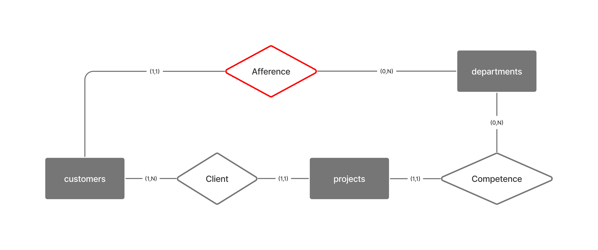
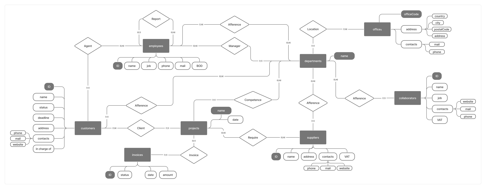
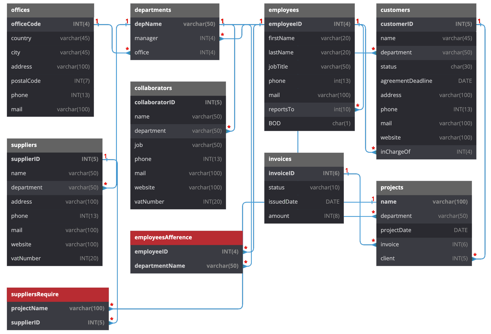

---
title: "Progetto Finale"
author: [Enrico Lacchin | IN0501156]
date: "30-05-2023"
subject: "Progetto Finale Basi di Dati"
keywords: [Markdown, Project]
subtitle: "079IN - Basi di Dati"
lang: "it"
titlepage: true
titlepage-color: "767676"
titlepage-text-color: "FFFFFF"
titlepage-rule-color: "FFFFFF"
titlepage-rule-height: 2
...

# Presentazione Progetto
Si vuole realizzare un database per la COMPANY LTD, società che opera nel mondo dell’organizzazione degli eventi, nella comunicazione online (siti web, social media, advertising, etc…) e svolge alcune operazioni nel mondo dell’aviazione.
La società necessita un database relazionale per gestire tutte le operazioni e i progetti che svolgono quotidianamente. 
Spesso la società si appoggia a fornitori esterni e collaboratori e questi dovranno essere rappresentati con delle tabelle.

## Requisiti del Database
* Per ogni dipendente deve esserci una relazione con il suo superiore, con il suo dipartimento di competenza e dev'essere indicato se fa parte del Consiglio di Amministrazione.
* Ad ogni progetto devono essere assegnati un cliente, una fattura (inizialmente può non esserci), un dipartimento di competenza e i fornitori necessari per quel progetto.
* Per ogni cliente ci deve essere il dipartimento di riferimento.
* Ogni dipartimento deve avere un riferimento a un ufficio e ad un manager.
* Ogni fornitore/collaboratore deve avere un dipartimento di competenza.
* Ogni cliente e fattura deve avere uno stato compreso in una lista specifica.
* Ogni dipendente deve far riferimento ad almeno un dipartimento.

## Azioni del Database
La COMPANY LTD dovrà svolgere le seguenti azioni sul database:

* Una volta all'anno viene richiesta la visione di tutti i membri nel direttivo per convocare il CdA
* Un volta al giorno vengono aggiornati i progetti e le fatture ed eventualmente aggiunti clienti, fornitori e collaboratori
* Una volta all'anno vengono visualizzate tutte le fatture emesse nel corso dell'anno e il fatturato totale per poter redigere il bilancio
* In base all'andamento dell'azienda ci deve essere la possibilità di aggiungere dipartimenti e/o uffici
* Due volte all'anno la COMPANY LTD vuole sapere a quali clienti sono state rilasciate $N$ o più fatture (dal 1 gennaio dell'anno in corso).
* L'azienda ha il bisogno di vedere le fatture emesse tra due date specifiche per monitorare l'andamento.

# Schema Entity - Relationship


# Dizionario dei Dati
## Entità

|   **Entità**    |                    **Descrizione**                    |                                  **Attributi**                                  | **Identificatore** |
|:---------------:|:-----------------------------------------------------:|:-------------------------------------------------------------------------------:|:------------------:|
|   *Customers*   |                 Clienti dell’azienda                  | ID, nome, stato, fine dell’accordo, indirizzo, contatti, referente nell’azienda |         ID         |
|   *Employees*   |                Dipendenti dell’azienda                |              ID, nome, ruolo, telefono, mail, flag se sono nel CdA              |         ID         |
|   *Projects*    |        Lista dei progretti svolti dall’azienda        |                                   Nome, data                                    |        nome        |
|   *Invoices*    |              Lista delle fatture emesse               |                      ID, stato, data di emissione, prezzo                       |         ID         |
|  *Departments*  |          Lista dei dipartimenti dell’azienda          |                                      Nome, Manager, Ufficio                     |        Nome        |
|   *Suppliers*   |           Lista dei fornitori dell’azienda            |                      ID, nome, indirizzo, contatti, p. IVA                      |         ID         |
| *Collaborators* | Persone/Aziende che collaborano con la  COMPANY LTD   |                        ID, nome, lavoro, contatti, p.IVA                        |         ID         |
|    *Offices*    |                  Uffici dell’azienda                  |                       Codice ufficio, indirizzo, contatti                       |   Codice Ufficio   |

## Relationship

|    **Relazione**     |                    **Descrizione**                     |           **Componenti**           |
|:--------------------:|:------------------------------------------------------:|:----------------------------------:|
|       *Agente*       |          Dipendente responsabile del cliente           |        Clienti, dipendenti         |
|       *Report*       |        Persona di riferimento per il dipendente        |             Dipendenti             |
|      *Manager*       |                Manager del dipartimento                |      Dipendenti, dipartimenti      |
|      *Cliente*       |             Cliente relativo a un progetto             |         Progetti, clienti          |
|      *Cliente*       |             Cliente relativo a una fattura             |          Fatture, clienti          |
|      *Fattura*       |              Fattura relativa al progetto              |         Fatture, progetti          |
|      *Richiede*      |     Necessità o meno di fornitori per un progetto      |        Fornitori, progetti         |
|     *Competenza*     |       Dipartimento di competenza per un progetto       |       Progetti, Dipartimenti       |
|     *Locazione*      |            Sede principale del dipartimento            |        Uffici, dipartimenti        |
|     *Afferisce*      |    Dipartimento di riferimento per il collaboratore    |    Dipartimenti, collaboratori     |
|     *Afferisce*      |      Dipartimento di riferimento per il fornitore      |      Dipartimenti, fornitori       |
|     *Afferisce*      |     Dipartimento di riferimento per il dipendente      |      Dipartimenti, dipendenti      |
|     *Afferisce*      |       Dipartimento di riferimento per il cliente       |       Dipartimenti, clienti        |

# Vincoli non esprimibili
Dall'analisi dei [Requisiti del database](#requisiti-del-database) si evincono i seguenti vincoli non esprimibili:

* Lo stato delle fatture deve essere compreso in una lista, che successivamente definiremo come: *Draft*, *Not Paid* e *Paid*
* Lo stato del cliente dev'essere compreso in una lista, che successivamente definiremo come: *Ongoing Negotiation*, *Agreed*, *In Progress* e *Done*
* La colonna dove si determina se il dipendente è nel CdA o meno (colonna *BOD*) può avere solo valore VERO (T) o FALSO (F)

# Tavola dei volumi
Si suppone che la COMPANY LTD sia una PMI con: 

* 100 dipendenti
* 10 dipartimenti
* 10 uffici
* 500 clienti
* 100 fornitori
* 20 collaboratori
* 1000 fatture emesse all'anno relative a 1000 progetti
* 4 fornitori ogni 10 progetti (400 fornitori per 1000 progetti)

Ne segue quindi la Tavola dei volumi:

|  **Concetto**   | **Tipo** | **Volume** |
|:---------------:|:--------:|:----------:|
|  *Dipendente*   |    E     |    100     |
|    *Ufficio*    |    E     |     10     |
| *Dipartimento*  |    E     |     10     |
|    *Cliente*    |    E     |    500     |
| *Collaboratore* |    E     |     20     |
|   *Fornitore*   |    E     |    100     |
|    *Fattura*    |    E     |    1000    |
|   *Progetto*    |    E     |    1000    |
|   *Richiede*    |    R     |    400     |

Ho omesso nella tabella dei volumi molte relazioni, poiché facilmente calcolabili dai volumi delle entità.


# Analisi delle ridondanze
Per migliorare lo schema [Entity - Relationship](#schema-entity---relationship) sono andato ad analizzare tutti i cicli presenti per vedere se poteva essere eliminata qualche relazione superflua.

**Cicli analizzati**:

* ***Customers - Projects - Invoices***:
  
  

  In particolare vado ad analizzare la ridondanza della relazione "Client" identificata dal colore **rosso**.
  Noto che la relazione "Client" tra le entità "projects" e "customers" è obbligatoria (cardinalità $(1,1)$) di conseguenza, se si vuole visionare il cliente di una determinata fattura, si potrebbe ricavare facilmente guardando il progetto relativo.

  In conclusione quella relazione può essere eliminata e nella tabella "invoices" non ci sarà la voce "client" ma solamente il progetto relativo a quella fattura.

* ***Customers - Employees - Departments***:

  

  In questo caso vado ad analizzare la ridondanza "Afference" sempre identificata in **rosso**.
  Dallo schema ER si evince che ogni dipendente dev'essere assegnato un dipartimento e che ad ogni cliente dev'essere assegnato un agente. Da questa analisi si potrebbe dire "*posso ricavare il dipartimento del cliente da quello dell'agente*".

  Se, però, andiamo a vedere la cardinalità tra employees $\rightarrow$ Afference $\rightarrow$ departments notiamo che è uguale a $(1,N)$ ossia che un dipendente può far riferimento a $1$ o $N$ dipartimenti quindi, in determinati casi, non saprei identificare un dipartimento specifico.

  In conclusione la relazione "Afference" tra "customers" e "departments" non risulta duplicata ma bensì necessaria, anche considerando il fatto cha altrimenti si violerebbe uno dei requisiti del database.

* ***Projects - Departments - Suppliers***:

  

  In questo ciclo non risulta nessuna ridondanza poiché ad ogni progetto e ad ogni fornitore deve essere assegnato un dipartimento ma non è detto che in ogni progetto siano necessari fornitori (vista la cardinalità $(0,N)$).

  Ne consegue che la relazione projects $\rightarrow$ Require $\rightarrow$ suppliers non è ridondante anche vista la sua natura di relazione "molti a molti".

* ***Customers - Departments - Projects***:

  

  In questo ciclo voglio analizzare se posso rimuovere la relazione "Afference" tra "customers" e "departments" evidenziata in **rosso**.

  Noto subito che ogni progetto deve essere assegnato ad un cliente e ad un dipartimento. Potrei pensare "*ricavo il dipartimento del cliente da uno dei progetti con lo stesso cliente*", ma questa affermazione non regge poichè un cliente può presentare diversi progetti di competenza di diversi dipartimenti.

  Potrei però, vista la cardinalità di customers $\rightarrow$ Afference $\rightarrow$ departments pari a $(1,1)$, aggiungere come dipartimento quello dove sono presenti maggiori progetti. In questo caso però violerei quello che è un requisito del database nel qualche per ogni cliente deve essere visualizzato il dipartimento di riferimento.

  Anche in questo caso la relazione customers $\rightarrow$ Afference $\rightarrow$ departments è necessaria


# Schema Entity - Relationship Revisionato

Dopo aver analizzato tutti i sottocicli, vado a rimuovere solamente la relazione customers $\rightarrow$ Client $\rightarrow$ invoices.

Segue lo schema revisionato:



# Schema Logico


Nello schema logico ho voluto evidenziare le tabelle *suppliersRequire* e *employeeAfference* che ho dovuto implementare per realizzare le due relazioni molti a molti presenti nello schema [Entity - Relationship](#schema-entity---relationship-revisionato).

# Progettazione Fisica
Per non appesantire troppo questo file ho voluto creare degli script SQL, rispettivamente per creare tabelle, view e store procedure e per riempire le tabelle, che possono esse scaricati dalla [***repo github***](https://github.com/enricolacchin/database-2023-final-project/) del progetto oppure dai link sottostanti.

* File table_creation.sql: [***download***](../../../SQL/table_creation.sql)
* File view_sp_creation.sql: [***download***](../../../SQL/view_sp_creation.sql)
* File data_insert.sql: [***download***](../../../SQL/data_insert.sql)

Nella progettazione fisica voglio mettere l'attenzione sul controllo utilizzato per i [vincoli non esprimibili](#vincoli-non-esprimibili) citati in precedenza:

```sql 
CREATE TABLE customers(
  /* ... */
  status char(30) CHECK(status IN ('Ongoing Negotiation', 'Agreed', 'In Progress', 'Done')),
  /* ... */
);
```
Tramite la keyword **CHECK** sono andato a controllare che quella determinata colonna facesse parte solamente di una lista definita.

Per quanto riguarda le Stored Procedure la più interessante è quella che mi ritorna le fatture tra due date scelte.
Vengono fornite in input due date e tramite la keyword **BETWEEN** vado a estrapolare solamente le fatture richieste. Tramite le **JOIN** invece vado a rappresentare i dati in maniera più bella così da vedere anche il nome del cliente.

```sql
CREATE PROCEDURE invoicesBetweenDates(IN startDate DATE, IN endDate DATE)
BEGIN
  SELECT customerID, customers.name, invoiceID, issuedDate FROM invoices
  INNER JOIN projects ON projects.invoice = invoices.invoiceID
  INNER JOIN customers ON customers.customerID = projects.client
  WHERE issuedDate BETWEEN startDate AND endDate;
END;
```